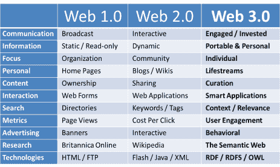

# Web 3.0:网络转型即将到来

> 原文：<https://medium.com/hackernoon/the-web-3-0-the-web-transition-is-coming-892108fd0d>

从 web 2.0 过渡到 3.0 版本可能会被大多数人忽视。这些应用程序看起来几乎和你现在使用的一模一样，但是变化是在后端。如果你是一个赌博的人，你会考虑将 Siacoin 作为云，将 Steemit 作为社交媒体的平台，甚至将它作为查看未来赌博活动的方式。

一旦你开始看到第一个工作正常的区块链项目的发布，你可能会看到人们离开 2.0 并转向 3.0。这是因为开发者将拥有 web 2.0 的技术和用户友好的技术，但他们将拥有 3.0 的开端，这应该更容易。

在这一部分中，我们将了解 web 2.0 的不同公司和领域，并让您了解区块链的哪些项目将抓住这一机会，引领 web 3.0 的发展。

人们目前使用的支付方式通常是通过信用卡公司、银行甚至贝宝。这些地方将负责获得资金并确保资金被正确转移，但也防止交易中发生任何盗窃。

对于所有这种类型的工作，组织通常有大量的成本。这种类型的成本和安全是什么需要保持这么高的费用为这些公司你将使用。

Ready Steady Sell 的大卫·塞斯福德(David Sessford)表示，随着加密货币的出现，你会注意到许多安全问题将会消失，交易成本将会大大降低。目前在世界各地使用的一些货币包括 Zcash、Monero、比特币和莱特币。用户所要做的就是接入互联网和一个保持钱包的设备。如果你在销售产品，那么你只需要让一家像 Bitpay 这样的公司将加密货币集成到你的支付系统中。

因为这将是一个平稳的过渡，虽然，你会注意到，它会发生，甚至没有使用加密货币。这意味着你将仍然能够使用你习惯的方法，而不是在最近到处都是的加密交易所交易硬币的价值。

你会发现 Stellar Lumens 是一家致力于通过将银行、用户甚至支付系统的所有系统连接在一起来破坏支付方式的公司。这将允许全球范围内更快的交易。这甚至不一定要在加密中完成，而是可以在任何类型的货币中完成。当你使用 Stellar Lumens 时，你甚至不会意识到你正在使用加密货币来完成工作，因为交易是在货币的后端运行的。

Request Network 是 PayPal 的另一个主要竞争对手。这是一个平台，可以让你在任何时候向任何人提出付款请求。当你在这里进行支付时，他们使用区块链完成，这将删除第三方，但仍然可以安全地获得全额支付。

更好的是，Request Network 的人员知道人们还不想处理加密货币，因此他们实施了不同的计划，让使用任何货币的人更容易提出请求。然而，由于他们使用的是区块链技术，该网络有一个很大的优势，即他们可以以低得多的费用进行交易。

大多数人将继续使用社交媒体，但即使这样，我们都看到它在工作方式上有一些严重的缺陷。其中一些包括脸书丑闻，这种机制被用来让你看到 Instagram 或 Twitter 希望你看到的东西，但广告的制作方式也有缺陷。

你必须处理的主要问题是，你在这些网站上的信息如何被用来对付你，并轻易地侵犯你的隐私。例如，你不想让你的朋友浏览你的浏览器历史，但是社交媒体网站通过扫描你的 cookies 来做到这一点，然后根据你的历史创建一个档案，然后出售它。

虽然这些猫很可爱，但我们想用电话来娱乐我们，并让我们与平时没有联系的朋友保持联系。因此，我们不能因此而放弃社交媒体。

Steemit 将以其区块链技术成为解决方案，引领社交媒体发展到 web 3.0。这个平台有自己的模式，内容的创造者由一群同行管理。当内容因质量好而被投票支持时，它将导致一个 [Steem](https://steem.io/) 的微交易，这是这里使用的货币。

这是一个没有广告的平台，甚至不存储用户信息，但不审查发布的信息，如果你是活跃的，你甚至可以获得加密货币的奖励。Steemit 是这项技术的领导者，但你甚至可以找到 [DTube](https://d.tube/) ，这是区块链的 YouTube 替代产品。

不利的一面是，Steemit 如此成功，以至于开始引来很多竞争。你会发现一个竞争对手是叙事，这是一个设计精美的网站。这是一个类似于 Steemit 的项目，但是管理是由创建主题利基的用户来完成的。叙事还决定将其网站的一部分交给品牌，这些品牌能够通过将优质内容展现在人们面前，在平台上传播自己。

还可以找[萨派恩，](https://www.sapien.com/)这是一个新闻平台；LinkedIn 的替代品 Indorse，甚至 ONG。这是一个很棒的社交项目，非常注重人们的隐私。

我们经常会发现，我们会发现不同的公司是我们正常娱乐的一个很好的替代选择，我们经常求助于网飞和 YouTube。最糟糕的是，这些公司真的控制了市场，这并没有给竞争留下多少空间。这使得人们可以创建大量内容，然后公司收集并出售这些数据。

通常，用户会在这些平台上发布内容，并希望他们能够做大，但通常不会为他们创造的东西做出任何回报。你还会看到人们开始质疑 YouTube 正在进行的不同审查，它如何改变其付费计划，甚至 Spotify 向在网络上发布歌曲的音乐人支付了多少钱。

你会发现很多区块链的项目也准备好了破坏这一点。音乐行业真的看到了很多伤害人们的不良交易，并且真的希望带头改变这个问题。音乐人伊莫金·希普在区块链启动了自己的项目，名为[菌丝体](http://myceliaformusic.org/)，旨在为音乐人和音乐创作者所创作的音乐提供一个公平的价格。你还会注意到，Voise 是一个很好的平台，它是分散的，艺术家很容易接触到他们的粉丝。

Flixxo 是一家使用以太坊试图取代 YouTube 的公司，但 Steem 也有 Dtube。你还会看到另一个击败 YouTube 的候选人是 Videocoin，这是一家初创公司，凭借 3500 万美元的 ICO 期获得了很大的吸引力。

如果您正在寻找存储解决方案，您会发现存储云是一个很好的解决方案。在这里，你会发现你可以以低廉的成本轻松地存储文件和硬件，而且可以从世界任何地方访问它们。

云存储的问题是，所有信息都将存储在一个人们可以访问的集中位置。这是一个问题，因为无论云有多安全，只有一家公司拥有它。这很容易导致一个公司的妥协，当这种情况发生时，你可以很容易地将你的所有数据暴露给每个人。

既然如此，现在也是分散存储的时候了。在这里，你会发现 Siacoin 正逐步成为这里最大的公司。这是一家允许有额外存储空间的人以加密货币的形式出租支付的公司。这是一家很容易在未来实现重大增长的公司，因为它已经比谷歌或亚马逊更便宜。

你会看到另一个创业公司，也叫 Filecoin。这是一家拥有巨大 ICO 的公司，是历史上最大的公司之一，赚了 2 . 57 亿美元。这是一家拥有分散式网络的公司，它以极具竞争力的价格保存文件。你会发现，Storj 也加入了他们的行列，推出了一个价格低廉但安全性高的伟大计划，只有用户可以进入数据。

目前使用的在线广告模式效果不佳。通常你只要访问一些在网站上做广告的公司，比如 YouTube 和脸书，就能看到这一点。当你在运营一个网站时，你知道这是一个大生意，当你要求人们订阅时，你最终会很快失去一些人。通常赚钱的最好方法是让广告出现在你的网站上，流量越大，你从广告中获得的收入就越多。

不利的一面是大多数时候人们会忽略广告。当人们看不到广告时，这已经够糟糕了，但是有些人甚至有广告拦截器来阻止广告出现。即使是从广告中获利最多的谷歌，也在 Chrome 浏览器上添加了屏蔽广告的功能。

可能发生的变化不是人们点击显示的广告的贡献，而是基于访问者的贡献获得利润。你会看到几家区块链公司正在从事这项工作。最大的变化之一是基本的注意力令牌。这是一家将内容创作者、广告商和消费者联系起来的公司，中间没有任何大公司。

你会注意到该公司甚至有自己的浏览器，名为 Brave。这种浏览器是一种用户能够向他们喜欢的内容的创作者支付小额交易，然后广告商向消费者支付注意力的浏览器。这一切都是在无人知晓的情况下完成的。

你还会注意到，你有牡蛎珍珠，这是另一个在线广告模式。这是一家正在开发引擎的公司，它允许内容消费者为他们喜欢的网站贡献 GPU 和 CPU，这有助于减少网站对广告的依赖。这也将允许网站和内容的创建者存储在一个分散的平台上，这更便宜，甚至更安全。

你会发现一个名为 Substratum 的大型项目正在运作互联网。这个平台将允许人们向一个分散的网络贡献计算资源，这个网络将不会有任何形式的审查或组织控制。

你会发现用户将会因为帮助维持底层运行而被支付加密货币。你会注意到，你可以在常规浏览器中找到托管内容，而不会干扰人们将要看到的内容。想想这对受政府压迫的人会有什么帮助。