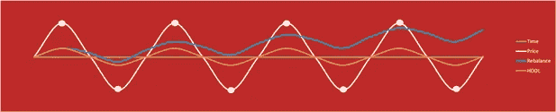

# 加密中的投资组合再平衡白皮书

> 原文：<https://medium.com/hackernoon/the-whitepaper-for-portfolio-rebalancing-in-crypto-ea6af634d35f>

在加密领域，再平衡是一个不断发展的策略。自 Shrimpy 应用程序发布以来，我们通过创建市场上最强大的平台，在投资组合再平衡方面一直处于行业领先地位。在开发我们的再平衡服务的过程中，我们获得了一个独特的视角，这有助于我们更好地理解再平衡在加密领域的作用。为了帮助促进这项研究向公共领域的转移，我们编写了一份题为“加密货币的投资组合再平衡”的白皮书。这项研究将为创造一个更普遍的加密货币再平衡策略奠定基础。随着我们继续扩大我们的研究，白皮书将相应更新。

点击此处下载白皮书。

# **简介**

投资组合再平衡是投资者在传统投资市场中使用了几十年的一种策略。然而，这种简单的投资技术很难作为加密货币投资组合的标准。在接下来的几节中，我们将详细讨论再平衡。

投资组合再平衡是指将投资组合中的资产重新调整回其目标配置的行为。随着市场的波动，投资组合中的资产将偏离其预期的配置比例。回到目标配置需要买卖资产。这个过程叫做再平衡。

投资组合中每项资产的目标分配权重由投资者在构建投资组合时确定。这些权重仅仅是每项资产在组合投资组合总价值中所占的百分比。在加密货币的情况下，资产可以被定义为任何单独的硬币或代币。当到了重新平衡的时候，资产被交易，使得每个资产中持有的价值再次等于最初指定的百分比。

这种策略的一个实际例子是，如果有 4 种不同的加密货币的投资组合。在研究了市场之后，投资者确定投资组合中每种资产的最佳配置是投资组合中 25%的股份。这意味着在每次再平衡结束时，投资组合将由 4 种资产的 25%组成。每项资产的价值应该转换成一个单一的共同价值，如 BTC 或法定货币，所以不同的资产不会根据数量来评估，而是根据价值来评估。因此，如果你在这四项资产中总共有 100 美元，那么在重新平衡之后，你在每项资产中会有 25 美元。

## 常见的再平衡策略

有两个主要的再平衡策略需要研究。这些是周期性再平衡和阈值再平衡。尽管它们触发再平衡的原因不同，但它们都导致资产被买卖，以与目标配置相一致。尽管基于阈值的再平衡是一种常见的策略，但本文的主要讨论主题将集中在周期性再平衡上。

**周期性**

Figure 1: Simple illustration depicting how periodic rebalancing takes place at specific times. After 24 hours, the allocations are not equal, so a rebalance will make them equal once again.

这些策略中最简单的是定期再平衡，在每次再平衡之间使用固定的时间。这段固定的时间被称为“再平衡期”。由于快速的价格波动，加密货币的再平衡期通常比其他资产类别短得多。例如，选择 1 天的重新平衡期。在这种情况下，重新平衡将在每天的同一时间发生。

**阈值**

Figure 2: This demonstrates a threshold rebalance when a portfolio reaches a 10% deviation. Notice the difference between the green and the blue allocation is 10%. This gap between the two allocations triggers a rebalance.

基于分配容差范围的重新平衡检查分配相对于彼此的漂移。通过将资产相互关联，可以随时跟踪每个资产之间的差异。因此，随着单个资产的配置百分比逐渐偏离，当任何两项资产之间的差异超过某个阈值时，就会发生再平衡。例如，对于+-5%的范围，如果一项资产在整个投资组合中的比例超出或低于 5%，则该投资组合将被重新平衡。想象一下之前讨论的情况，一个投资组合有 4 种不同的硬币，每种硬币持有投资组合价值的 25%。在这种方法中，一旦其中一种资产消耗了投资组合价值的 20%或 30%以上，就会发生再平衡。然而，这也意味着，如果投资组合中的所有硬币一起升值或贬值，而不改变它们在总投资组合中的百分比，那么就不会发生再平衡。

# **密码中的投资组合再平衡债务解决算法**

本节将详细介绍加密货币投资组合再平衡所涉及的一些复杂性。从理论上讲，再平衡应该很简单，但由于交易所施加的限制，情况会变得复杂。其中一个限制是限价单通常有最低交易要求。这些最低限额因交易所而异，但都会导致无法达到目标分配的情况。当达到目标分配所需的交易少于最低交易要求时，就会出现这种情况。

购买更多需要资金来达到其目标配置的资产的行为被称为“债务解决”。出售一项在一段时间内表现良好且分配额大于目标分配额的资产的过程被视为“征税”。对表现良好的资产征税，使它们与目标配置相匹配，通常很容易，但将债务偿还给其余资产就比较复杂了。有无法偿还债务的情况。无论这是由于征税资产不符合交易或交换错误的最低要求，都无关紧要。其结果是出现了一种负债超过支付能力的局面。

除非另有说明，每个算法都将假设交易通过 BTC 进行。这意味着将有两个不连续的步骤。首先，所有资产的分配比例大于其目标分配比例的，都将被征税。这种税收是通过为 BTC 出售资产而产生的。第二，债务将被支付给每一项资产，其分配百分比低于其目标分配百分比。将从征税步骤中收集的 BTC 池中进行支付。

构建解决这个问题的算法应该满足以下 4 个要求:

**公平**:最公平的情况不是在两种资产之间挑选。这意味着，如果资金只够做一笔交易，最公平的选择是两样都不选。(然而，从用户的角度来看，这可能不是所期望的)

**确定性**:算法要一致。每次都应该有效。每个可到达的状态都应该是可预测的。

**可用性**:一个算法可以是公平的、确定性的，但是不可用。算法需要是可用的和可取的。它应该产生用户想要看到的结果。

经济的:使用的任何方法都不应该需要过多的交易来满足之前的要求。该算法应该为尽可能少的费用进行优化。

## **基于股份的债务解决方案**

基于股份的债务解决方案是一种算法，试图公平的结果。这个解决方案的工作方式是通过计算每项资产持有的债务百分比来分配股份。例如，假设债务总额为 100 BTC，但只有 90 BTC 可供支付。这意味着 90 BTC 需要在 100 BTC 的债务中分配。做到这一点最公平的方法是偿还每项资产所欠债务的 90%。他们将只能获得 90%的债务偿付，而不是 100%的资产债务。

这是最公平、最确定的算法。不做优先考虑单一资产或交易的决策。这些问题来自可用性和经济决策。

这种解决方案的一个问题是，很少能够偿还 100%的债务。由于这种情况很少发生，因此很难让每项资产都达到其目标配置。因此，对于一些希望尽可能多的资产达到其目标分配的用户来说，这种算法可能不太理想。从另一方面来说，这种算法可能更适合一些用户，因为这种技术是完全无偏的。它并不试图预测用户更喜欢购买哪种资产。

## **最大债务第一决议**

最大债务优先解决算法侧重于首先还清最大债务。这种算法背后的理由是，拥有最大债务的资产距离其目标配置最远。在这个意义上，算法应该首先满足离用户期望分配最远的资产是有意义的。

让我们检查一下上面检查过的相同情况。想象一下，你只有 90 BTC，却有 100 BTC 的债务要还。使用这种算法，你将首先支付离目标配置最远的资产。这可能导致单个资产获得 90 BTC，如果他们足够远的话。那么，就剩下 0 BTC 来支付剩余的资产。

虽然这种策略可能对一些用户有意义，但它假设用户希望债务最大的资产首先得到偿付。事实可能并非如此。因为这是一个不公平的算法，所以从用户的角度来看，这导致了不期望的假设。

## **阻力最小的债务解决路径**

最小阻力债务解决路径与前面的算法略有不同。这种技术仅适用于资产对的子集，并绕过为其他资产偿还债务而收集的 BTC 池。阻力最小的路径是指将资产直接连接在一起的交易对，因此在再平衡期间，它们不需要通过 BTC 进行交易。其中一个例子是币安的 XRP/ETH。如果一个投资组合同时包含 XRP 和瑞士联邦理工学院，它就有机会在这两种资产之间直接交易，而无需先交易到 BTC。

阻力最小的路径总是被认为是产生最大量的最终资产的路径。因此，这考虑了费用、利差和滑点，以最大化最终资产金额。假设投资组合中有两项资产也是成对的，假设它们是阻力最小的路径，则可以首先对它们进行评估和偿付。

最小阻力债务解决路径可以进一步推广到包括所有导致最小差价、滑点和费用的交易。这导致投资组合中那些被认为可以廉价收购的资产的购买力最大化。

然后，可以根据以下标准计算每个资产的阻力:

*   交易数量，越高阻力越大
*   %扩散，其中较高的扩散增加阻力
*   %滑移，较高的滑移会增加阻力
*   %费用，费用越高，阻力越大

## **将所有这些放在一起**

一旦理解了这些策略，就有可能将它们放在一起创建一个公平、确定、可用且经济的再平衡算法。这是通过在不同阶段执行这些策略来实现的。

首先，**经济**战略完成阻力最小的路径。这应该在任何资产出售给 BTC 之前完成。

第二，**最公平的**策略应该用来分配为债务分配而收集的 BTC。这使得债务可以分散到所有需要偿还的资产中。但是，在此过程中，如果某些资产的偏差很小，可能会有小于最小交易限额的交易。

第三，最大债务优先的**可用**策略应该用于分配上一步留下的 BTC。这使得每项资产尽可能接近目标配置。

这种分阶段策略是**确定性的**，为算法在重新平衡期间的行为提供了可预测性。

# **常见的再平衡场景**

加密货币市场呈现了无数的情况，可以对这些情况进行评估，以了解再平衡在不同条件下的表现。在本节中，我们将构建几种常见情况，以突出一些典型案例。虽然还有许多其他情况，但是这里讨论的场景可以以不同的方式组合起来，以理解几乎任何情况。

## 哄抬股价

泵和转储一直是密码市场的标志。这是指一项资产的价值急剧上升，然后急剧下降。结果是回到原来的价格。

Figure 3: This graph illustrates a pump and dump. The white line is the price of a single asset in a portfolio. The orange line is the value of the portfolio if the HODL strategy is used from beginning the end. The blue line is the value of the portfolio if a rebalance was performed at the white dot.

**HODL**

在这个场景中检查的泵和倾卸由价值相等的初始和结束价格定义。因此，在整个涨跌过程中，投资组合的价值不会发生变化。

**重新平衡**

泵和转储提供了一个重新平衡的机会，以获取投资组合的回报。重新平衡时，偏离资产产生的超额价值被剔除，分散到其他资产中。由于不稳定资产的价格回到了原始价值，沿着泵或转储曲线的任何地方的再平衡的净结果是投资组合的正回报。

**评估**

抽水和转储为增加投资组合的总持有量提供了一个再平衡的机会。这些同样的机会对于简单地通过抽水和倾倒 HODL 的投资组合来说是不存在的。

## 快速崩溃和恢复

下一个示例将研究闪存崩溃和恢复的行为，这将导致与初始值相同的结束值。因此，这被定义为价值急剧下降，然后价值急剧上升，回到原始价格。

Figure 4: This graph illustrates a flash crash and recovery. The white line is the price of a single asset in a portfolio. The orange line is the value of the portfolio if the HODL strategy is used from beginning the end. The blue line is the value of the portfolio if a rebalance was performed at the white dot.

**HODL**

这种情况下的 HODL 结果与泵送和倾卸场景相同。由于开始和结束价格都是相同的价值，HODL 将不会导致投资组合的价值发生变化。

**重新平衡**

再平衡可以利用这些闪电崩盘带来投资组合价值的净正增长。当重新平衡时，偏离的资产在它便宜的时候被购买。由于资产价格回归到原始价值，沿着泵或转储曲线的任何地方的再平衡的净结果是投资组合的正回报。

**评测**

通过再平衡捕捉闪电崩盘可以增加投资组合的价值。使用 HODL 技术的投资组合没有这个机会。

## 侧向运动

下一种情况是长时间的简单横向运动。在此期间，尽管投资组合的总价值保持相对平稳，但通常会出现小幅波动。

Figure 5: This graph illustrates prolonged sideways movement in the market. The white oscillating line is the price of a single asset in a portfolio. The orange line is the value of the portfolio if the HODL strategy is used from beginning the end. The blue line is the value of the portfolio if a rebalance was performed at the white dot.

Figure 6: This graph illustrates prolonged sideways movement in the market. The white oscillating line is the price of a single asset in a portfolio. The orange line is the value of the portfolio if the HODL strategy is used from beginning the end. The blue line is the value of the portfolio if a rebalance was performed at each white dot.

**HODL**

当检查这种情况时，使用 HODL 策略的投资组合的结果与使用泵和转储的结果相同。投资组合价值应该没有净变化。这意味着从这些微观波动的开始到结束，资产持有量没有增加或减少。

**重新平衡**

在图 5 中，由白线描绘的投资组合中的一项资产的价值朝着白点减少。此时，投资组合重新平衡，资产经历积累。然后，当资产增值回到基线时，投资组合价值增加。无论再平衡发生在这些波动的低谷还是高峰，这种情况都会出现。当一项资产的价值恢复到以前的价值时，它会导致价值的净增加，以进行再平衡。

在图 6 中，持续的再平衡贯穿于长期的横向运动中。在这种情况下重新平衡会产生复合效应。在每个高峰期和低谷期继续重新平衡会导致投资组合的价值不断攀升。

**评估**

横向运动提供了一种重新平衡的可能性，以利用资产价值的小幅波动。长时间的横向波动会导致投资组合价值的增加。此外，频繁的重新平衡会产生复合效应，从而进一步提升性能。

## 缓慢死亡

慢性死亡是指单一资产的价值持续下降。在整个时期内，它的价值不断下降。

Figure 7: This graph illustrates a slow death. The white line is the price of a single asset in a portfolio. The orange line is the value of the portfolio if the HODL strategy is used from beginning the end. The blue line is the value of the portfolio if a rebalance was performed at the white dot.

**HODL**

持有一项缓慢死亡的资产会导致投资组合总价值的净减少。然而，这种缓慢的死亡并不影响任何其他持股的价值。因此，当投资组合的总价值下降时，投资组合的子集，不包括缓慢死亡的资产，在价值上没有任何下降。

**重新平衡**

重新平衡到一种正在慢慢消亡的资产会降低投资组合的价值。除了单个资产的价值下降，投资组合中其他资产的价值也在下降。因此，这意味着这种单个资产以及投资组合的其他部分都在流失。

**评价**

当重新平衡时，这是一个不理想的情况。不断地重新平衡一项濒临死亡的资产，将会拖累整个投资组合。保持多样化的投资组合并定期监控资产可以降低这种风险。单一资产占总投资组合的比例越小，风险就越小。

## 缓慢起飞

就像单一资产持续增值时的缓慢起飞一样。从长期来看，它保持着总体上升的趋势。

Figure 8: This graph illustrates a slow climb. The white line is the price of a single asset in a portfolio. The orange line is the value of the portfolio if the HODL strategy is used from beginning the end. The blue line is the value of the portfolio if a rebalance was performed at the white dot.

**HODL**

持有价值缓慢增长的资产会导致投资组合的净增长。这种缓慢的倾斜对投资组合的其他部分没有影响，因此这项资产的价值增长与其自身的价值增长成正比。

**重新平衡**

重新平衡一项不断增长的资产，会导致利润减少，并把利润转移到投资组合的其他部分。由于这个实例讨论的是单个资产的行为，这将导致对这个单个资产的价值增加的抑制作用。

**评估**

稳步提升资产价值对经济再平衡和 HODL 都有利。如果投资组合价值的其余部分停滞不前，HODL 会产生更大的回报。这样做的原因是利润不会从后继资产中提取。在另一种情况下，再平衡有一个优势，因为总是获胜的稳定增长的资产比许多投资者认为的加密市场上的资产要少得多。这意味着更典型的情况是一项资产增值，但下一次是另一项资产大幅增长。在这种情况下，最好从一项资产中剔除一些利润，因为下一次可能会看到另一项资产的上涨。

## 急剧下降

急剧下降是指资产价值快速下降，然后稳定在一个新的基线值。

Figure 9: This graph illustrates a sharp decline and then stabilization. The white line is the price of a single asset in a portfolio. The orange line is the value of the portfolio if the HODL strategy is used from beginning the end. The blue line is the value of the portfolio if a rebalance was performed at the white dot.

**HODL**

随着时间的推移，急剧下跌的资产的 HODL 只会导致投资组合价值与其自身价值成正比的减少。

**重新平衡**

这种情况的结果与 HODL 的结果相同。虽然单一资产崩溃导致投资组合净减少，但 dot 的再平衡不会带来任何额外的资金损失。在点之前沿递减线的任何地方重新平衡将导致额外的损失(见“缓慢死亡”)。

**评估**

在这种情况下，当查看完整的投资组合价值时，再平衡和 HODL 表现相同。在点重新平衡将积累更多的资产急剧下降，然而，稳定的价格之后意味着没有额外的投资组合价值的损失。

## 急剧跳跃

急剧上升是指单个资产的价值迅速增加，直至达到新的基准价值。

Figure 10: This graph illustrates a pump and then stabilization. The white line is the price of a single asset in a portfolio. The orange line is the value of the portfolio if the HODL strategy is used from beginning the end. The blue line is the value of the portfolio if a rebalance was performed at the white dot.

**HODL**

随着时间的推移，急剧上涨的资产的 HODL 只会导致投资组合价值的增加与其自身价值的增加成正比。

**再平衡**

这种情况的结果与 HODL 的结果相同。虽然单一资产注入导致了投资组合的净增长，但 dot 的再平衡不会带来任何额外的资金收益。与 HODL 相比，在点之前沿着增长线的任何地方重新平衡将导致表现不佳(见“缓慢起飞”)。

**评估**

在这种情况下，当查看完整的投资组合价值时，再平衡和 HODL 表现相同。在点上的再平衡将重新分配在急剧倾斜期间观察到的一些收益，然而，之后稳定的价格意味着没有观察到投资组合价值的额外收益。

# **重新平衡回溯测试**

回溯测试是使用来自交易所的交易数据来模拟一个策略在给定时期的表现的过程。这通常用于通过在这些大型数据集中运行来测试策略的可行性。以下部分将详细说明执行回溯测试时使用的约束条件。

## **回溯测试设置**

**交易&数据**

从 2017 年 5 月 4 日至 2018 年 5 月 3 日之间的交易所收集了一整年的市场数据。这些数据被用来评估每笔交易在执行再平衡时的成本。此外，所有交易都包括 0.25%的费用，这是大多数交易所在撰写本文时的标准费用。每项资产之间的交易路径是先交易到 BTC。所以，从 LTC 到 SNT 的交易会从 LTC 到 BTC，然后从 BTC 到 SNT。在这种情况下，两笔交易都产生 0.25%的费用。

**再平衡期**

以下一些研究将评估改变再平衡周期的影响。每个部分都将标注清晰的重新平衡周期，但是将使用的唯一重新平衡周期是 1 小时、1 天、1 周和 1 个月。

**投资组合规模&分配**

在每个回溯测试开始时，投资组合被植入一个 5000 美元的初始投资，该初始投资在资产之间分配。在这些研究中，每个投资组合中的资产数量从 2 个资产组合到 40 个资产组合不等。在任何给定的研究中，双资产投资组合被确定为需要分析的最小投资组合。

除非另有说明，所有分配在投资组合中的权重是平均的。因此，由 5 项资产组成的投资组合将平均分配 20%的资产。

**资产选择**

为了确定在构建投资组合的过程中将考虑哪些资产，使用了 Bittrex 和 Poloniex 的横截面。在 2018 年 5 月 3 日，Poloniex 上列出的具有一年数据的每项资产都与同样具有一年数据的 Bittrex 资产列表进行了比较。两个列表中的任何资产都包含在资产选择池中。当构建投资组合时，从池中随机选择资产来创建投资组合。任何重复都被删除并重新选择。在每次回溯测试之后，为下一次回溯测试选择一组新的随机资产。对于每种策略类型和再平衡期，该过程完成 1000 次。

## 重新平衡频率的评估

**2 资产组合**

Figure 11: This group compares the performance of portfolios which contain two assets but differ by rebalance period. This performance varies from 1 hour (top left chart) to 1 month (bottom right chart). Each histogram incorporates 1,000 backtests, where the x-axis is the percent gain better than HODL. The y-axis is the number of backtests which fell into the performance buckets that are defined on the x-axis. (Example: A backtest was run with a rebalance period of 1 hour and 2 assets in the portfolio. The results of a backtest was a 50% increase over buy and hold. This would mean a 1 is added to the top left chart in the x-axis bucket which has the range of 44 and 67\. This process is then repeated until 1,000 backtests have been run.)

Figure 12: This demonstrates the median percent for which rebalancing at varying intervals outperformed HODL for a portfolio which contains two assets.

双资产投资组合是投资组合中最简单的选择。在这种情况下，加密货币只是在每个再平衡期间相互之间来回交易。图 11 显示，较短的再平衡周期导致较大的性能差异。在较短的再平衡周期中，异常值明显较少，结果始终较高。随着再平衡期的延长，价差会减小。这导致结果中的差异较小，但对异常值的观察较高。这表明，周期越长，回报越低，但也会产生更多零星的异常值。

> **使用 1 小时再平衡期的投资组合的表现优于买入并持有，最大差异为 93%。**

**4 资产组合**

Figure 13: This group compares the performance of portfolios which contain four assets but differ by rebalance period. This performance varies from 1 hour (top left chart) to 1 month (bottom right chart). Each histogram incorporates 1,000 backtests, where the x-axis is the percent gain over HODL. The y-axis is the number of backtests which fell into the performance buckets that are defined on the x-axis. (Example: A backtest was run with a rebalance period of 1 hour and 4 assets in the portfolio. The results of a backtest was a 50% increase over buy and hold. This would mean a 1 is added to the top left chart in the x-axis bucket which has the range of 32 and 66\. This process is then repeated until 1,000 backtests have been run.)

Figure 14: This demonstrates the median percent for which rebalancing at varying intervals outperformed HODL for a portfolio which contains four assets.

继续 2 种资产组合研究的趋势，图 13 表明较短的再平衡期在 4 种资产组合中也有较大的表现差异。与较长的再平衡周期相比，这导致了更少的异常值和显著更高的中值性能。还可以观察到，表现最好的投资组合都使用了 1 小时的再平衡期。包括所有异常值时也是如此。

> **一个小时的时间表现最好，比买入并持有**高出 177%。

**6 资产组合**

Figure 15: This group compares the performance of portfolios which contain six assets but differ by rebalance period. This performance varies from 1 hour (top left chart) to 1 month (bottom right chart). Each histogram incorporates 1,000 backtests, where the x-axis is the percent gain over HODL. The y-axis is the number of backtests which fell into the performance buckets that are defined on the x-axis. (Example: A backtest was run with a rebalance period of 1 hour and 6 assets in the portfolio. The results of a backtest was a 50% increase over buy and hold. This would mean a 1 is added to the top left chart in the x-axis bucket which has the range of 22 and 55\. This process is then repeated until 1,000 backtests have been run.)

Figure 16: This demonstrates the median percent for which rebalancing at varying intervals outperformed HODL for a portfolio which contains six assets.

6 资产组合延续了 2 和 4 资产组合中讨论的趋势。这包括较短再平衡期的较大价差和较短再平衡期的较高平均绩效。此外，随着投资组合中资产数量的不断增加，1 小时再平衡期和 1 个月再平衡期之间的时间间隔似乎越来越长。这可以通过首先比较 4 资产投资组合和 2 资产投资组合，然后比较 6 资产投资组合和 4 资产投资组合来观察。

> 一个包含 6 种资产、再平衡周期为 1 小时的投资组合的表现超过 HODL 203%。

**8 资产组合**

Figure 17: This group compares the performance of portfolios which contain eight assets but differ by rebalance period. This performance varies from 1 hour (top left chart) to 1 month (bottom right chart). Each histogram incorporates 1,000 backtests, where the x-axis is the percent gain over HODL. The y-axis is the number of backtests which fell into the performance buckets that are defined on the x-axis. (Example: A backtest was run with a rebalance period of 1 hour and 8 assets in the portfolio. The results of a backtest was a 50% increase over buy and hold. This would mean a 1 is added to the top left chart in the x-axis bucket which has the range of 50 and 80\. This process is then repeated until 1,000 backtests have been run.)

Figure 18: This demonstrates the median percent for which rebalancing at varying intervals outperformed HODL for a portfolio which contains eight assets.

8 资产组合延续了 2、4 和 6 资产组合中讨论的趋势。这包括较短再平衡期的较大价差和较短再平衡期的较高平均绩效。此外，在这项对 8 个资产组合的研究中，只有一个柱状图包含的结果比 HODL 差。这可以在右下角的图表中看到，该图表代表了使用 1 个月再平衡期的投资组合。

> **每 1 小时重新平衡一次的中值 8 资产组合比 HODL 高出 224%。**

**10 资产组合**

Figure 19: This group compares the performance of portfolios which contain ten assets but differ by rebalance period. This performance varies from 1 hour (top left chart) to 1 month (bottom right chart). Each histogram incorporates 1,000 backtests, where the x-axis is the percent gain over HODL. The y-axis is the number of backtests which fell into the performance buckets that are defined on the x-axis. (Example: A backtest was run with a rebalance period of 1 hour and 10 assets in the portfolio. The results of a backtest was a 50% increase over buy and hold. This would mean a 1 is added to the top left chart in the x-axis bucket which has the range of 44 and 72\. This process is then repeated until 1,000 backtests have been run.)

Figure 20: This demonstrates the median percent for which rebalancing at varying intervals outperformed HODL for a portfolio which contains ten assets.

10 个资产组合的结果延续了 2、4、6 和 8 个资产组合中讨论的趋势。这包括较短再平衡期的较大价差和较短再平衡期的较高平均绩效。此外，如果每个月至少进行一次再平衡，4000 个投资组合中只有 10 个表现比 HODL 差。这意味着随机选择一个由 10 种资产组成的投资组合，每月至少重新平衡一次，结果是去年有 99.75%的机会跑赢买入并持有。

> **拥有 10 项资产、再平衡周期为 1 小时的投资组合的中值表现比 HODL 好 234%*。***

## *完全比较*

*收集前 5 个部分的结果会生成一个 4 x 5 的网格，显示每个投资组合和再平衡期的表现。由于大多数图形的上限比下限高得多，因此使用中值来防止大的偏差。这也意味着 50%的投资组合高于该值，50%的投资组合低于该值。因此，如果随机选择资产来构建投资组合，有 50%的机会表现得比列出的价值更好。*

*此外，列出的价值是买入和持有的百分比收益。因此，10%的值意味着再平衡执行得比 HODL 好 10%*。**

****

**Figure 21: The median performance demonstrates that the higher the rebalance period with the higher number of assets presents the highest gains for rebalancing. Each value represents a percent increase OVER buy and hold. That means a value of 18 means the median of that group performed 18 percent BETTER than buy and hold. This demonstrates, even the absolute worst case performs better than by and hold, even after considering taxes.**

**从这个网格中可以得出两个主要结论。首先，再平衡期与过去一年的表现之间存在关联。随着再平衡期变短，投资组合的表现会提高。第二，投资组合中的资产数量与业绩之间存在相关性。随着投资组合中资产数量的增加，业绩也会提高。在这项研究中，表现最好的投资组合是那些再平衡期短、资产多的投资组合。**

**完成比较后，下面的直方图包括了为这项研究运行的每一个回溯测试。它通过包括评估的所有再平衡和投资组合规模，说明了再平衡和 HODL 之间的性能差异。**

****

**Figure 22: Combining all the backtests over all portfolios and rebalancing periods produces a complete picture comparing rebalancing and HODL. This results in a median complete performance of 64%. This means, a randomly selected portfolio size between 2 and 10, a randomly selected rebalance period between 1 hour and 1 month, and a randomly selected portfolio of assets had a 50% chance of performing 64% better than buy and hold if the only difference was rebalancing.**

> ***结果显示，总体投资组合规模、再平衡周期和硬币选择的中值性能提高了 64%。***

# **解释**

**从这项研究中可以得出两个主要关系。第一个关系是，增加资产数量会提高投资组合的表现。第二个关系是，缩短再平衡周期(增加再平衡频率)会提高投资组合的绩效。因此，理想的投资组合是频繁再平衡的，并且包含许多资产。**

> ***再平衡以 64%的中间值击败了 HODL。***

## ****研究投资组合多样化的影响****

**下一节将研究增加投资组合中的资产数量对业绩的影响。上一节从 2 个资产组合到 10 个资产组合不等。这个部分将从 2 个资产组合到 40 个资产组合不等。**

****HODL****

****

**Figure 23: This graph shows the results of a $5,000 initial investment that used the HODL strategy for one year. Each data point on the graph is the median return after 1,000 backtests which were run by randomly selecting the number of assets on the x-axis.**

**该图显示，霍德林在一年后接近了 45k 美元左右的渐近线。当资产数量增加到 16 个以上时，价值上的差异就很小了。**

****1 个月重新平衡****

****

**Figure 24: This graph shows the results of a $5,000 initial investment that used 1 month rebalances for one year. Each data point on the graph is the median return after 1,000 backtests which were run by randomly selecting the number of assets on the x-axis.**

**该图显示，1 个月的重新平衡在一年后有大约 60k 美元的明显渐近线。当资产的数量增加到 22 个以上时，价值上的差异就很小了。**

****1 周重新平衡****

****

**Figure 25: This graph shows the results of a $5,000 initial investment that used 1 week rebalances for one year. Each data point on the graph is the median return after 1,000 backtests which were run by randomly selecting the number of assets on the x-axis.**

**该图显示，一周的再平衡在一年后有大约 65k 美元的明显渐近线。当资产的数量增加到 16 个以上时，价值上的差异就很小了。**

****1 天重新平衡****

****

**Figure 26: This graph shows the results of a $5,000 initial investment that used 1 day rebalances for one year. Each data point on the graph is the median return after 1,000 backtests which were run by randomly selecting the number of assets on the x-axis.**

**该图显示，1 天的重新平衡在一年后有一个大约 73k 美元的明显渐近线。当资产的数量增加到 14 个以上时，价值上的差异就很小了。**

****1 小时重新平衡****

****

**Figure 27: This graph shows the results of a $5,000 initial investment that used 1 hour rebalances for one year. Each data point on the graph is the median return after 1,000 backtests which were run by randomly selecting the number of assets on the x-axis.**

**该图显示，1 小时的重新平衡在一年后有一个大约 145，000 美元的明显渐近线。当资产数量增加到 18 个以上时，价值上的差异就很小了。**

## **综合结果**

****

**Figure 28: This graph shows the results of a $5,000 initial investment that used the strategies as discussed above. Each data point on the graph is 1,000 backtests which were run by randomly selecting the number of assets on the x-axis.**

**该图比较了再平衡期及其在过去一年中的表现。该图表明，1 小时的重新平衡比其他时段的回报高得多。然而，不管策略如何，该数据表明，在过去一年中，14 至 22 项资产的投资组合具有最高的单位资产业绩潜力。超过这个范围，增加更多的资产不会带来价值的大幅增加，尽管它确实会带来一些好处。低于这个范围的投资组合规模会导致价值急剧下降。**

## ****优化资产配置****

**之前的每个回溯测试都是在资产平均分布的情况下运行的。下一节将评估三种不同分布模型的性能效果。这些分配策略如下:**

*   ****甚至****
*   ****直线型****
*   ****指数型****

****平均分配分配****

****

**Figure 29: This distribution follows an allocation of 10 percent for each asset.**

**平均分配意味着每种资产在投资组合中占有相同的权重。10 项资产的投资组合将导致每项资产在投资组合中恰好占 10%的权重。每当重新平衡投资组合时，都会进行交易来重新调整投资组合，以匹配这些期望的分配。**

************

**Figure 30: This group compares the performance of evenly distributed portfolios which contain 10 assets but differ by rebalance period. Each histogram incorporates 1,000 backtests, where the x-axis is the value of a portfolio after 1 year which had an initial investment of $5,000\. The y-axis is the number of backtests which fell into the portfolio value buckets that are defined on the x-axis. (Example: A backtest was run with a rebalance period of 1 hour and 10 evenly distributed assets in the portfolio. The results of a backtest was $200k after one year. This would mean a 1 is added to the bottom right chart in the x-axis bucket which has the range of $195k to $214k. This process is then repeated until 1,000 backtests have been run.)**

****

**Figure 31: These values represent the median portfolio value in USD, 1 year after an initial investment of $5,000\. Each value corresponds to their respective histogram displayed above.**

**平均分布的投资组合通过每小时重新平衡，呈现了从 HODL 的 4 万美元中值到 12.3 万美元中值的回报。除了中值更高之外，更频繁的再平衡也带来了更好的利差。虽然使用 HODL 策略的投资组合的价值主要集中在低端，如上述直方图所示，但频繁的再平衡通过将结果分布在更广泛的价值和更高表现的投资组合上，改善了分布。不仅 1 小时再平衡周期的中位数击败了 HODL 的中位数，在 1 小时再平衡策略组的 1000 多个回溯测试中，表现最差的投资组合也击败了 HODL 投资组合的中位数。**

> ***1 年后，每小时重新平衡一次的平均分布投资组合的回报率为 2，360%。***

****线性分配分配****

****

**Figure 32: This distribution follows an allocation of 1, 3, 5, 7, 9, 11, 13, 15, 17, 19 percent for each asset.**

**线性分布仍然具有等于 100%的百分比总和，但是每个资产的权重是不均匀的。它们不均匀的方法是线性的。由于线性可以有多种含义，线性将被定义为有 10 项资产的投资组合，每项资产的分配比例为 1、3、5、7、9、11、13、15、17、19%。每当重新平衡投资组合时，都会进行交易来重新调整投资组合，以匹配这些期望的分配。**

********

**Figure 34: This group compares the performance of linearly distributed portfolios which contain 10 assets but differ by rebalance period. Each histogram incorporates 1,000 backtests, where the x-axis is the value of a portfolio after 1 year which had an initial investment of $5,000\. The y-axis is the number of backtests which fell into the portfolio value buckets that are defined on the x-axis. (Example: A backtest was run with a rebalance period of 1 hour and 10 linearly distributed assets in the portfolio. The results of a backtest was $200k after one year. This would mean a 1 is added to the bottom right chart in the x-axis bucket which has the range of $183k to $204k. This process is then repeated until 1,000 backtests have been run.)**

****

**Figure 33: These are the median portfolio values for each set of backtests which are detailed in the histograms above.**

**与均匀分布相比，线性资产分布的结果显示一年期内的回报率下降。中值的降幅从使用 HODL 策略的投资组合的 2000 美元到每 1 小时执行一次再平衡的投资组合的 8000 美元不等。直方图还显示，线性资产分布降低了结果的传播。结果不是一条平滑的曲线，而是聚集在这个分布的低端。这表明，不仅中位数下降，而且高绩效投资组合也减少了。**

> **1 年后，每小时重新平衡一次的线性分布投资组合的回报率为 2，200%。**

****指数分配分布****

****

**Figure 35: This distribution follows an allocation of 1, 1, 2, 2, 4, 6, 9, 15, 23, 37 percent for each asset.**

**分配分布的最后一种方法是指数分布。这种方法导致一种资产持有投资组合总价值的最大份额，之后的每种资产持有前一种资产的一小部分。在 10 项资产的投资组合中，指数分布被定义为每项资产的分配分布为 1、1、2、2、4、6、9、15、23、37%。每当重新平衡投资组合时，都会进行交易来重新调整投资组合，以匹配这些目标配置。**

************

**Figure 36: This group compares the performance of exponentially distributed portfolios which contain 10 assets but differ by rebalance period. Each histogram incorporates 1,000 backtests, where the x-axis is the value of a portfolio after 1 year which had an initial investment of $5,000\. The y-axis is the number of backtests which fell into the portfolio value buckets that are defined on the x-axis. (Example: A backtest was run with a rebalance period of 1 hour and 10 exponentially distributed assets in the portfolio. The results of a backtest was $200k after one year. This would mean a 1 is added to the bottom right chart in the x-axis bucket which has the range of $176k to $201k. This process is then repeated until 1,000 backtests have been run.)**

****

**Figure 37: These are the median portfolio values for each set of backtests which are detailed in the histograms above.**

**与均匀分布和线性分布相比，指数资产分布的结果在 1 年内表现出更大的回报率下降。中值的降幅从使用 HODL 策略的投资组合的 3，000 美元到每 1 小时执行一次再平衡的投资组合的 2 万美元不等。直方图显示了这种持续下降的趋势。结果聚集在这个分布的低端，甚至比探索线性分配分布的回溯测试更多。这表明线性分布的中位数下降，以及高收入投资组合的频率下降。**

> ***一年后，每小时调整一次的线性分布投资组合的回报率为 1，760%。***

****释义****

**结合本研究的所有结果，得出的结果是一张热图，显示了在过去一年中，每个策略和再平衡期的中值投资组合的表现。**

****

**Figure 38: These are the median portfolio values for each set of backtests combined across all histograms which were detailed above. Each value represents 1,000 backtests. With a starting portfolio value of $5,000, these median values represent the final value held by the portfolio after 1 year.**

**该热图表明，在过去一年中，1 小时重新平衡的均匀分布优于非均匀分布。事实上，资金分布越不均衡，投资组合的中位数表现就越差。**

## ****市值评估****

**本部分的设计是将资产分为 3 类；大型(7000 万至 260 万美元)、中型(900 万至 6900 万美元)和小型(90 万至 780 万美元)市值。资本化范围是通过根据 2017 年 5 月 4 日每项资产的市值将资产分为 3 个偶数组来定义的。在回溯测试的资产选择阶段，从每个市值组中随机选择资产。**

****性能****

**评估了四个独立的组:大型、中型、小型和综合市值资产。总市值代表所有资产，不考虑市场资本总额。**

****大市值****

****

**Figure 39: These values represent the total holdings of the median large market cap portfolio after one year. The top left value representing a portfolio which performed no trades over the course of a single year and contained 2 assets. The bottom right represents a portfolio of 10 assets which were rebalanced every 1 hour. Each cell represents exactly 1,000 backtests which were combined to calculate the median.**

**在这项研究中，大盘股由 7000 万至 260 万美元估值范围内的资产组成。每次估值都是在 2017 年 5 月 4 日进行的。**

**这组研究的结果表明，通过简单地增加使用 HODL 策略的投资组合中的资产数量，并没有明显的业绩提升。但是，随着重新平衡频率的提高，性能也会提高。在 1 小时的重新平衡期间观察到了最大的性能提升。**

> ***重新平衡一个大市值的加密投资组合，在一年时间里获得了高达 1140%的回报。***

****中端市值****

****

**Figure 40: These values represent the total holdings of the median mid-market cap portfolio after one year. The top left value representing a portfolio which performed no trades over the course of a single year and contained 2 assets. The bottom right represents a portfolio of 10 assets which were rebalanced every 1 hour. Each cell represents exactly 1,000 backtests which were combined to calculate the median.**

**在这项研究中，中端市值硬币由 900 万至 6900 万美元估值范围内的资产组成。每次估值都是在 2017 年 5 月 4 日进行的。**

**在过去的一年中，中端市场的硬币表现出了最高的回报率。它们不仅是多样化的有力证明，甚至在增长的时候，它们也表现出了令人印象深刻的增长。与 HODL 相比，一小时的再平衡使投资组合价值增加了 156%。**

> ***重新平衡一个中等市值的加密投资组合，在一年内获得了高达 3980%的回报。***

****小市值****

****

**Figure 41: These values represent the total holdings of the median small market cap portfolio after one year. The top left value representing a portfolio which performed no trades over the course of a single year and contained 2 assets. The bottom right represents a portfolio of 10 assets which were rebalanced every 1 hour. Each cell represents exactly 1,000 backtests which were combined to calculate the median.**

**在这项研究中，小市值硬币由 90 万美元至 780 万美元估值范围内的资产组成。每次估值都是在 2017 年 5 月 4 日进行的。**

**小市值硬币呈现了有趣的结果。在过去的一年里，小市值投资组合的回报率是所有市值组合中最低的。但是，增加重新平衡频率可以提高性能。虽然霍德林的表现不如大市值资产，但 1 小时的再平衡期带来的回报高于大市值资产。**

***重新平衡一个小市值的加密投资组合，在一年时间内获得了高达 2820%的回报。***

****合计(任何市值)****

****

**Figure 42: These values represent the total holdings of the median portfolio after one year. The top left value representing a portfolio which performed no trades over the course of a single year and contained 2 assets. The bottom right represents a portfolio of 10 assets which were rebalanced every 1 hour. Each cell represents exactly 1,000 backtests which were combined to calculate the median.**

**综合所有市值提供了综合市场的总体概况。将不同市值的资产混合到一个投资组合中，可以创造出中庸的表现。**

> ***去年，重新平衡加密投资组合带来了高达 2340%的回报。***

****释义****

**结果显示，在过去一年中，中等市值投资组合的表现优于小市值、大市值和混合市值投资组合。HODLing 小市值投资组合导致了 1 年期内最差的回报。最后，尽管持有大市值投资组合的表现优于小市值投资组合，但当频繁重新平衡时，大市值投资组合的表现不如所有其他投资组合。**

# ****重新平衡的理由****

## ****减少市场波动****

**再平衡是一种可以提高市场稳定性的策略。随着市场的不断成熟，更多的投资者将重新平衡他们的投资组合。因此，随着资产价值开始上升，更多的投资者将开始出售资产，这将使价格回落。同样，当一项资产价值下降时，这些投资者会买入这项资产，从而使价格回升。这防止了在加密市场中常见的快速波动，因为需要更大的市场力量来移动资产的价格。**

## ****低维护****

**与大多数策略相比，再平衡需要投资者付出最少的努力。设置初始参数后，不需要对投资组合进行维护。可以根据需要定期从投资组合中添加或删除资产，但是这种工作通常很少。**

**建立再平衡战略也是一项简单的任务。首先，投资者必须选择一个再平衡期和资产配置。确定后，应按照指定的时间间隔执行重新平衡。无论是手动执行还是通过第三方服务执行，该策略都不会试图为市场计时。它只需要购买和出售资产，以在指定的时间间隔内重新调整目标配置。**

## ****回溯测试展示了有希望的结果****

**前面几节说明了在一年时间内重新平衡所带来的一些性能影响。总的来说，与 HODL 相比，重新平衡多样化的投资组合显示一年期的回报率有所提高。这表明，投资者可能有机会利用加密市场的再平衡。**

> ***免责声明:回溯测试检查过去的表现，并不保证未来的表现。***

# ****结论****

**从表面上看，再平衡是一个简单的策略:将当前分配与目标分配重新对齐。然而，深入挖掘细节会使执行再平衡的方式变得复杂。本白皮书试图阐明这些复杂性，并为未来的研究提供基础。**

> **本白皮书不以任何方式提供投资建议、税务建议、法律建议或其他专业建议。Shrimpy 不建议或认可购买或出售资产，数字或其他，或读者进行任何投资或进入任何贸易或交易。在从事任何交易或投资活动之前，读者应该咨询合格的专业人士。**

**别忘了查看一下 [Shrimpy 网站](https://www.shrimpy.io/)，在 [Twitter](https://twitter.com/ShrimpyApp) 和[脸书](https://www.facebook.com/ShrimpyApp)上关注我们的更新，并在[Telegram](https://t.me/ShrimpyGroup)&[Discord](https://discord.gg/gXyy95y)上向我们令人惊叹的活跃社区提问。**

***捕虾队***