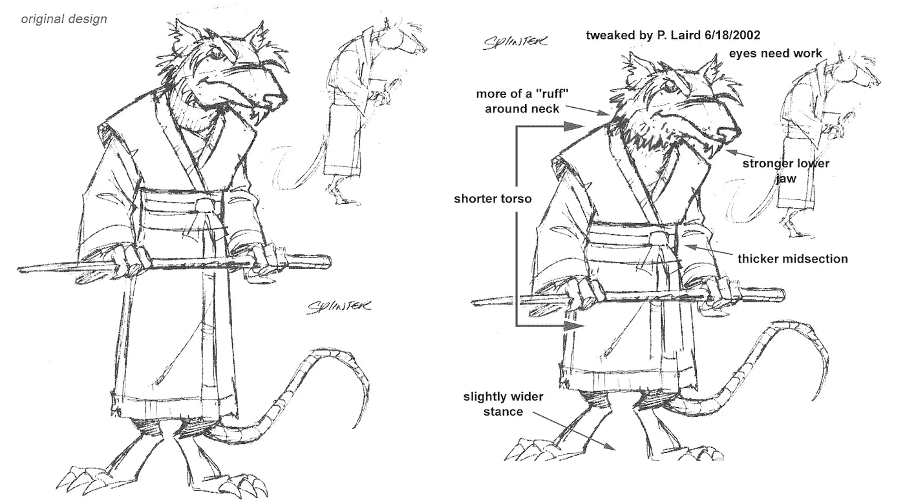
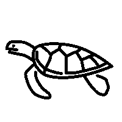
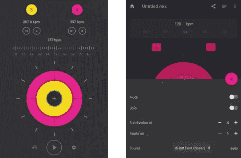
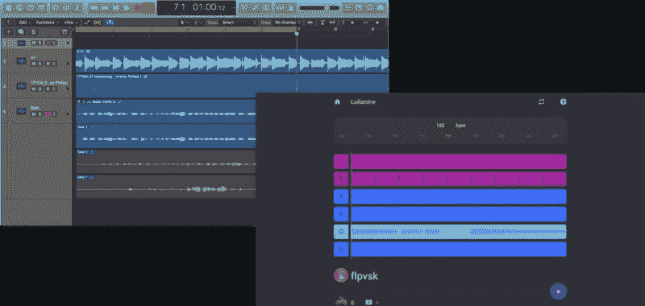

# 在不确定的情况下制造产品

> 原文：<https://medium.com/hackernoon/the-why-and-how-of-prototyping-9a9d8e993be0>

## 迭代产品创意时重新思考最佳实践

> 这篇文章是我讲话的后续。您可以观看俄语或英语[的视频记录:](https://youtu.be/Uqxc_7NAJDY)

AmsterdamJS 02.08.18–Prototyping with code

老牌公司根据规格制造产品。那就是把文字变成模型和代码。这是*容易*。

创业公司和创新团队没有规格，只有来自市场的模糊信号。他们聚焦于需求，找到可能满足需求的产品，然后生产出来。全靠他们自己。如果他们走错了任何一步，他们就要重新开始。这既费钱又无利可图。

这两种运作模式:研究和执行，在本质上是不同的，但我们以同样的方式对待它们。

我想谈谈*的研究模式*。关于心智模型和技术，开发人员和团队的其他成员可以用来更快地迭代一个想法。当然，这是有代价的。为了让这一新流程发挥作用，我们都必须再次成为新手。

## 现状

我们浪费时间、精力和资源去建造没人想要的东西。

我经常看到团队依赖产品经理来提出一个特性提案和一个规范。然后，设计人员会收到规范。他们制作高保真的视觉效果，并把它们传递给开发者。开发人员实现该特性。QA 和产品验证它按预期工作，代码进入生产。

对于大型特征，该过程平均需要两到六周。几个星期到一个月的时间来收集顾客的反馈。如果*所有的产品假设都是正确的*，花这个时间没问题。

如果产品是错误的，那将是巨大的浪费。

## 为什么这么做？

在柏林，一个团队几个月的工作大约是€4 万英镑(公司成本)。加上浪费时间的机会成本。再加上对球队士气的负面影响。加上将来维护添加代码的时间。

没有人希望出现这种结果。为什么我们要朝着它努力？因为我们想做好我们的工作:

*   产品希望最好地利用团队拥有的时间。所以他们想出了功能和长期路线图，这样团队就可以继续建设。他们通常基于大量的猜测；
*   设计师希望生产高保真的实体模型，这样开发人员就不会浪费时间去猜测，产品最终看起来也很好；
*   开发人员希望编写干净的代码，有良好的基础，构建易于扩展和维护的东西；
*   QA 希望在所有的 bug 进入生产之前就抓住它们。

Why, Shredder!?

我们是专家，这就是我们的工作。在某些情况下，这是合适的。就像当我们确切知道客户想要什么，我们就有足够的时间和预算。但在高度不确定的背景下，就相当于造了一个高科技的太空火箭，朝一个随机的方向发射。

## 别再当专家了

菲利普·泰特洛克在他的书《T1》中描述了一系列预测锦标赛。这些比赛的目的是展示专家们预测未来的能力。

专家们给各种全球事件分配了概率:从州际暴力到经济增长，再到领导层变动。后来，这些预测根据它们与现实的接近程度进行评分。

最后，事实证明专家*的表现比老练的范伟还要差*。甚至比从过去推断的算法还要糟糕。

专家们很快得出结论。他们更相信这些结论，不太可能改变他们的观点。这意味着为了更好地做研究*，我们需要再次成为新手*:

*   专家知道他们需要做什么，新手需要不断的反馈；
*   专家设计架构，新手喜欢用最简单的方法来工作；
*   专家可以证明他们确信的任何结论。菜鸟不会纠结于结论；
*   专家会失去名声，但新手不会。

我们还需要改变重点。我们在研究过程中的目标不是实现一个特性，而是*减少不确定性*。要回答这三个问题:

*   作为一个团队，需要改变什么来实现我们的目标？
*   换什么？
*   如何做出改变？

再次强调，实际上做出改变*并不是研究*的目标。

*来自 Polychops* [的例子 Polychops](/polychops/polychops-655f9347dd4b) 一开始是作为练习多节奏的节拍器。它有一个不寻常的介绍。与其他节拍器应用和网站相比，它的工作方式不同。

在我们开始这个项目之前，我们有一大堆问题:

*   人们对这种新的节拍会有什么反应？
*   我们能让它听起来好听吗？
*   我们能让它看起来更好吗？
*   人们对多节律感兴趣吗？

## 获得答案

有时我们可以用现有的人类知识来回答其中的一些问题。很多时候我们做不到。在那些情况下，我们可以使用古老的科学方法。我们提出假设，进行实验并分析结果。

如何提出一个假设？这里有几个链接可以帮你入门:[设计冲刺](http://www.gv.com/sprint/)、 [TRIZ](https://en.wikipedia.org/wiki/TRIZ) 、[当前现实树](http://www.dbrmfg.co.nz/Thinking%20Process%20CRT.htm)。

这是这个过程的鸟瞰图:

1.  找到阻碍我们实现目标的根本原因；
2.  找到一种可以消除根本原因的干预措施；
3.  运行一个实验来测试干预是否有效。

我们将关注第 3 步，运行实验。在软件公司里，一个实验往往会是一个原型。

# 样机研究

原型很整洁。首先，它们帮助我们验证我们的假设。第二，它们提供了对实施的后期阶段的见解。

原型可以很好地理解客户的需求和产品的形状。他们不擅长研究市场。例如，它的规模和人口统计。

有时我们可以将原型集成到现有的产品中。很多时候，我们不得不从头开始或分叉代码。

最好的原型是我们可以在最短的时间内构建和使用的。

记住，我们必须成为菜鸟。在开发和使用原型时，我们必须有初学者的心态。

## 寻求反馈

原型只是运行实验的工具。实验的真正目的是收集反馈。在我们开始原型制作之前，思考如何收集数据*是很重要的。*

*来自生产移动设备* 的例子，一个 B2B 产品的销售周期至少为六个月。此外，我们的客户都很忙，很难得到及时的反馈。我们通过组建一个独立的团队在内部使用该产品来解决这个问题。我们的*内部*客户。这不是一个容易的决定，但最终，它对产品产生了巨大的积极影响。我们缩短了反馈周期，开始以光速前进。

Productive Mobile demo

对于一个 B2C 产品，我们尝试了许多不同的方式来获得反馈。第一轮是来自朋友音乐家。随后[在 Reddit](https://www.reddit.com/r/Bass/comments/8dm4hm/metronome_for_polyrhythm_practice/) 上发帖，进而导致一对一的采访。

定性反馈提供更多见解。产品创意越古怪，定量数据就越没用。观察人们使用你的原型。这很有见地*和*激励人心。

*来自 Booking.com 的例子* Booking.com[在现场进行了许多著名的 A/B 测试](http://www.eyequant.com/blog/what-booking-can-teach-us-about-ab-testing)。它们是数据驱动的。我认为这是把网站推向无用深渊的原因。

Booking.com

*来自 Polychops 的例子* Polychops 的整个录音模式的想法都是从反馈中诞生的。一个人想要导出节拍的音频，以便在他们的 DAW 中使用，并记录他们自己在上面演奏。我们后来证实，许多音乐家录制并聆听自己的声音。所以我们决定让它成为节拍器的一部分。这个功能是在与人交谈中产生的。

## 从界面开始，伪造其余的

原型是一种幻觉。这就像电影布景或剧院舞台。我们希望让顾客相信它是真实的，而不是让它变得真实。

用户使用的是界面，因此它是产品中最重要的部分。当设计原型时，通常*是唯一重要的事情*。

对于 UI 产品，我们会绘制用户流程图，并创建低保真度的纸质模型。然后，我们将使用编码和绘图的组合来构建我们想要验证的体验。界面的某些部分不工作是正常的。但是，它应该看起来现实，让重点。

*来自 Polychops* 的例子 Polychops 的早期原型是一个微小的 flash 动画。我们把它展示给不同水平的音乐家，看看他们的反应，看看它是否有助于理解复节奏的概念。

An early prototype of Polychops metronome feature

The actual implementation of the same view

同样的方法也适用于 API 产品。我们将从编写 API 文档开始。然后我们会在不同的用例上“在纸上”尝试它。

*来自高效移动设备的示例* 我们正在重新思考我们的可视化移动应用构建器。为了给创作者更多的灵活性，我们决定引入一个新的低级 API。为了原型化它，我们首先想出了所有的方法，它们的输入和输出签名。然后，我们在纸上使用这个新的 API 来验证它将覆盖我们所追求的用例。我们编写调用 API 的代码，然后硬编码这些调用的结果。

Prototype 把重点放在了接口上，所以“后端”就成了我们可以伪造的东西。

*来自朋友的例子* 我的一个朋友曾经告诉我，他们的团队需要两到四个月的时间来构建一个原型并进行实验。他在一个面向消费者的网络平台工作。原来他们经常被后端团队屏蔽。他们的决定？重写部分后端以使用新的微服务架构。虽然我为后端团队感到高兴，但完全没有必要进行实验。

*来自 Polychops 的例子:认证* 在某些时候，我们希望让平台上的用户能够相互交流。为此，原型需要某种认证。但是为认证和授权编写代码是一项低影响高风险的昂贵任务。为了不浪费时间，我们在客户端实现了 auth。浏览器将生成一个令牌并保存在本地存储器中，并用它来授权请求。它是假的，但是它足够好来进行实验。

*来自 Polychops 的例子:后端 API*
对我们的 API 的一个调用没有转到后端，而是在客户端上解决*。我们在应用程序中打包了一个 JSON 和一个结果。我们现在没有关注服务的这一部分，静态数据已经足够好地完成了这项工作。*

## 使用设计系统

如果我们有一个强大的设计系统，我们将节省很多时间。有了它，我们就不用手工设计每一个交互了。它释放了精神资源，我们可以专注于产品。回到新手思维，我们需要调整的变量越少越好。

*来自 Polychops 的例子* 我们在没有任何设计系统的情况下开始制作 Polychops 原型。我们想出了“移动”界面。刚开始还可以。但是随着我们的发展，我们需要越来越多种类的交互:通知、菜单、导航。我们没有从头开始设计，而是改用现有的系统[。它节省了时间和智力。](http://material.io/design)

Design system will help save time as the prototype becomes more complicated

## 偷窃

从你喜欢的产品中窃取创意。理想情况下，你想从其他领域偷东西，而不是从竞争对手那里。从竞争对手那里偷东西和创新没什么关系，我们已经知道这是可行的。

*来自 Polychops 的例子* Polychops 中录制流程的灵感来自于现有的 DAW 软件。例如，当您录制时，Logic 会保存所有镜头，以便您稍后可以选择一个镜头。我们也一样。

Logic (left) Polychops bar view (right)

## 技术小额贷款

当我们了解系统、它的需求以及它在未来可能改变的方式时，编写干净的代码是有意义的。在制作原型时，我们没有这些信息。让代码变得干净以便我们可以在以后丢弃它是没有意义的。

这里有几个可能有帮助的指导方针。

**避免重构**
在抽象之前复制粘贴一段代码至少 3 次。

经常有抽象重复的冲动。我注意到在原型上工作会带来更多的工作。例如，UI 组件在开始时可能是相似的，但是随着你的进展，它们会开始出现分歧。原型不稳定。此外，一旦你面前有了这个东西的所有版本，抽象起来就容易多了。

**不要写测试** 测试是预期行为的规范。在早期，你只能凭经验猜测这种行为是什么，而这种猜测很可能是错误的。

**根据领域模型来构造代码，而不是框架** 框架和库来来去去，尤其是早期。领域模型是一个更稳定的变量。

例如，如果你开始使用 Redux，*而不是*分割你的代码

*   动作创建者
*   还原剂
*   中间件

*使用*

*   人
*   摆簧夹
*   节拍等。

**抽象出库和框架** Polychops 最初的工作是非常客户端繁重的。我开始使用组件的状态作为数据存储。后来，状态的一部分转移到 Redux 存储中，另一部分在后端通过 Apollo 连接。

在这些转换过程中,“哑”UI 组件保持不变。他们不知道什么是 Redux 存储或 GraphQL 查询，逻辑在包装器中。

**偿还债务** 如果实验成功，我们就要着手实施。在这种情况下，我们将不得不回来重构。

我们采取*的捷径，从实施阶段借用*的时间。

# 如何让利益相关者参与进来

很难改变我们做事的方式。所以，如果你接受我描述的模型，你如何让团队的其他成员去尝试它呢？

这完全是另一篇文章，但是这里有几个提示可以帮助你开始:

1.  我们要做的是说服利益相关者停止推动特性。如果他们这样做了，团队可以花时间去探索不确定性；
2.  理解他人的目标和他们所承受的压力。设身处地为他们着想；
3.  在附近。产品经理和其他团队成员依靠你的专业知识来理解什么是可能的，什么是不可能的；
4.  解释研究的价值。这是你的筹码；
5.  提出一个具体的建议。从小处着手。尝试新方法的方法之一是运行内部黑客马拉松；
6.  如果我能有所帮助，请随时联系我！

# 摘要

当构建产品时，有时间进行研究，也有时间执行。

研究阶段的目标是减少不确定性。不确定性可能存在于产品本身、实施或市场中。在研究阶段，我们不能使用与执行阶段相同的技术。这会浪费时间、金钱和热情。

相反，在做研究时，一个好的思维模式是像新手一样思考。这意味着经常寻求反馈，假装不重要，偷窃。鼓励和支持团队的其他成员也成为新手。研究不是追求完美的时候。

我希望你可以使用这些知识，我希望有一天我会成为你的许多快乐的顾客之一！

# 工具和技术

*   决策日报[https://fs.blog/2014/02/decision-journal](https://fs.blog/2014/02/decision-journal)
*   设计冲刺[https://www.thesprintbook.com](https://www.thesprintbook.com)
*   [PERT 时间和偏差(概率)估计技术](https://en.wikipedia.org/wiki/Program_evaluation_and_review_technique#Time)

我要感谢 [**@** 维克多 _ 苏兹达列夫](https://twitter.com/victor_suzdalev)审阅了这篇文章的草稿，还要感谢[奥列格·莫霍夫](https://medium.com/u/1baa95013281?source=post_page-----9a9d8e993be0--------------------------------)和[阿列克塞·伊万诺夫](https://medium.com/u/664d02357126?source=post_page-----9a9d8e993be0--------------------------------)对谈话的帮助。