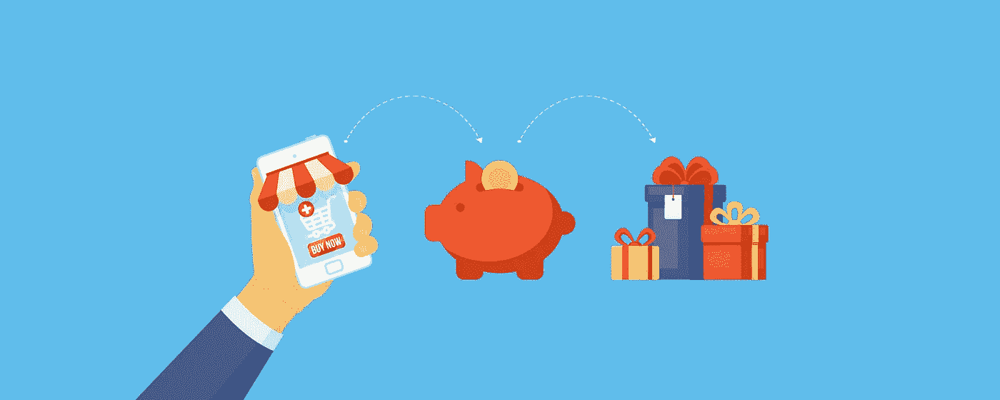

# 将区块链用于奖励计划的原因和方法

> 原文：<https://medium.com/hackernoon/the-whys-and-how-s-of-using-blockchain-for-rewards-programs-341644ff41a5>

忠诚度和奖励计划很受客户欢迎，但计划所有者和成员都很难从这些计划中获得最大收益。区块链奖励计划可以提供变革性的机会，以降低成本，吸引更多的参与者，并为成员提供灵活、快速的兑换。

客户忠诚度和奖励计划本质上是交易性的，有大量的参与者。这些是区块链应用程序的典型特征，这就是为什么在忠诚度和奖励计划的操作中嵌入分散原则的好处如此之大。以下是区块链奖励计划可以帮助您实现的目标:

*   **成本效率**。从交易和客户获取的角度来看，区块链提高了忠诚度计划的效率。这部分是因为区块链减少了对中介的需求。忠诚度计划的交易成本很高，商家[每年支付第三方 350 亿美元](https://www.bloomberg.com/news/articles/2018-05-30/forget-airline-miles-crypto-coins-are-coming-to-reward-programs)来维护与忠诚度积分相关的信用卡。区块链节省开支的空间很大。
*   **提高易用性**。客户对奖励计划感到失望，因为他们经常有太多的账户，每个账户的积分太少，无法进行有意义的兑换。区块链可以提供集中忠诚度奖励的机会，使成员更容易享受奖励，从而鼓励忠诚度。
*   **可用性提高**。忠诚计划传统上是所有者专有的不透明系统。[区块链可以开放忠诚度计划](https://www.ccn.com/american-express-taps-hyperledger-blockchain-for-rewards-program-revamp/)，吸引更多商业参与者。与此同时，区块链的开放和高效意味着会员不必等待积分奖励，这通常是一个问题，即计划所有者必须为在独立商家消费的钱积分。

一个主题很快浮现出来:区块链擅长解决隐藏在企业高墙后的交易网络所面临的许多挑战——比如忠诚度计划。将区块链应用到忠诚度计划中，这些网络会变得更便宜、更容易获得和使用。

# 大企业如何从区块链获益

不难看出为什么区块链和忠诚度奖励计划是一个很好的选择。但是这种匹配转化到现实世界中了吗？我们发现了几个现有的使用案例，为忠诚度和奖励计划提供了明显的优势:

*   美国运通消除障碍。美国运通[宣布，它正在利用 Hyperledger](https://www.coindesk.com/american-express-upgrades-rewards-program-hyperledger-blockchain/) 使零售商能够提供定制会员奖励优惠。零售商 Boxed 是第一批抓住机会向美国运通客户提供 5X 会员积分的公司之一。
*   **新航采用区块链**。为了让航空公司的忠诚计划——常旅客计划的会员更容易使用里程，[新加坡航空公司推出了常旅客计划](https://www.singaporeair.com/en_UK/sg/media-centre/press-release/article/?q=en_UK/2018/July-September/ne2518-180724)。KrisPay 是一个总部位于区块链的支付系统，允许客户使用新航赢取的里程在选定的零售商处付款。
*   乐天计划发行自己的货币。自 2003 年该平台成立以来，日本电子商务巨头已通过超级积分发放了 91 亿美元的忠诚度积分。[2018 年 2 月，它宣布](https://www.zdnet.com/article/rakuten-to-release-own-cryptocurrency-as-it-looks-to-enhance-loyalty-platform/)它将把这个庞大的忠诚度计划推广到一种名为乐天币的加密货币中，希望通过其零售产品进一步吸引客户。

我们强调了信用卡、旅游和电子商务巨头如何将区块链技术用于他们的忠诚度计划。然而，这些努力的有效性和持久性在很大程度上取决于该项目提供的经验。

# 用户体验将是关键

忠诚度计划是消费者的必需品，但不是必需品。任何阻碍良好用户体验的事情都不利于热情的程序采用。这就是为什么[在将区块链技术应用于忠诚度和会员计划时，有意义的区块链 UX 实践是必不可少的](https://labs.eleks.com/2018/08/better-ux-design-for-blockchain.html?utm_source=medium&utm_medium=refferal&utm_campaign=Republ-Blockchain-Rewards-Blog)。

与集中式网络相比，区块链机制的运作方式有所不同。因此，区块链 UX 最佳实践包括用户教育的强大元素。应用以下原则来确保计划成员快乐、积极参与:

*   使用进度指示器或其他方法让用户了解区块链事务的进度，通常需要一两分钟才能完成。
*   告知用户安全存储个人密钥的重要性，因为丢失个人密钥会带来严重后果，这与在线帐户密码不同。
*   向用户解释区块链交易是不可逆的:没有办法撤销区块链上的交易。
*   包括游戏化以提高用户的参与度，但是向用户解释游戏以确保他们参与进来。
*   鼓励用户反馈，通过学习用户的建议和抱怨来帮助你构建更适合用户需求的应用程序。
*   再次向用户保证:安全性是每个人的头等大事，您可以通过清晰地显示每一步的安全通知来建立信任感。

虽然效率、成本节约和盈利能力是采用区块链的关键驱动因素，但用户体验必须是忠诚度计划受到喜爱和接受的核心。如果您正在考虑采用区块链作为您的会员或忠诚度计划，请考虑让企业区块链专家参与进来。

[让我们来讨论一下](https://eleks.com/contact-us/?utm_source=medium&utm_medium=refferal&utm_campaign=Republ-Blockchain-Rewards-Blog)你如何通过区块链提供的前沿机会来实现你的商业目标。

*原载于 2018 年 8 月 31 日*[*【eleks.com*](https://eleks.com/blog/using-blockchain-rewards-programs/?utm_source=medium&utm_medium=refferal&utm_campaign=Republ-Blockchain-Rewards-Blog)*。*