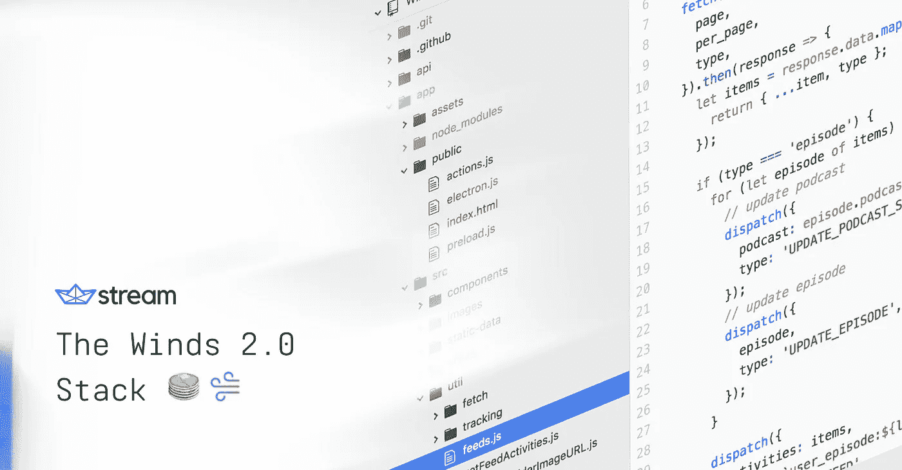

# Winds 2.0 堆栈

> 原文：<https://medium.com/hackernoon/the-winds-2-0-stack-59e593ff9f07>

Winds 最初只是一个简单的 Stream 示例应用程序，但由于我们出色的社区的大力支持，我们决定在这个项目上投入更多的时间和精力。围绕 Winds 2.0 的初步反应超出了我们所有人的预期。自 5 月中旬推出以来，该应用在黑客新闻上连续一天排名第一，在 Github 上拥有 5500 颗星(还在增加)，并成为产品搜索上的热门应用。

进入其中，没有办法预测 Winds 2.0 会变得多么流行——它会是绝对的成功还是史诗般的失败和时间的浪费？？该团队喜欢构建示例应用程序，所以我知道这不会是一个完全的损失，看到这个新的迭代在发布后的第一个月被如此广泛地使用是值得的。

风力发电的技术和蒸汽发电完全不同。你可能已经看过 StackShare [写的关于](https://stackshare.io/stream/stream-and-go-news-feeds-for-over-300-million-end-users)Stream 如何为使用 Go、RocksDB 和 Raft 的 3 亿用户提供活动源的博文。但是，大风是根据 [Node.js](https://stackshare.io/nodejs) 、 [MongoDB Atlas](https://stackshare.io/mongodb-atlas) 、 [Express](https://stackshare.io/expressjs) 、 [PM2](https://stackshare.io/pm2) 、 [Bull](https://github.com/OptimalBits/bull) 、 [Babel](https://stackshare.io/babel) 和 [React](https://stackshare.io/react) 。

要开始使用 Winds 2.0，你可以尝试网页版或者在这里下载应用程序，或者如果你更喜欢冒险，可以去 GitHub 并在本地运行它。接下来，让我们来谈谈 Winds 2.0 堆栈，以及我们为什么选择使用我们所采用的技术(以及我们为什么首先选择构建 Winds！).

# RSS 是一种破碎的体验😭

我们意识到许多 RSS 高级用户是开发人员、设计人员和记者。我们对 Winds 的目标之一是回答我们一直在问自己的问题:如果一个开发者和设计者的社区可以创建一个简单而完美的 RSS 体验会怎么样？这能扭转越来越少的用户利用这项技术，越来越多的出版物放弃支持的恶性循环吗？

RSS 的未来是不确定的。我们希望通过这个项目为# ReviveRSS 做出贡献。

# 为什么是 JavaScript/Node…？🤔

Winds 的另一个核心目标是让更多的开发者参与进来。我们希望*任何人*都能够很容易地注意到他们对 RSS/Podcast 体验不满意的地方，并轻松地提交带有修复或添加的 pull 请求。

如果你有足够的勇气探索代码库，你可能会注意到我们在任何事情上都使用 JavaScript 包括前端和后端。我们团队的大多数人都有使用 Go 和 Python 的经验，所以 Node 不是这个示例应用程序的明显选择。关于 JavaScript 有趣的是有多少人抱怨它是一种不合适的语言。当然，它有自己的怪癖——单线程、回调地狱等。–但是我们相信用任何语言都有可能开发出优秀的软件。

对于 Winds 来说，JavaScript 是围绕项目培养社区的一个很好的选择。更重要的是，随着对 [Async/Await](https://hackernoon.com/6-reasons-why-javascripts-async-await-blows-promises-away-tutorial-c7ec10518dd9) 语法的支持，JavaScript 的成熟度开始显现。

当然……会有一些反对者拒绝承认 JavaScript 有任何积极的一面(甚至在[黑客新闻](https://news.ycombinator.com/item?id=12338365)上有关于 Node.js 的咆哮)；然而，如果没有完全用 JavaScript 编写，*我们*就不会看到我们所做的结果。下面是我们选择 JavaScript 的一些原因:

*   几乎每个开发人员都知道或者至少能够阅读 JavaScript
*   有了 [ES6](https://es6.io/) 和 Node.js v10.x.x，它已经成为一种非常强大的语言
*   [异步](https://developer.mozilla.org/en-US/docs/Web/JavaScript/Reference/Operators/await) / [等待](https://developer.mozilla.org/en-US/docs/Web/JavaScript/Reference/Operators/await)功能强大且易于使用([异步/等待 vs 承诺](https://hackernoon.com/6-reasons-why-javascripts-async-await-blows-promises-away-tutorial-c7ec10518dd9)
*   Babel 允许我们试验下一代 JavaScript(官方 JavaScript 规范中还没有的特性)

[Yarn](https://yarnpkg.com/) 允许我们快速一致地安装软件包(并且充满了[吨的新花样](https://www.sitepoint.com/yarn-vs-npm/)

# 德沃普斯·🖥️

你很少听说公司是如何部署和管理代码的。由于 Winds 2.0 是开源的，所以我们想分享一些工具来完成将代码从机器上传到服务器的工作。

Winds 的网页版静态托管在 S3 的 CloudFront 上。总的来说，我们每个月只需花费几美元就可以举办。该应用程序的每个桌面版本都部署在 Electron 内部，使我们能够在 web 和桌面之间架起一座桥梁。

至于后端 API，那就是后话了。我们有一个相当不错的部署流程来确保稳定性和可维护性。以下是概要:

1.  所有代码都存储在 [GitHub](https://stackshare.io/github) 上
2.  我们使用 [Fabric](https://stackshare.io/fabric) 和 [Boto](https://github.com/boto/boto) 的组合在 AWS 上手动启动构建
3.  [CloudFormation](https://aws.amazon.com/cloudformation/) 创建一个由 [EC2](https://aws.amazon.com/ec2/) 实例、[自动伸缩组](https://aws.amazon.com/autoscaling/) (ASG)、[应用负载平衡器](https://aws.amazon.com/elasticloadbalancing/) (ELB)和一个 [Redis](https://stackshare.io/redis) 实例组成的新风环境
4.  AWS CCM 存储并检索启动时所需的各种配置(例如，当前版本等。)
5.  Dotenv &环境变量存储在 Puppet 和 CCM 中
6.  一旦所有 EC2 实例都可用，一个[傀儡](https://stackshare.io/puppet)脚本就会运行并在所有实时实例上应用配置(在应用模式下)
7.  [PM2](https://stackshare.io/pm2) 启动，自动启动我们需要的各种 Node.js 进程来保持我们的应用程序的活力( [API](https://github.com/GetStream/Winds/tree/master/api) 和 [Workers](https://github.com/GetStream/Winds/tree/master/api/src/workers) )

对于日志度量，我们使用了一个组合[StatsD](https://stackshare.io/statsd)+[Graphite](https://stackshare.io/graphite)+[Grafana](https://stackshare.io/grafana)。

# 理解电子⚡

我们想尝试建立一个[电子](https://electronjs.org/apps/winds)应用程序，除了网络之外，还可以下载到每一个 Linux 发行版、macOS 和 Windows。从根本上来说，这似乎很容易:我们编写代码，将它包装在电子层中，然后发布到我们想要的操作系统中……结果证明我们错了。

电子虽然强大，却比我们预想的要大得多。构建不同的发行版尤其困难，即使使用了 [electron-builder](https://github.com/electron-userland/electron-builder) (当然，我们运气不好，需要修补 electron-builder(这个错误已经被修复了)，但这只是我们遇到的一些棘手问题)。macOS 菜单栏必须恰到好处，才能让 macOS 商店接受我们的应用程序，而用电子 API 执行小任务，比如在外部浏览器中打开链接，结果证明是相当困难的。尽管困难重重，我们的团队还是开发了一些定制工具(在 [GitHub](https://github.com/getstream/winds) 上全部可见并开源)，我们不仅向所有发布目标发布，也向 [web](https://winds.getstream.io) 发布。

# 在 JavaScript 🗳️中测试

在某种程度上，JavaScript 仍然是蛮荒的西部。这是相当不自以为是的，特别是如果你使用 Express，所以我们必须推出我们自己的测试框架来完成这项工作。我们的 API 是用 Express 构建的，使用了各种 Node.js 模块的组合。以下是我们用于测试的工具列表:

*   作为测试框架的 Mocha
*   [柴](https://chaijs.org/)为断言库
*   [Sinon](https://sinonjs.org/) 作为我们的嘲讽库
*   作为 HTTP 嘲讽库的 Nock
*   [模拟-要求](https://github.com/boblauer/mock-require)作为模块模拟库
*   伊斯坦布尔作为我们的测试覆盖工具

**奖励:**这是我们的[测试者](https://github.com/GetStream/Winds/blob/master/api/setup-tests.js)的真实例子。

测试模块的组合我们选择我们的团队快速地与多个开发人员一起同时处理不同的特性集，而不会降低 API。

# 前端🛠️

React 是一个非凡的框架，在我们看来，它已经战胜了 Angular 和 Ember 等其他框架。鉴于其更新的[麻省理工学院许可](https://twitter.com/reactjs/status/964689022747475968?lang=en)，它非常适合 Winds 2.0 项目。

我们在 Winds 2.0 中使用的主要堆栈非常简单:

**主堆栈**:

*   [创建-反应-应用](https://stackshare.io/create-react-app)
*   [反应](https://stackshare.io/react)
*   [Redux](https://github.com/reduxjs/react-redux) (反应-redux)
*   [反应路由器](https://stackshare.io/react-router)
*   [电子](https://electronjs.org/)

现在我们来聊聊我们用来实现 Winds 2.0 的一些前端模块。

**有趣的模块**:

*   React-audio-player 是一个很好的 React 核心音频元素 API 接口
*   [React-waypoint](https://www.npmjs.com/package/react-waypoint) 用于处理自动分页的滚动事件
*   [React-dropzone](https://www.npmjs.com/package/react-dropzone) 方便 OPML 文件导入
*   [React-image](https://www.npmjs.com/package/react-image) 在我们没有存储图像的情况下，实现完美的图像回退

# 后端

当您构建一个大型应用程序时，您通常依赖许多库和工具来提高代码质量、缩短上市时间等。也就是说，Winds 也依赖于许多库和工具。下面是我们使用的几种，但不是全部:

## FeedParser

FeedParser 是一个相当复杂的 Node.js 模块，在我们看来，它是这个项目的支柱。它处理 RSS 提要中的大部分不一致之处，并给出提要的“净化”版本。如果没有这个模块，我们将会写很多 if/else 语句……这一点也不好玩。

## 最小法郎

[Franc-Min](https://www.npmjs.com/package/franc-min) 是一个语言检测模块，我们利用它来确定提要的语言。这听起来像是一个小任务；然而，事实上，它是我们个性化引擎的很大一部分。例如，我们只向说英语的用户推荐英文提要。其他语言也一样。

## 公牛

[公牛](https://github.com/OptimalBits/bull)在[雷迪斯](https://stackshare.io/redis)的帮助下帮助 Winds 2.0 队列保持结构上的健全。它附带了一个超级简单的 API，并支持多个队列，这非常适合我们的用例。此外，在他们的 [GitHub](https://github.com/OptimalBits/bull) 页面上有几个开源监控工具，可以洞察幕后发生的事情。

## ES6

[JavaScript w/ES6](https://stackshare.io/es6)**使我们的团队能够为广泛的人群编写极简代码。Winds 2.0 中的所有代码都是 100%的 JavaScript(除了少数用于帮助部署工作流的 bash 脚本)。该团队目前正在迁移代码库中的大部分功能，以利用 [Async/Await](https://developer.mozilla.org/en-US/docs/Web/JavaScript/Reference/Statements/async_function) 来减少代码行数。**

## **故事**

**[纱](https://stackshare.io/yarn)绝对惊艳。这是一个非常快速的专门为 JavaScript 构建的包管理器。最重要的是，由于它的缓存机制，它是 100%开源的，几乎总是可用的。我们过去使用过 [npm](https://stackshare.io/npm) ，虽然它工作得很好，但 Stream 的团队更喜欢 Yarn。**

## **Axios**

**Axios 是一个基于 Promise 的 HTTP 客户端，用于浏览器和 Node.js。我们实际上在各种任务的前端和后端都使用它。例如，所有前端 HTTP 请求都通过一个包装器流向 Axios。对于后端，我们利用 Axios 来检查文件的大小，然后将其发送到解析流程，然后发送到数据库进行存储，这确保了大文件不会影响我们的工作进程。如果你还没有看过 Axios，你一定要看看。**

## **指挥官**

**[Commander](https://www.npmjs.com/package/commander) 是另一个 Node.js 模块，这次为构建命令行界面提供全面支持。是的，没错，Winds 有一个 CLI，我们用它来完成各种任务，比如测试提要、删除 RSS 提要等等！**

## **巴比伦式的城市**

**[巴别塔](https://stackshare.io/babel)“允许我们今天使用下一代 JavaScript”。本质上，如果某个特性，比如 imports，在特定的 JavaScript(前端和/或后端)中不可用，我们仍然可以通过利用 Babel 来使用它。**

## **表达**

**[Express](https://stackshare.io/expressjs) 用来为我们的 [API](https://github.com/GetStream/Winds/tree/master/api/src) 提供动力。与其他框架相比，它在压力下确实会大放异彩。老实说，我们的团队拥有大多数 JavaScript 框架的经验，我们发现 Express 是最容易使用的。定期维护，有开源组件，很牛逼。😎**

## **哨兵**

**[Sentry](https://stackshare.io/sentry) 支持我们后端和前端的实时崩溃报告。让我们震惊的是你可以用 Sentry 得到的粒度。它们的特性帮助我们识别和调试错误，并让我们了解何时修复或回滚。说到救火，这个工具绝对赢得市场。**

## **阿尔戈利亚**

**[Algolia](https://stackshare.io/algolia) 为我们的应用程序提供了闪电般的([字面上的](https://blog.algolia.com/algolia-v-elasticsearch-latency/))搜索。在 2 毫秒下的 ***中，我们的用户可以发现 RSS 提要和播客来阅读或收听。他们甚至有 React 和 Angular 这样的框架组件来使集成更好。这是迄今为止我们最喜欢的一个；但是，我们都喜欢。😛*****

## **溪流**

**[Stream](https://stackshare.io/stream) 是 Winds 2.0 的关键资源，因为它为我们的用户提供新闻提要和活动流，甚至基于机器学习的个性化。如果没有[流](https://getstream.io)，我们将无法像现在这样为用户提供建议内容。**

## **MongoDB 地图集**

**[MongoDB Atlas](https://stackshare.io/mongodb-atlas) 是一个现象级的 DBaaS，让我们担心获取用户，而 MongoDB 担心正常运行时间。这与托管您自己的集群是一样的，只是 MongoDB 为您提供了一个仪表板和一个 URI 来连接。有了 MongoDB Atlas，再也不用担心集群健康、监控等问题了。**

## **猫鼬**

**[mongose](https://stackshare.io/mongoose)是一个强大的 ODM，它允许我们在 MongoDB 环境中定义丰富的模型。一般来说， [NoSQL 数据库](https://www.mongodb.com/nosql-explained)是无模式的(意味着它们没有或者不需要任何形式)；然而，使用 MongoDB，指定一个模式总是一个好主意，这样就可以正确地索引和组织数据。这允许容易的更新和有效的查询。**

## **PM2**

**[PM2](https://stackshare.io/pm2) 是 Node.js 的流程管理器。它使我们能够确保正常运行时间，并根据需要扩展流程。该项目的 CLI 非常简单，这使得我们的团队可以随时使用它。**

# **最后的想法😁**

**要开始使用 Winds 2.0，您可以尝试网页版或在这里下载应用程序。如果你想更有冒险精神，去 GitHub 并在本地旋转它。**

**RSS 陷入了恶性循环。Winds 是一个社区的努力，旨在帮助扭转局势和复兴。捐款总是很受欢迎。要讨论新功能，请查看[官方风松弛频道](https://communityinviter.com/apps/winds-community-hq/winds-2-0)。**

**如果你想知道更多关于[流](https://getstream.io/)和我们的 API 如何工作的信息，我们有一个简单的 [5 分钟 API 之旅](https://getstream.io/get_started/)，它将带你完成构建可扩展活动订阅源的过程。**