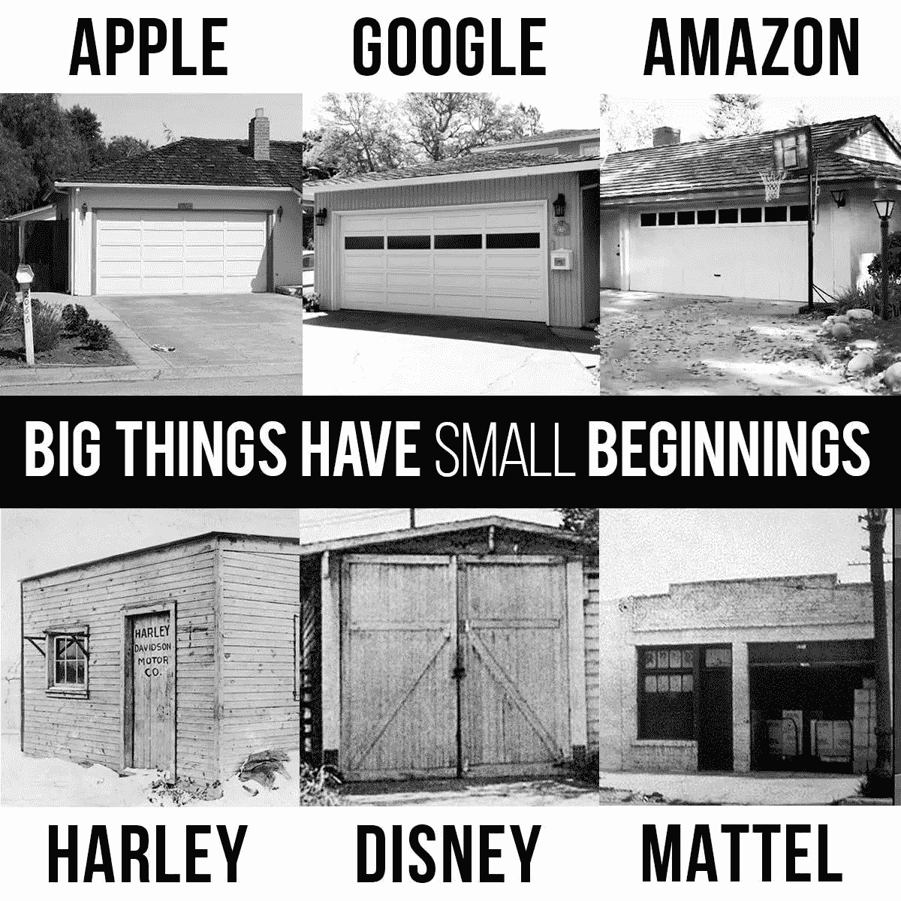
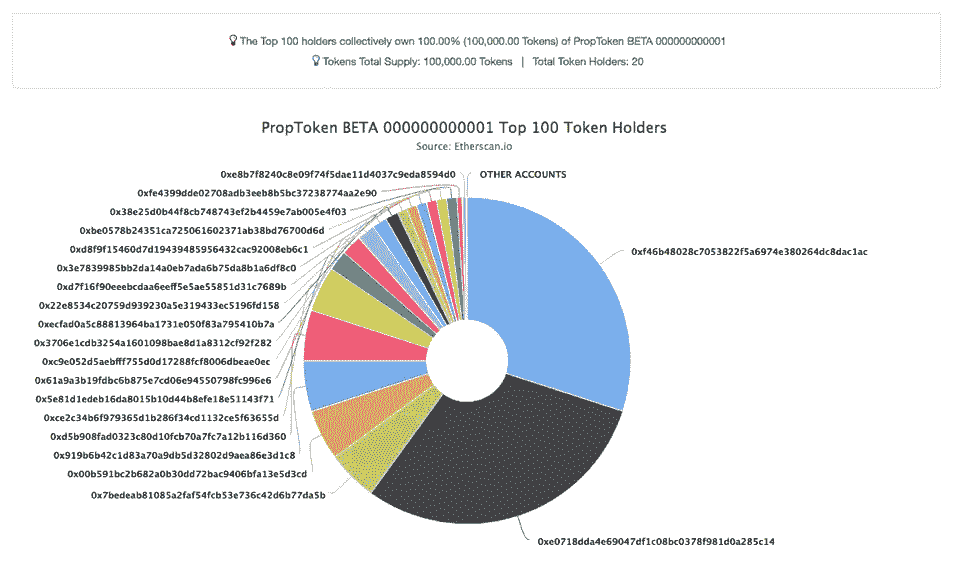
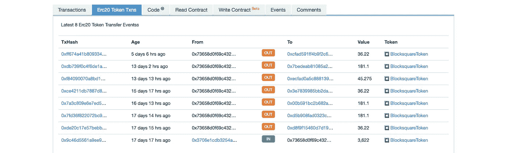
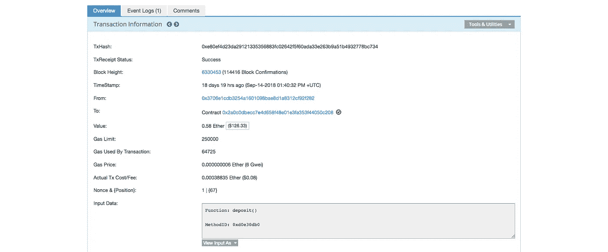
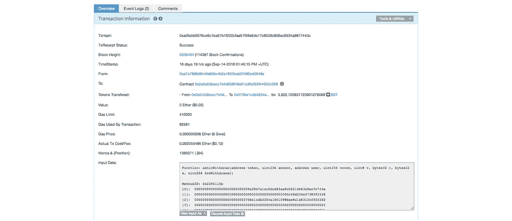
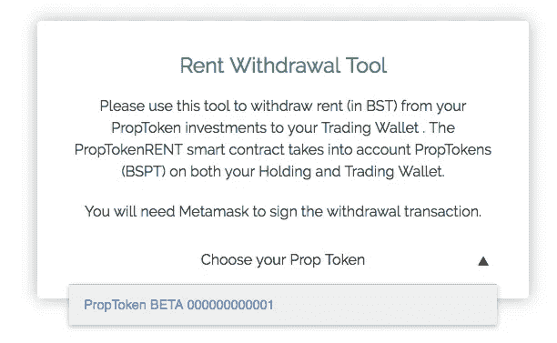
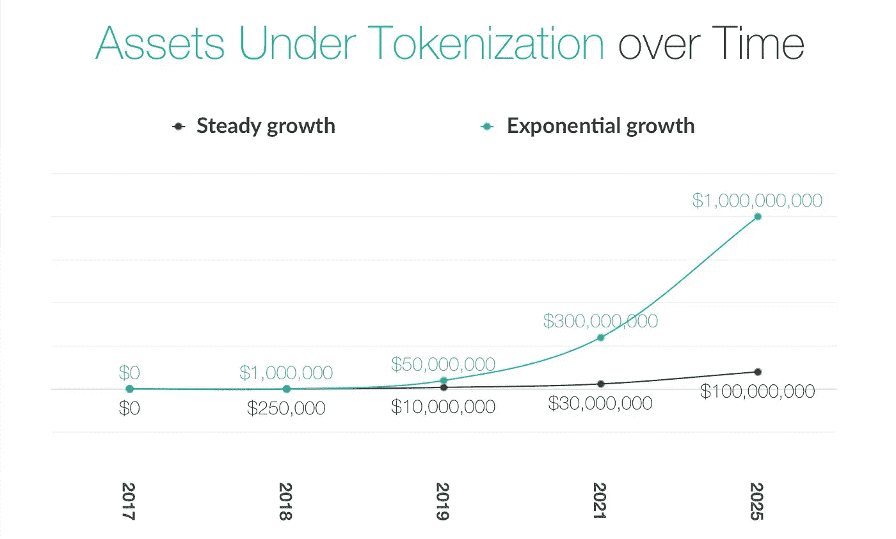
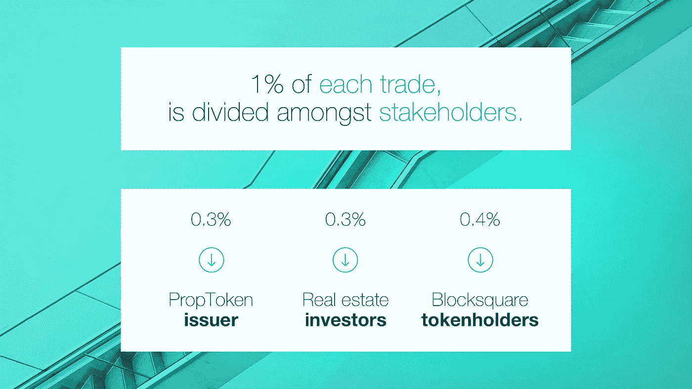
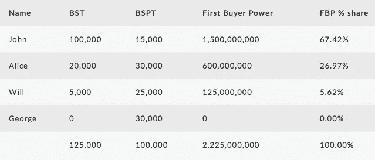

# 世界上第一个标记化的车库

> 原文：<https://medium.com/hackernoon/the-worlds-first-tokenized-real-estate-property-is-a-garage-bb0c1364fbc1>

## 对最近试点项目的简要概述，来自 4 个不同大洲的 19 名投资者投资了一项单一的令牌化房地产资产。

当我们在 [Blocksquare 的 Telegram group](http://go.blocksquare.io/telegram) 上发布消息称，试点[标记化](https://hackernoon.com/tagged/tokenization)项目将涉及卢布尔雅那科技园的一个车库停车场时，我们的一名活跃社区成员创造性地评论道:“嗯，许多成功的公司都是在车库里开始他们的[业务](https://hackernoon.com/tagged/business)，Blocksquare 为什么会有所不同呢？”随后不久便出现了下图。

小型车库项目转变成国际成功的故事是罕见的，但这些故事我们都听说过。他们告诉我们，如果没有专注、决心和毅力，再强的想法也没有多大价值。在 Blocksquare，我们渴望这些车库故事，并努力为房地产企业提供最好的区块链工具。

> Blocksquare 的愿景很简单——让房地产投资变得可访问、数字化和全球化——最近结束的试点证明我们的团队走在正确的道路上！

**完整的试点报告可在** [**此处**](https://blocksquare.io/assets/pdf/pilot-report-01-web.pdf) **找到，这篇简短的评论将主要关注执行部分，它如何应用于 BST 令牌持有者，以及成熟的房地产企业如何从我们的技术中受益。**

# 关于方块广场

对于那些不熟悉的人来说，Blocksquare 是一家为商业房地产开发世界领先的区块链令牌化系统的初创公司。Blocksquare 在斯洛文尼亚(欧盟)的卢布尔雅那有一个由专业人士和数字货币爱好者组成的团队，其使命是为任何有互联网连接的人提供房地产投资。

# 该项目

在 Blocksquare，我们正在为房地产众筹平台、资产管理公司、房地产开发商和其他类似的参与者等或多或少成立的企业创建一个开箱即用的解决方案。这些业务本身已经是一个工作平台——它们向一群投资者提供本地区的房地产投资交易。这些企业所没有的是提供一种新的新兴资产类别的工具——令牌化的房地产投资。

这就是 Blocksquare 的用武之地！

NDP 的一家本地资产管理公司成功地将斯洛文尼亚的一处小型房地产——位于卢布尔雅那科技园区的一个地下车库停车位——进行了令牌化。这个最低可行财产(MVP)吸引了来自世界各地的小投资者，他们通过长达 16 天的众筹周期参与进来。

Technology park in Ljubljana

我们的主要目标是在日常环境中测试 PropToken 系统的 beta 版本。卢布尔雅那科技园区的物业面积较小，只有一个车库停车位，这让我们的团队有机会专注于执行，而不是投资者关系。

## 数字共享

数字股票——或者我们在 Blocksquare 称之为 propto kens(BSPT)——被分发给来自 8 个不同国家的 19 名投资者。BSPT 代表 Blocksquare 财产令牌，它们可以区分为 100，000 份数字股份，代表某一特定财产的 100%股份。每组数字股份都由以太坊区块链上部署的一个单独的智能合约管理，这意味着 100 甚至 1000 名用户现在可以投资于一个单一的房地产，而没有其他联合投资模式的缺点，即投资者必须服从其他人的决定。

Source: [Etherscan](https://etherscan.io/token/tokenholderchart/0x9473481877cb241b0c8f647bf841973196e61a1d)

车库的最高购买限额为 30，000 BSPT 或 30%的象征性财产，从而实现了利益相关者的公平分配。PropToken 系统甚至可以自动跟踪和记录二级市场上的利益相关者。事实上，每一笔交易都在以太坊区块链上记录下来，这给了投资者最大的透明度和洞察力。

## 租金分配

每个属性都有自己唯一的智能合同地址，认证合作伙伴在指定对 PropTokenRENT 合同的存款时会使用该地址。在像 Etherscan 这样的区块链索引平台上查看这个合同地址，任何人都可以验证从生成的租金中购买的 BST 的总量，以及利益相关者已经要求的 BST 的量。

Source: [Etherscan](https://etherscan.io/address/0x73658d0f69c4327363d889276bced7e20dab984f#tokentxns)

由于所有地址都是公开的，我们还知道认证合作伙伴的主要地址，NDP 资产管理公司使用该地址来标记新的物业并进行租金收益存款。仔细查看地址，我们看到 NDP 在 9 月 14 日将 0.58 ETH(或大约 100€)发送到了 IDEX(T1)，这是一个目前可以进行 BST 交易的交易所。

Source: [Etherscan](https://etherscan.io/tx/0xe80ef4d23da29121335356883fc02642f5f60ada33e263b9a51b4932778bc734)

随后从 IDEX 到 NDP 以太坊地址的 3622 英国夏令时的传入交易清楚地表明，英国夏令时被 NDP 购买，后来存入 PropTokenRENT 智能合约。一切都是透明的，公开可审计的！

Source: [Etherscan](https://etherscan.io/tx/0xa5febb0076ce6c1ba57b1f200cfaa51f59e6de17c8536c806ec6534a9677443c)

NDP 将继续按月进行分配，通常在每月 15 日左右。其他认证合作伙伴和令牌化属性可能需要不同的分发计划，Blocksquare 允许任何分发计划。

在投资者方面，利益相关者需要使用个人的 Blocksquare 帐户或直接通过与 PropTokenRENT 合同交互来提取租金拨款。利益相关者可以或多或少地定期这样做，确信他们是唯一的受益人，并且他们无人认领的总份额受到加密保护，随时可以提取。

## BST 流动性

这第一个令牌化的房地产树立了一个清晰的例子，说明租金产生的财产如何增加 BST 的流动性。车库停车每年增加大约 1200€的 BST 需求。不多，但这种流动性是由新资本而不是人为做市提供的这一事实是一个非常重要的考虑因素——随着新认证合作伙伴的加入，令牌化下的资产数量将会增加，从而影响 BST 的流动性水平。

## BST 实用程序

首次购买者是指参与 PropToken 生成活动的投资者，他们直接从认证合作伙伴处购买 prop token(BSPT ),而不是在以后数字股票在二级市场交易时购买。

特定 PropToken 的第一个买家将永久记录在区块链上，每次特定数字股票易手时，他们将分享 0.3%的交易费。投资者的第一笔买方交易费份额的计算基于:

(a)投资者购买的 BSPT 数量，以及
(b)投资者在购买时持有的 BST 数量。

投资者的第一买方势力(FBP)越高，交易费份额越大。下表显示了在 PropToken 生成事件中只有 4 个参与者的 FBP 计算的简化示例:

Simplified FBP % share calculation example

# 与我们一起成长

商业房地产物业的符号化使**资产管理公司、房地产众筹平台、多家庭办公室、房地产开发商**和类似的房地产企业能够增加交易数量、加快交易流程、将业务拓展到新的市场并成倍增长其业务。

> 我们为本地问题提供全球解决方案。

**我们知道，今天谁是您的消费者和员工并不重要，重要的是明天谁是您的消费者和员工！**

任何老牌房地产企业都应该**接受并理解**房地产表征化所提供的商业模式。**将**与 Blocksquare 结合将允许您**试验和学习**，就像 NDP 资产管理公司通过与我们合作车库停车试点所做的那样。

我们喜欢创造双赢的局面——与我们合作将**增强**贵公司的能力和价值主张，**鼓励内部和外部的创新**，**让您今天的员工为您未来的客户做好准备！**

## 取得联系:

[*加入我们的电报群*](https://t.me/blocksquare)*[*在 twitter 上关注我们*](https://twitter.com/blocksquare_io)*[*喜欢我们的 facebook 页面*](https://www.facebook.com/blocksquare.io)**

***…或者干脆发邮件到*[*future @ block square . io*](mailto:future@blocksquare.io)*；)***

## **瑞士日内瓦的聚变加速器计划**

**试播被证明对 Blocksquare **更重要——我们被**[**Fusion prop tech**](http://www.fusion.xyz)**录取了！**我们的辛勤工作使我们从全球 100 家初创企业中脱颖而出，我们期待着加入这一团队，向最优秀的人学习，打造最适合当今市场的产品。**