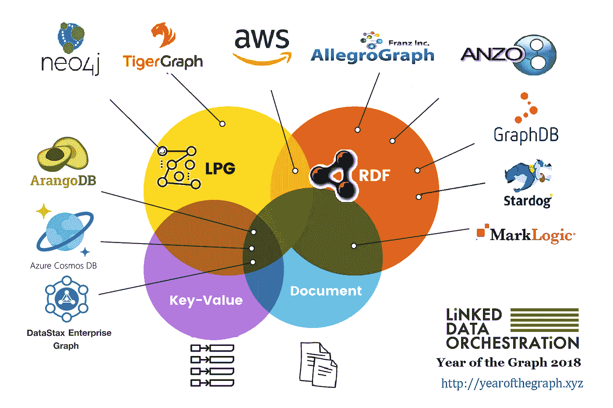

# 图表年简讯:2018 年 7 月

> 原文：<https://medium.com/hackernoon/the-year-of-the-graph-newsletter-july-2018-dfe34a7620bc>

什么是图形数据库？你真的需要一个吗，如果需要，你怎么选择？

归根结底就是这样。本月出版的图表年时事通讯很特别。

除了通常的喧嚣，这是一年中的这个时候有点慢，这个月的图形提供年扩展到图形报告年。

除此之外，这一版还包括 10+1 个项目，涵盖了更长的时间，主要是关于使用 Gremlin、Cosmos DB、DSE Graph、图形数据建模以及将图形与机器学习相结合的教育资源。

1.什么是图形数据库？你真的需要一个吗，如果需要，你怎么选择？我经常被问到这些问题，它们不是容易回答的类型。

要做到这一点，既需要专业知识，也需要努力。好消息，我已经这样做了，所以你不必这样做。这部作品比其他任何作品都更现代、更全面，而且价格也很低。

***特惠—前 10 名买家使用代码 10 可享受 33%的优惠首先***

 [## 图表的年份

### 什么是图形数据库？你真的需要一个吗，如果需要，你怎么选择？你真的知道…的答案吗

yearofthegraph.xyz](http://yearofthegraph.xyz) 

2.所有证据都指向同一个方向——图形数据库正蓄势待发。

Markets & Markets 预测，到 2023 年，复合年增长率(CAGR)将达到 24.091 亿美元的市场规模。

 [## 图形数据库市场预计到 2023 年将达到 24.091 亿美元

### 伊利诺伊州诺斯布鲁克-(sb wire)-2018 年 6 月 19 日-医疗保健和生命科学垂直行业预计将以最高速度增长…

www.sbwire.com](http://www.sbwire.com/press-releases/graph-database-market-expected-to-reach-24091-million-usd-by-2023-995037.htm) 

3.如果你想在阅读《图表年报告》之前对图表数据库有一个总体的了解，你可以从大卫·贝克伯格的演讲开始。对于一切你在那里找不到答案的事情，好吧，你知道该怎么做。

4.介意一些关于图形数据建模的专家建议吗？Ted Wilmes 给出了超越 DSE 图表的图表提示和技巧。

5.需要更多的提示和技巧，这一次使用 Gremlin？贾扬塔·蒙达尔所说的也适用于宇宙数据库之外的领域。

 [## 将 Gremlin API 用于 Azure Cosmos DB 的技巧

### 贾扬塔·蒙达尔停下来和斯科特·汉塞尔曼聊了聊 Gremlin，Cosmos DB graph 的遍历查询语言…

channel9.msdn.com](https://channel9.msdn.com/Shows/Azure-Friday/Tips-for-using-the-Gremlin-API-with-Azure-Cosmos-DB) 

6.用图表进行时间旅行怎么样？同样，Daniel Larkin-York 阐述的技术可以应用到 ArangoDB 之外

 [## 使用图形数据库进行时间旅行，例如 NoSQL 多模型数据库

### 图形数据库通常用于分析高度互联的数据集中的关系。社交网络…

www.arangodb.com](https://www.arangodb.com/2018/07/time-traveling-with-graph-databases/) 

7.总结教程，这里有一个关于开始使用 GraphX on Spark 进行图形分析的教程。这里重要的一点是，尽管它可能有用，但它不是一个图形数据库。

 [## Spark GraphX - DZone 大数据的分布式图形处理

### “简单是可靠的先决条件”，Edsger Dijkstra。图表是一种明显的、易于理解的数据…

dzone.com](https://dzone.com/articles/distributed-graphs-processing-with-spark-graphx) 

8.让我们不要忘记查询语言。随着社区中对带标签的属性图的标准化查询语言的呼吁仍然开放，TigerGraph 的 Mingxi Wu 就图查询语言的重要性发表了自己的看法。

 [## 企业在选择图形查询语言时应该知道什么

### 世界上几乎每个企业都使用数据库，无论是并行、分布式、平面文件…

www.eweek.com](http://www.eweek.com/database/what-enterprises-should-know-about-selecting-a-graph-query-language) 

9.DeepMind 的 Marta Garnelo 一直致力于将人工智能的符号方法与机器学习相结合。虽然前者被后者掩盖了，但 Garnelo 认为它们应该能够互补，并认为 RDF 在这方面有作用。

10.屋大维的人也一直在研究图和机器学习的交集，他们刚刚发布了一个可以用于问答的数据集。

 [## CLEVR 图:基于图的推理数据集

### 我们很高兴地宣布新数据集的发布。CLEVR 图形旨在帮助进一步研究机器…

medium.com](/octavian-ai/clevr-graph-a-dataset-for-graph-based-reasoning-5e4e64f28ffb) 

11.以下是 DIG 团队如何构建他们的领域洞察图，以帮助使用 RDF 打击贩运:

 [## 人工智能工具“挖掘”暴露性环，解码公开和黑暗的网络域。

### 人贩子不按规矩出牌。他们使用复杂的加密技术，并且经常发布色情广告——换一次手机…

publications.computer.org](https://publications.computer.org/intelligent-systems/2018/06/07/human-sex-trafficking-dark-web-ai-investigation-tool/) 

***您是否希望每月在收件箱中收到最新一年的图表简讯？简单——只需在下面注册。你认为一些新闻应该出现在即将到来的时事通讯中吗？太容易了——给我掉一行*** [***这里***](https://linkeddataorchestration.com/contact/) ***。***

贴有 [AI](https://linkeddataorchestration.com/tag/ai/) 、[allegraph](https://linkeddataorchestration.com/tag/allegrograph/)、 [AnzoGraph](https://linkeddataorchestration.com/tag/anzograph/) 、 [ArangoDB](https://linkeddataorchestration.com/tag/arangodb/) 、 [AWS](https://linkeddataorchestration.com/tag/aws/) 、 [CosmosDB](https://linkeddataorchestration.com/tag/cosmosdb/) 、 [DSE](https://linkeddataorchestration.com/tag/dse/) 、 [Graph](https://linkeddataorchestration.com/tag/graph/) 、 [GraphDB](https://linkeddataorchestration.com/tag/graphdb/) 、 [GraphX](https://linkeddataorchestration.com/tag/graphx/) 、 [Gremlin](https://linkeddataorchestration.com/tag/gremlin/) 、[机器学习【T23](https://linkeddataorchestration.com/tag/machine-learning/)

*原载于 2018 年 7 月 19 日*[*linkeddataorchestration.com*](https://linkeddataorchestration.com/2018/07/19/the-year-of-the-graph-newsletter-july-2018/)*。*