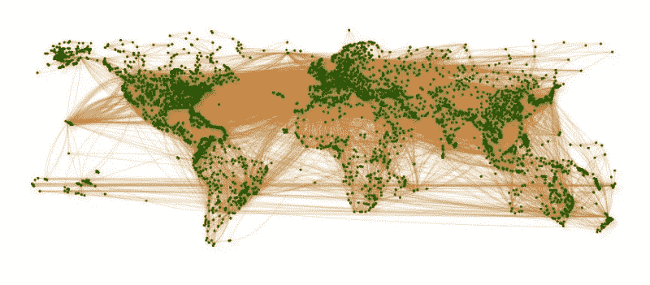
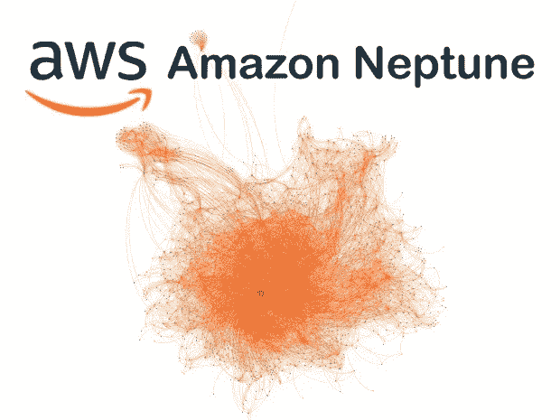
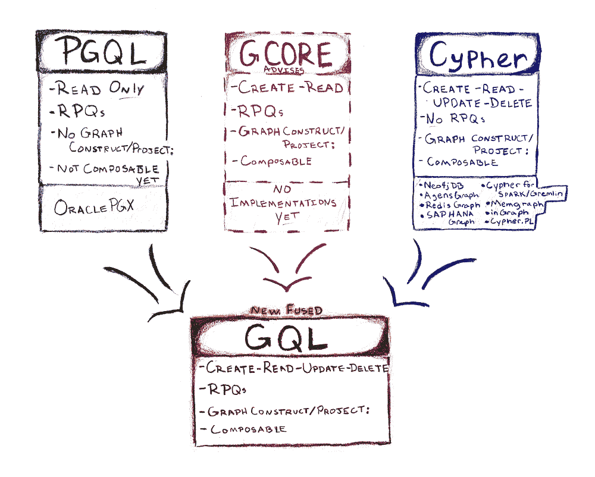
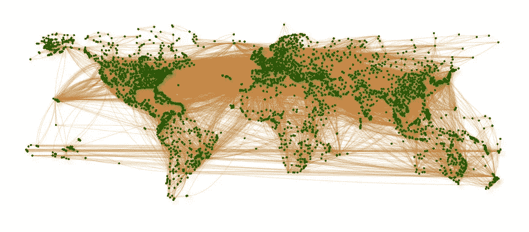
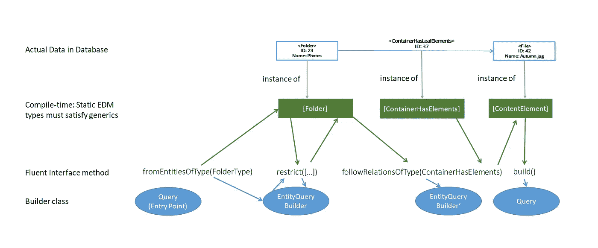
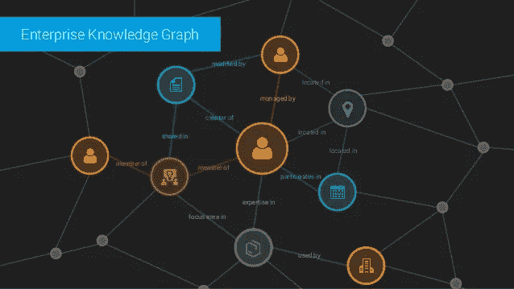
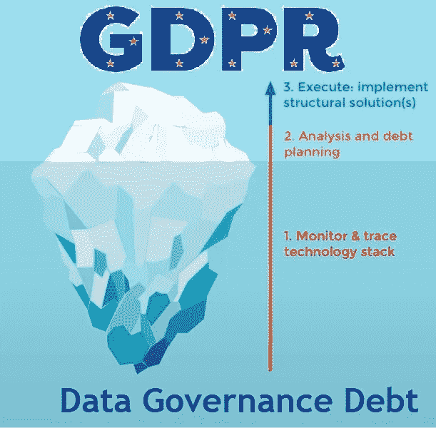

# 图表年简讯:2018 年 6 月

> 原文：<https://medium.com/hackernoon/the-year-of-the-graph-newsletter-june-2018-1322fe22839f>

AWS Neptune goes GA，微软 Cosmos DB 发布新功能，查询语言讨论升温，TigerGraph 宣布免费开发者版，用 Zalando 和 Textkernel 在现实世界中构建企业知识图，等等。对于图形数据库世界来说，五月是另一个有趣的月份。

数据科学家如何使用知识图？如何以及为什么可以发布 JSON-LD，或者使用 Gremlin 编写类型安全的图形查询？GDPR、元数据、语义学、IBM 和 Hortonworks 之间有什么联系？让我们开始我们的旅行并找出答案。

点击下面的图片，了解相关故事。

1 期待已久，现在普遍可用。AWS Neptune，这款来自亚马逊的二合一新产品，与其他图形数据库解决方案相比如何？它是如何工作的，它有什么用处，它会成为“[亚马逊](https://en.wiktionary.org/wiki/Amazon#Verb)”的域名吗？

2.Azure Cosmos DB 在微软 Build 的中心舞台上庆祝它的第一个生日。这个多模型数据库刚刚增加了一系列新功能，包括多主复制功能和一个异步 Java SDK，其主要架构师 Rimma Nehme 分享了更多细节。

3.我们已经强调了 graph guery 语言有多重要，以及那里的景观有多破碎。Neo4j 已经提出了一项提案，将自己的查询语言 Cypher 与甲骨文和 LDBC 的另外两种属性图查询语言 PGQL 和 G-Core 统一起来。有趣的是看到基本原理，社区的反应，以及它将如何发挥出来。

4.我们说过，图形查询语言和社区反应吗？这里是两者的回顾:社区有不同的反应，TigerGraph，图形数据库领域的最新成员，决定提供免费的开发者版本，试图建立自己的社区。

5.看起来，与 Gremlin(图查询语言的另一种替代语言)相关的人们同时还在继续工作。该项目的主要贡献者之一 Kelvin Lawrence 刚刚更新了他的实用小精灵指南。

6.作为查询语言的总结，这里有一个关于如何以及为什么在 Gremlin 之上构建类型安全图查询的建议，来自 Celum 的人。

7.Thomson Reuters 的人员会见了高级数据科学家，讨论如何鼓励更广泛地采用企业知识图。他们讨论了自然语言处理和人工智能等话题，但总的来说，他们认为最有价值的地方是连接数据仓库。

8.企业知识图很棒，但是实际上如何构建呢？让我们听听专家的意见:来自 Textkernel 的帕诺斯·亚历克索普洛斯和来自 Zalando 的 Katariina Kari 在这方面有超过 20 年的经验。在上台向我们讲述伦敦互联数据之前，他们在这里分享了一些经验。

9.五月也是 GDPR 月。可以理解你现在已经厌倦了，但是，我保证，这不是关于更新术语，或者任何通常的讨论。它是关于元数据和(基于图形的)语义如何帮助弥补 GDPR 揭示的数据治理差距。

10.如果您正在阅读本文，那么您很可能已经知道并使用了 JSON-LD。如果没有，来自 Data Language 的 Paul Wilton 写了为什么您应该考虑这一点，不管您是否使用关联数据和 RDF。

***您是否希望每月在收件箱中收到最新一年的图表简讯？简单——只需在下面注册。你认为一些新闻应该出现在即将到来的时事通讯中吗？太容易了——给我掉一行*** [***这里***](http://linkeddataorchestration.com/contact/) ***。***

贴有 [AWS](http://linkeddataorchestration.com/tag/aws/) 、 [Azure](http://linkeddataorchestration.com/tag/azure/) 、 [Connected Data London](http://linkeddataorchestration.com/tag/connected-data-london/) 、 [CosmosDB](http://linkeddataorchestration.com/tag/cosmosdb/) 、[企业知识图谱](http://linkeddataorchestration.com/tag/enterprise-knowledge-graphs/)、 [GDPR](http://linkeddataorchestration.com/tag/gdpr/) 、 [Gremlin](http://linkeddataorchestration.com/tag/gremlin/) 、 [JSON-LD](http://linkeddataorchestration.com/tag/json-ld/) 、[链接数据](http://linkeddataorchestration.com/tag/linked-data/)、[元数据](http://linkeddataorchestration.com/tag/metadata/)、[微软](http://linkeddataorchestration.com/tag/microsoft/)、[开源](http://linkeddataorchestration.com/tag/open-source/)

*原载于 2018 年 6 月 11 日*[*linkeddataorchestration.com*](http://linkeddataorchestration.com/2018/06/11/the-year-of-the-graph-newsletter-june-2018/)*。*