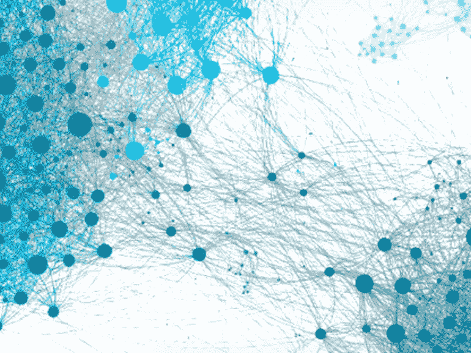
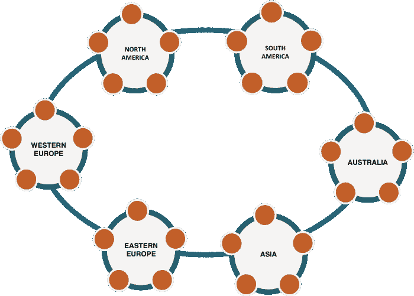
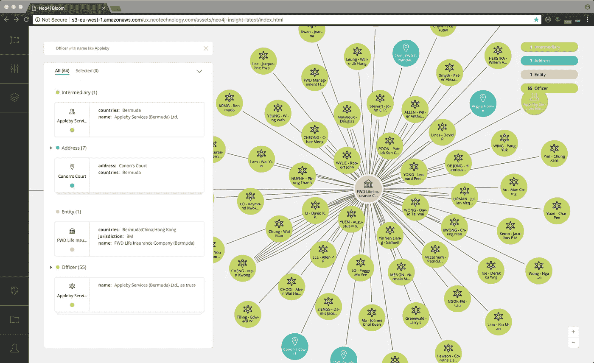
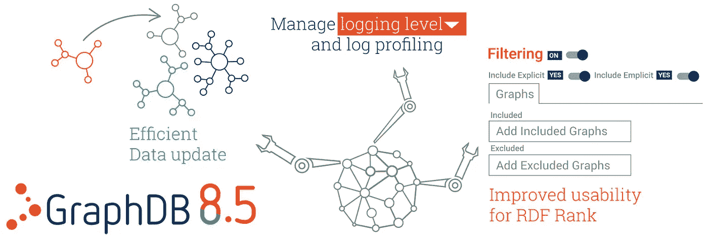
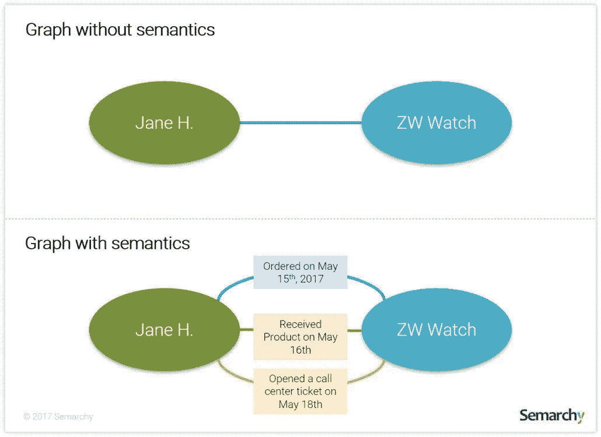
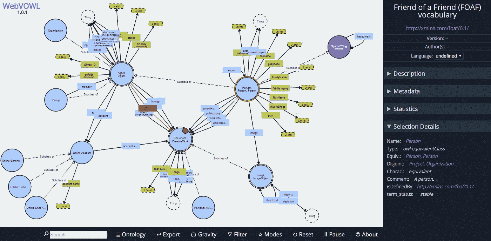
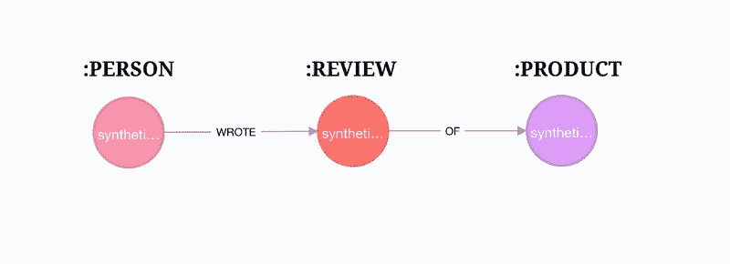

# 图表年简讯:2018 年 5 月

> 原文：<https://medium.com/hackernoon/the-year-of-the-graph-newsletter-may-2018-b427bf2eeaa>

***新发布，算法，可视化。在图形数据库世界中，四月是一个有趣的月份。***

**我们看到了两个次要和一个主要的图形数据库版本，即 GraphDB 8.5、Neo4j 3.4 和 DSE Graph 6.0。这些都带来了有趣的新功能，并稍微重塑了景观。**

我们看到更多的图表成为主流:向经理解释无索引邻接，在福布斯上讨论图表查询、算法和分析，在 ZDNet 上查看亚马逊 Neptune 的引擎盖下。

**我们看到图表被用于主数据管理和深度学习。我们还看到了一种使用 JSON 编写 SPARQL 查询的新方法，以及一种基于 web 的可视化本体的免费工具。**

***点击下面的图片进入故事。***

1.  **DSE (DataStax Enterprise)是卡珊德拉的商业版。人们不认为 Cassandra 是一个图形数据库，因为它不是。但是 DSE 是一个不同的故事。自 2015 年以来，DSE 一直在向其武库中添加图形功能，到目前为止，可以认为是一个多模型数据库，包括 Graph。由于 DSE 6.0 刚刚发布，我们来看看它的新特性，重点是 Graph。**

**2。Neo4j 也发布了新版本。Neo4j 3.4 将于 5 月中旬正式上市，它在性能和管理方面引入了许多改进。然而，最值得注意和推崇的是布鲁姆。Bloom 是一个新的可视化工具，补充了现有的 Neo4j 浏览器，因为它面向非技术用户。这是 Neo4j 到目前为止的一个空白，可能是独立图形可视化解决方案的一个问题。**

**3。最后但同样重要的是，在新版本中，GraphDB 8.5。更高效的数据同步、更好的报告和预加载工具都是受欢迎的新增功能。但是最显著的新特性是对 RDFRank 插件的改进。RDFRank 是一种开箱即用的算法，使类似 PageRank 的计算变得更容易。现在 RDFRank 可以异步工作并使用过滤器。**

**4。但是说真的，图查询、图算法和图分析之间的区别是什么？丹·伍兹在《福布斯》上讨论了所有地方。**

**5。既然我们现在处于讨论/教育模式，你知道什么是无索引邻接吗？如果您对图形数据库感兴趣，您应该。丹·麦克里用一种平易近人的方式解释了这一点。**

**6。图数据库在企业数据管理中的作用是什么？Semarchy 的 Salah Kamel 认为，目前，图形数据库更适合分析。虽然不是每个人都同意，但 Kamel 为使用 Graph 进行主数据管理、触及语义、查询和可视化提供了一个令人信服的案例。**

**7。另一方面，Amazon Neptune 的首要目标是运营应用。我们已经详细介绍了海王星，现在轮到托尼·贝尔来看看引擎盖下面。他发现 Neptune 更像是二合一的图形数据库:一部分是 RDF，一部分是 LPG，不幸的是这是非此即彼。亚马逊可能希望在某个时候统一这些，但这并不容易，也不会很快发生。**

**8。说到 RDF 和可视化:如果你正在使用 RDF，你可能知道可视化本体的痛苦之一。WebVOWL 是一个基于网络的可视化工具，可以使理解和导航本体更容易，它刚刚得到了更新。**

**9。使用 RDF 图的另一个经常提到的难点是查询。SPARQL 并不是很多人的首选，即使对那些喜欢它的人来说，也有一部分是他们不需要的:将结果解析成他们想要的格式。SPARQL Transformer 是一个有趣的想法，它让您可以将 JSON 既作为查询语言使用，又作为您希望获得结果的格式的规范。**

**10。对深度学习和图形感兴趣？事实上，这两者很配。来自 Octavian 的 David Mack 演示了如何将你的图表连接到 TensorFlow，并以 97%的准确率预测评论。**

***您是否希望在收件箱中收到最新一年的图表简讯？简单——只需在下面注册。你认为一些新闻应该出现在即将到来的时事通讯中吗？太容易了——给我来一行*** [***这里***](http://linkeddataorchestration.com/contact/) ***。***

*原载于 2018 年 5 月 9 日*[*linkeddataorchestration.com*](http://linkeddataorchestration.com/2018/05/09/the-year-of-the-graph-newsletter-may-2018/)*。*