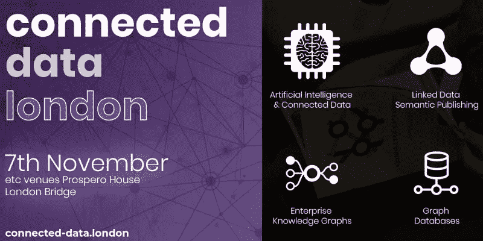

# 图表年简讯:2018 年 10 月

> 原文：<https://medium.com/hackernoon/the-year-of-the-graph-newsletter-october-2018-f20adbb03577>

**获得正确的知识图语义和定义,《语义网标准在现实世界中的应用》, Google no less，ArangoDB，Azure CosmosDB，Neo4j 和 TigerGraph 宣布了新版本。**

**到现在为止，你可能已经知道知识图表正处于 Gartner 的炒作周期中。但是我们如何定义知识图呢？我对 ZDNet 的看法。**

 [## 宣传之外的知识图表:从图表和数据库中获取知识

### 知识图表到底是什么，对它们的大肆宣传是怎么回事？学习区分炒作和现实…

www.zdnet.com](https://www.zdnet.com/article/knowledge-graphs-beyond-the-hype-getting-knowledge-in-and-out-of-graphs-and-databases/) 

**这是 Stardog 的 Kendall Clark 的镜头:**

 [## 什么是知识图？

### Stardog 是全球领先的企业知识图谱平台。但是什么是知识图，为什么你应该…

www.stardog.com](https://www.stardog.com/blog/what-is-a-knowledge-graph/) 

**普华永道的 Alan Morrison 谈知识图表如何帮助 IT 堆栈崩溃**

**你知道 Airbnb 也有知识图谱吗？你可以在这里读到它。请注意 LinkedIn 的分类经理**关于在现实世界中构建知识图表的细微差别的深刻评论

 [## 在 Airbnb 扩展知识访问和检索

### 介绍我们用于编码关系和呈现相关信息的知识图

medium.com](/airbnb-engineering/scaling-knowledge-access-and-retrieval-at-airbnb-665b6ba21e95) 

**想知道知识图在现实世界中是如何工作的？如何在 web 规模上处理语义，这对数据治理有何帮助，如何评估图形数据库，或者图形和人工智能如何协同工作？那么这是为你准备的活动—查看官方公布的计划**:

 [## 2018 年伦敦互联数据计划的知识图和人工智能专家

### “互联数据伦敦”是那些利用数据中的关系、意义和上下文来实现以下目标的人的领先活动…

互联数据.伦敦](http://connected-data.london/2018/09/27/knowledge-graph-and-ai-experts-for-connected-data-london-2018-program?utm_campaign=YOGnewsletter) 

**来自[A]的 Cruce Saunders 阐述了语义网对于企业出版商的重要性**

 [## 什么是语义网，企业出版商为什么要关心？

### 语义网是通过将连接的、链接的数据与智能内容相结合而形成的知识图

medium.com](/@cruce/what-is-the-semantic-web-and-why-should-enterprise-publishers-care-461fc2a4d614) 

**Google 刚刚扩展了搜索，所以现在也可以搜索数据了。除了非常有用之外，这也展示了 schema.org 和语义网标准在现实生活中是如何工作的:**

 [## 谷歌现在可以搜索数据集。先研究，后世界？ZDNet

### 随着数据科学和分析的兴起和民主化，能够找到…

www.zdnet.com](https://www.zdnet.com/article/google-can-now-search-for-datasets-first-research-then-the-world/) 

**Dan Brickley，schema.org 的策划者，谈 RDF 和 SPARQL**

**Azure CosmosDB 在微软 Ignite 2018 上宣布了新功能。这些都不是特定于图形的，但是不管怎样，像全局范围内的多主机这样的东西应该会派上用场**

 [## Azure Cosmos DB -智能云数据库-智能边缘时代

### Rimma Nehme 产品经理和架构师，Azure Cosmos DB Azure Cosmos DB 是微软的全球分布式…

azure.microsoft.com](https://azure.microsoft.com/en-us/blog/azure-cosmos-db-database-for-intelligent-cloud-intelligent-edge-era/) 

Neo4j 还在纽约 Graph Connect 上发布了新版本 3.5。v3.5 中的主要新功能将于 2018 年第 4 季度推出，包括全文搜索和新的图形算法实现。

 [## Neo4j 3.5 准备为下一代人工智能和机器学习系统提供动力

### 最新的 Neo4j 图形平台使用连接优先的方法 GRAPHCONNECT，NEW…

neo4j.com](https://neo4j.com/news/neo4j-3-5-next-generation-ai-machine-learning/) 

【Neo4j 前几天，TigerGraph 也公布了新版本。TigerGraph 增加了与流行的数据库和数据存储系统的集成，宣布了一个 github 存储库来托管开源连接器，增加了对图形算法的支持，以及一个 Neo4j 迁移工具包。

 [## 介绍最新发布的 TigerGraph:最快的图形分析性能

### 世界上最快的企业图形分析平台，今天推出其最新版本，旨在帮助…

info.tigergraph.com](https://info.tigergraph.com/introducing-the-latest-release-of-tigergraph-fastest-performance-for-graph-analytics) 

**ArangoDB 也有了一个新的版本:3.4。一个候选版本已经发布，主要的新特性是搜索、对 GeoJSON 和谷歌 S2 索引的支持、通过查询分析和流式游标的性能改进，以及使 RocksDB 成为默认存储引擎**

 [## 发布候选版本 1 ArangoDB 3.4 -有什么新内容？

### 对于 ArangoDB 3.4，我们已经添加了 100，000 行代码，愉快地删除了 50，000 行代码，并更改了 13，000 多个文件…

www.arangodb.com](https://www.arangodb.com/2018/09/rc1-arangodb-3-4-whats-new/) 

Expero 的乔希·佩里曼分享了一些使用图形数据库的实践经验

***您是否希望每月在收件箱中收到最新一年的图表简讯？简单——只需在下面注册。你认为一些新闻应该出现在即将到来的时事通讯中吗？太容易了—给我来一行*** [***这里***](https://linkeddataorchestration.com/contact/) ***。***

*原载于 2018 年 10 月 1 日*[*linkeddataorchestration.com*](https://linkeddataorchestration.com/2018/10/01/the-year-of-the-graph-newsletter-october-2018/)*。*