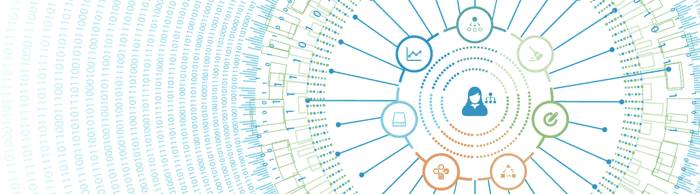
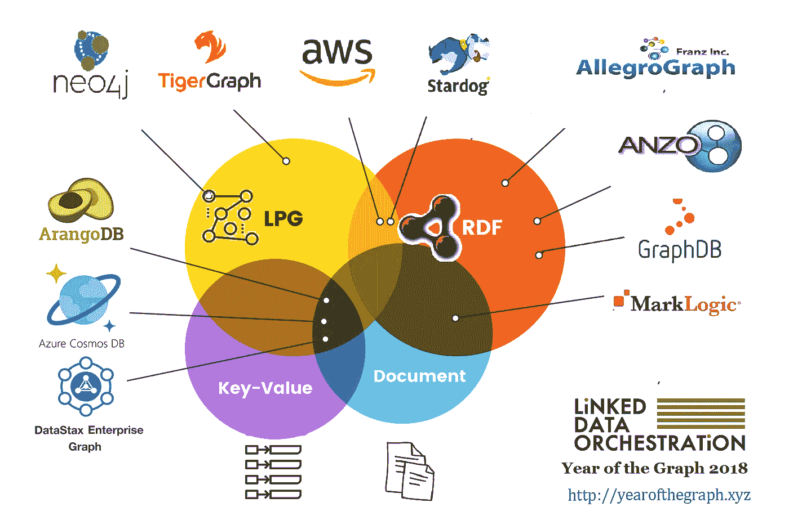

# 图表年简讯:2018 年 9 月

> 原文：<https://medium.com/hackernoon/the-year-of-the-graph-newsletter-september-2018-4f3f1fdf1525>

**Gartner 炒作周期中的知识图，图数据库的机器学习扩展和可视化工具，带 RDF 的以太坊分析，带 R、SPARQL 和 Spring 使用 Gremlin，图数据库研究获得 VLDB 最佳论文奖，标杆 AWS Neptune。**

**对于一个典型的暑假月份来说，比如八月，这还不错。这一期的图表年时事通讯不得不延长，以确保我们尽可能多地包含好的内容。**

**Gartner 2018 年炒作周期近日发布，知识图谱首次纳入其中。如果你想要官方证明这是图表年，你有它。**

当一项迄今为止还很小众的技术受到关注时，一些解释是合理的，语义网公司的 Andreas Blumauer 对此进行了尝试。

 [## 知识图表——在日益复杂的世界中连接点

### 再见筒仓！留在岛上的人会撤退。这句话几乎在我们生活的任何层面上都是正确的

www.linkedin.com](https://www.linkedin.com/pulse/knowledge-graphs-connecting-dots-increasingly-complex-blumauer/) 

**谷歌有知识图谱已经有一段时间了。但是在网络范围内开发和使用一个知识图谱并不容易。Diffbot 声称已经做到了这一点，将网络变成了世界上最大的知识图谱。**

 [## 作为数据库的网络:有史以来最大的知识图谱

### 网络是人类最伟大的成就和资源之一。不断扩大和几乎无所不包，我们都…

www.zdnet.com](https://www.zdnet.com/article/the-web-as-a-database-the-biggest-knowledge-graph-ever/) 

**关于知识图、知识图是什么以及如何构建知识图，有很多要说的。一个图形数据库将是你建立一个图形数据库的基础，但是这不是你使用图形数据库的唯一目的。Neo4j 的 Jennifer Reif 谈到了图形数据库何时有意义。**

 [## 如何知道图形数据库是否解决了问题？

### 一直困扰开发人员的最大问题之一是“我应该使用什么技术？”。来自…的分析

medium.com](/neo4j/how-do-you-know-if-a-graph-database-solves-the-problem-a7da10393f5) 

**关于知识图表，有这样一件事:你不需要为了建立一个图表数据库而将你所有的数据都转移到图表数据库中。但是你需要有正确的指针和元数据，为此你需要一个图形数据库。语义有限责任公司的 Kurt Cagle 描述了这种方法。**

 [## 构建语义数据目录

### 我最近与一家大型企业的高级数据经理进行了一次交谈，他正在进行…

medium.com](/@kurtcagle/building-semantic-data-catalogs-a72d0e1b821a) 

**既然我们在事物的语义方面，那么看看 Alethio 和 SANSA 如何将用于读取和查询大规模 RDF 数据的 SANSA 堆栈与两种最经典的图形算法——Connected Components 和 PageRank 相结合，在以太坊网络上进行分析。**

 [## 交易网络中的枢纽和权威——由 SANSA 和图形分析提供支持

### Alethio 的数据科学家深入研究以太坊区块链，以确定交易中的主要参与者…

media.consensys.net](https://media.consensys.net/the-hubs-authorities-in-transaction-network-powered-by-sansa-and-graph-analysis-9bf271c2e5f9) 

**RDF 和图形分析，检查。RDF 和机器学习，也查。期待看到这种情况越来越多。在这里，来自 Stardog 的 Pedro Oliveira 概述了 Stardog 的 SPARQL 机器学习扩展如何进行相似性搜索。**

 [## 相似性搜索- Stardog

### 学习如何用机器学习在知识图中找到相似的条目。

www.stardog.com](https://www.stardog.com/blog/similarity-search/) 

**Neo4j 也有一些机器学习扩展。Neo4j 的实习生 Lauren Shin 开发了一些线性回归的扩展，她在这里概述了这些扩展。**

 [## 图形和 ML:多元线性回归

### 同样的 neo4j 线性回归程序，现在自变量无限！更多功能，无需额外…

towardsdatascience.com](https://towardsdatascience.com/graphs-and-ml-multiple-linear-regression-c6920a1f2e70) 

**另一个贡献者，来自德累斯顿工业大学的 Peter Heisig，另一个 Neo4j 扩展。Heisig 构建了一个图形视图编辑器来与 Neo4j 交互，跳过了编写 Cypher 的部分。**

 [## Neo4j 图形视图编辑器

### TL；DR neo4j 1 browser 2 是一款非常棒的图形查询工具，并且配有设计良好的用户界面，可以…

皮黑.德](https://pehei.de/post/neo4j-editor/) 

**更多可视化工具。Dave Bechberger 为启用 Tinkerpop 的图形数据库构建了一个运行遍历和可视化结果的 IDE。现在还处于早期阶段，但是如果你不是主机的忠实粉丝，这可能对你有好处。它是开源的，所以你也可以贡献。**

但是这并不是 Tinkerpop 用户高兴的唯一原因。微软还为支持 Tinkerpop 的图形数据库开发并开源了一个有价值的资源:Gremlin 的 Spring 数据层。如果你喜欢春天的数据，你一定会欣赏这一点。

 [## Azure Cosmos DB 图形 API 的 Spring Data Gremlin

### 我们很高兴地宣布，Spring Data Gremlin 现在可以在 Maven Central 上获得，源代码可以在 GitHub 上获得。这个…

azure.microsoft.com](https://azure.microsoft.com/en-us/blog/spring-data-gremlin-for-azure-cosmos-db-graph-api/) 

**Tinkerpop 如日中天:来自波恩大学的 Dharmen Punjani 和 Harsh Thakkar 刚刚发布了他们的 Gremlin——SPARQL 连接器，包含在 Tinkerpop 中。这意味着您现在可以使用 SPARQL 查询支持 Tinkerpop 的图形数据库。**

**总结 Tinkerpop 和 Gremlin，来自昆士兰大学的 Jeffrey Hanson 展示了 Gremlin 如何被用于寻找 R. Hanson 是一个保护科学家，被他在工作中必须处理的问题吸引到图中。**

 [## 使用 Gremlin 的 R 中的 RPubs -子图

### 编辑描述

rpubs.com](http://rpubs.com/jeffreyhanson/subgraphs-gremlin) 

**这显示了大型图形的普遍性和图形处理的惊人挑战。这也是 Siddhartha Sahu 和他的合著者的用户调查论文的标题，该论文赢得了 VLDB 的最佳论文奖。**

你有没有想过海王星的速度到底有多快？根据 TigerGraph 的工程副总裁 Mingxi Wu 发布的基准测试，没有 TigerGraph 快。供应商所做的基准测试应该有所保留，但是这可能会给你一个想法。

 [## 亚马逊海王星，真相大白

### 今年 5 月，亚马逊宣布其名为 Amazon Neptune 的云图数据库服务全面可用…

www.tigergraph.com](https://www.tigergraph.com/2018/08/29/amazon-neptune/) 

**性能很重要，但是选择一个图形数据库是一项艰苦的工作，需要考虑许多因素。好消息是，已经有人这样做了，所以你不必这样做。**

**关于图形数据库的最全面的研究在这里为你节省时间和金钱，并确保你选择适合你的。如果你已经读到这里，这里有一个限量版的 33%折扣代码给你:33 折**

***您是否希望每月在收件箱中收到最新一年的图表简讯？简单——只需在下面注册。你认为一些新闻应该出现在即将到来的时事通讯中吗？太容易了——给我来一行*** [***这里***](https://linkeddataorchestration.com/contact/) ***。***

贴有[分析](https://linkeddataorchestration.com/tag/analytics/)、 [AWS](https://linkeddataorchestration.com/tag/aws/) 、[大数据](https://linkeddataorchestration.com/tag/big-data/)、 [CosmosDB](https://linkeddataorchestration.com/tag/cosmosdb/) 、[数据科学](https://linkeddataorchestration.com/tag/data-science/)、[企业知识图谱](https://linkeddataorchestration.com/tag/enterprise-knowledge-graphs/)、[以太坊](https://linkeddataorchestration.com/tag/ethereum/)、 [Gremlin](https://linkeddataorchestration.com/tag/gremlin/) 、[关联数据](https://linkeddataorchestration.com/tag/linked-data/)、[机器学习](https://linkeddataorchestration.com/tag/machine-learning/)、[微软](https://linkeddataorchestration.com/tag/microsoft/)、 [Neo4j](https://linkeddataorchestration.com/tag/neo4j/)

*原载于 2018 年 9 月 2 日*[*【linkeddataorchestration.com】*](https://linkeddataorchestration.com/2018/09/02/the-year-of-the-graph-newsletter-september-2018/)*。*