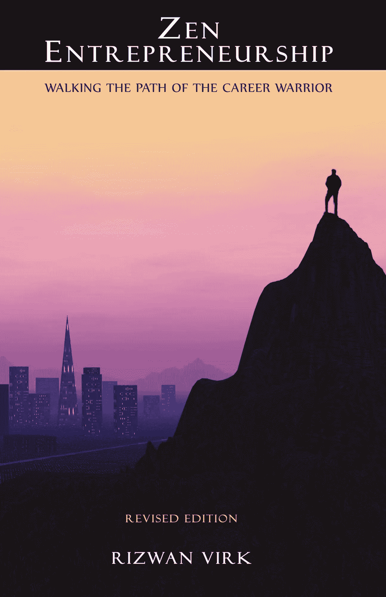

# 重温创业之禅

> 原文：<https://medium.com/hackernoon/the-zen-of-entrepreneurship-fdfec88c8526>

> 注意:本周，我的书 [Zen Entrepreneurship](https://www.amazon.com/Zen-Entrepreneurship-Rizwan-Virk-ebook/dp/B00CXJAH9A/) 在亚马逊上是免费的——在这里为你的 kindle [下载。这篇文章最初出现在](https://www.amazon.com/Zen-Entrepreneurship-Rizwan-Virk-ebook/dp/B00CXJAH9A) [Techcrunch 上。](https://techcrunch.com/2013/06/08/the-zen-of-entrepreneurship/)

在硅谷，很容易找到很多关于我称之为“外部”创业指南的建议，包括:构建你的公司，打造一个最低可行的产品，与投资者谈判条款清单，出售你的公司，等等！

另一方面，这篇文章讲述的是创业旅程中鲜为人知的“内心世界”。在这个旅程中，没有现成的药方。每个公司、企业家和市场都是独一无二的。相反，它是关于发展一个“清晰的头脑”来看到真正发生的事情，相信你的“直觉”来找到一条通过未知领域的道路，并认识和超越你的个人模式来找到你的人生使命。

这些事情真的有助于建立一个成功的创业公司吗？当我刚从麻省理工学院毕业，创办我的第一家软件公司时，我不这么认为。想象一下，几年后，当我在个人成长道路上苦苦挣扎的问题变成了决定我创业公司生死的问题时，我有多惊讶！我写了我的书 [Zen Entrepreneurship，这本书本周在亚马逊 kindle 上免费](https://www.amazon.com/Zen-Entrepreneurship-Rizwan-Virk-ebook/dp/B00CXJAH9A/)，来分享我学到的一些经验。

以下是一些亮点:

# 1.保持冷静，看清楚。

经营一家初创公司就像有几条消防水管从不同方向对准你，每一条都试图让你失去平衡。你如何能保持冷静的头脑，在每一次突发事件中不惊慌失措？

从你的创业中抽出一点时间来培养专注和清晰的思维是我强烈推荐的一个基本做法。在东方传统中(在西方也越来越多)，这意味着冥想或瑜伽。虽然这些练习提供了实际的好处，如提高注意力、平静和耐力，但这些练习的真正目的完全是别的东西:意识。

在瑜伽传统中，我们的身心由几个清晰的鞘(称为 *khosas* )组成，当我们在生活和工作中经历压力时，我们在这些鞘(称为 *samskaras* )中建立不完美，以至于它们变得浑浊，不让光线穿过。最终，这使我们看不清我们行动的结果，我们陷入重复的模式。与主要是身体活动的锻炼不同，冥想和瑜伽练习有助于清除这些鞘，就像清洁肮脏的挡风玻璃一样，这使我们能够更清楚地感知我们周围的道路上正在发生的事情，然后采取适当的行动。

作为企业家，我们忙于让投资者、员工、顾问和客户相信我们对未来的愿景，有时我们对周围市场的基本现实视而不见，直到为时已晚。在硅谷，博客上充斥着公司和产品失败的原因。

不像著名的(虚构的)日本盲人剑客佐藤一(Zatoichi)在行动前经常在脑海中看到特定剑挥出的结果，完全预测一个动作的结果是不可能的。然而，如果我们有正确的心态，这些结果一发生就有可能被更清晰地感知。我们可以看到市场上真正发生的事情，然后采取适当的行动，而不是看我们希望产品表现如何。

# 2.企业家，认识你自己！你的图案像龙一样。

如果说我从创办多家公司和投资数十位企业家中学到了什么，那就是你的个性迟早会影响你的创业轨迹——不管你愿不愿意！

在我的书《禅宗企业家精神》(Zen Entrepreneurship)中，我的导师揭示了我生活中的一种模式，当时我只是勉强意识到:我总是在寻找新的、令人兴奋的东西，最终会同时做太多事情。最终，我会被迫放弃一些我正在处理的活动，以挽救其余的活动。要成为一种模式，一件事必须发生至少三次，的确如此——在高中，在大学，现在在我放学后的第一次创业中。

当我们为这家快速成长的初创公司筹集风险投资资金时，这种模式变得更糟，而不是更好！它具体化为我现在所说的“表演与歌唱”问题(“在好莱坞，所有的演员都想成为歌手，而所有的歌手都想成为演员”)。从那以后，我参与的每一家创业公司都以某种形式面临这样的核心问题。我们无法决定是要做产品公司还是服务公司，就一直两个都做，几乎导致灾难性的结果。为了让我的公司成功，我必须认识并处理这种无意识地推动我的业务的内部模式。

再举一个例子，我认识一个硅谷的企业家，他总是发现自己与新投资者和顾问处于类似的情况。总会有一段蜜月期，在这段时间里，“新人”在他眼里不会做错什么，他不会浪费时间向团队的其他成员吹嘘这一点。迟早，他们所做的决定中有一个会变得不那么好。然后，企业家开始将失败完全归咎于“新人”，而不是自己承担任何责任。最终，新人厌倦了企业家，他们分道扬镳，再也不想和对方有任何瓜葛。

这种模式的显著之处在于，企业家并不知道这种情况正在发生。我是在这种情况发生了几次之后才意识到这一点的。就像《土拨鼠日》中的比利·穆雷一样，他陷入了一场不断重复的自己制造的戏剧中。只有有意识地认识到这种模式是他自身问题的反映，他才能够超越这种模式。

想想你自己的模式，或者你认识的企业家的模式。就像一些发现自己与不同的人有着相似关系的年轻男性(或女性)一样，我对硅谷初创公司投资越多，就越看到雄心勃勃的企业家在他们的初创公司中向外重复他们内心的戏剧。

你的内在模式就像龙。中国有一句关于龙的古谚:“不要理会龙，它会吃了你。直面恶龙，它会打败你。学会驾驭龙，你就能利用它的力量。”

关键是要认识并学会利用隐藏在你的模式中的优势，而不是被它们消耗掉。

Read about the inner art of entrepreneurship — this week for free on kindle!

# 3.学会运用你的直觉，跟着线索走。

当你学会清理你的头脑，你也将能够更清晰地调谐到你的直觉。有时候，一个小小的预感、直觉、有趣的感觉、意想不到的巧合、同步性，甚至是一个特别生动的梦都可以让你走出困境，走向全新的成功。我称这些形式的直觉为线索。就像一个好的寻宝游戏或神秘事件一样，线索一次只能揭示一个，我们必须既能单独识别它们，又能把它们组合成一个更大的模式。

几年前，当我创办一家 XML 内容管理公司时，我们找不到一个我们喜欢的名字。我碰巧去密歇根州看望我的父母，正开车行驶在安阿伯附近的 I-94 公路上，这时我注意到一栋建筑的侧面有一个模糊熟悉的名字:Arbortext。当我看到它时，我有一种奇怪的感觉，即使你不知道为什么，那种感觉也会一直伴随着你，有点像似曾相识。

以这种感觉为线索，我决定跟踪它。最初，它为我们的命名问题提供了一个简单的答案。Arbortext 的创始人以他们大学时的家乡命名了他们的公司。我们决定做同样的事情，并将我们的公司命名为剑桥博士。但这还不是全部。沿着这条线索，我对这家公司做了一些研究，意识到他们在一个邻近的市场空间，所以我联系了 Arbortext 的创始人之一，告诉他我们的产品。长话短说，他们成了我们最大的客户，给了我们的小公司在市场上极大的可信度——这一切都是因为我跟着线索看它会走向何方。

不管他们承认与否，大多数投资者在做投资决定时都非常依赖他们的直觉。然后，他们会添加必要的逻辑理由，让他们的合作伙伴同意这是一项不错的投资。

几年前，当我在斯坦福商学院的时候，一位著名的沙丘路风险投资人告诉了我们一些关于他的过程的事情，这些事情会让我的分析型教授们退避三舍。他说，除了通常的因素(市场规模、管理团队、竞争)，他还在周围的环境中寻找“信号”，作为投资前的确认。基本上我称之为线索。有一次，当他为是否投资一家多媒体流媒体公司而苦恼时，他去看了一场球赛。在那里，他偶然听到一个视力不太好的孩子告诉他的父亲，他希望他能在手机上看比赛，因为他们的座位太远了。这个线索足以证明，风投决定继续投资。

这就是线索的工作方式——如果你或我头顶上有这个孩子，它可能对我们没有任何意义——它们是来自我们无意识的高度个性化的信息，告诉我们要注意一些事情。那么，他们将走向何方？

# 4.把这些点连接起来，找到更大的图案。

有时候，跟随我们的直觉会导致单个的点，直到很多年后才会连接起来揭示一个更大的模式。一个著名的例子是史蒂夫·乔布斯放弃了他所有的大学课程，转而爱上了书法。直到多年后，当他们制造第一台麦金塔电脑时，这一点的含义才变得清晰。如果不是因为他在书法课上对字体的热情，你可能会在《信使报》的黑白或绿色屏幕上读到这篇文章！

你对什么感兴趣却从未跟进过？这不仅关系到你目前的创业，也关系到你在生活中的使命，更大的格局。

我曾经很喜欢成为一名电影制作人的想法，在初中时就在脑海中构思完整的剧本。几年后，在我开始投资和指导企业家之后，一个不同类型的年轻企业家找到了我，没有人愿意资助他:一个电影学院的应届毕业生。将这些点串联起来，我开始指导电影制作人，这对我个人来说已经变得像科技创业投资一样有益。

真正的成功和满足感不仅仅来自于卖掉一家公司或赚了数百万美元，它们来自于你觉得这辈子应该做的事情是一致的。我称之为你独特的战士之路——你在这里做出的贡献，你在这里学到的教训(通常与处理我前面提到的模式和问题有关)。

再一次，用硅谷的禅宗大师史蒂夫·乔布斯的话来说:“你必须相信，在你的未来，这些点会以某种方式连接起来。你必须相信某些东西——你的勇气、命运、生活、因果报应等等。这种方法从未让我失望，它让我的生活变得完全不同。”

跟着线索走。把这些点联系起来。找到你生活中起作用的更大的模式。这就是企业家精神的真谛。

> 注:本周我的书 [Zen Entrepreneurship，kindle 免费，在这里下载。](https://www.amazon.com/Zen-Entrepreneurship-Rizwan-Virk-ebook/dp/B00CXJAH9A/)