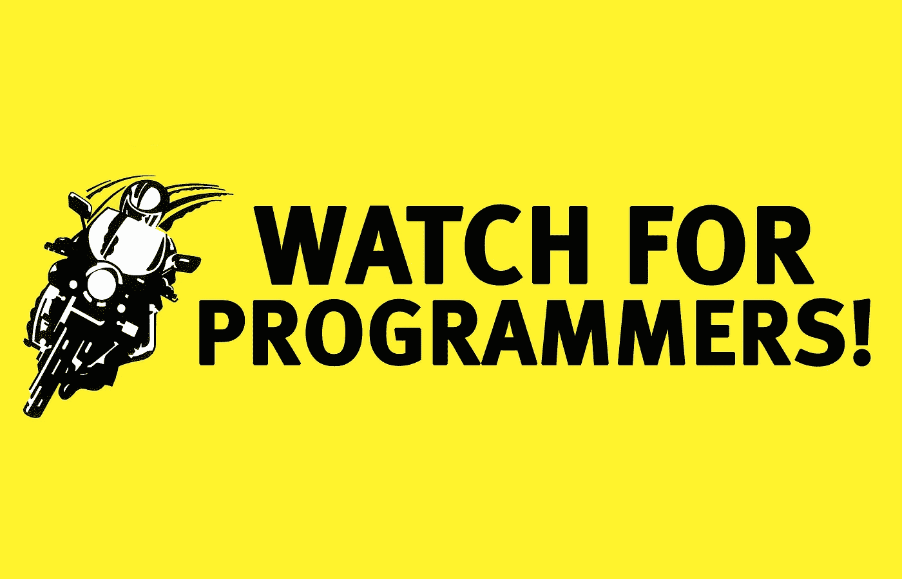
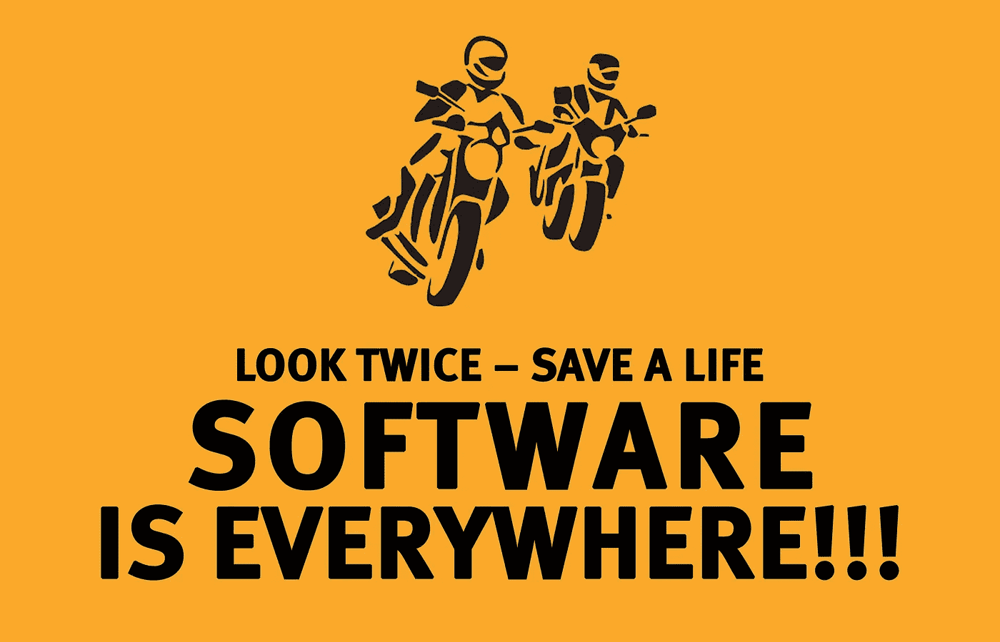

# 摩托车和编程的禅

> 原文：<https://medium.com/hackernoon/the-zen-of-motorcycling-and-programming-620907dbab2c>

## 软件工程的价值探讨

我穿过炎热的夏日微风，沿着与大海平行的林荫道前行。我的引擎通过保持法定速度限制慢慢加速。我在我的摩托车上感受着这一切，带着灵感的想法和对保存的疑虑。“我应该检查那个东西吗？这个细节呢？啊，不管是什么，享受这一程吧。”我毫不畏惧，朝我的右边望去，除了沙丘什么也没有，左边是巨大的南湾。蓝天上有缕缕白云，远处有一座桥。我正在去欧比的路上，这是一个紧靠大西洋的不知名的停车场。

一停车，我就脱下头盔、手套和夹克。汗水从我的衬垫凯夫拉尔牛仔裤顺着我的腿流到我的马靴上。我坐在自行车旁，在阴凉的一边。我想思考，但相反，我翻出我的手机，孤独地盯着电子邮件和社交帖子。

一段时间过去了。最后，一辆自行车停了下来，查看并检查在附近停车是否安全。一位老妇人从她破旧的自行车上跳了下来。我看了一下，有了判断。“嗯，她已经准备好了。我喜欢的骑手。”她慢慢走近，欣赏我的自行车，我欣赏她的。

我们聊起了自行车和骑行哲学。这位女士比我更有骑马经验，生动地讲述了骑马的冒险经历。然后她问了我的职业。

> 但是什么是…软件编程？

**我:**“嗯，最简单来说，我们就是读者。更罕见的是，我们是代码的作者。当我们写作时，我们可能会遵循支票。”

**她:**“什么样的检查？”

**我:**“首先当然是我们有 *T-CLOCS* (轮胎/车轮/刹车、控制、灯光/电气、油/液、底盘、支架)。在我们写作之前，我们阅读是为了理解增加我们正在阅读的内容是否有意义。我们可能必须先解决问题。一旦我们有了可以添加的东西，这可能需要一些时间，我们就可以安全地继续下去。”

**我:**“但是在我们跳上去之前，我们必须穿上装备。 *ATGATT* (所有档位，所有时间)。在我们写作的时候，我们穿上护具来保护自己。让我们称之为检查我们写作的测试。测试不会保护我们免受一切伤害，但它让我们处于一种心态，即我们可能会受伤，并采取预防措施以避免未来受伤。”

**我:**“从那以后，我们就担心那段文字的可见度。我们希望代码清晰。我们让其他人审查和检查它。然后代码被安全地附加上去。”

**她:**“啊，有点像*多看两眼，救人一命*？”

我:“是的，但是我们承担了繁重的工作，以确保代码运行良好。我们有高视觉，不断移动以被看到，甚至放下手势信号以确保我们有明确的意图。”

她:“有没有程序员会写代码并避开这些检查？”

**我:**“当然。即使是合法的，这些程序员也是*车道分割线*。他们很快超过其他人，有时他们会赢。但最终，他们的机会耗尽了，他们伤害了自己和他人。”

我:“我对机器的尊重是最重要的，一直都是。就像我知道那边的自行车会伤害我和其他人一样，我知道我所拥有的尊重会让我保持克制，所以我可以活到明天再骑。”

她:你很有头脑。但是回到这个软件编程的事情上来。所以你们是读者，有时也是作家。除了这些检查和测试，你如何读和写好？”

我:“就像我们应该练习我们的 8 字形、停车、急转弯和技巧一样，我们也需要练习我们的阅读和写作。不管我们在这个游戏中待了多久，我们都应该持续这样做。我不相信这一点，直到我最近有一个非常接近的电话。我太懒了，但我知道如果我不断练习这项技能，它就会变得很平凡。”

**她:**“是啊，差不多到座位时间了。但这也是骑手的态度和风险评估。”

**我:**“但是事情是这样的。练习是有背景的，我们必须考虑如何练习。这必须是一场聚焦运动。到处都有相当多的炒作，你会被拖着去读和写一些变得无关紧要的东西。你确实需要骑自己的车。”

我:“有时你需要听从大卫·霍夫或肯·康登的建议，但有时需要玛利亚·科斯特洛或基思·科德。很多时候，你必须使用数据，比如伤害或女佣报告。有时候你必须跟着感觉走。但重要的是学习的态度。”

我:“我们都丢了自行车。你会学到掸去灰尘，重新拾起来是很重要的。”

**她:**“知道了。计算机能读取这些文字(代码)吗？”

我:的确，因此这些程序是如何工作的。*就像摩托车一样，软件无处不在！但是它主要是关于人的。这些机器可以很好地处理所有的文字。他们可以优化，这样他们可以跳过边缘陷阱，在沙地上导航，并处理各种不同的天气和交通状况。但是人类不能总是。有时候自负会碍事。”*

**她:**“有点像那些你先扔了之后就再也不扔和平标志的骑手？”

**我:**“是的。但是还有其他人对此视而不见，他们需要学习放下那个和平标志意味着什么。我们需要好好指导，并借此机会向他们展示我们的编程*工艺*。学会大量阅读和少量写作是一件具有挑战性的事情。这变得更加困难，因为我描述的主要是团队中的*表演。你也知道保持团队乘坐在一起有多难。”*

**我:**“就像骑摩托车一样，编程是无法掌握的。”

**她:**“所以，你们是读者团队，很少是作家。机器处理优化，质量是最重要的专业。指导是一个重要的方面，就像我已经向其他人展示了我所知道的以及如何安全骑行一样。在我听来，经过这一切，你可以享受乘坐？”

**我:**“我愿意。以上是我的看法，但其他人可能会有不同的看法。质量？质量让我想起了那本书，《禅与摩托车保养的艺术》。”

我:“我不确定我是古典主义者还是浪漫主义者。当我读或写代码，或者换油或更换定子时，我会像疯子一样一直看着仪表。我做得对吗？我怎么能确定？研究、应用和*信任*！”我不得不考虑如何把事情做好的所有细节。"

**我:**“但是，我…，我们要做的不仅仅是*看；我们*都要*见*和*见。*”