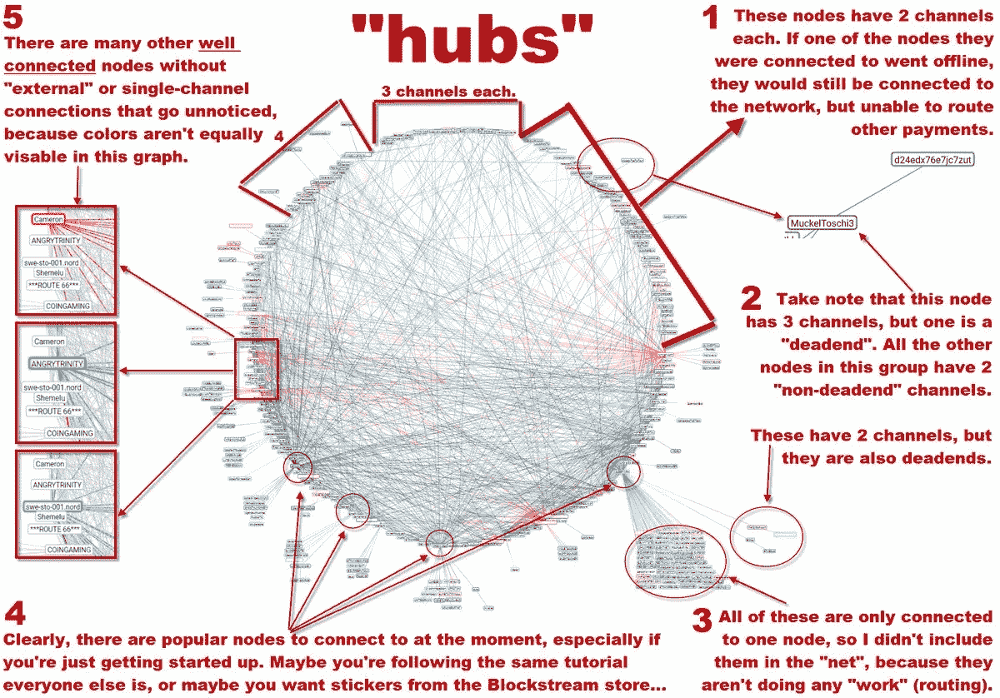
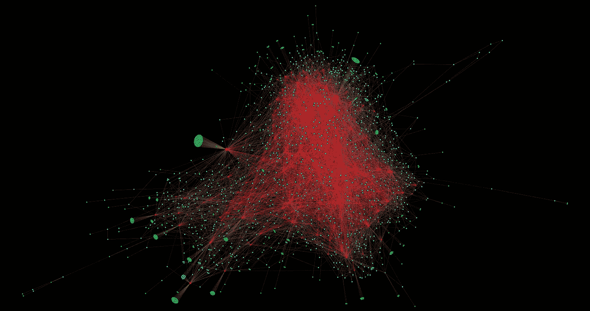

# 在我看来，这些闪电网络节点看起来的确很集中！怎么回事？

> 原文：<https://medium.com/hackernoon/them-lightning-network-nodes-sure-do-look-centralized-to-me-what-gives-ee39c9b12ac0>

## (只是你的眼睛在捉弄你)

**人甲:**看闪电网，太神奇了&长这么快！

**人 B:** 看看那些中心枢纽，我看起来没那么神奇！

**人物 C:** 嗯，Lightning 还处于起步阶段，人们不想把他们的比特币“冒险”在极小概率的软件故障上。或者，也许他们只是想等到他们实际上可以用它来做他们特别发现有用的事情，这还不存在，因为这些东西是有机增长的，商家采用比特币需要的时间和比特币最初需要的时间一样多。

**人 B:** 不，你不懂… **看**那些**毂**，看就是了！你可以**看到**他们！他们就在那里！**继续在 MS Paint 中圈出它们**

这是一系列重复发生的事件，现在我想我应该把一些东西放在一起，这样人们就可以参考了。这种情况之所以经常发生，是因为它很容易做到，而且吸引了最普通的人:*那些不知道自己在看什么的人，即使他们认为自己知道。*

[https://rompert.com/recksplorer/](https://rompert.com/recksplorer/)

反驳这种图片的最简单的方法是提及我在上面的 Reddit 帖子中所说的，那是一种视觉错觉。然后从视觉上论证 ***即*** ，于是人们 ***明白了*** 的意思，就像他们 ***看到了*** 原来的错误信息一样。我已经做了几次了，但是我从来没有把最后一个放在手边，所以我总是把下面的事情都重新做一遍。这次我们手头都有这篇文章。

那么，在我突出显示它之前，下面的“枢纽”有什么特别之处吗？

Zoom in to see what I mean.

没有吗？那么这个“枢纽”是什么呢:

Zoom in to see what I mean.

这两者的大小都等于或大于上面圈出的突出部分，*但你根本看不到它们，除非你选择它们*。事实是，这张网络图在向你展示闪电网络方面做得非常糟糕。它很漂亮，玩起来也很有趣，但它确实对每个人都造成了分析上的不公正。过去我曾多次试图调和这一点，但没有一件事是可靠的，没有批判的。我第一次尝试以易于理解的格式重新分布网络拓扑是在网络很小的时候，而且是在我停机的时候拼凑起来的。我想提请注意这样一个事实，即单个节点离线对路由支付的“网络”工作的影响非常小。

[https://twitter.com/StopAndDecrypt/status/957301236814024704](https://twitter.com/StopAndDecrypt/status/957301236814024704)

有些人试图指责我歪曲了网络的拓扑结构。主要是这一次，原告实际上犯了他们指控我的罪行，在我把闪电网络图重新组织成一个圆圈之前，他完全歪曲了它的起始状态:

[www.reddit.com/r/btc/comments/7tjeon/misleading_ln_graphs_no_nodes_i_dont_think_so/](http://www.reddit.com/r/btc/comments/7tjeon/misleading_ln_graphs_no_nodes_i_dont_think_so/)

我试着回答，但唯一能让它出来的是宣传。如果你去那里为自己辩护，这是一场失败的战斗:

最后，我重新绘制了这张图，并为清晰起见添加了一些标签，在这里，我做了同样的努力，以表明还有许多其他节点有许多通道，但它们并不突出。

[https://twitter.com/StopAndDecrypt/status/959557939144085504](https://twitter.com/StopAndDecrypt/status/959557939144085504)

这部电影最终得到了更多的关注，但也遭到了批评。这个特定的用户要求我只以非可视化的方式呈现数据，完全没有抓住我要说的要点。人们正被他们的眼睛 误导 ***，当他们的眼睛*** 以不同的方式显示相同的信息时，这种被误导的人很容易回来。有很多人根本不在乎你在他们面前推销的数字。当他们看到这样的事情时，理想的情况是，他们意识到他们被欺骗了，或者信息被歪曲了，现在他们对这个问题再次保持中立。但你不可能让所有人都满意:

[https://www.reddit.com/r/Bitcoin/comments/7uvdej/hubs_annotated/dtoaq5t/](https://www.reddit.com/r/Bitcoin/comments/7uvdej/hubs_annotated/dtoaq5t/)

公平地说，这位用户实际上提供了一些有用的数据，显示网络在不断改进。第一个是原始的，第二个是我要求从数据中排除具有单一通道的节点，就像我的“信息图”一样。在未来，你要么使用闪电钱包，要么运行路由节点。你选择哪一个取决于你，但这方面的重要数据不会是大多数选择第三方支持/访问比特币的人*(就像现在的比特币基地用户)*，而是一组节点*路由*，以及它们的数量*(类似于现在的全节点维护者)*。

[https://www.reddit.com/r/Bitcoin/comments/8jzlzo/less_memes_more_data_ln_becomes_more_distributed/](https://www.reddit.com/r/Bitcoin/comments/8jzlzo/less_memes_more_data_ln_becomes_more_distributed/)

所以我最终尝试了一个稍微另类的方法，用一个视频，希望这真的有助于显示到底有多少“枢纽”。上面的数据虽然不错，但还是没有达到我的目标。这里有一个简单的问题你可以在看下一个片段的时候思考:*如果有一万个不同的闪电“枢纽”，你还会称闪电网络为集中式吗？*

指向并说你可以看到枢纽的形成是一个低层次的论点，我愿意相信视频做得很好，驳回，但我决定我要走得更远，完全重塑网络。每个 Lightning 节点都维护一个现有节点和渠道的列表，以便它们在收到发票时可以有效地路由支付。上面的网络浏览器使用相同的列表来呈现它的图形，所以我从我的 Lightning 节点中取出该列表，并将其插入到一个名为 [Gephi](https://gephi.org) 的程序中，在那里我可以根据自己的喜好自由地操作它。

我做了一些不同的变化。这是我认为最好的一个:

Full Resolution: [https://upload.wikimedia.org/wikipedia/commons/9/98/Bitcoin%27s_Lightning_Network_Visualization.png](https://upload.wikimedia.org/wikipedia/commons/9/98/Bitcoin%27s_Lightning_Network_Visualization.png)

这里有几件事情真正定义了它与之前的节点资源管理器之间的区别。让我们复习一下:

只有一个通道的节点是绿色的，如果有许多通道连接到同一个节点，它们会捆绑成组。我特别喜欢这个，因为它把它们移开了，这样它们就不会随机分散在整个图表中。它还有助于突出显示最初连接到的流行节点。例如，Blockstream 的节点有许多只与他们开通频道的同行，可能是因为有一个教程指向他们的节点，他们有一个闪电商店，你可以从那里购买。

更大的节点不再隐藏。你可以看到它们，它们更适合分布在中间。它们的大小与它们打开的通道数量成比例*(稍后会谈到这个)*，并且都是明显的红色。如果你愿意，你可以称它们为枢纽，但随着时间的推移，这种独特的节点集将继续增长。当它们成千上万的时候，你就不会称它们为枢纽了。

— — — —

下一张是“枢纽”信息图的更好的重拍，有一些额外的信息。节点按照它们拥有的通道数量进行排序和着色，通道宽度被缩放以表示两个节点之间存在多少重复的通道。你会看到在图像的右下方，有一个节点，有许多重复的通道和其他三个节点。如果我没记错的话，它有 18 个通道是通过位于外围的那个节点打开的。

— — — —

我要展示的最后一个与此类似，但它将所有具有相同数量通道的节点堆叠在一起。您可以看到带有单个通道的节点列，旁边带有两个通道的节点，等等。您还可以看到，总通道的分布在节点集之间形成了一种自然曲线。请特别注意这种分布，因为它会一直存在，这不是一件坏事。

— — — —

在某个点上，当网络已经成熟并且足够大的时候，任何一个理性的人都不得不让步，最后说“好吧，好吧，有这么多的节点和这么多的通道”。如果你有点渴望，你可能会问:但这些渠道中有多少有值得考虑的资金量？财富集中化呢？闪电网容易被有钱人控制吗？

**首先:**至少你现在不再理会那种愚蠢的“看吧！”争论。

**其次:**不。节点间的财富分配将看起来非常类似于渠道分配。如果你不熟悉帕累托分布，让我先给你看一些图表。

[https://twitter.com/michaelbatnick/status/1019680856837849090](https://twitter.com/michaelbatnick/status/1019680856837849090)

这条推文最近在 Twitter 上流传了一点，我认为它在突出**和突出** *的问题方面做得非常好(我像个白痴一样上当了)。*对分配的抱怨倾向于吸引该分配中的少数群体*(或外部并感到被排除在外)*他们认为分配不公平。这种情况有两个方面。一方面，有时分配*是不公平的，比如当中产阶级的差距由于糟糕的经济政策而不断扩大时，或者当进入市场的壁垒由于政府强加的法规而被人为抬高时。另一方面，有时分布是完全自然的，*自然分布绝对没有错。*当人们有一个议程或者对事情的方式有根本性的误解时，问题就出现了，他们试图进行自然分配，而那些对他们没意见的人看起来像是恶棍。通常这是通过吸引那些不知道自己在看什么的人来实现的。*就像在网络图上圈出恰好突出的任意节点一样，**不包含 100%数据的饼状图非常容易误导人。**这就像有一个很好的经济，但是然后把中产阶级从你的数据中隐藏起来，说“看看中产阶级的巨大差距”。

[https://twitter.com/JackGavigan/status/1019897751788769280](https://twitter.com/JackGavigan/status/1019897751788769280)

这就是帕累托分布的样子，但为了说明我的观点，我们需要先回顾一下关于闪电技术的一些基本知识。

*   闪电*钱包*不是闪电*节点，*它们不路由。
*   每条路线都被加密了。**路由不能选择性审查。**任何政府都不能让“脸书”不仅仅是你的付款路线。
*   你的钱包可以打开与网络上任何节点的通道，而不仅仅是前 5 名。你永远不会依赖于顶端的节点。
*   如果“苹果”掉了，闪电网不在乎。将会有成千上万的其他节点传递支付。
*   运行闪电节点没有监管壁垒。如果你想运行一个和路由付款，你可以。

这里有一个假设。比方说，我想运行一个闪电节点，用 500 美元资助它，并开始路由支付。我绝不是闪电网络的苹果。我是个小人物。上面那个 S&P 分布图？如果你做一个所有闪电网络节点渠道基金的饼状图，我会在底部百分位数。但问题是，我所要做的就是找到网络上距离最远的两个节点，并将它们连接起来。现在我有一条热门路线，正在收取小额费用。

假设有人来做同样的事情。他们找到网络中距离最近的两个节点，并将它们连接起来。个人重复这个过程需要多长时间？任何人都可以加入并启动一个“低资助”节点，找到网络上距离最远的两个节点，并通过打开与这两个节点的通道来连接它们。

你不能批评财富的帕累托分布*(除非它是由于外部因素而非自然的，* ***有点像比特币试图通过健全的货币****)但你可以*尝试*并批评它对闪电网络意味着什么。当人们以批评的态度指向“枢纽”*(我们已经确定会有成千上万个)*时，他们试图以某种方式辩称，我们将依赖它们来分配我们的资金。甚至上面“失败的路由图表”也通过试图显示当从网络中移除“顶部节点”时有多少路由失败来关注这一点。如果需要在两个不相连的节点之间路由支付，**有人会将它们连接起来**。*

*我的意思是让我们现实一点…你认为我不会把它们联系起来吗？这对我有多重好处。我可以收取费用，同时帮助闪电网络变得更加互联。为什么我不会这么做？当然，我不能到处去连接每个节点，但我肯定不是这个星球上唯一一个寻找金融机会的人。这个网络将像瘟疫一样增长，并且只会随着时间的推移变得更加紧密。激励本质上是内在的，任何人都无法阻止它。他们看到了一些经济财富中心，而我看到了成千上万的 T2 人:*

**

**not made from real data**

*/end*

* [## StopAndDeathcross[200/365](@ StopAndDecrypt)| Twitter

### StopAndDeathcross[200/365](@ StopAndDecrypt)的最新推文。全栈社交工程师。某处路由…

twitter.com](https://twitter.com/StopAndDecrypt) 

以下是截至 2018 年 7 月 30 日的各种更新闪电网络图。

我向你挑战绕着中心转圈。

*