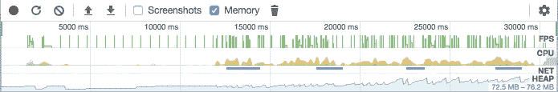
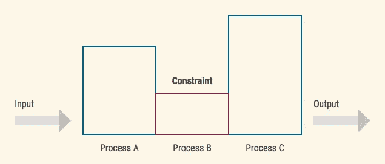
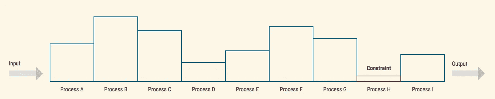
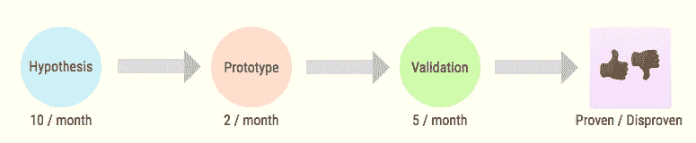
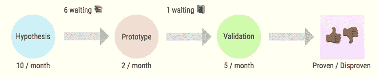
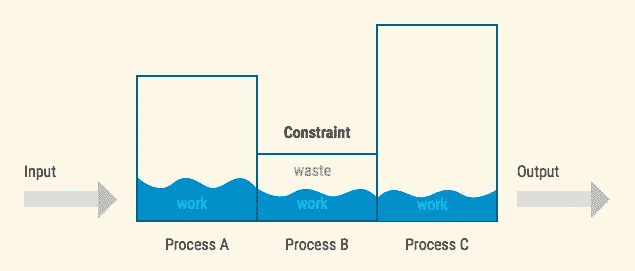
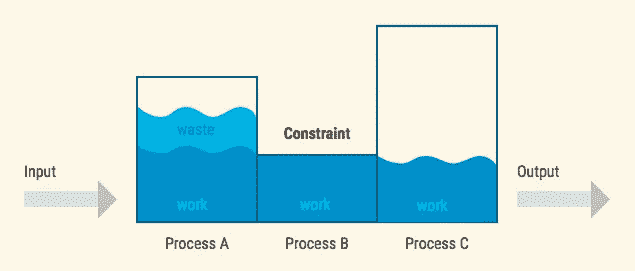
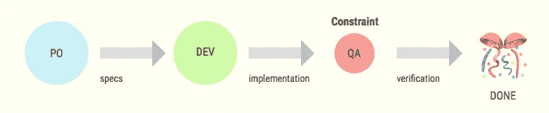

# 色彩约束理论

> 原文：<https://medium.com/hackernoon/theory-of-constraints-in-colour-187291015327>

## “软件创业中的约束理论”系列的第 4 部分

> 这是“软件创业中的约束理论”系列的第四篇文章如果你没看过其他的，我推荐从这里开始:[第一部分](/@flpvsk/systems-thinking-in-management-c3ed049e8d91)。

一个软件性能不佳有成千上万种可能的原因。*成千上万。*我们有多少种方法可以找到并解决这些问题？*一个。我们有一种方法可以做到。*

1.  选择你想要改进的:执行速度，内存消耗，其他的；
2.  使用诸如 CPU 或内存分析器之类的工具，确定代码中问题最突出的地方*；*
3.  改进您在第二步中找到的代码。因为那一块表现最差，整个系统会改善；
4.  回到步骤 2。

Chrome Memory and CPU profiler

提高企业或团队的绩效也是如此。一旦我们理解了系统的目标，我们就可以找到*确切地说是一个约束*，我们需要控制它来改进整个系统。这是 Eliyahu Goldratt 的约束理论背后的绝妙想法。

> 快速提醒一下。这个系列的这一部分比其他部分更理论化。这可能需要你额外的精力和好奇心。谢谢你的尝试，我希望这是值得的！

# 寻找约束

有一些指标可以作为业务的 CPU 和内存概要分析数据。我们在[系列的第一部分](/@flpvsk/systems-thinking-in-management-c3ed049e8d91)中谈到了它们。最重要的两个:

*   *吞吐量*或系统在一段固定时间内完成多少有用功；
*   *库存*或有多少工作*滞留在系统中*但会在某个时间点释放。

系统的约束是从整体上限制系统输出的部门或过程。

Throughput of each element of a three-part system

换句话说，约束是系统中吞吐量最低的元素。约束条件的指标之一是它前面的库存数量不断增加。每个系统只有一个约束*(在极少数情况下是两个，但绝不会更多)*。*如果你发现不止一个约束，很可能你没有足够清晰地定义系统和它的目标。*

**

*Throughput of each element of a nine-part system*

*如果我们能测量流程中每一步的生产量和库存水平，我们就能找到制约因素。但是我们无法测量抽象的概念。我们的生产量和库存到底是多少取决于系统及其目标。*

## *例子*

*假设我们已经成立了一家初创公司，正在进行[客户发现](http://www.market-by-numbers.com/customer-development/)。作为一家早期公司，我们的目标是找到一个值得解决的问题和可行的解决方案。我们使用一个制定和验证假设的迭代过程来实现这个目标。*

**

*Average throughput of each step of the process*

*当 10 个潜在客户中有 8 个愿意给我们一些有价值的东西时，我们知道我们找到了问题解决方案。我们希望他们做出某种承诺——可能是时间、金钱等。*

*   **该系统的吞吐量*是我们在一个月内验证的提高分数(增加承诺潜在客户数量)的假设量；*
*   **这个系统的库存*是在给定时刻我们正在研究的假设的数量。*

*这种系统的约束是生产能力最低的部门或流程。在我们的案例中，这是“原型”阶段:*

**

*Inventory in the system*

*限制的一个指标是它前面的库存越来越多，也就是大量积压。*

# *什么会出错？*

**根据定义，*约束是限制系统的生产能力。这也意味着*只有*如果我们管理好约束，我们才能*增加整个系统的吞吐量*。*

*找到约束是最难的部分。相比之下，*控制* it 就相当简单了。我们需要避免这两件事:*

## *1.利用不足或“缺乏”约束。*

*除了约束条件之外，其他每个部门或流程都有多余的产能可以浪费。如果*约束*没有产生有用功，系统的输出受到影响；*

**

*Underutilising constraint leads to waste*

## *2.过度生产或“超载”约束。*

*如果在约束之前的部门*总是生产过剩，系统中的库存就会持续增长。在上一篇文章中，我们看到了它会导致什么。事情需要很长时间才能完成。**

**

*Overloading the constraint leads to waste*

## *例子*

*在上面的启动示例中，我们可能会犯以下错误:*

**

*Startup example process*

*在这个过程中，我们必须确保原型阶段永远不会被饿死。例如，原型团队可能会因为等待构建规范而受阻。他们也可能在做虚假的工作，验证没有原型就可能被拒绝的想法。*

> *约束的时间是任何组织中最宝贵的资源，我们不应该浪费它。*

*本例中的约束意味着不断产生假设，并将它们堆积在原型的团队待办事项中。这家公司会用一份上百个想法的清单做什么？最好的情况是这会增加管理积压工作的人的开销，最坏的情况是会鼓励原型团队进行多任务处理。*

# *改善工作流程*

*Goldratt 提出了一种算法，可以帮助我们不断改进任何系统。他认为，在我们投入更多资源解决问题之前，确保我们通过约束改善工作流程是很重要的。他提出了实现这一目标的机制:*

## *1.利用约束。*

*我们应该确保约束得到 100%的利用。没有任何原因导致的停机。该约束只做*有用的*工作。*

## *2.使系统的其他元素服从约束。*

*系统的其他部分需要通过约束保持连续的有用功流。通常，这意味着这些部分本身将“低效地”工作，以使约束条件和系统作为一个整体更加高效。*

## *例子*

*尽管“利用”步骤看起来很简单，但我经常看到团队陷入让约束等待资源的陷阱。我看到和经历的最常见的例子来自于工程。*

*假设我们的工程流程是这样的，QA 是约束条件:*

**

*Engineering process*

*假设我们使用 Scrum。我们在 sprint 开始之前选择一堆特性和错误修复，然后尝试在迭代过程中完成它们。问题是，在 sprint 的前半段(直到开发人员实现第一个特性)，QA 没有有用的工作可做。该约束未被充分利用。*

> *Scrum 过程会伤害这个团队的表现。*

*现在假设 QA 把 70%的票退回给开发者返工。这意味着 QA 必须将大多数问题检查两次或更多次。我们可以*从属*系统中的其他元素，以帮助解除我们的一些约束负担。例如，我们可以要求开发人员在去 QA 之前测试彼此的实现。*

*在最后一个例子中，开发人员将不得不做他们没有资格做的工作。他们的效率会下降，但他们不是制约因素，QA 才是。*

> *在这个例子中，通过降低开发人员的效率，我们使系统作为一个整体表现得更好。*

# *五个对焦步骤*

*在[他的第一本书](https://en.wikipedia.org/wiki/The_Goal_%28novel%29)中，Eliyahu Goldratt 展示了一个持续改进任何组织的过程。第零步是[制定明确的目标](/@flpvsk/systems-thinking-in-management-c3ed049e8d91)。然后我们按照步骤进行:*

1.  *找到约束条件；*
2.  *利用约束；*
3.  *使系统的其他部分服从约束；*
4.  *提升约束(给它更多的资源)；*
5.  *如果约束已被破坏，请重复。*

*这是一个反复的过程。我们找到约束，尝试最大限度地利用它，仅在必要时添加更多资源，并在约束被打破时重复。*

**的目的不是*逐渐消除所有的约束，而是要知道约束现在在哪里，以及我们如何才能最大限度地利用它。*

> *作为一家企业，最可怕的地方是不知道自己的目标和限制。*

*我们使用 ToC 的经验非常有益。最初，我们将它应用于公司不同的独立部分。先工程，后产品和销售。渐渐地，我们注意到，当它作为一个整体应用于一个组织时，效果最好。*

*在 Productive Mobile，我们使用它来为每个团队建立健康指标，构建产品路线图，甚至重新制定我们的销售战略。*

*就我个人而言，我使用约束理论作为思维模型来推理任何系统。它帮助我降低复杂性和专注度。对我来说，这是一次解放的经历。*

# *理论够了！*

*既然我们已经讨论了理论部分，我希望在接下来的文章中给出更多来自真实世界的例子。如果你自己尝试过 ToC，请在评论中分享你的经验。*

*下次见👋*

*我要感谢那些与我分享经验和有用见解的人。他们的投入是这个系列的基础。排名不分先后，这些人分别是:[斯特凡·威鲁达](/@stefan.willuda)，[里卡多·j·门德斯](http://numergent.com/)，[埃德·希尔](http://www.synchronoussolutions.com/about-us/)，[阿迪娅·莫尔](https://twitter.com/adiyathemighty)，[康尼·彼得罗维奇](https://twitter.com/produktgestalt)，[戈兰·ојkić](https://twitter.com/najgoricovek)。*