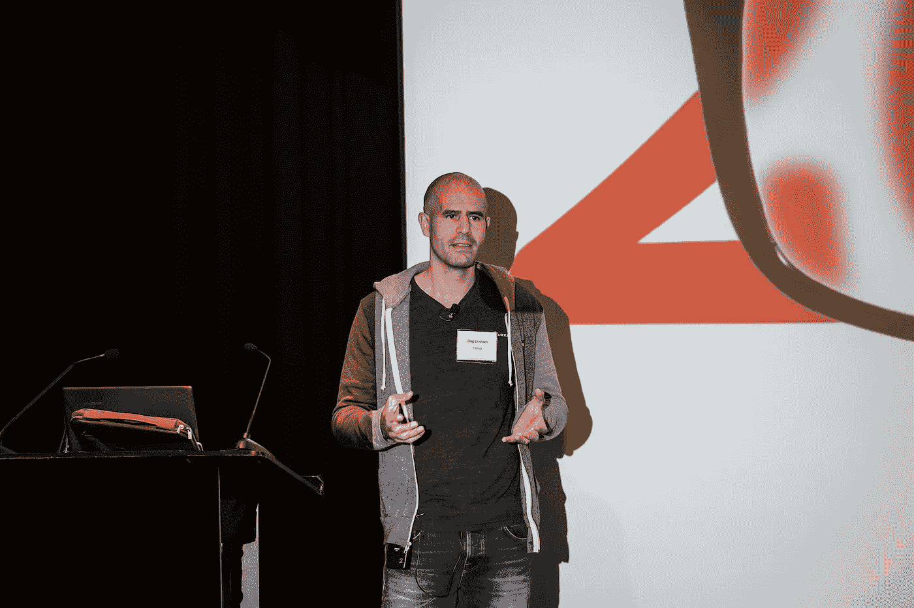

# 有 3 种主要的技术债务。以下是管理它们的方法。

> 原文：<https://medium.com/hackernoon/there-are-3-main-types-of-technical-debt-heres-how-to-manage-them-4a3328a4c50c>

正如聪明的金融债务可以帮助你更快地实现主要的生活目标，并不是所有的技术债务都是坏的，管理好它可以为你的公司带来巨大的利益。对于快速增长的公司来说尤其如此，这些公司迫切需要尽早发货，以便确定产品/市场的适合度，满足客户需求，并抓住新出现的机会。但就像金融债务一样，你必须明智地对待科技债务。从长远来看，累积的债务会降低你的运输速度，导致开发人员士气问题，甚至完全毁掉你的生意。

Dag Liodden 已经管理技术债务超过 14 年了——最近作为 adtech company [Tapad](http://firstmarkcap.com/portfolio/tapad/) 的联合创始人兼首席技术官，他帮助指导了一笔 3 . 6 亿美元的收购。虽然没有简单的一刀切的解决方案，但 Dag 发现将债务分类有助于团队内部和团队之间沟通和解决技术债务问题。他与[第一马克](http://firstmarkcap.com/)分享了三种主要的科技债务，以及他解决每一种债务的策略。

*Dag Liodden speaking at* [*FirstMark’s annual CTO Summit*](https://hackernoon.com/leadership-tips-for-ctos-46c3b565bd52)

## **1。故意技术债务**

Dag 说，工程师通常知道做某件事有正确的方法，也知道做某件事有快速的方法。在许多情况下，快速的方式*是*正确的方式(以避免过度设计)，但有时团队会故意以“错误”的方式做一些事情，因为他们需要快速将产品交付给市场。

> “我们有时会故意欠下技术债，以缩短上市时间。”

当采取这种方式时，不仅要考虑推出一个功能会节省多少时间，还要考虑偿还明确产生的债务会花费多少时间。确保利益相关者意识到这将不可避免地减慢以后其他特性的发布。

**如何解决:**您的团队可能不同意敏捷的实现，但是 Dag 发现，当故意推迟需要完成的工作时，跟踪待办事项中这种类型的技术债务通常是有意义的。如果不具体跟踪，不太可能偿还，久而久之会变成意外的设计债。产品所有者和利益相关者应该对这种债务的增加负责，因为它是由业务决策引起的。

## **2。意外/过时的设计技术债务**

在设计软件系统时，Dag 的团队试图通过简单和快速交付来平衡超前思维和面向未来的设计。他警告说，这是一种微妙的平衡，没有人每次都能把握好。随着系统的发展和需求的变化，您可能会意识到您的设计是有缺陷的，或者新功能的实现变得困难和缓慢。一个好的原创设计通常更容易进行增量重构，但有时你可能不得不咬紧牙关，进行更重要的重构。

如何解决这个问题:如何有效地重构一个系统本身就是一个巨大的话题，但是这需要时不时地发生(当系统处于“稳定”状态时，每隔一年左右)是完全自然的。否则，您可能一开始就过度设计系统，导致不必要的速度变慢。团队/技术领导和产品负责人应该负责确保留出时间来解决这种类型的技术债务，因为它是由设计决策和频繁变化的需求引起的。

## **3。钻头腐烂技术债务**

随着时间的推移，科技债务会逐渐恶化。一个组件或系统通过大量的增量变更慢慢地变得不必要的复杂，当几个可能不完全理解原始设计的人一起工作时，这种情况常常会加剧。症状之一是复制粘贴和货物邪教编程。

**如何解决:**达格说，这可能是唯一一种你应该通过持续重构来避免的技术债务。强大的团队会花时间去理解他们正在工作的系统的设计(即使他们最初并没有设计它)，逐步改进设计，并在此过程中清理糟糕的代码。开发团队应该负责避免位腐技术债务，因为它是由单个开发人员产生的。

虽然对科技债务进行分类不会神奇地让它变得容易处理，但它可以促成更有成效的对话，并加强你的团队。科技债务将会、也应该一直存在于系统中。重要的是，你要试着理解债务是如何拖慢你的团队的，并在短期内交付特性的努力与中长期内整体生产力的提高之间取得平衡。

*想从科技行业专家那里获得更多战术商业经验，* [*注册 FirstMark 简讯*](http://eepurl.com/cRvfxT) *。*