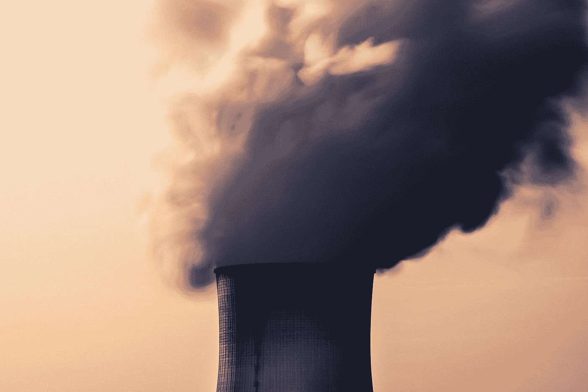

# “比特币没有任何一点让它成为一种很好的价值储存手段。”

> 原文：<https://medium.com/hackernoon/there-is-nothing-about-bitcoin-that-makes-it-a-good-store-of-value-de6033b02d1>

## 康奈尔大学的 Emin Gün Sirer 创造了一种比比特币更早的虚拟货币。在一次采访中，他谈到了区块链的潜力、能源消耗和新的共识协议等问题。

Emin Gün Sirer 是康乃尔大学的计算机科学教授，也是 T2 加密货币和合同倡议(IC3)T3 的联合主管。Sirer 创建了 P2P 工作证明数字货币(Karma)，*比比特币早了六年，*在核心共识协议的开发中发挥了重要作用，并在此前提醒加密货币社区各种协议中以前未被发现的安全缺陷。

我和 Sirer 在他的办公室谈了区块链在公众中的广泛应用，以及随着这些系统继续发展以解决实际的社会需求和问题，密码领域的团队如何改变他们对代码不变性的看法。

Sirer 谈到了他对比特币和以太坊的低去中心化水平的担忧，工作证明系统的巨大浪费能源消耗，以及一份关于一种新的共识机制的匿名发布的白皮书，这种机制可以使区块链更加高效。他还谈到了区块链理工大学的广大公众面临的障碍，以及他希望区块链项目将如何直接解决导致 2008 年金融危机的不透明商业行为和现有实体。

*本次采访的长度和内容已经过编辑。完整的采访，大约是此片* [*的两倍，此处提供，专为*](/@00AaronFernando/meet-the-professor-who-created-a-virtual-currency-that-predated-bitcoin-bd66f34ac61d) *中等成员提供。*

## 亚伦·费尔南多:首先，我想了解一下你的背景——最初让你对这个领域感兴趣的东西。

**Emin Gün Sirer:** 我对加密货币的尝试始于点对点系统。在 Napster 问世前后，如何构建健康的对等系统是一个大问题。似乎大多数人都会加入分享东西的人群。但他们会接受，他们不会给。

这在人类社会中很常见，人们就是这样做的。所以对于这个问题有很多不同的解决方案，这被称为“偷窃”……在更广泛的人群中，这被称为“公地悲剧”:当你从社会中拿走东西却没有回报。

所以，BitTorrent 是对此的回应。在 BitTorrent，有一种易货经济。你给我一块，我给你一块。

我的解决方案是，看 BitTorrent 是否可行。如果我们给人们一种货币会好得多。所以，我为什么不发明一种可以凭空创造出来的货币——它一文不值——但是你可以用它来换块。所以要得到一个区块，你必须用这种货币支付给我，然后要得到这种货币，你必须向其他人提供区块。这就是所谓因果报应系统的起源。它有工作证明。它比 Satoshi 早了六年。

当比特币出现时，我的第一反应是让我们看看这个，看看发生了什么，了解一下它的安全属性。所以我们和伊塔伊·埃亚尔一起做了这项工作，[标题] [自私的采矿](https://www.cs.cornell.edu/~ie53/publications/btcProcFC.pdf)我发现人们说的关于比特币的很多事情都不是真的。

在他们认为安全的条件下，它是不安全的。当它是安全的时候，我们描述了必须做什么来保持它的安全，我们也给了他们补丁来防止那些自私的采矿者。然后我致力于安全性和可伸缩性等等。剩下的就是后来发生的大量工作。

## 是什么让你对区块链的货币使用产生了兴趣？

大约三、四十年前，计算机开始大量出现。它们存在的时间比那更长，但(那时)它们能被更广泛的受众所接受。他们进入了各种不同的行业和部门。他们在科学领域取得了进展。但企业并没有真正采纳它们，华尔街也没有真正采纳它们。如果你看看银行业的历史，好吧，他们有数据库。但是他们不知道如何让联网的机器工作。所以**所谓的*区块链革命*——实际上就是找出如何让计算机在人们互不信任的环境中工作的过程。**

此外，我们都经历了 2008 年的危机……这使得每个人都成为经济专家。比特币是对那个时代疯狂的反应，是对它处理货币供应等方式的反应。

我想稍微离题一点，这很重要。在计算机科学中有多种不同的做事方式。而这些方式……唯一能形容的就是'*审美'*这个词是对的。你可以构建非常复杂、笨重、单一、封闭的软件——我们有这样的系统。最广为人知的(60 岁以上的人都会知道这个)是一个叫做 [Multics](https://en.wikipedia.org/wiki/Multics) 的操作系统。它笨重，庞大，无所不能……此外，还有另一种美学，以一个叫做 Unix 的系统为例。在那里，一切都是一个小工具，它们相互啮合在一起，你可以看到每个工具的输出，你可以检查事情等等。

所以，现在发生的部分事情是**将第二种美学带到了华尔街**。这些人在建造非常复杂、非常不透明的结构。没人知道幕后到底发生了什么，除了他们失败的时候。如果你回头看，平均每八年这些人都会失败。

## 在当前的状态下，你认为需要发生什么——也许没有发生——来为非技术人员的采用提供基础？

这是一个很好的问题。几乎所有与你交谈的人都会告诉你，“*哦，它必须更加可用。我们必须让钱包变得更容易。*“那都是真的。但是让我告诉你两件他们不会告诉你的事，我认为这两件事是必不可少的。

第一:**这些系统的架构非常复杂。**因此，我不相信这只是在用户面前摆一个薄薄的贴面。我不认为可用性问题源于缺乏坏的钱包软件——我们有。我们的钱包不好。但是我认为我们不可能在现有的系统上有好的钱包。它们太复杂了。

如果你要处理比特币，你肯定需要理解 mempool 的概念。不能*只用比特币支付*。看起来好像你做了，但在一天结束时，有人会检查你的交易是否被提交到区块链，或者它是否被卡在内存池中——这是一个短语，每个比特币用户都知道这个短语的意思，因为他们必须这样做。这是建筑的一部分。在不知道的情况下使用比特币是不可能的。

所以这是第一个问题:架构必须简化。第二个问题是社交框架——围绕这些系统的社交架构必须改变。当前的社会架构是基于霍德林的。它的基础是拿着你的硬币，乘着它不可避免的上升到月球，找到其他人购买你的硬币，并通过卖给他们而变得富有等等。这是一种可怕的方式，我们越早摆脱这种模式越好。

## 在当今的任何生态系统中，你有没有发现任何令人担忧的趋势？

最近几周，我一直在思考工作验证系统的能耗问题。

**我认为(一些人)回避比特币和其他基于工作证明的硬币的原因之一是它们不可持续。他们最终消耗了大量的能量。多少能量？嗯，单单比特币的消费就和全丹麦的一样。如果你想想象那是什么，那大约相当于两个巨大的核反应堆。**

无论如何，比特币使用的能源并非完全来自可持续来源。所以有人说，这是中国通过互联网出口煤炭的一种方式。他们在中国烧煤，他们污染那里的空气，他们开采/制造这些比特币，然后卖给西方人，西方人用它来购物或做其他事情。

这不是运行*任何*系统的好方法，这些矿商并没有真正提供高度的分权。我们做了[一项最近的研究](https://arxiv.org/abs/1801.03998)发表于过去九个月左右，研究了比特币和以太坊的去中心化。它发现比特币基本上——粗略地说——有大约 19 个采矿实体。泳池和单人矿工加起来。所以，19 个几乎不算什么。带着这 19 个人并不难——他们中的任何一个人所执行的任务与你在没有任何硬件的情况下所执行的任务没有什么不同。

我们可以建立 19 个人合作的系统，他们将对交易进行排序和验证，就像他们处理采矿硬件一样。因此，所有这些硬件都是矿工们自己之间的某种竞赛，但他们带来的总分权只有 19 个。而其中三个构成了哈希幂的大部分。

所以你真的是在买入比特币术语中所谓的*19 个多重信号中的 3 个。如果这三个人接受你的交易，那么你就成功了。如果他们没有，那你就出局了。(抱歉，我弄错了，我应该说比特币十九个 multisig 中有四个。以太坊是十一分之三。)所以**数量少得可怜，我们没有得到太多的权力下放，对环境的影响是巨大的**所以我们非常需要能够使整个过程绿色化的技术。*

## 因此，有许多共识机制正在运作中…

不，没有。有许多不同的白皮书，但所有这些都归结为两种不同的方法，加上上周[2018 年 5 月 16 日]公布的一种新方法。

只有两类共识协议。其中一个叫做*经典共识*，是由 [Leslie Lamport](https://en.wikipedia.org/wiki/Leslie_Lamport) 和 [Barbara Liskov](https://en.wikipedia.org/wiki/Barbara_Liskov) 这样的人开发的，他们都获得了图灵奖。在传统的共识中，核心协议通过定义谁在系统中工作——谁是验证者，谁是决策者——然后在他们做出决定时达成一致。他们有一堆协议来决定何时提交决定。

它们非常快，但正如我所说，它们要求我们知道谁在参与。所以它们不能用于像比特币这样的开放货币，但它们可以用于得到许可的区块链。所有这些以公司为导向、基于行业的努力，例如，当人们谈论在区块链上放置供应链时，他们通常是在谈论使用许可的区块链，使用这些协议之一。这是一种方法。它有许多不同的名称——HyperLedger、Tendermint、DPoS、授权股权证明、股权证明——所有这些不同的方法都属于这一类别。

而在另一边，你有*中本聪自己发明的*。只有这两种，或者说只有这两种，直到上周[2018 年 5 月 16 日]一篇新论文发表，它提出了第三种做事方式。这篇论文叫做“从雪花到雪崩”，它描述了三种协议:雪花，雪球，雪崩，它们有一个非常奇怪的性质。他们结合了中本聪共识的最佳与古典的最佳。

当然，在中本聪看来，这是公开的。任何人都可以加入。你不需要得到许可，因为我不需要知道谁参与了这个系统。没人需要知道。你只是解决了一个密码难题，然后就拥有了一些硬币。这就是中本聪的可爱之处，除了它不是绿色的，不可持续的。

还有固有的性能限制。这些块只需要经常出现—比如说，每十分钟—这意味着你的交易在十分钟内不在分类账中。还有一个特别的吞吐量，对于比特币来说，每秒只有三次交易。所以这个新的协议家族——从雪花到雪崩——颠覆了这一切。它说，“瞧，我们可以把两者的精华结合起来。我们可以为您提供快速终结、高性能，而无需了解系统中的所有人，但我们大致同意这很好。我们不需要完全一致。

我们可以在没有任何不可持续的工作证据挖掘的情况下让它工作。如果没有要做的决定，我们不必消耗能量。这是一个静态协议。因此，我认为这是开创性的，它将在未来两年内彻底改变这一局面。

## 但你可能会遇到这样一种情况，即需求持续上升，估值持续上升，那么保持比特币价值上升的将不是交易速度(T3)，而是 T2。

让我非常清楚地描述一下为什么价值储存叙事在应用于加密货币时非常危险。

当谈到这些在线货币时，它们真的都是一堆有趣的数字。它们本身没有什么价值。没有人会想要这些有趣的数字，所有这些有趣的数字都是可替换的——它们都差不多。因此，如果你有比特币、比特币现金或其他任何东西，这些东西在它们服务的功能上并没有什么不同*。**因此，比特币没有任何优点让它成为一种很好的价值储存手段。这种说法极其危险。它被用来向那些不明白比特币价值将从何而来的大众出售比特币。***

这种价值只能来自其他人购买的系统。所以你真正做的是**你在赌别人会进来。你赌的是采用曲线上升。在某种程度上，将不会有更多的人加入这个系统，这非常非常类似于无意中的金字塔计划**——没有一个受益人。所以本质上正在发生的是一种分布式的、分散的方式，这些人试图早投入硬币，以从晚投入的人那里获益。

那不是赚钱的好方法。它对社会没有好处，它没有以有形的形式产生实际价值，它没有让任何人的生活变得更好。当你可以通过互联网发送这些硬币时，当它们作为支付机制时，它们是有用的。你拿着不花的硬币——不能花(或者不支付过高的费用就不能花)是一枚不值钱的硬币。

## 你认为哪些非财务用例最有把握，哪些是你最感兴趣和最感兴趣的？

我主要在基础设施层工作，所以我不知道应用程序。当我做研究时，我的大部分研究是适用于所有区块链的。

话虽如此，我对区块链在保险业的应用最感兴趣，因为**保险公司是不透明的、铁板一块的，它们往往会倒闭。**你真的看不到它们内部发生了什么。至少可以说，他们周围的监管很不和谐。因此，这是准备被打乱。**这些巨擘将发现自己面临一场生存危机，除非它们适应新环境。**

我也对这个新想法感到非常兴奋，我们称之为*自治区块链*，两个人可以在不求助于公共区块链的情况下进行安全通信和安全数据共享——不需要公开任何信息，也不需要私人区块链，不需要指定第三方来保存他们的数据。所以你和我，或者我和系统中的任何人都可以开始运行我们自己无法篡改的节点。这为信任提供了必要的基础。这提供了我们在区块链寻求的可审计性和透明度。