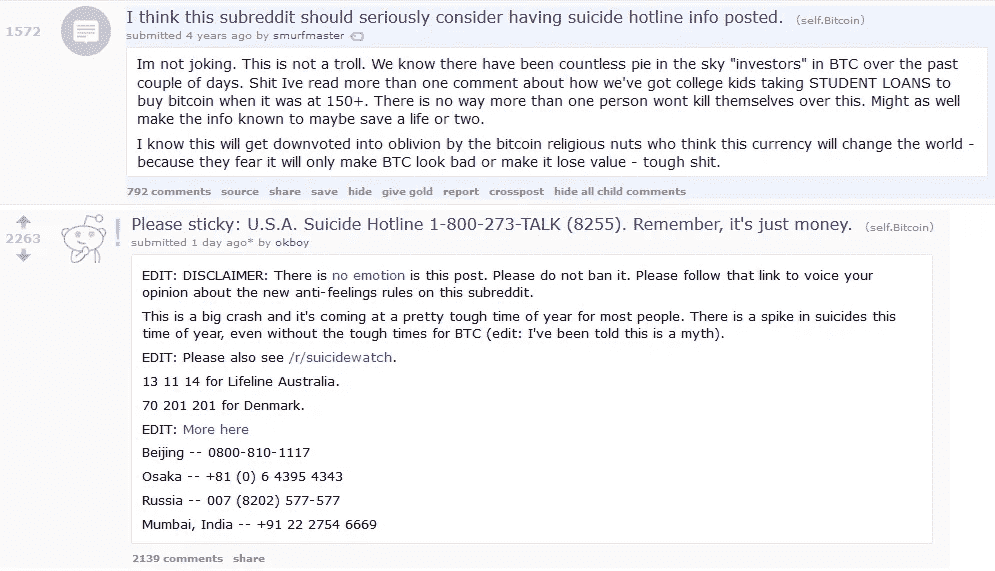

# 街上血流成河——加密货币现在怎么办？

> 原文：<https://medium.com/hackernoon/theres-blood-on-the-streets-what-now-for-cryptocurrencies-feb4328afa73>

我将继续为你破坏它——加密货币的未来是光明的。然而，我想写下我们在过去几周目睹的事情。

人们正在恐慌，这从我私下和社交媒体上收到的消息中可以明显看出——尤其是来自这个领域的新人。然而，我们还没有接近 2011 年的崩溃，尤其是 2013 年的崩溃。我记得当时的气氛与今天不同——那是纯粹的绝望。要达到这一点，我们还有很长的路要走。价格是否会进一步下跌，我们是否会到达那个点，还有待观察。在这篇文章中，我不会深究这个问题。

A couple of reddit posts during the 2013 crash

我们在过去几周和几天目睹的，是对过去一年绝对疯狂的牛市和 T2 牛市的调整。人们(和机构)正在获利，这导致比特币、以太坊和所有其他加密货币的价格下跌。一些 FUD(恐惧，不确定性，怀疑)也在过去几周浮出水面，在人们的脑海中蔓延，这有助于这次下跌。

## 这都是关于人类心理学的

这一切都归结为一件事:人类心理学。这是人之常情——当你看到你的投资下降时，你想尽快卖掉并退出。你看到其他投资上升，你会冲动购买，或者像他们所说的“FOMO”(害怕错过)。

除此之外，过去几个月，大量新资金进入了市场。大多数新投资者将加密货币视为快速致富的方案，没有看到这些项目带来的潜在价值，也没有在投资前进行适当的研究。他们只是在疯狂上涨期间成为市场的一部分——从来没有在下跌期间。显然，当事情“变红”时，他们不知所措地爬出门去。

## 展望未来…

就技术而言，过去几个月没有任何变化。5 个月前将要改变世界的技术，今天仍然存在。相反，它更成熟，正准备成为主流。

展望 2018 年和 2019 年，生态系统将更加成熟。将为比特币实施一个扩展解决方案，以帮助降低交易成本和速度。分散式应用程序(dApps)将开始进入主流，并在现实世界中使用。更多的机构资金将进入这一领域。交易所将更加可靠，更有弹性。许多被高估和“无用”的项目将会消失——这只会有助于生态系统成熟。我们将以这样或那样的方式向加密货币成为我们日常生活的一部分迈进了一步。

就像过去所有的比特币牛市(或者你可以称之为泡沫)一样，大量新投资者进入了这个领域。他们在各种交易所创建账户，提交文件以获得验证，并存钱购买加密货币——当我们第一次进入这个领域时，我们都这样做过。他们中的绝大多数人只是“玩弄”了存放“微不足道”金额的加密货币。

一旦媒体叙事发生变化，开始报道加密货币如何成熟并在现实世界中得到应用，将会发生什么？在上一轮牛市中完成注册程序的投资者将会回来。他们谁也不会忘记他们最初投资的原因；100 倍回报的前提。而那些原本只是和他们“调情”的人，将会准备冲动购买比上次更多的数量。

这些原因将成为未来更疯狂牛市的燃料。

如果你喜欢这篇文章并想看更多，请确保给这篇文章一个**掌声**和我的博客一个**关注**。

您也可以通过在此捐款来表达您的支持:

**BTC**:395 jpxqaqlvyp 2 CP 4 uvmdbppartdkbfzk
**BCH**:181 fsplrfwvk 3 tpfmev 678 plrua 2 kpeofh
**LTC**:lgj w5 vjo 2 exxftqawuljvbrtqdiscxng 7 u
**ETH**:0x4c 7195 e 074 cf 0 ab 6 f 77 BD b 7

免责声明:这篇博文中的所有信息和数据仅供参考。我的观点是我自己的。我对任何信息的准确性、完整性、适用性或有效性不做任何陈述。我将不对任何错误，遗漏，或任何损失，或因其展示或使用引起的损害负责。所有信息均按原样提供，不含任何担保，也不授予任何权利。