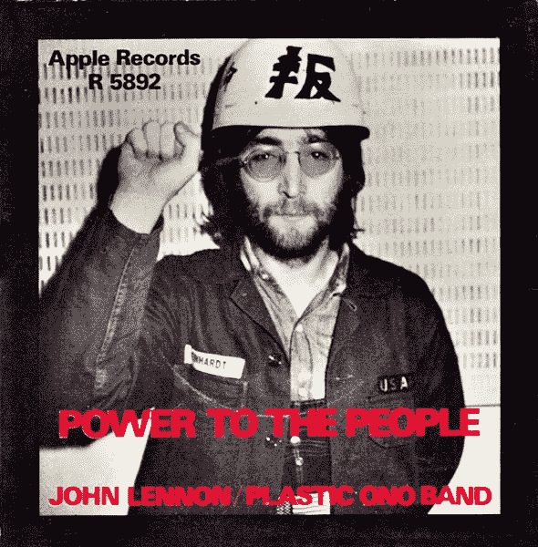

# “区块链”没有什么特别的

> 原文：<https://medium.com/hackernoon/theres-nothing-special-about-the-blockchain-35d38c554394>

没有太多创新…但是有很多愚蠢..

Blockchains…and basically 95% of crypto’s..

如果你后来读了我的一些材料，这可能会有点令人震惊——但这是 100%真实的。

我正在努力发布一些文章，这将有助于人们理解区块链的一般类型之间的差异，在阅读这些文章的过程中，你会对我为什么打这个电话有更深的感觉。

这篇文章的目的是用简单的语言来阐述为什么我认为区块链实际上没有什么特别之处——在我看来，当你开始穿越这片风景时，理解这一点非常重要。

## “区块链”

这是一个模糊的术语。如今，任何在公司名称后面加上这个词的猴子似乎都会走出去&额外赚到或筹集到 1 亿美元:

Stupidity…Image courtesy of CNBC…

如果这不是你见过的最愚蠢的事情，那么…那你一定看过一些非常愚蠢的 S#*%…

无论如何..除了这样的事情，我想说的是，人们试图掌握/分类/标记/归类一项技术，试图模仿比特币自诞生以来的表现——所有这些都是为了利用一种趋势。

但问题是比特币的创新不是区块链！！这正是当新技术和金钱结合在一起时会发生的事情。所有的低能儿都突然冒出来，一夜之间成了专家，开始满嘴胡说八道，好像他们明白发生了什么。

区块链并不是天生的创新者。

区块链只是一种新的、更安全的信息数据库方式。谁会在乎呢！在过去的 20 年里，我们已经有了多种构建新数据库的方法，除了后端技术极客之外，没有人真正在乎这些。

人们现在真正关心的是钱的问题。那些从一开始就说这没用的蠢驴现在都很痛苦，因为他们错过了 100 万的回报。那么在这种情况下，任何有认知失调反射的人会怎么做呢？很简单:通过寻找“下一个”将“接管比特币”和“成为新的加密金”的区块链，试图找到合理化和证明他们愚蠢的方法。

因此，在 2018 年，在比特币从 1 美分涨到 2 万美元之后，我们看到了所有对正在发生的事情一无所知的专家，他们说“区块链是创新”。

但是这里有一条新闻:*不..不是的..*

不，你的新“区块链”技术不会这样做:

Chart is a little outdated…sorry..

真正的创新是创造去中心化的共识协议和网络，这些协议和网络能够在没有中央权威的情况下运行*，传统上人们需要“信任”中央权威，以允许更多的交换、通信和交易。*

> 真正的创新是创建分散的共识协议

比特币开创的是*第一次*融合多种不同的技术、学科&理论，创造出一种新形式的 ***治理*** 。

“区块链”只是拼图的一部分。它允许分类账和分类账中的交易不可改变，这很好，但这是博弈论和机制的设计，其中不需要中心方来审查、监控、验证或确认“状态”、交换、转移等，这是“去中心化共识协议”的特殊之处。

这个领域真正的创新是比特币。我想说以太坊也在那里，特别是他们开发了 Casper (PoS)。

但是除此之外，在这个阶段没有任何其他东西能够真正开拓自己的空间&发展一种革命性的新的治理形式 **^^** 。

其他一切都在比特币的浪潮中，声称自己是下一个大事件，声称自己有一个更快、更私人的“区块链”,但却完全忽略了一点:

***这不是讲《区块链》***

自从 protocols^分散协商组织成立以来，我们作为一个社会已经能够预见未来。在未来，所有这些浪费的基础设施以及我们用来维护它的持续时间、精力和资源将变得越来越不相关。

政府、法院、投票系统、法律、机构、组织等，

所有这些实体的创建都是为了帮助指导和管理社会，同时允许公众以某种形式(尽管有限)参与这一过程。

事实是，这些实体、过程、程序、规则等的大部分可以被编纂，并且，公众可以在从选择到实施的整个过程中有更大的参与。

我们已经证明，比特币、以太坊和其他加密货币+区块链通过*分散共识机制运作。*

现在，我们“只能”以金钱的形式交易价值(我认为这本身就是一个惊人的成就)，但是随着最优秀的人才涌向这些开源协议，随着越来越多的人听说它们并使用它们，我们将看到它们以互联网的方式发展。

15 年前，我保证你不会用信用卡在网上买东西。现在吗？百分百正常。

同样的事情也会发生在这里。

跑来跑去说区块链有多“革命”其实只是来自于不了解它的人。

这是 IBM 的世界(无意冒犯 IBM——这更多的是一种隐喻)。

This is what revolutions are made of..

从表面上看，IBM 和苹果都造了一台“电脑”，但实际上他们各自在造两种完全不同的东西。一个是制造机器，另一个是创造革命&赋予人民权力。

又是《1984》，你猜怎么着；区块链&分散一致协议/网络(DCP/N)正在做两件非常不同的事情。

## 结论

当人文科学和科学交叉结合时，最伟大的革命和创新就会发生。

只专注于一个会带来渐进的改进——这很好，我们也需要这样——但是只有当它们走到一起时，步骤变化才会发生。

再次以苹果为例，乔布斯将艺术和科学结合起来，创造了 iMac、iPhone、iPad 等等。彻底改变了个人电脑。计算机从企业的“工具”变成了几乎和衬衫一样无处不在的东西，从而使信息竞技场变得平坦。^^^

区块链和 DCP/N 的情况也是如此。

一个是专注于构建一个工具，这个工具很可能会被企业采用&让它们更有效率。干得好。恭喜你。

另一种是通过对博弈论和机制设计的研究来获取人类心理和自身利益，将其与密码学、区块链和计算机科学等技术相结合，并使用它来实现和提供一组最基本的人类和社会需求:交换、交易、协议、通信等。

所以，是的…权力属于人民！哈哈..

That’s not “Apple” Apple btw ;)

## 笔记

这不是我最连贯的作品，我为此道歉。我想写的东西实在太多了，但现在只能写到这里了&等我有更多的时间来详细阐述每一个想法的时候再写吧。

我在文章中还做了一些评论和陈述，我觉得需要多解释一下:

^:我在这里喋喋不休地谈论比特币，因为它是同类事物中的第一个。这不是最好的区块链技术，但它是我们第一次看到一个系统能够允许互不相识的人使用数字令牌进行安全的在线交易，而无需中央机构监控、验证或确认交易。*那就是革命*。此后的一切都是对这一理念的改编——有些好，有些没用。

^^如果你看过我的文章，你会知道我是整个空间的忠实支持者。所以我对“所有其他人”的小小抨击并不是为了诋毁世界上的 Monero、Dash 等。有一些惊人的项目采用了去中心化的 consenus 协议，可能比比特币更好/更聪明——它们也应该如此；他们可以站在巨人的肩膀上——所以不要误解我的评论，我只是想指出，在比特币出现之前，确实有一堆不同的技术。继比特币之后，我们有一个超过 5000 亿美元的加密市场&围绕它的更广泛的“区块链”市场。

^^^:我的观点没有考虑到你对智能手机、电脑、连接等无处不在的看法。你们有些人可能会说他们很伟大，有些人可能会说他们侵蚀了社会。那是你的看法，但不是我的观点。如果这是你的一个症结，我会花一点时间来阅读这个:

 [## 技术在变化，但人却一成不变*

### 混蛋变得更混蛋，慷慨的人有更多可以慷慨对待的。

medium.com](/@AleksandarSvetski/technology-changes-but-people-stay-the-same-f2d5b903b81d) 

这是我早期的一篇文章，所以请原谅我过度的亵渎..lol。

**如果你喜欢这篇文章，请给它一些爱，为它鼓掌(或几下)，并把它传给任何你认为应该读一读的人。**

**我的一些东西有点粗糙，但这样做是希望能让人们更清楚/更深入地思考他们在做什么。**

**希望你得到一些价值&反馈总是受欢迎的！**

**阿列克斯**

****_ _ _ _ _ _ _ _ _ _ _ _ _ _ _ _ _ _ _ _ _ _ _ _ _ _ _ _ _ _ _ _ _ _ _ _ _ _ _ _ _ _ _ _ _ _ _ _ _ _ _ _ _ _ _ _ _ _ _ _****

**您也可以关注我:**

** [## 亚历山大·斯维特斯基|职业简介| LinkedIn

### 查看 Aleksandar Svetski 在 LinkedIn 上的职业简介。LinkedIn 是世界上最大的商业网络，帮助…

www.linkedin.com](https://www.linkedin.com/in/alekssvetski/)  [## 亚历山大·斯维茨基—中等

### 阅读亚历山大·斯韦茨基在媒介上的作品。试图“思考”的企业家。我所有东西的出口加密…

medium.com](/@AleksandarSvetski)  [## Earn.com

### 和我一起在 Earn.com 工作。

earn.com](https://earn.com/aleksandarsvetski/)  [## 亚历山大·斯维茨基(@亚历山大·斯维茨基)|推特

### Aleksandar Svetski 的最新推文(@AleksSvetski)。CEO @ Valley Iconic。澳大利亚

twitter.com](https://twitter.com/AleksSvetski)**