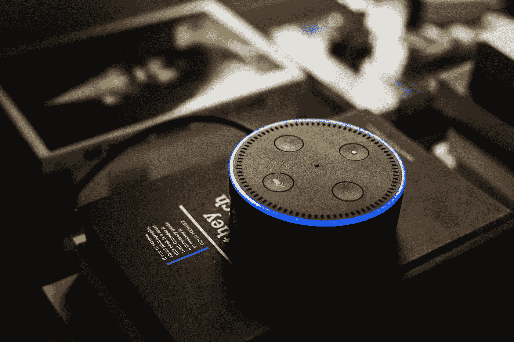

# 通过打破模式来改变世界

> 原文：<https://medium.com/hackernoon/these-4-companies-have-altered-society-and-youre-paying-for-it-40186a04344e>

# 通过打破模式来改变世界

如果你看看 10-20 年前国内生产总值排名前 10 位的公司，它们基本上是一样的:可口可乐、柯达、百视达、通用电气和沃尔玛。这些品牌为我们的电视屏幕增光添彩，渗透到我们的广告空间，成为消费主义不可或缺的一部分。

然而，在过去的 5 到 10 年里，这些顶尖竞争者保持竞争力的本质已经发生了变化。现在，这不是长寿的问题，而是比其他人更新、更快、更有创意的问题。这是关于事物发展的速度和保持领先 10 步。我们现在处于未知领域。基于技术和创新建立商业模式的公司已经迅速取代了大型零售商和家族企业。

因为名单变了，生活也变了。

不相信我？

想想你购物的方式。想想你看电影的方式。你开车的方式。你工作的方式。你从一个地方到另一个地方的方式。你的孩子看待产品、世界的方式，*你*。

都不一样了。这很重要。

## **从沃尔玛到亚马逊**

在我成长的过程中，如果你想要什么，你会出去买。你必须等你的父母上车，亲自带你去商店。你有零花钱。你可以买一个玩具(也可以不买)。然后你回家玩它，直到它散架，你不得不等待一个新的。“东西”并不像今天这样一次性或低风险。商品不是点击一下按钮就能买到的，这使得购买的决定变得更加重要。回报并不容易。质量仍然很重要。今天，我们的孩子以惊人的频率看到、购买和丢弃。(我们也是。)购物成了事后的想法，因为它是即时的。买家不会后悔——不会。你可以在任何时候，以任何方式买到你想要的东西。关于我们如何看待产品，这教会了我们的孩子什么？我们如何决定购买产品？我们如何不耐烦地等待产品？我们现在拥有的大部分东西都是一次性的。

## **从希尔顿到 AirBnb**

让一个陌生人住在你家里的想法听起来有点奇怪，但对许多人来说，他们最大的房地产投资——他们的房子——可以获得实时回报。输入:AirBnb。当然，这不是第一个也不是最后一个将我们带入共享经济空间的例子，但这是一个视角转变的明显例子，表明赚钱的机会就在你的家门口。

## **从福特到特斯拉**

交通工具变了。T 型车是 20 世纪的轰动之作。我们可以连续几天谈论路上的橡胶是如何让美国经济变得更好的。全球化。生活质量。等等。退而求其次。有争议，但对我来说，它指向特斯拉。创新驱动的公司。从现在使用众包信息来缓解我们通勤的地图(hello，Waze ),到自动驾驶汽车，再到为 Ubers 打车，这意味着你的汽车实际上可以提供另一个可行的收入来源——我们正在以令人难以置信的方式实现交通自动化，让我们在路上和路上走向不同的生活方式。

## 然后是苹果。

苹果或许是公司品牌化最强的例子，它是对一家公司如何能够主导多个市场并围绕这些市场创造一整套生活方式的认可。我们都可以想到朋友、同事或家庭成员要么拥有苹果的所有东西，要么总是拥有最新的设备，或者两者兼而有之。最大的变化是照相手机。我们不再随身携带相机(除非你是摄影师)来存储记忆。你不必等着冲洗胶卷。我们确实改变了捕捉和储存记忆的方式。苹果不断推出最好的产品，这迫使三星和 LTE 等竞争对手公司提高水平。我们翻阅积满灰尘的旧相册的日子一去不复返了。相反，我们将整个数字生活存储在电子设备上。

然而，这些公司只是通往*另一个*地方的垫脚石，在那里，10 年后，这些重量级人物可能也会被淘汰。(即使是苹果。)如今，很少有公司能拥有我们曾经最钟爱的品牌的持久力。我们怎么回到那里？我们想吗？

如果你现在是一名企业家，你如何确保自己不是一个噱头？你不是无数想法中的一个，这些想法来得快去得也快。

不要成为潮流。成为一家对自己的员工、客户和后代产生影响的公司，除非你解释清楚，否则他们甚至不会知道什么是地图、vhs 视频、相册，或者什么是大盒子零售商。

虽然我们的生活在不断变化，但有些事情不应该。你必须向后看才能向前看。记住好的东西。复活它。尊重有效的方法，并让它变得更好。

你的生计可能就靠它了。

在[脸书](https://www.facebook.com/mrshaunblack/)、 [Instagram](https://www.instagram.com/mrshaunblack/) 和 [Twitter](https://twitter.com/Mrshaunblack) 上关注**@ mrshaunback**，获取更多小企业的见解和灵感。