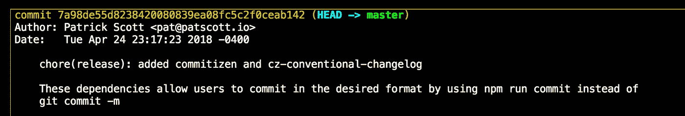
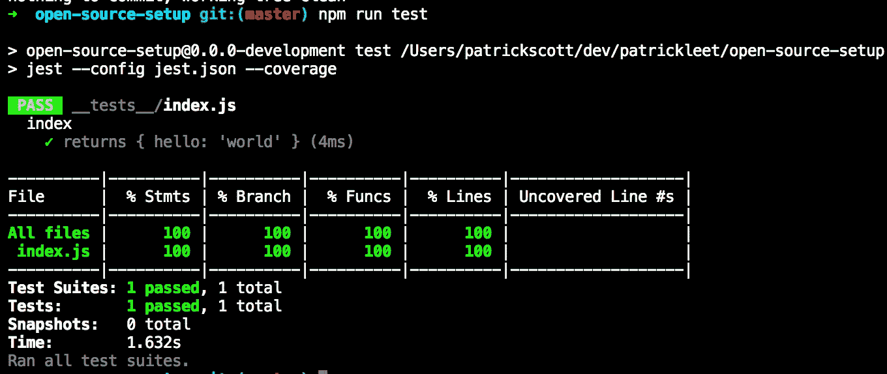
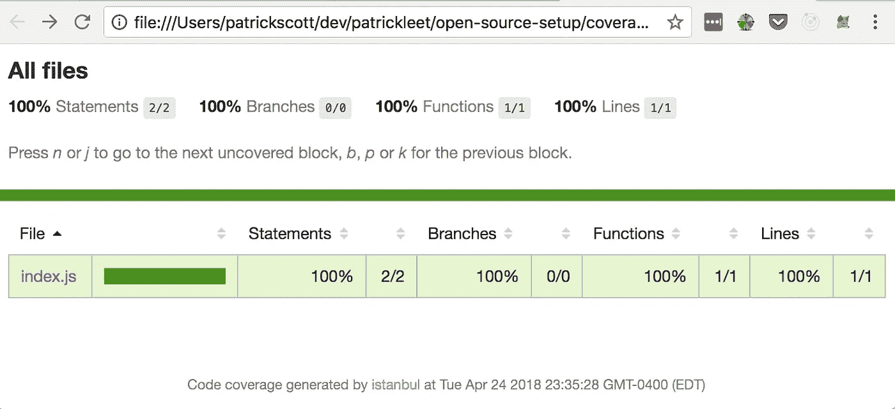
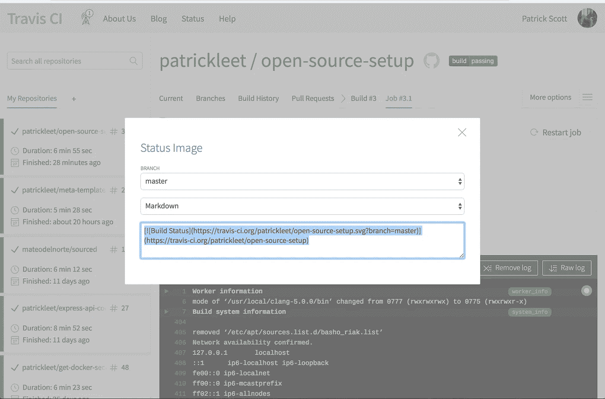
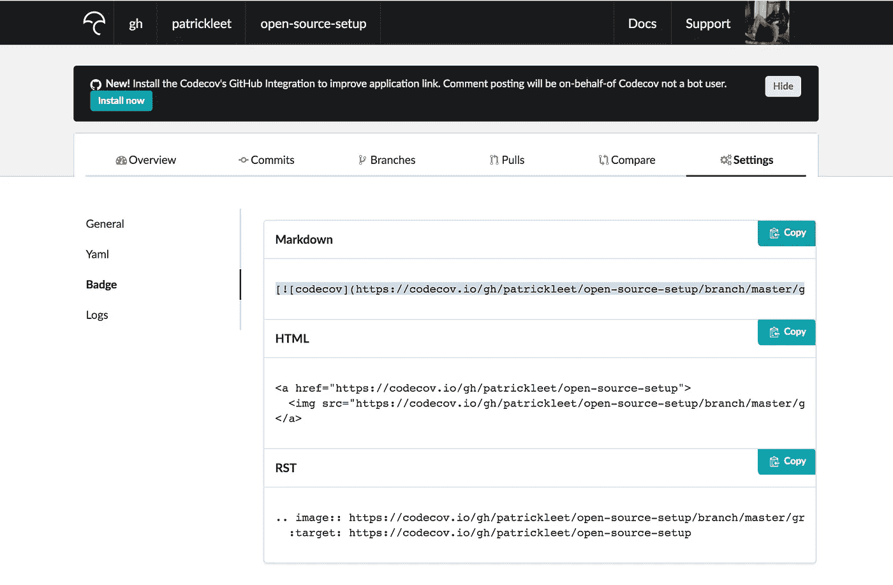
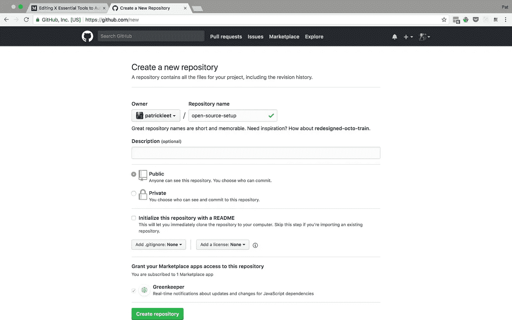

# 这 6 个基本工具将为您发布、修改和维护您的 NPM 模块

> 原文：<https://medium.com/hackernoon/these-6-essential-tools-will-maintain-your-npm-modules-for-you-4cbbee88e0cb>

## 学习如何在你自己的项目中实现它们将会节省你大量的时间！


> 管理开源项目的工作量太大了。

这就是为什么你最喜欢的只有一两个贡献者的无名库没有合并你的拉取请求。

为了补救这种情况，可以使用一套自动化工具将您从保持依赖关系最新、确保代码质量和发布软件新版本的束缚中解放出来。

不幸的是，我们不能自动化所有的维护，但我们可以处理很多。

首先，你需要一个 npm 帐号和一个 github 帐号来运行这些。

让我们开始吧。

# 1.使用语义发布自动化您的发布和语义版本控制

这第一个工具真的解决了我看来最大的痛点。发布软件的新版本。

当正确使用时，`semantic-release`将在必要时*计算新的版本号*，将决定何时删除版本号的情感部分排除在外。

它还*将你的包发布到 npm* ，并且*在 GitHub* 中标记一个新版本。这将生成一个格式良好的 Releases 页面，详细描述构成每个新版本的变化！

首先，安装语义发布 cli 工具:

```
npm i -g semantic-release-cli
```

然后，使用它来设置您的项目。在您正在使用的 npm 模块中运行以下程序:

```
➜ semantic-release-cli setup
? What is your npm registry? [https://registry.npmjs.org/](https://registry.npmjs.org/)
? What is your npm username? patrickleet
? What is your npm password? [hidden]
? What is your GitHub username? patrickleet
? What is your GitHub password? [hidden]
? What is your GitHub two-factor authentication code? [hidden]
? What CI are you using? Travis CI
? Do you want a `.travis.yml` file with semantic-release setup? Yes
```

这将建立所有必要的连接和认证与特拉维斯，Github 和 NPM。

这是新的`package.json`文件。

```
{
  "name": "open-source-setup",
  "version": **"0.0.0-development"**,
  "description": "",
  "main": "index.js",
  "scripts": {
    "test": "echo \"Error: no test specified\" && exit 1",
  },
  "author": "",
  "license": "ISC",
  **"repository": {
    "type": "git",
    "url": "**[**https://github.com/patrickleet/open-source-setup.git**](https://github.com/patrickleet/open-source-setup.git)**"
  }**
}
```

运行`semantic-release-cli setup`向我们的`package.json`文件添加了两个新脚本。以相同的名称调用 devDependency 的`semantic-release`计算版本并准备构建的`package.json`文件，用新计算的“语义版本”或“semver”替换`0.0.0-development` 。

下一个脚本`travis-deploy-once`将运行实际的发布部分。但是，在 Travis 中，构建可以同时在多个环境中运行。我们需要`travis-deploy-once`来确保实际的发布只发生一次，当所有构建都完成时，而不是为每个测试的节点版本发布。

如果缺少所需的`repository`部分，则`setup`命令还会将其添加到您的配置中，并安装新的所需的`devDependencies`。

最后，还生成了一个“travis.yml”文件，其内容如下:

```
language: node_jsnode_js:
  - node
  - 10
  - 8cache: npminstall:
  - npm install
  - npm install -g codecovscript:
  - npm run lint
  - npm run test
  - codecovbranches:
  except:
    - '/^v\d+\.\d+\.\d+$/'jobs:
  include:
    - stage: deploy
      if: branch == master && !fork
      node_js: 'node' # pre-installed version
      script:
        - npm install -g semantic-release@^15
        - semantic-release
```

# 2.使用`commitizen`和 cz-conventive-changelog 来捕获关于每个提交的更多细节

`semantic-release`需要一点帮助来实际计算新版本，尽管它并不真正理解你的代码做什么，这是理解是否有突破性变化的一个明显的先决条件，因此仍然依赖于开发人员告诉它。

其方式是通过在先前版本和当前版本之间发生的提交消息。

考虑下面的例子:

```
git commit -m 'unhelpful' 
# semantic-release has no idea what you didgit commit -m "feat(Customers): Add new customer API endpoints to be more human friendly, removed delete route and replaced it with deactivateBREAKING CHANGE: The old /delete url is no longer supported."# semantic-release knows you wrote a new feature. That's a minor version bump. Also, there is a breaking change! This calls for a major bump instead!
```

**现在的问题是，你希望人们知道和/或关心你应该如何编写提交消息的规则。**

*别担心，有一个模块可以解决这个问题！*

它被称为 commitizen，当用户运行它时，它会用一个向导提示用户创建他们的提交消息。为此，它会询问一系列问题。

首先，要安装:

```
npm i --save-dev commitizen cz-conventional-changelog
```

`commitizen`是提供向导的工具，`cz-conventional-changelog`是描述所需提交格式的插件。

在`package.json`做如下修改:

```
// package.json
{
  //...
  scripts: { 
    **"commit": "git-cz",** 
    // ... 
  },
  //... 
  **"config": {
    "commitizen": {
      "path": "./node_modules/cz-conventional-changelog"
    }
  }**
}
```

现在，我们可以使用`npm run commit`来代替`git commit -m ""`提交

```
➜ npm run commit> open-source-setup@0.0.0-development commit /Users/patrickscott/dev/patrickleet/open-source-setup
> git-cz/Users/patrickscott/dev/patrickleet/open-source-setup
/Users/patrickscott/dev/patrickleet/open-source-setup
cz-cli@2.9.6, cz-conventional-changelog@2.1.0Line 1 will be cropped at 100 characters. All other lines will be wrapped after 100 characters.? Select the type of change that you're committing: chore:    Other changes that don't modify src or test files
? What is the scope of this change (e.g. component or file name)? (press enter to skip)
 release
? Write a short, imperative tense description of the change:
 added commitizen and cz-conventional-changelog
? Provide a longer description of the change: (press enter to skip)
 These dependencies allow users to commit in the desired format by using npm run commit instead of git commit -m
? Are there any breaking changes? No
? Does this change affect any open issues? No
[master 7a98de5] chore(release): added commitizen and cz-conventional-changelog
 3 files changed, 5989 insertions(+)
 create mode 100644 .gitignore
 create mode 100644 package-lock.json
```



Our nicely formatted commit message

> **专业提示:**您仍然会收到不遵循这些规则的拉请求——在这种情况下，选择“挤压并合并”而不是默认的“创建合并提交”。您将能够输入一个新的提交消息来触发一个新的发布。

# 3.运行生成代码覆盖率报告的自动化测试

发布任何东西都不是很好的实践。这篇文章不是关于测试的，但是，如果你没有运行自动化测试作为你的发布过程的一部分，你就做错了。

我真的很喜欢`jest`这个。因此，我将添加 jest 的最小设置。

无论您使用什么，生成覆盖报告是非常重要的！Jest 通过简单地使用`--coverage`标志就可以做到这一点。我还发现它的功能很容易使用。

要设置 jest 和报告覆盖范围，请进行以下更改:

```
npm i --save-dev jest
mkdir __tests__
touch jest.config
```

许多人喜欢把他们的 jest 配置放在他们的 package.json 中。我认为它已经够乱的了，所以我通常使用下面的`jest.config`

```
{
  "testEnvironment": "node",
  "modulePaths": [
    "src",
    "/node_modules/"
  ],
  "coverageThreshold": {
    "global": {
      "branches": 100,
      "functions": 100,
      "lines": 100,
      "statements": 100
    }
  },
  "collectCoverageFrom" : [
    "src/**/*.js"
  ]
}
```

在 package.json 中:

```
 "scripts": {
    "commit": "git-cz",
    **"test": "jest --config jest.json --coverage",**
    "semantic-release": "semantic-release",
    "travis-deploy-once": "travis-deploy-once"
  },
```

我的测试存储库有 0 个文件和 0 个测试，所以为了快速解决这个问题，我在[这个提交](https://github.com/patrickleet/open-source-setup/commit/840376c55c111008a5b06f4e118decba7e3eae5f)中创建了两个文件。鉴于这已经是一篇有点长的文章，并且超出了范围，请随意查看那里的那些文件。

您还需要将`coverage`添加到您的`.gitignore`文件中。

这是运行`npm run test`的新输出



一个新的文件夹`coverage`也随着结果生成。通过运行`open ./coverage/lcov-report/index.html`来检查一下。



# **4。用 Codecov 维护覆盖标准**

通过 jest 设置，项目现在输出一个`coverage`文件夹。当你的项目是开源的并在 Travis 上运行时，这几乎是设置`codecov`的唯一要求。

通过设置 codecov，您将在自述文件上获得一个漂亮闪亮的徽章，宣传您经过良好测试的代码，以及所有 Pull 请求的自动注释，详细说明变更如何影响覆盖率。

我已经在上面的. travis.yml 文件中包含了所需的更改，所以如果您继续学习的话，一切都准备好了。

还可以前往 [CodeCov](https://codecov.io/) 并使用 GitHub 登录创建一个帐户，并授予适当的权限。

# 5.确保一致的代码格式，并通过林挺代码来避免简单的错误

在我们确保代码质量的同时，我们还希望确保所有代码在部署之前都通过了林挺测试。

你喜欢什么标准就看你自己了！有的喜欢 airbnb，有的更喜欢“标准”。

选择对你和你的团队有用的东西，但是请选择一些东西！

我将使用名为`standardjs`的标准，尽管它的名字如此，但它并不是一个标准。但我还是很喜欢。

让我们安装`eslint`并运行设置。

```
npm i --save-dev eslint
```

运行`npx eslint --init`将启动一个向导，为您的选择安装和配置正确的依赖项。

```
➜ npx eslint --init
? How would you like to configure ESLint? Use a popular style guide
? Which style guide do you want to follow? Standard
? What format do you want your config file to be in? JSON
```

结果，生成了一个非常简单的配置，`.eslintrc.json`。

```
{
    "extends": "standard"
}
```

为了执行 lint，我们需要向`package.json`添加一些脚本

```
 "scripts": {
    "commit": "git-cz",
    **"lint": "eslint src __tests__",
    "lint:fix": "eslint --fix src __tests__",**
    "test": "jest --config jest.json --coverage",
    "semantic-release": "semantic-release",
    "travis-deploy-once": "travis-deploy-once"
  },
```

这个命令很简单，它使用`.eslintrc.json`中的设置接收一个文件夹列表。我喜欢用`--fix`创建第二个命令，以便在本地运行时自动修复问题。

这里有一个区别的例子

```
➜  npm run lint> open-source-setup@0.0.0-development lint /Users/patrickscott/dev/patrickleet/open-source-setup
> eslint src __tests__/Users/patrickscott/dev/patrickleet/open-source-setup/src/index.js
  1:44  error  Newline required at end of file but not found  eol-last/Users/patrickscott/dev/patrickleet/open-source-setup/__tests__/index.js
  3:1  error  'describe' is not defined                      no-undef
  4:3  error  'it' is not defined                            no-undef
  6:5  error  'expect' is not defined                        no-undef
  8:3  error  Newline required at end of file but not found  eol-last✖ 5 problems (5 errors, 0 warnings)
  2 errors, 0 warnings potentially fixable with the `--fix` option.➜  npm run lint:fix> open-source-setup@0.0.0-development lint:fix /Users/patrickscott/dev/patrickleet/open-source-setup
> eslint --fix src __tests__/Users/patrickscott/dev/patrickleet/open-source-setup/__tests__/index.js
  3:1  error  'describe' is not defined  no-undef
  4:3  error  'it' is not defined        no-undef
  6:5  error  'expect' is not defined    no-undef✖ 3 problems (3 errors, 0 warnings)
```

第一次，它只告诉我们什么是错的。当包含 fix 标志时，5 个错误中的 2 个可以被自动修复。

剩下的三个错误是由于 jest 的工作方式，即假设这些全局变量将由测试运行程序定义。

我们可以通过修改`.eslintrc.json`告诉`eslint`这些不是问题来解决这个问题。

```
{
    "extends": "standard",
    **"globals": {
        "describe": true,
        "it": true,
        "expect": true
    }**
}
```

现在运行`npm run lint`退出，没有错误。

我已经在第一个`.travis.yml`文件中添加了这个。

有了那个，我就在推我的代码！但是我们还没有完成。然而，下一个工具希望我们在它被设置之前就能达到这一点。

这是构建的[结果，并且在](https://travis-ci.org/patrickleet/open-source-setup/jobs/370892229) [Github](https://github.com/patrickleet/open-source-setup/releases/tag/v1.0.0) 上创建了一个发布包，并发布到 [NPM](https://www.npmjs.com/package/open-source-setup) 。

我鼓励你浏览 Travis 的工作 lob 并阅读输出，看看 semantic-release 是如何计算它的发布的。

在我们继续之前，让我们花一点时间把我们的自述文件写得漂亮一点(或者干脆一点)。为了合法，我们显然需要所有的徽章。

首先前往 Travis，通过单击页面顶部附近的徽章获取徽章。将打开一个带有不同嵌入代码的弹出窗口。你会想要 markdown 的自述文件。



我认为它们放在标题下面看起来很好，所以把它贴在那里或顶部吧。

接下来，前往 Codecov。导航到您的项目，并获取显示您的存储库代码覆盖率百分比的 markdown 标记。

可以在**设置** | **徽章**部分找到。



Also apparently they have a GitHub app now which is even better that I should install.

这是我的 README.md 文件:

```
# open source setup[](https://travis-ci.org/patrickleet/open-source-setup)[](https://codecov.io/gh/patrickleet/open-source-setup)An example repository showing how I set up my open-source npm modules.
```

# 6.使用 GreenKeeper 保持您的依赖关系最新

应用程序中第一个过时的是依赖项。

没关系。

进展、新功能和安全修补程序，每天都在世界各地推送。

问题是要跟上他们。

为此，我使用了 [GreenKeeper.io](https://greenkeeper.io) 。

GreenKeeper 将通过读取它的 package.json 文件来监视你告诉它的任何注册表，并且每当你的包的一个依赖关系的新版本被更新时，它将创建一个新的 Pull 请求，使用`cz-conventional-changelog`风格的提交消息！

这意味着，此时您需要做的就是，如果 travis CI 构建的 Pull 请求通过，请按 merge。如果你注意的话，这很棒，因为这将使用`semantic-release`触发一个新的版本！

设置 GreenKeeper 有两个步骤。

1.  遵循 https://greenkeeper.io/docs.html#installation 的[的安装说明。这将指导您安装 GreenKeeper“GitHub App ”,然后授予 green keeper 访问您的存储库的权限。对于每个选定的存储库，将提交一个初始拉请求，您可以合并该请求以完成对该存储库启用 GreenKeeper。](https://greenkeeper.io/docs.html#installation)
2.  一旦您合并了那个 PR，您会发现您需要完成一个额外的设置步骤来使锁文件保持最新。

不过，你只需要第一次安装 GitHub 应用程序，因为将来你创建的库会询问你是否想要启用它。



I already had the Greenkeeper GitHub App installed

来自 GreenKeeper 的初始 Pull 请求可能需要一段时间才能进入新的存储库。

因为我以前做过这个，我知道接下来会发生什么，所以我们必须对`.travis.yml`文件进行一些更新。

一旦您合并了 PR，greenkeeper 会让您知道需要安装和配置的依赖项，以便它能够保持`package-lock.json`最新。

让我们继续做下去，也许绿色守护者公关会在同一时间到来。

在 travis.yml 中添加以下部分:

```
**before_install:
  - npm install -g npm@latest
  - npm install -g greenkeeper-lockfile@1**

**before_script: greenkeeper-lockfile-update**

**after_script: greenkeeper-lockfile-upload**
```

如果出于某种原因，您的初始 PR 仍然没有出现，并且已经超过 30 分钟，这可能意味着出现了问题(根据他们的文档)，此处提供了[故障排除步骤](https://greenkeeper.io/faq#no-initial-pr)。

一旦来了就合并！第一个 PR 将升级您的所有依赖项，为其提供最新的基线，并将 GreenKeeper 徽章插入自述文件。如果需要，GreenKeeper 会告诉你。

这是我在本教程中从事的项目的公关。
[https://github.com/patrickleet/open-source-setup/pull/1](https://github.com/patrickleet/open-source-setup/pull/1)

# 结论

这是用最少的努力维护您的开源项目的一个非常坚实的基线。

希望你觉得有用！

> *有兴趣听听我的 DevOps 之旅，没有无用的 AWS 认证？* [*现在就在 HackerNoon*](https://hackernoon.com/my-journey-to-achieving-devops-bliss-without-useless-aws-certifications-a7cbf7c539d1) *上看。*

请跟我来，留下一些掌声，看看我的其他文章。

> 你知道你可以给你喜欢的每篇文章打 50 分吗？Medium 使用这些信息为作者最有用的内容付费！相当酷！
> 
> 您可以通过点击/轻拍，然后按住拍手按钮来完成此操作。