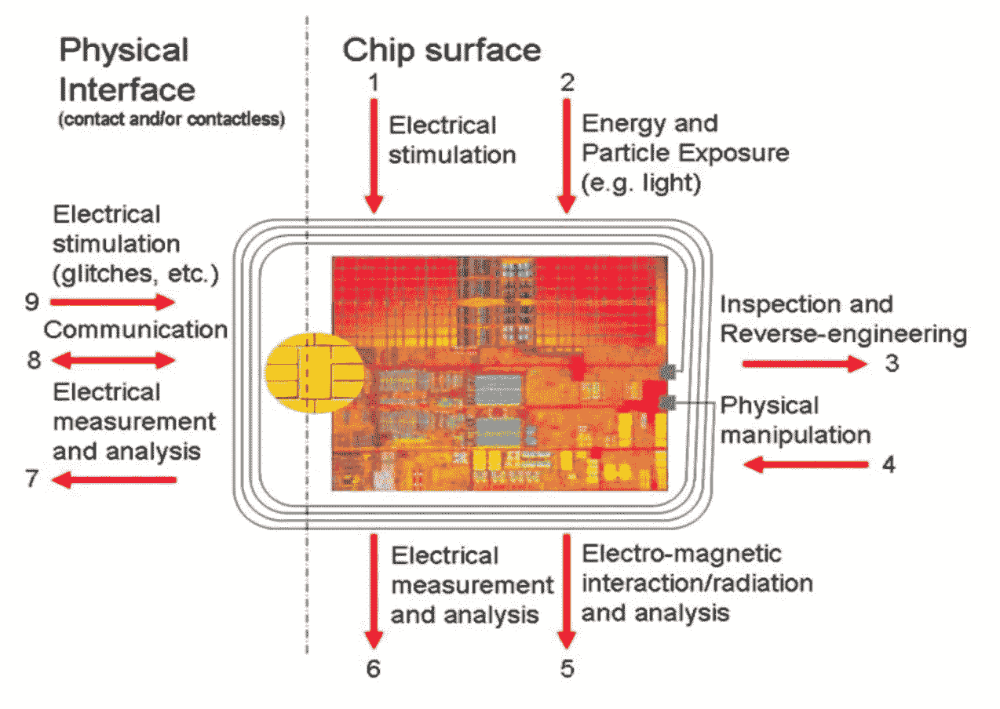

# 这些智能钞票可以给大众带来密码

> 原文：<https://medium.com/hackernoon/these-smart-banknotes-could-bring-crypto-to-the-masses-4be57bcca1c7>

> 2017 年，加密货币席卷了我们；比特币的迅速崛起让世界意识到分布式账本的可能性及其潜在影响。这让投资者陷入了一场投机和 FOMO。这种数字货币一度飙升超过 1，900%。所有的谈论甚至让华尔街也开始涉足。加密似乎不再被认为是短暂的热潮，它背后的技术，区块链，正被证明像互联网一样具有深刻的革命性。
> 
> Every successful technology navigates a Cambrian era of growth before it figures out what it’s best used for. [Blockchain](https://hackernoon.com/tagged/blockchain) and cryptocurrencies are arguably in their one-size fits all stage. The issue being one-size never fits all. What of the sceptic, the technically unsophisticated, the conservative, the one sitting on the fence? How do we get crypto to them? People love crypto because it’s a decentralised trust-less system that needs no middleman — it allows digital exchange of value using existing computing power. That’s great! But managing private keys and buying and selling crypto is complex; you need to open an account on an exchange, get a wallet, manage keys and passwords. In most countries you need to pass lengthly and complex Know Your Customer hurdles. There’s just so much friction involved; a transaction takes a long time, uses a lot of energy and involves a lot of risk ([bitcoin](https://hackernoon.com/tagged/bitcoin) is very easy to lose). The sceptic or the average Joe just isn’t going to bother. Would not something tangible, accessible, easy to grasp and less of an illusion be so much easier? Like a physical crypto bank note? Why not allow the masses to skip this digital cash metaphor and revert to something simpler, almost reminiscent of China’s easily receivable Hong Bao (红包). Here I chat with Andrew Pantyukhin, Co-Founder at Tangem, who is changing this paradigm and bringing physical crypto to the masses.

## Tangem 是做什么的？

Tangem 是数字资产的第一个物理表现形式。我们是第一个真正的实物比特币——第一个*有形的*比特币。Tangem notes 是一种智能纸币，带有一种特殊的芯片，可以携带加密货币或任何其他数字资产。有了这些钞票，你就可以通过移交或接收来进行物理加密交易。与在线使用加密货币不同，实物交易是即时、免费、匿名的，没有任何费用。它们是真正去中心化的，这意味着它永远不会受到技术局限的限制。

## **哪里可以买到？**

你可以在世界各地买到它们，从街角商店、零售连锁店、特殊的自动取款机，或者已经拥有它们的人那里。你可以像使用现金一样使用它们，但它不是政府支持的法定货币，而是加密货币！

## 你为什么要创造 Tangem？

就像香槟一样——有点意外！我们拥有世界上最独特的微电子团队之一，可以对安全元素进行本地编程，这是一套非常罕见的技能。当加密货币在 2014-2015 年左右开始获得牵引力时，我们开始研究我们可以在这个领域做什么，以及我们如何应用自己。我们考虑过携带价值的智能卡，但在当时这是不切实际的。这些芯片太慢，缺乏椭圆密码支持，太不安全，或太耗电，或过于庞大和昂贵。
由于我们的微电子业务，我们与世界上所有主要的芯片组供应商都有着良好的合作关系，如恩智浦、三星和英飞凌。有一次，当我们与他们中的一个人交谈，试图在智能卡上实现加密货币时，他们告诉我们，他们在未公布的路线图上有一个芯片家族，可以以很高的收益率和价格做我们需要的一切。我们比市场上的其他人提前几个月获得了相关信息和芯片规格，以及样品。现在市场上有几款这样的芯片，我们成为了它们在全球的第一个主要客户和使用案例。

## 为什么现在可能了？

2017 年，我们看到了芯片技术的微小突破。历史上，我们在嵌入式芯片方面有两个方向:一个是超级安全的，设计为不可破解的，即所谓的安全元素，另一个是强大和通用的，足以处理椭圆曲线加密和复杂的计算。去年，某些类型的安全元件获得了对高级加密技术、嵌入式闪存的支持，同时获得了更高级别的安全认证、更低的功耗和令人难以置信的经济性。即使是 65 纳米的变体也非常薄、小并且具有物理弹性。

## 为什么这些智能钞票被认为是不可破解的？

这使得破解一张钞票的成本变得不经济，以至于不值得这么做。而且，黑掉一张钞票并不能让你接触到其他钞票。

几十年来，防篡改芯片技术一直在开发和不断改进，用于军事和政府应用，如身份识别和访问控制，或用于金融服务和电信行业，以及最近的信用卡和 SIM 卡。该技术解决了硬件和软件层面上所有已知的攻击媒介。

9 levels of physical protection

## 当一切都是数字的时候，为什么世界需要智能钞票？

真的很简单。加密仍然很难使用；它需要一个陡峭的学习曲线。用户不得不经历如此多复杂且令人厌烦的步骤。有了实体钞票，你需要的只是钞票，没有必要学习或了解任何关于加密货币的知识。每个人都知道现金是如何运作的。我们不需要教你任何东西。此外，每个人都知道如何保护物品的物理安全——你不需要高度复杂的数字技能。

## 市场规模有多大？

今天，我们认为只有大约 500 万人在积极交易和使用加密货币，即拥有超过 100 美元的加密货币，最有可能的是 2000 万个钱包。如今，全球大约有 10 亿人了解加密货币。我们相信需求将来自这 10 亿人，这是我们追求的市场。这是目前的需求，一旦我们消除使用障碍，这一数字将迅速增长到 70 亿。

## 除了加密货币，还有哪些应用？

我们仍然用我们对法定货币的看法来对待加密货币；受控、集中并与 GDP 挂钩。我们尚未意识到的是，当任何人都可以几乎无成本地发行自己的私人、地区、工业和企业货币，并在他们的员工、合作伙伴和客户之间无限流通时，会发生什么——这将从质的方面改变我们对货币、经济和货币机制的所有认识。我认为这是我们将要看到的最有趣的效果。

因此，这不仅仅是现有货币的问题，一旦我们将引入一种新货币的成本降至几乎为零，对现金的整个定义和认知都将发生变化。

当然，我们也在考虑追求其他细分市场。这些芯片是超级安全的，它们可以用于政府识别或商业发行的识别。它们可用于积分卡、礼品卡、票务，以及任何需要实物数字证明或数字资产实物证明的应用。我们以一种新的方式将物理和数字联系在一起，这是前所未有的。本质上，我们认为数字很容易复制，而这项技术保证了它不可复制。这在以前也是不可能或不切实际的。

## 就此而言，有没有其他人正在做你正在做的事情或与你正在做的事情相似？

我们使用的一套技术正在出现，并将在未来几年内为每个人所用。我们非常幸运，甚至在最新技术出现之前就拥有了大部分所需的软件堆栈和人才。所以我们可以把工程资源转移到新项目上。那是非常幸运的。我们总共花了大约三年时间来开发该软件堆栈和专业技术，而拥有无限资金的竞争对手至少需要一到两年时间才能达到相同的功能和安全性水平。很明显，当他们到达那里时，我们希望领先几光年。

Tangem co-founder, Andrew Pantyukhin in San Francisco at Nodle.io offices in SoMa

## 有多贵？

我们目前每件产品的生产成本不到 2 美元——我们现在生产了数百万件。当把它扩大到数十亿单位时，它将和现代纸币一样大。对于大多数政府来说，在未来将他们的法定货币转换成这种技术是很容易的。我们的长期目标之一是将某些政府正在开发的国家区块链扩展到他们的实物货币。

**最后，Tangem 的下一个目标是什么？**我们已经开发了让第一批 10 亿人使用加密货币的技术，现在也要靠我们来开发分销和商业合作伙伴关系，让这项技术真正进入全球数十亿人的手中。