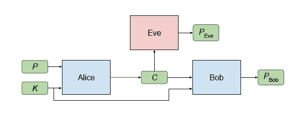
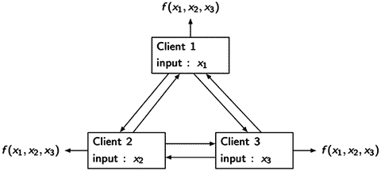

# 这三个安全趋势是分散人工智能的关键

> 原文：<https://medium.com/hackernoon/these-three-security-trends-are-key-to-decentralize-artificial-intelligence-f22d9cf38d69>

分散式人工智能(AI)是人工智能领域最有前途的趋势之一。随着区块链技术越来越受欢迎，对分散式人工智能的宣传也越来越多。虽然从概念的角度来看，分散式人工智能系统的价值主张非常明确，但它们的实施却充满了挑战。可以说，实现分散式人工智能架构的最大挑战是在安全和隐私领域。

分散式人工智能系统的基础是一种环境，在这种环境中，数据提供商、数据科学家和消费者等不同方合作创建、训练和执行人工智能模型，而不需要集中的权威机构。这种类型的基础设施不仅需要在各方之间建立公正的信任，还需要解决一些安全挑战。让我们来看一个非常简单的场景，一家公司希望创建一系列人工智能模型来检测他们销售数据中的模式。在一个分散的模型中，该公司将向一组数据科学家发布一系列数据集，这些科学家将合作创建不同的机器学习模型。在此过程中，数据科学家将与训练和规范模型的其他方进行互动。加强数据的保密性以及不同方之间通信的安全性对于以分散的方式创建人工智能模型是至关重要的。

传统的加密技术，如对称或非对称加密，在分散的人工智能场景中可能是有用的，但它们不能满足这些类型系统的许多关键要求。首先，这些技术需要不同方之间的隐含信任，以交换用于保护通信的密钥，这不是你在分散式人工智能架构中可以依赖的因素。此外，还存在一个问题，即任何一方都可以解密数据并获取敏感信息。为了缓解这些挑战，分散式人工智能系统已经开始采用一些来自学术研究的最先进的加密技术，如果应用正确，感觉有点像魔法😉具体来说，有三种安全方法在分散式人工智能架构中变得无处不在:同态加密、GAN 密码术和安全多方计算。

# 同态加密

同态加密可以被认为是过去十年中密码学领域最大的突破之一。让我们用一个简单的例子来说明同态加密。想象一下，你拥有一家珠宝设计室，在那里你使用贵金属来创造新的珠宝。在这种环境下，你担心你的一些设计师可能会偷走他们工作中使用的一些珍贵材料。为了避免依赖主观信任，你创造了一个小小的上锁的盒子，设计师可以在里面操纵材料，创造新的珠宝，但他们不能把它拿出来。

在数学上，同态被定义为“一个数学集合(如群、环或向量空间)到另一个集合或其自身的映射，其映射方式是通过对第一个集合的元素应用运算而获得的结果被映射到通过对第二个集合中它们各自的图像应用相应的运算而获得的结果上”。同态加密允许在密文上执行特定类型的计算，产生也是密文的加密结果。具体来说，有两种同态加密算法:

**部分同态加密(PHE):** 给定两个数据原语 a 和 b 的加密:E(a)和 E(b)，PHE 可以在不知道 a、b 或私钥的情况下计算 E(a+b)或 E(ab)。PHE 是最常见的同态加密技术，因为它比全同态加密模型便宜得多。有不同类型的 PHE 算法，包括[无填充 RSA](https://en.wikipedia.org/wiki/RSA_cryptosystem) 、[埃尔加马尔](https://en.wikipedia.org/wiki/ElGamal_encryption)和[派利耶](https://en.wikipedia.org/wiki/Paillier_cryptosystem)

**全同态加密(FHE):** 给定两个数据基元 a 和 b 的加密:E(a)和 E(b)，PHE 可以同时计算 E(a+b)和 E(ab)。FHE 被认为是不可能的，直到 IBM 研究员 Craig Gentry [在 2009 年发表了他的博士论文](https://crypto.stanford.edu/craig/craig-thesis.pdf)，在论文中他展示了一种使用[基于格的密码术](https://en.wikipedia.org/wiki/Lattice-based_cryptography)构建 FHE 系统的方法。

在分散的人工智能环境中，同态加密允许各方在加密的数据集上执行计算，而不必解密数据。不幸的是，大多数同态加密实现都过于昂贵，无法在主流解决方案中采用。我说的昂贵不是指时间；我指的是使用 AWS EC2 实例一年来运行一些同态加密数据的基本计算。

# GAN 密码术

对抗式神经密码或 GAN 密码是一种新兴的人工智能方法，它使用生成式对抗式神经网络(GAN)来保护不同方之间的通信。GAN 密码术是由谷歌在 2016 年的一篇题为[“学习用对抗性神经密码术保护通信”](https://arxiv.org/abs/1610.06918)的研究论文中首创的。本文提出了一种方法，其中神经网络可以动态地发现新形式的加密和解密，以保护通信信道免受试图破坏安全方案的对手的攻击。

GAN 加密方案的设置涉及三方:Alice、Bob 和 Eve。通常，Alice 和 Bob 希望安全地通信，而 Eve 希望窃听他们的通信。因此，期望的安全属性是保密性(而不是完整性)，对手是一个“被动攻击者”,可以拦截通信，但在其他方面非常有限。

在上面描述的场景中，Alice 希望向 Bob 发送单个机密消息 P。消息 P 是对爱丽丝的输入。当爱丽丝处理这个输入时，它会产生一个输出 C(“P”代表“明文”，“C”代表“密文”。)Bob 和 Eve 都接收 C，对其进行处理，并尝试恢复 p。让我们分别用 PBob 和 PEve 来表示这些计算。Alice 和 Bob 比 Eve 有优势:他们共享一个密钥 K。该密钥[K]用作 Alice 和 Bob 的附加输入。

非正式地说，参与者的目标如下。Eve 的目标很简单:精确重构 P(换句话说，最小化 P 和 PEve 之间的误差)。Alice 和 Bob 想清楚地交流(尽量减少 P 和 PBob 之间的误差)，但也想对 Eve 隐藏他们的交流。

使用生成性对抗网络技术，爱丽丝和鲍勃被联合训练成功沟通，同时学习打败夏娃。关键是，Alice 和 Bob 对于他们将要用来实现目标的加密算法没有预先定义的概念，甚至对将要使用的技术也没有预先定义的概念。遵循甘原则，爱丽丝和鲍勃被训练打败最好版本的夏娃，而不是一个固定的夏娃。

在分散式人工智能系统中，GAN 密码术可以允许不同的节点动态地保护数据集和模型，可以抵御最复杂的攻击。

# 安全多方计算

安全多方计算(sMPC)是另一种安全技术，可以在不暴露数据集本身的情况下断言数据集。sMPC 是新区块链协议(如 Enigma)的基础。sMPC 最初是由计算机科学家 Andrew Yao 在 1986 年提出的，作为著名的百万富翁问题的解决方案。

考虑我们有三方 Alice、Bob 和 Charlie，各自的输入 x、y 和 z 表示他们的工资。他们想知道这三种薪水中最高的一种，但不想向对方透露他们各自挣多少钱。数学上，这转化为他们的计算: *F(x，y，z) = max(x，y，z)*

如果有一些可信的外部团体(比如说，他们有一个共同的朋友托尼，他们知道托尼可以保守秘密)，他们每个人都可以告诉托尼他们的工资，他可以计算出最大值，并告诉他们所有人。MPC 的目标是设计一个协议，在这个协议中，Alice、Bob 和 Charlie 只通过相互交换消息，仍然可以学习 F(x，y，z ),而不需要透露谁制造了什么，也不需要依赖 Tony。他们应该不会从参与他们的协议中学到更多，就像他们不会从与一个廉洁的、完全值得信任的托尼的互动中学到更多一样。

sMPC 已经利用诸如英格玛区块链这样的技术在分散式体系结构中取得进展。在分散式人工智能架构的背景下，sMPC 将允许不同方对可用于人工智能模型的数据集做出断言，而不会将数据集透露给第三方。

启用分散式人工智能系统需要高度重视安全性和隐私。同态加密、GAN 密码术和安全多方计算是一些开始变得相关的技术，以实现第一波分散式人工智能平台。