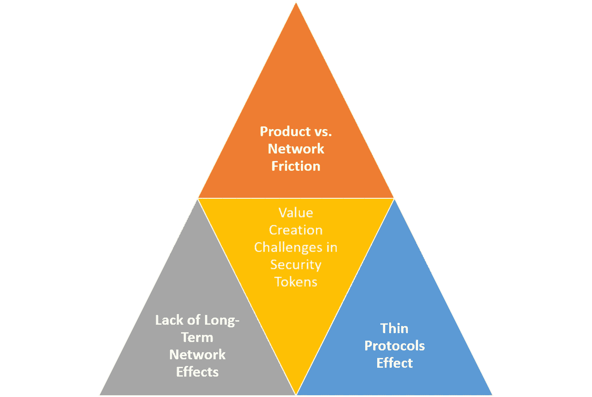
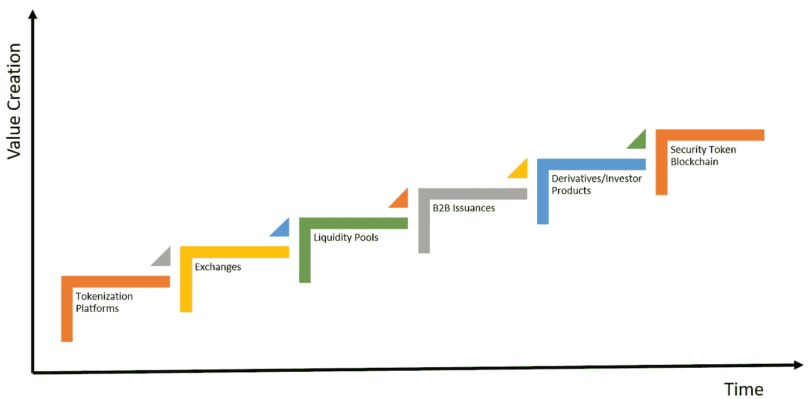

# 瘦协议、缺乏网络效应和安全令牌的价值理论

> 原文：<https://medium.com/hackernoon/thin-protocols-lack-of-network-effects-and-a-theory-of-value-for-security-tokens-7e8a3bd3b9d>

理解技术市场的价值是如何被创造和积累的，是最有效的，也可以说是最难的，来发展一个关于这个领域的独特论题的方法。在安全令牌的情况下，考虑到空间的早期碎片化，制定价值创造论题似乎特别困难。经过一年的疯狂开发，数百名新玩家，更多的新闻稿和第一批发行的令牌，我们仍然没有一个安全令牌空间的主要价值创造途径的清晰画面。今天，我想探讨一些基本的想法，这些想法可能会为如何在加密证券市场创造和积累价值提供一些清晰的思路。

当这个领域还没有出现重大投资时，为安全代币制定一个价值理论的挑战尤其困难。风险资本家和机构投资者倾向于将资本部署在他们认为价值将被创造和积累的领域，因此是短期和长期价值创造理论的早期数据点。换句话说，“跟着钱走”是在技术市场的整个生命周期中形成价值创造理念的一种更简单的方式。在安全令牌的情况下，嗯…目前还没有钱跟进。

当考虑安全令牌的价值创造时，有三个方面让我非常担心:

1) **产品与网络摩擦:**与其他加密市场不同，加密证券领域似乎一直在演变为一个没有底层网络的孤立产品的集合。

2) **缺乏长期的网络效应:**与前一点相关，安全令牌市场在发展过程中似乎没有产生强大的网络效应。

3) **瘦协议效应:**第一波加密证券似乎被非常基础的协议和令牌所主导，而不是强大的平台基础。

# 产品与网络摩擦

直到今天，安全令牌市场一直是一个孤立的产品集合，没有一个基础网络或激励来影响整个生态系统的增长。加密网络的价值不仅是一个巨大的价值创造机制，而且是一个在网络中不同参与者之间分配价值的渠道。有了网络，一些产品可能会受益于网络中其他参与者创造的价值。没有这一点，价值将在特定的产品类别上积累，但不容易扩散到生态系统的其他部分。

# 缺乏网络效应

与上一点相关，现有一代安全令牌产品产生的长期网络影响非常小。安全令牌传输中的大多数网络效应发生在以太坊级别，对安全令牌生态系统的其余部分几乎没有影响。

# 精简协议

fat 协议理论是密码资产的主要价值创造理论之一。如果你读了这篇博客，你就会知道我并不热衷于 fat 协议的想法，但我认为它抓住了加密生态系统相关部分的价值创造动力。在安全令牌的情况下，整个空间基于非常薄的协议，如 DS 协议或 R 令牌和应用程序。这有什么关系？为什么这种类型的精简协议可以在安全令牌生命周期的特定领域(如发行或合规性)获取价值，它们不太可能获取或分发长期价值。

# 有价证券的价值理论

认识到当前安全令牌生态系统的 DNA 和挑战，我们可以开始制定如何在该空间创造价值的基本理论。如果我们从价值创造的角度来看安全令牌空间的演变时间表，我们可能会得到如下结果:

一些可能有助于理解上图的注释:

安全令牌空间中的初始值已经被发布平台捕获。

慢慢地，证券代币交易所可能开始从加密证券的上市和交易活动中积累一些价值。

企业债券的令牌化等 B2B 场景将是在最初的安全令牌浪潮中获取大量价值的领域之一。

众筹市场等流动性池可能会捕捉到安全令牌生态系统中的一些相关价值。

债务、衍生品、披露或合规等领域的加密金融协议具有获取和分配安全令牌价值所需的网络效应。

为大型机构投资者服务的衍生产品等复杂的安全令牌产品将成为安全令牌领域的终极价值创造引擎之一。

如果专门从事安全令牌的区块链的想法成为现实，我们可能会看到安全令牌市场的价值创造动力发生转变。

这些是我对安全令牌领域的价值创造挑战和动态的一些初步想法。我预计一些概述的想法可能会引起争议，甚至是不完整的，但希望有助于引发关于这一重要主题的辩论。