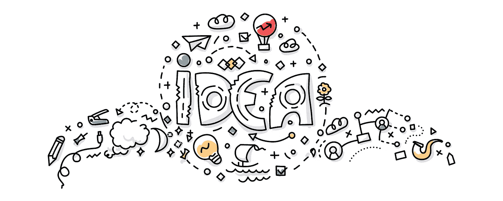

# 工程师在开始工作前应该知道的事情

> 原文：<https://medium.com/hackernoon/things-engineers-should-know-before-starting-up-8aa5da6a7d60>

大多数关于创业的学校和书籍都关注产品。他们说，做你喜欢的事。专注于你的激情！

事情是这样的——如果你的激情不是做生意——你就不应该创业。

如果你是一名艺术家——比如说一名设计师——并且你讨厌你的老板，有一天你会对自己说，“天哪，如果我没有老板该多好啊？”

这不是你辞掉工作，创办自己的设计公司，或者追随你的激情，受托画图画书的信号。

那是胡说八道。

你应该做的是:了解更多关于[营销](https://hackernoon.com/tagged/marketing)以及销售和财务的知识。如果你不喜欢学习它们，也不喜欢将它们付诸实践，新闻快讯:**你不会喜欢经营自己的企业。**

大多数企业家会告诉你，忘掉书本、博客和视频，走出去，亲自尝试一下。除非你这么做，否则事情不会水落石出。

这是真的。直到你开始自己的事业，直到你与投资者和潜在的联合创始人交谈，直到你尝试销售并最终失败——你永远不会学到商业的第一条规则。

没人在乎你的产品。

你是否找到了治愈癌症的方法并不重要。如果你造了一台点石成金的机器也没关系。

不一个。给予。答:妈的。关于。你的。产品。

你可以谈谈你的想法。相信我。创意是廉价的。执行是昂贵的。创业很难。

我知道你在想什么… *好吧，当然，也许他们不在乎你的想法。但是我的想法比你的大！他们会关心我的产品。*

听着，没事的。如果你不这么想，你可能就不会在这里了。你可能永远也不会自己创业。然后我们可能永远无法治愈癌症…

但是听着。在出去尝试破坏一些东西之前，你首先需要学会如何识别哪些东西是*可破坏的*。在你卖东西之前，你必须能够识别一个市场，以及如何有效地进入这个市场。在你考虑开发一个可行的产品之前，你必须首先确定人们到底想要什么！

如果你没有被教育你的方法，如果你没有聪明地创业，你不会从经验中学到很多。但是你会浪费很多时间。还有很多钱。

那是最糟糕的。

如果你知道创业的基本知识，就去做是唯一的好建议。

问问你自己，如果你不知道你的客户会是谁，至少有四种策略来获得他们，并知道通过每种策略获得他们的确切成本——你应该读几本关于营销的书。

我推荐[营销的 22 条不变法则](https://www.goodreads.com/book/show/33449.The_22_Immutable_Laws_of_Marketing)，艾伦·迪布的 [1 页营销计划](https://www.goodreads.com/book/show/41943000-the-1-page-marketing-plan?ac=1&from_search=true)，以及唐纳德·米勒的[故事会](https://www.goodreads.com/book/show/34460583-building-a-storybrand?ac=1&from_search=true)。

如果你担心构建你的产品会花费大量的时间和金钱，那就不应该这样！阅读[精益启动](https://www.goodreads.com/book/show/10127019-the-lean-startup?ac=1&from_search=true)。

如果你不知道你的产品将如何赚钱，或者你不知道你的企业可以合理地赚多少钱，或者每个客户一生应该产生多少收入，或者对你第一年的收入有一个很好的估计(以及支持这种说法的证据)，你应该学习金融建模。

如果你知道所有这些，并且你仍然对你的事业感到兴奋，那么你就为成功做好了准备。正如他们所说，开始吧。