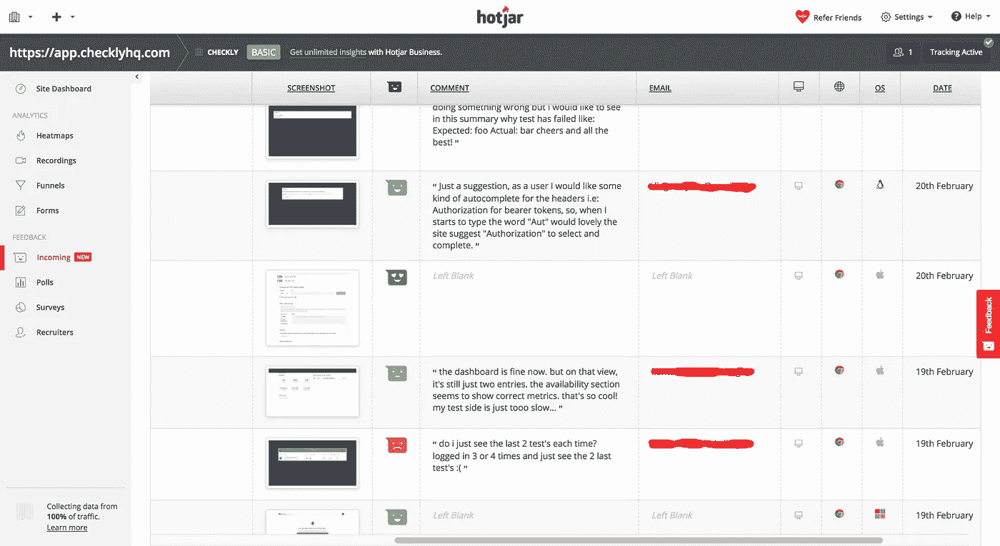

# 我从我的 SaaS 项目的私人测试阶段学到的东西

> 原文：<https://medium.com/hackernoon/things-i-learned-from-my-saas-projects-private-beta-period-cd69a11d9e58>

[Fernando Botero, Tiger and Trainer, 2007, Oil on canvas, 122.6 x 186cm](https://www.christies.com/features/Fernando-Botero-Latin-American-Art-7334-1.aspx)

我在 SaaS 的新公司 https://checklyhq.com 已经进行了大约两个月的私人测试。我刚刚转到“常规”测试版！为更多的测试版欢呼！私有测试版有两个目标:

1.  **技术**:对代码和基础设施的健全性检查。
2.  **业务**:获得用户对功能和可用性的初步反馈。

下面是事情的经过和我学到的东西。

# 获取注册

我打开了 Mailchimp 邮件列表，并在 Checkly 的主页上添加了一个订阅框。我的目标是💯注册，然后开始发送邀请。100 听起来不算多，但考虑到我的预算和时间表，我认为这足以让基础设施得到锻炼，并获得足够的初始反馈以进入下一阶段。

Homepage with beta signup

邀请某人注册一个**免费**私人测试版和要钱是完全不同的。这就是为什么我希望私人测试简短明了，因为它并没有真正告诉我任何关于商业有效性的事情。

为了获得实际注册，我使用了以下方法。声明:我有 0.0 的社交媒体追随者或任何观众。我的一个 Github 项目有 69 颗✨…星

## **1。社交媒体&博客**

我的第一个策略是开始写关于构建 Checkly 的博客。就像我现在做的一样。两个博客帖子做得相当好:一个通过 [Hackernoon](https://hackernoon.com/) 联合发布，一个通过[自由代码营](https://www.freecodecamp.org/)发布。这产生了迄今为止最好的注册流。关于 Vue.js 的做得最好。

 [## 我在用 Vue.js 构建 Saas 应用时学到的五件事

### 六个月前，我开始开发我的第一个真正的 Saas 应用程序 Checkly。这篇文章是五个…

hackernoon.com](https://hackernoon.com/five-things-i-learned-building-a-saas-app-with-vue-js-90b6a5acd275) 

**！！额外免费 1337 成长 h4x！！我花了相当多的时间在博客上。大多数 m 大约是 9 分钟的读数。它们带有许多自定义图像和图表。由于我的艺术史学位，它们带有漂亮的彩色英雄形象。没有便宜的点击诱饵。显然人们喜欢那样。修卡。😱**

## 2.聚会

我安排在柏林的 Vue.js 和 Node.js 聚会上发言。特别是 Node.js meetup 取得了巨大的成功。出席人数众多，来自柏林开发者社区的开发者对此非常感兴趣。归因于注册有点难，但我的直觉告诉我这种努力是值得的。做起来也很有趣。

**！！额外** **免费 1337 成长 h4x！！我非常偷偷摸摸地把一篇博客文章变成了一次演讲，反之亦然。一石二鸟&宁懒不累！**

## 3.免费工具

我在 https://puppeteersandbox.com 的 Checkly 开发了一个衍生工具。Checkly 使用 Puppeteer Node.js 框架来自动化浏览器交互，因此大部分基础设施已经就绪。Puppeteer sandbox 类似于 JsFiddle 或 CodeSandbox，但用于 Puppeteer Node.js 脚本。

我在推特上发布了它，并在致力于这个主题的 Slack 小组中提到了它。角落里甚至有一个小弹出窗口，提示人们注册 Checkly。它有一些用途，但我真的需要投入更多的努力，因为我计划让这个免费工具存在一段时间。

## **4。测试列表**

我对测试列表持观望态度。我注册了，支付了最基本的计划。我得到了一些流量和一些注册。然而，我有点怀疑他们的流量的价值。

Betalist tweet

看起来他们给 5 万多粉丝发的推文没人听，只是被机器人转发了大约 160 次。准确地说，每一个产品都有大约 5/10 的 tweets 方差。我认为贝塔名单的意图是好的。然而，我选择了退款，他们没有任何大惊小怪。

## 4.Twitter 广告

我在推特广告上花了 100€。我得到了大量的印象和相当多的点击:这是容易的部分。我有大约 3 个注册。

Twitter’s ad dashboard

这可能是因为我在目标、细分、时机、广告文案等方面完全是个新手。等等。感谢 Twitter 团队让工具本身变得易于使用并且非常强大。这是我需要在稍后阶段重新审视的东西。

最后有 200 多人报名。这超过了我的目标 100 分！事实证明，200 人注册你的测试版并不意味着所有 200 人都真正登录并开始使用你的应用。修卡！大约有 110 人实际上登录了这个应用程序并在里面做了一些事情，所以大约有 50%的掉线率

Google Analytics showing signup attribution

Signups via Mailchimp

# **得到建议**

由于我是“单飞”，我真的很想找一个在管理面向开发者的 SaaS 公司方面更有经验的同行。我联系了 TravisCI 创始人兼前首席执行官 Mathias Meyer，他优雅地同意边喝咖啡边见面，这样我就可以向他请教了。马蒂亚斯非常友好和支持，并提供了一些关于运行测试版和其他各种东西的很好的提示。自从我们聊天之后，马提亚斯就主动联系创始人，向他寻求建议或只是聊天

Mathias is one of the good guys.

**！！额外** **免费 1337 成长 h4x！！:**向业内人士寻求建议。寻求建议和试图推销东西是完全不同的。这就是为什么如果你不是一个彻底的神经病，他们可能会同意见你。

# **获取用户反馈**

在发布之前，我安装了来自 [Hotjar](https://hotjar.com) 的反馈窗口小部件。每个人收到的注册邮件都明确提到了这一点，并鼓励人们使用这个小工具来解决任何问题、愿望、想法或其他问题。

Welcome email explicitly asking for feedback

这太棒了。我收到了 50 多条非常详细的回复。许多用户回复了他们的电子邮件地址(否则就是匿名的),我也确保快速跟进，不管回复是错误报告还是功能建议。

Hotjar Incoming Feedback responses

奇怪的是，至少有**五次**用户建议了一个功能、附加功能或调整功能，这些功能、附加功能或调整功能实际上已经在我的待办事项列表上了(一个简单的 Trello 板),但我并不确定。这对于重新安排我的路线图很有帮助，我甚至在收到反馈的几天内就做了一些小的补充。

# 我没做过的事

我是一名工程师，所以在让人们进入 Checkly 之前，我苦恼了太多的事情。有些事情实际上很重要，但事实证明大多数事情并不重要。我讨厌重复创业知识，但是“做不可扩展的事情”和“你可能不需要它”是非常非常正确的。所以，这里有一个我没有做的事情的简短列表:

*   一个真正的“邀请”系统。我刚刚给所有注册者群发了一封邮件，内容是完全相同的登录链接。
*   计划限制。每个人都可以永远使用任何东西。稍后我将处理时间或特性限制。
*   公司。我没有要钱，严格来说没有任何交易。当然还没有。我们说话这会儿我正在努力。
*   CI/CD、自动化等:代码是使用 NPM 脚本或 Heroku 推送的。我通过 SSH 登录服务器，检查什么时候出了问题。

我正在为 https://checklyhq.com的开发和运营团队构建一个主动监控解决方案。注册 15 天免费试用。还不确定？试试**鼓掌**👏下面！或者…

克雷克雷。🍍