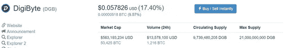
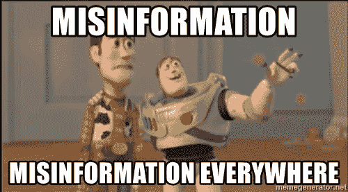
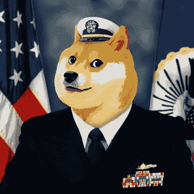
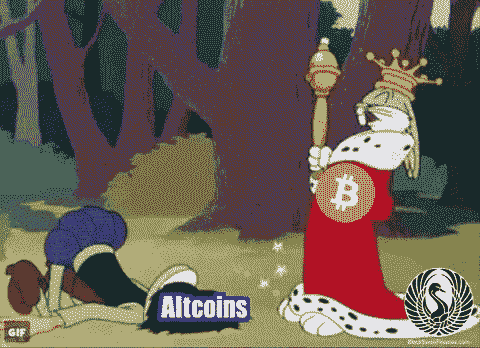

# 当我开始密码交易时，我希望我知道的事情

> 原文：<https://medium.com/hackernoon/things-i-wish-i-knew-when-i-started-crypto-trading-3ec33b59c3a5>

[密码](https://hackernoon.com/tagged/crypto)交易。当你乘火箭去月球时，它会带来一些最高的高点，当你看着你的投资组合流血时，它会带来一些最低的低点。

今天我想给你提供的，是一些我希望在我刚开始的时候就知道的事情，希望能让你对交易世界有所了解，也许，仅仅是也许，让你免于一些我从痛苦中学到的事情。

1.  **你是哪种交易者？**

What the hell am I doing?

这是一个自我反省的问题。你需要诚实地审视自己，确定你想成为什么样的交易者。很多人幻想着好莱坞的日内交易者和他们的巨额收入。老实说，日内交易压力很大，如果你没有时间照看市场，特别是如果你不知道自己在做什么，你会发现自己很快失去你的钱。

有三种不同类型的交易者:

*日内交易者*(你做日内交易或更多)，

摇摆交易者(你每 2-7 天交易一次，如果趋势需要，有时会更久)。

*投资者*(逢低买入，长期持有)。

这三种类型都是赚钱的有效途径，但需要不同的策略。你可能会发现自己是这些的混合体。

就我个人而言，我属于摇摆交易者和投资者。

**每日不做交易是可以的。有时最好的交易是不做的交易。过度交易是新手最常见的错误之一。让交易来找你，并且知道你正在进入什么。如果你不能回答*为什么*你做了那笔交易，*你就是在赌博。***

2) **市场心理极其强大。**

[技术分析](https://www.investopedia.com/terms/t/technical-analysis-of-stocks-and-trends.asp) (TA)是一个强大的工具，可以帮助你做出有根据的决策，但是马上就知道，它不是水晶球。

Aw Yeah. $DOGE is heading to the moon.

我想指出的是，FUD(恐惧、不确定、怀疑)和 FOMO(害怕错过)非常*强大，甚至可以打破最教科书的图表，引发[黑天鹅事件](https://www.investopedia.com/terms/b/blackswan.asp)。始终实行风险管理并利用[止损](https://www.investopedia.com/articles/stocks/09/use-stop-loss.asp)。*

*也明白什么是回音室。如果你把自己投入到一个硬币的官方电报频道，或者正在和一个名叫“(在此插入硬币)鲸鱼”的人说话，他们希望硬币升值就有了个人利益。当我第一次用这种方法交易时，我被烧伤了，当时我听到很多人在一个团体里为了一枚硬币说“这枚硬币将会是 1 美元！”当你看到足够多的人在喊它时，它在你的脑海中强化了它，你开始相信它。FOMO 开始踢了进来。学习如何计算一枚硬币的价格。没有那么难。这导致了:*

*3) **如何计算一枚硬币的价格。***

*因此，数字字节(DGB)，是我之前提到的硬币，我被烧伤。我被告知，它将是“1 美元到年底！”我不知道硬币的价格是如何计算的，也不知道[市值](https://www.investopedia.com/articles/basics/03/031703.asp)是如何运作的，于是在[市场周期](https://www.investopedia.com/terms/m/market_cycles.asp)的顶部盲目地投入了我的资金。我为此付出了高昂的代价。*

**

*看上面截图中的价格。计算方法是总市值(563，193，234 美元)除以流通供应量(9，739，480，205 DGB)。这就是我们上面看到的价格。你可以在这里找到所有的硬币市值。*

*这意味着，要让 DGB 达到 1 美元，你需要 9，739，480，205 美元的市值。这对你的选择现实吗？确保你完全理解你所涉及的硬币的潜力，并设定现实的期望。*

*当心推特，你最好的朋友和最坏的敌人。*

**

*I mean come on, it’s the internet.*

*Twitter 可以是一个奇妙的信息来源，也可以是一个可怕的信息来源。请记住，99.9%在 twitter 上发布图表的人已经建仓，买入，现在正试图影响市场走向他们想要的方向。给你看的那个人(在这里插入硬币)要去月球拍摄？他们已经买入，如果他们在一个团体中，也通知他们。*

**质疑一切。*那个人用什么指标得出那个结论？不知道那个特别的指标是什么？问吧。那就去查吧。研究一下。在[谷歌](https://hackernoon.com/tagged/google)中输入该主题，然后输入“投资媒体”。直到今天，我还在这么做。我不会尝试教你 TA，因为有很多人已经比我准备得更好了。参见 [CryptoCred 的](https://twitter.com/CryptoCred)免费加密课程[这里](https://docs.google.com/document/d/15c3rN15rkXldY8Te3GDG4NG7noaaoikydOoZQlElwXw/edit)开始走上正确的道路。*

*自己做研究。 (DYOR)刚刚告诉你市场要上月球的那个家伙；你知道他们是谁吗？他们交易多久了？大多数 twitter 交易者都是卡通形象。你不知道他们是谁。你能面对你的朋友说:“我买这枚硬币是因为一个穿海军制服的总督这么说的吗？”？某人拥有的追随者数量不等于可信度或经验水平。*

**

*Good looking, but not a licensed adviser.*

*提问也是可以的！如果你问的是“如何”，而不是“目标先生”，大多数 twitter 名人会很乐意为你指出正确的方向或解释他们的图表我完全忽略了目标问题，因为首先，*我不是有执照的财务顾问*，最后，当我错了的时候，我不想看到火把和干草叉。你猜怎么着。我没有 100%的成功率，而且已经失败了很多次。任何声称自己没有被 rekt 的人都是骗子，任何认为自己不会被 rekt 的人都是傻子。*

**

*“TaRgEt SiR?”*

*5) **一般提示。***

**减速*。如果你错过了，总会有另一枚火箭。*呼吸*。另一方面，你买的那个硬币现在在流血，球队合法吗，硬币有真正的用途吗？如果你拿着它，它可能会及时回来。也有例外，但总体而言，挺过风暴并不是一个坏选择(这不适用于熊市)。当我在硬币上发现很好的位置时，我也开始赚更多，买入并持有，直到他们有一天。$DOGE 就是一个例子，我在 15-17 sat 时买入，持有了大约 3 个月，然后以 100+sat 卖出。追逐水泵会把你榨干。如果你在一枚硬币上有一个好的位置，你会少担心很多。*

**

*Average day of trading in crypto.*

**拥有山寨币是* ***不是*** *拥有 BTC* 一样。你的目标是获得更多的 BTC 还是投资特定的硬币？在建立你的投资组合时要记住这一点。如果你的目标是获得更多的 BTC，小心不要太忠于一枚硬币。*

**比特币为王。时刻关注着 BTC。如果你不看的话，它会很快摧毁你所有的派对。**

**

**投资一个硬钱包*。把你的长期非交易硬币从交易所拿走。如果那个交易所[突然关闭，所有的硬币都丢失了](https://www.wired.com/2014/03/bitcoin-exchange/)，你会有什么感觉？*

***使用双因素认证**不是短信，而是基于设备的认证器(像谷歌认证器)。[短信认证在](https://nypost.com/2017/12/28/pc-security-pioneer-john-mcafee-claims-his-twitter-was-hacked/)之前就已经被黑了。这是阻止您的帐户被泄露的最佳防御措施。不同的交流使用不同的密码。是的，这可能是一种痛苦，但你宁愿失去你的硬币吗？*

**使用书签交换网站。*转到该网站并将其加入书签。用这个代替谷歌搜索。钓鱼网站已经被发现欺骗交流，并支付广告费用将他们推到谷歌搜索结果的顶端。*

*6) **千万不要单独交易。***

*当独自交易时，你没有多余的时间互相讨论问题、图表和经验。一些人对有偿团体有负面的看法，而另一些人则对他们赞不绝口。如果你要加入一个付费团体，我强烈建议你加入一个以教育为基础的团体，而不是信号团体。你*需要*学会如何正确解读这些市场，保护自己的利益。如果那个组织倒闭了，你打算怎么办？最终，你无论如何都要付出代价。你可以付钱给一个团体来学习，付钱给犯错的市场和个人经历，或者两者兼而有之。就我个人而言，刚入门的时候，我就报名参加了一个付费群学习，一刻也不后悔。如果我没有这样做，我就不会有今天。*

*即使你没有决定加入一个付费的教育团体，也可以加入许多免费团体中的一个，但还是要小心回音室和泵组。付费团队通常会减少噪音，你会找到更认真的交易者/投资者。*

**

*Find your pack.*

***结论***

*耐心是加密交易的关键，这里有很多活动的部分。不要害怕错过交易，因为这个环境充满了赚钱的机会。请记住，在这个市场上赚钱很容易，但赚钱却很难。任何公开交易都不是你的。不要让贪婪驱使你，慢慢地卖出你的头寸。再说一次，总会有另一枚火箭要去捕捉！您可以关注我:*

***推特:**[@ JoshMcGruff](https://twitter.com/JoshMcGruff)
**insta gram:**[@ JoshMcGruff](https://www.instagram.com/joshmcgruff/?hl=en)
**trading view:**[https://www.tradingview.com/u/JoshMcGruff/](https://www.tradingview.com/u/JoshMcGruff/)*

*你也可以在我们的免费加密交易 Discord 群组中找到我——[比特币共济会](https://discord.gg/5KpVGhE)。*

***编辑:**哎！我为这篇文章写了第二部分。请点击这里查看:*

*当我开始做加密交易的时候，我希望我知道更多的事情*

*喜欢这个故事吗？学点东西？请我喝杯啤酒表示感谢！CashApp — $JoshMcGruff*

**

*Buckle up! It’s a wild ride!*