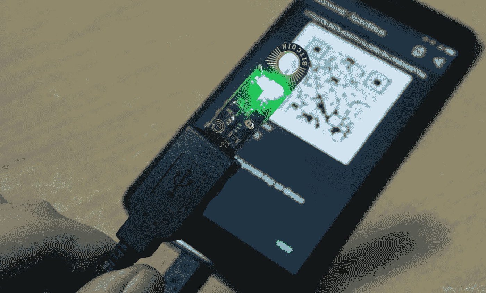

# 保护你的比特币时需要考虑的事情

> 原文：<https://medium.com/hackernoon/things-to-think-about-when-securing-your-bitcoin-924e70776c6b>

Securing your Bitcoin is one of the most important and overlooked aspects of owning it. You don’t realize you are doing it wrong until you lose all your coins. If you are not careful, It will happen when you least expect it.

我每天都听说有人丢失比特币和替代币，因为他们缺乏如何安全保护数字资产的知识和技能。这往往会导致灾难性的后果，好人失去一切。当你搞砸了，crypto 里没有客服可以打电话。你通过痛苦的刺痛来学习你的底线。

在这个过程中，我也犯过错误，损失了一些比特币。这促使我不断研究新的策略来优化我自己的安全实践。在这个过程中，我遇到了一些非常聪明的人，他们乐于与我分享他们的专业知识。

# **神秘的裹尸布**

拘留在某种程度上是秘密进行的。这是由于你将这些信息公之于众而招致的恶意攻击。这个游戏的迷人之处在于，你无法去任何自称比特币安全“专家”的公司、组织或任何人那里获取这些信息。你可以尝试，你会得到一些好的提示，但这还不够。你需要勤奋地做你的研究和**听取多方意见**。剩下的就看你的了。希望你选择明智。

我发现了解这些东西的最好方法是去找开发者和密码朋克，他们已经在这个领域开拓了很多年。这些人中的大多数并不认为自己有什么特别，也不愿意公开讨论他们的做法。幸运的是，这些年来我获得了一些信任。在与他们中的一些人谈论了这样一篇文章的必要性后，他们同意参与，但有些人坚持不透露他们的身份。

下面的五个问题仅仅触及了表面。希望这能激励你更多地考虑如何提升你的安全游戏。最后一个投稿人用英语和西班牙语回答。

Jimmy Song teaching one of his [Programming Blockchain](http://programmingblockchain.com/) courses in Austin, Texas.

# **比特币安全 Q & A #1 与 Jimmy Song，**编程区块链

**你锁定比特币和密码的首选方式是什么？**

在我控制的钱包里。

**你对纸质钱包有什么想法？**

安全性好，隐私性差。相比数字产品，人们通常更擅长保护纸质产品。

[bitaddress.org](http://bitaddress.org) is a good option for a paper wallet.

**有哪些纸质钱包值得推荐？**

[bitcoinpaperwallet](https://bitcoinpaperwallet.com/) 和 [bitaddress](http://bitaddress.org) 都不错。只要确保你离线生成钱包。

**你喜欢硬件钱包吗？**

大部分是。他们倾向于遭受你不能审计硬件的事实。也就是说，人身安全是人们更习惯的东西，所以这样会更好。你不用的安全性通常没那么好。

**硬件钱包有什么推荐吗？**

我使用 [Trezor](https://trezor.io/) ，但我不能保证硬件本身的安全性。我仍在等待一款消费级的 [HSM](https://en.wikipedia.org/wiki/Hardware_security_module) (硬件安全模块)。

对于使用硬件钱包的人，你有什么好的建议？

它们被设计得易于使用，所以除非你确切地知道你在做什么，否则就按照它们的意图去使用它们。例如，没有人能很好地完成多重信号。

一般来说，用防篡改标签把你的种子锁在某个地方。这是我最起码会做的。

**还有哪些高安全性的钱包软件选项？**

离线设备上的军械库(比如旧的笔记本电脑)非常好。虽然我有点偏见，因为我帮助制作了那个东西。

**你对在热门钱包上存储比特币有什么感受？**

只是小额的，比如少于 500 美元。疑神疑鬼没坏处。

[Trezor](https://trezor.io/) makes a few hardware wallets that are easy to use.

**有哪些你可以推荐的热门钱包？**

取决于您的使用情况。如果是为了支付一些人，即使是集中的热钱包也没问题，只要你不介意丢失它。把它当成你钱包里的钱。举例来说，你可能会失去它，所以不要随身携带你一生的积蓄。

我过去喜欢菌丝体，但是他们仍然对 segwit 反应迟钝。我没有玩过太多，因为我一般不会用比特币购买小物品。

对于那些使用热钱包的人，你有哪些最好的建议？

只保留你愿意失去的数量。

你对那些用他们的话说提供“额外安全”比特币存储的公司有什么看法？

这违背了做自己银行的精神，但监管机构要求对冲基金这样做。交易所的历史是这样的，盗窃总是摆在桌面上的事情，所以我不一定相信他们中的任何一个。

为什么一个交易所是一个可怕的地方来存储你的密码，即使有双因素认证？

少量的话没问题。对更大的数量来说是不好的。如果你把你的硬币存放在交易所，你实际上是把你的硬币借给了他们，而他们有可能无法或不愿还你钱。

你会向人们推荐哪些安全的物理场所来存放硬件钱包、纸质钱包或私人钥匙？

我不是物理安全方面的专家，但我想某种形式的保险库是不错的。

有没有一种人们应该优先使用的操作系统，可以为比特币或加密交易提供更好的安全性？

Linux 通常是我的首选操作系统，因为它是开源的。

**那么推荐的浏览器呢？**

开源的东西。

**描述一下你发送和接收比特币或密码的一些最佳实践和技巧？**

对于小额，使用热钱包。对于更大的金额，使用硬件或离线钱包。仔细检查一切，不要匆忙。

**描述一些存储比特币或密码的最佳实践技巧？**

小心点，好好计划。

**你还有其他的至理名言吗？**

希望它们在其他问题里！

*查看 Jimmy 为期两天的面对面研讨会，了解比特币开发培训。更多详情请访问*[*programmingblockchain.com*](http://programmingblockchain.com/)*。在推特上关注*[*@ Jimmy song*](https://twitter.com/jimmysong)*。*

Akin Fernandez is the co founder of [Azte.co](https://azte.co) and hates the word “crypto.” This image is one of his paintings.

# **比特币安全 Q & A #2 与阿金·费尔南德斯、**Azte.co

你最喜欢用什么方式锁定你的比特币和密码？

没有所谓的“密码”我用[开口钉](https://opendime.com/store)和[大钩](https://www.ledgerwallet.com/)锁定。因为这两者都提供离线存储，所以你可以放心，你的比特币是安全的。

**你对纸质钱包有什么想法？**

它们非常有用。随着用于生成、导入和管理它们的软件变得更好，它们将变得更加有用。

有哪些纸质钱包值得推荐？

军械库生产有用的纸钱包；这是我自己试验过的。

**你喜欢硬件钱包吗？**

是的。它们对于任何比特币用户的工具箱来说都是必不可少的，而且在未来，将会变得司空见惯。每个挣钱的人都会有一个某种形式的硬件钱包，这符合他们的个人银行业务流程层次结构，其中设备和做法是根据安全性需求、便利性以及你所说的比特币数量来排序的。如果你有数百万美元的比特币，把它们储存在你家里的一个硬件设备上可能会让你彻夜难眠。将它们放在助记符下也不令人满意；撞头记不住单词怎么办？如果你被杀了怎么办？你的孩子将如何继承你的财产？你不能告诉你的律师你的话；他可能会偷你的钱。你不能把钱留在交易所，因为那不安全。这是一个真正的商业问题，需要寻找一个强有力的解决方案，最好的解决方案不需要相信任何人或任何制造商，而且非常简单，任何人都可以做到。就目前而言，设备和方法的混合是最好的，有尽可能可靠的后备措施。不得不说，如果你过着不能相信任何人的生活，你就有比在哪里存放你的比特币更大的问题。

[Opendime makes very affordable and secure USB Bitcoin Stick that is easy to use.](https://opendime.com/)

**你对硬件钱包有什么推荐吗？**

我推荐[总账](https://www.ledgerwallet.com/)和 [OpenDime](https://opendime.com/) 。OpenDime 是一种变革性的设备，它将比特币变成一种实物无记名工具。如果你需要保持比特币的安全和离线，并通过互联网从你的钱包中消费或支付到你的手机钱包中，Ledger 是很好的选择。Ledger 很好地结合了功能和外形，非常易于使用，而且考虑到它所做的事情，价格低得离谱。

**对于使用硬件钱包的人，你有哪些最好的建议？**

阅读手册。再读一遍。再读一遍。遵循所有说明。变得非常熟悉它是如何工作的。这适用于 Ledger，而不适用于 OpenDime，因为 OD 非常简单，几乎不需要理解。使用一枚硬币比打电话容易。OpenDime 甚至是洗衣证明。理解你的设备如何工作是至关重要的；你不可能在不损失一些安全的情况下外包你的比特币安全。这并不难做到，我们在这些设备上做了大量的工作，使它们对消费者友好，它们对消费者非常友好。从账本转移比特币比在网上使用信用卡更容易。

**还有哪些高安全性的钱包软件选项？**

如果你有一台装有参考客户端的 MacBook pro，关机并放在保险箱里，那就是非常高的安全性。一般来说，如果你远离 Windows，并且将你的使用限制在已知的安全平台和设备上，你会更安全。安全是复杂的；看似正常的行为可能会危及您的安全，就其本质而言，安全既是一个过程，也是一个目的。武士钱包是一个非常好的选择，它有你需要的那种功能来妥善管理你的比特币。从其他钱包的种子导入钱包在 Samurai 上完美地工作，它是由一个优秀的专家团队开发的，我强烈怀疑它将成为全球第一钱包。

**你对在热门钱包上存储比特币有什么看法？**

总得有人跑热钱包，不然服务没法运营。你使用的设备或钱包类别应该由你的使用情况决定。如果你长期储存比特币，你需要选择适合的设备和方法。如果你正在运营一项比特币服务，你要送出大量的比特币，那么你需要一个热钱包。与其说是感情，不如说是实际考虑。

[Screen grab of Bitcoin Core’s “choose your wallet” page.](https://bitcoin.org/en/choose-your-wallet)

**你能推荐几款热门钱包吗？**

[比特币核心](https://bitcoin.org/en/wallets/desktop/windows/bitcoincore/)。 [Electrum](https://electrum.org/#home) 也很好用。

**你有什么好的建议给那些用热钱包的人？**

运行 Linux。如果失败，运行 MacOS。在任何情况下，都不要运行 Microsoft Windows。

**你对那些用他们的话说提供“额外安全”比特币存储的公司有什么看法？**

在自由社会，人们可以自由地互相提供服务。你可以自己运行自己的“额外安全”比特币存储。你也可以使用这些公司使用的软件。他们唯一的优势是储存设施，可以抵御火灾和水的破坏。也请记住，当你使用这些公司时，它们比你存储自己的比特币更不安全。一旦他们知道你是谁，你就暴露了。如果国家要求他们把你的比特币交给他们，很可能你会失去你的比特币，没有任何不打官司的手段拿回来。

每个人都有权利经营企业和为他人提供服务。只要这些企业不使用欺诈手段，它们在市场上是可以接受的。问题是你如何衡量“额外安全”意味着什么(如果它是真实存在的)，你能相信人们会做他们所说的事情吗？这在像美国这样的国家尤其重要，在这些国家，企业可能会被迫通过国家安全信函向你妥协，并被迫不透露你已经妥协。我想知道美国是否有任何保管比特币的企业收到过国家安全信函？我不认为这是任何人问过的问题，我也不知道他们中是否有人在操作金丝雀信号。当然，如果你管理自己的比特币，这些对你来说都不重要，这正是你应该这么做的原因。

为什么即使有双因素认证，交易所也是一个可怕的存储密码的地方？

[Akin published “The Pillar and the Pond” on Hackernoon.com](https://hackernoon.com/the-pillar-and-the-pond-9eea73318b92)

因为交易所是比特币保管人，而你要把自己的比特币存放在永远不能被随意查封的地方。如果你想把你的钱存在第三方服务中，为什么不把你的钱存在一个“安全”的银行里呢？所有顶尖的比特币创造者都只使用交易所来交易比特币，他们不会把比特币放在交易所里。无论交易所发生什么，无论是所有权变更、国家安全信件还是其他一些恶作剧，如果你把比特币放在自己的设备中，没有人能阻止你以任何你认为合适的方式消费它。在交易所存储比特币是一种倒退，任何经历过“他们的”账户被关闭的人都知道这是事实。不保留自己的比特币延续了银行主义的坏习惯。谢天谢地，像 https://hackernoon.com/the-pillar-and-the-pond-9eea73318b92[的](https://hackernoon.com/the-pillar-and-the-pond-9eea73318b92)的 [HodlHodl](https://hodlhodl.com/) 这样的分布式交易所将会置比特币保管业务于死地，并将安全性从支柱中推出，投入池塘

**你会向人们推荐哪些安全的物理位置来存放硬件钱包、纸质钱包或私人钥匙？**

保护敏感文件安全的最佳实践方法有好几代，这就是比特币。比特币不是货币，它是可以打印出来或存储在设备上的文本。看看档案管理员是如何存储纸张和数据长达几十年的，是一个很好的开端。用无酸墨水在无酸纸上打印是必不可少的，特别是如果你打算把你的比特币打印几十年。

[Opendime makes the Bitcoin hardware wallet called the Coldcard signs transactions and can be used offline.](http://blog.opendime.com/coldcard-annoucement/)

**有没有一种人们应该优先使用的操作系统，可以为比特币或加密交易提供更好的安全性？**

Linux 或 MacOS，没有借口。如果你真的是认真的，那么 Qubes OS 是一个相当安全的操作系统。

建议的浏览器呢？

谷歌 Chrome 就足够了，你可以用它来运行你的账本软件。

**描述一些发送和接收比特币或密码的最佳实践技巧？**

接收比特币的方式有很多种，你可以根据自己的需求量身定制方法。举个例子，假设你是一个秘书，每周用比特币领一次工资。你的老板可以每周将你的工资发送到同一个支付代码，或者你可以在下班打卡时在手机上显示一个新地址给他。一旦你拿到工资，你可以立即将一部分存入你的冷藏设备，你知道那里是安全的，剩下的留到周五晚上喝。比特币非常灵活；可以肯定的是，设计“作为日常货币的比特币”吞吐系统，并建立人们的比特币自我管理实践和软件，是一门生意。有了 Azteco，你可以买一张代金券送到任何地方，而不必用自己的钱包；这项服务承担了所有繁重的工作。这是一种非常安全的发送比特币的方式，因为你不必担心过程，或者自己运行一个钱包。像这样强大、反直觉的服务将大幅扩大比特币用户和工作流程的数量，而这些用户不会有任何技术负担。

**描述一下你储存比特币或密码的一些最佳实践和技巧？**

"加密"

**你想指出的经常愚弄人们做蠢事的危险信号是什么？**

是的。购买备用硬币是一件愚蠢的事情。不管他们叫什么。

**你还有其他的至理名言吗？**

箴言 8:11“因为智慧胜过珍珠；所有可能想要的东西都不能与之相比。”

*阿金·费尔南德斯是 Azte.co 的联合创始人。你可以通过阅读《* [*不可改变的和抵制审查》来了解他。*](https://www.coinstrategy.io/single-post/2017/11/27/Akin-Fernandez-Immutable-And-Censorship-Resistant)*" Follo Akin on medium*[**你锁定比特币和密码的首选方式是什么？**](https://medium.com/u/e6958b5742d2#3 带匿名密码朋克</strong></h1>
</h1>
</h1>
</h1><p id=) [Trezor](https://trezor.io/)

第 3 级:用于退休的长期纸质钱包冷存储，在多个位置备份，可能包括保险箱。

**你对纸质钱包有什么看法？**

这是一个非常合理和安全的方式来存储您的私人密钥，但他们最常用的长期冷藏。

**有哪些纸质钱包值得推荐？**

目前为止我见过最好的是[bitaddress.org](http://bitaddress.org)

[Trezor‘](https://trezor.io/)s new the Model-T.

**你喜欢硬件钱包吗？**

我更喜欢硬件钱包，尽管有人说它们比纸质钱包风险更大，因为硬件组件需要从多个公司/地点采购。

**硬件钱包有什么推荐吗？**

我更喜欢 Trezor。

**对于使用硬件钱包的人，你有哪些最好的建议？**

确保备份您的种子，以防您的设备丢失或损坏。

仅将它们用作第 2 层存储。

不要总是更新到最新的固件版本，直到它发布一段时间，以确保没有错误或问题。

**还有哪些高安全性的钱包软件选项？**

其中一个更高级的安全钱包是 btcarmory.com。

**你对在热门钱包上存储比特币有什么看法？**

一个热钱包应该和你的普通钱包没有太大区别，里面装着日常开销资金。

**有哪些你可以推荐的热门钱包？**

对于 Android，我喜欢[武士钱包](https://samouraiwallet.com/)。

[“Samauri Wallet — A modern bitcoin wallet hand forged to keep your transactions private, your identity masked, and your funds secure.”](https://samouraiwallet.com/)

你有什么好的建议给那些用热钱包的人？

备份你的种子以防你的手机被损坏，并且永远不要储存比你在普通钱包里更多的种子。

你对那些用他们的话说提供“额外安全”比特币存储的公司有什么看法？

它总是一个案例一个案例地进行研究，看看他们是如何存储私钥的。然而，如果你没有自己的私钥，它就不是你的比特币。

为什么即使有双因素认证，交易所也是一个可怕的存储密码的地方？

主要是因为交易所几乎每月都会遭到黑客攻击。然而，今年我期望分散的交换，其中你的私人钥匙从不离开你的财产起飞，并成为一个新的标准。其中一些交换直接与硬件钱包接口，并提供更高的安全性。

你会向人们推荐哪些安全的物理场所来存放硬件钱包、纸质钱包或私人钥匙？

所有平常的地方，保险柜和保险箱。有许多人发挥他们的想象力，变得更有创造力。

Putting your private keys and hard wallet in a bank vault is only secure until they lock you out.

**有没有一种人们应该优先使用的操作系统，可以为比特币或加密交易提供更好的安全性？**

这一切都归结为保护您的私钥。不管是什么操作系统，连接到互联网的计算机上的私钥都处于同样的危险之中。

**那么推荐的浏览器呢？**

上述条件同样适用于此。

**描述一下你发送和接收比特币或密码的一些最佳实践和技巧？**

总是仔细检查地址

适用时使用多重签名

不要支付过多的费用。如果你能多等一会儿，那就去做，这样你就能省钱。

**你想指出的任何经常愚弄人们做蠢事的危险信号？**

如果你不是交易者，不要太担心价格。只是霍德尔。

**你还有其他的至理名言吗？**

永远做你自己的研究。不要相信。验证。

Secure your Bitcoin in cold storage and keep your hard wallet or private keys in a very safe place.

# **比特币安全 Q & A #4 带匿名密码朋克**

**你锁定比特币和密码的首选方式是什么？**

出于安全考虑，不能说。

在我看来，目前市场上没有很好的完整解决方案，所以人们必须设计自己的软件解决方案。

**你对纸质钱包有什么想法？**

他们可以是好的，但很容易搞砸。网站经常被关键搞砸。如果我的 EthWallet 被黑客攻击，或者有人在他们的机器上感染了病毒，病毒会将他们重定向，这可能会杀死他们。最好下载代码并运行它。

对于普通人来说，纸质钱包笨重且难以使用。

不过，对于早期用户来说，它们是一个不错的选择。

The default warnings at [myetherwallet.com](https://www.myetherwallet.com/) speak for themselves. Be careful!

**你喜欢硬件钱包吗？**

它们相当不错，但支持的硬币有限，所以在这一点上，它永远不可能成为所有硬币的完整解决方案，这令人沮丧。他们的接口是垃圾。《账本》的 Chrome 插件使用起来令人沮丧。

**硬件钱包有什么推荐吗？**

[伊莱杰纳米](https://www.ledgerwallet.com/)。

对于使用硬件钱包的人，你有哪些最好的建议？

买两个。在银行保险箱中存放一份副本。

**还有哪些高安全性的钱包软件选项？**

你必须自己开发软件。

Avoid using SMS authentication and download Google Authenticator for a more secure experience.

**为什么一个交易所是一个可怕的存储你的密码的地方，即使有双重认证？**

我觉得不是。事实上，它比大多数人的本地存储系统要好。也就是说，它们可能会被黑客攻击，但自 Mt Gox 以来，交易所已经发生了很大的变化。

**你会向人们推荐哪些安全的地方来存放硬件钱包、纸质钱包或私人钥匙？**

一个保险箱。看银行还是有好的目的的！

有没有一种人们应该优先使用的操作系统，可以为比特币或加密交易提供更好的安全性？

Linux 或者 Mac。

**建议的浏览器呢？**

勇敢。或者 Eset 的沙盒浏览器。

**描述一下你发送和接收比特币或密码的一些最佳实践和技巧？**

先寄一点，然后确认它已经到了。确保每次至少阅读两个屏幕上的前 6 位数字和后 6 位数字三次。

**你想指出的经常愚弄人们做蠢事的危险信号是什么？**

使用短信作为双因素。没有锁定他们的电话账户。打电话给公司，在你没有亲自出示身份证的情况下，不要让他们更换服务。使用谷歌的特殊安全硬令牌和门户。验证每个设备。备份您的 Google Auth 和 Authy 帐户。对 Veracrypt 使用加密分区。

**你还有其他的至理名言吗？**

三重检查一切。加密中没有退格键。

Bitcoin security in places like Venezuela is critical where the banks are pointless.

# **委内瑞拉比特币商的比特币安全 Q&A # 5**

*我们希望帮助西班牙语国家的朋友，所以我们在这一部分添加了英语和西班牙语的答案。*

你首选的锁定比特币和密码的方式是什么？

中文:非常冷的钱包。

西班牙语:Monederos fríOS verdaderamente fríOS。

你对纸质钱包有什么想法？

e:它们很有用，因为它们满足特定类型的用户。

s:儿子:这是一种特殊的用途。

[Mycelium](https://wallet.mycelium.com/) is another wallet option.

有哪些纸质钱包值得推荐？

[菌丝体](https://wallet.mycelium.com/)和[bitaddress.org](http://bitaddress.org/)

**你喜欢硬件钱包吗？**

艾凡:我知道。我认为他们是天才产品，他们将取代银行。

学生:是的，他是未来银行的一名员工。

**硬件钱包有什么推荐吗？**

[特雷佐](https://trezor.io)和[纳米伊莱杰](https://www.ledgerwallet.com/)。

**对于使用硬件钱包的人，你有什么好的建议吗？**

尽量不要上网太久，把你的助记单词放在两个不同的非常安全的地方。

学生:在一个多小时的时间里，他们没有排队等候，而是在一个多小时的时间里打了半个小时的交道。

The [Nano Ledger S](https://www.ledgerwallet.com/) is another hard wallet option.

**还有哪些高安全性的钱包软件选项？**

e:创造你自己的钱包，但这需要做大量的调查和研究，因为在这一点上，雇人为你创造钱包是没有意义的。

学生:创建你自己的卡特拉，但也需要木叉调查和研究这一点，他认为这是一个非常重要的人物。

**你对在热门钱包上存储比特币有何看法？**

爱因斯坦:不是一个选项。你觉得把黄金放在你房子外面的街道中间怎么样？

学生:不，这是一个选择。你有什么建议吗？

**有哪些你可以推荐的热门钱包？**

爱因斯坦:没有。

斯:宁古诺。

**你有什么好的建议给那些用热钱包的人？**

e:不要用。

斯:没有，我们罗。

[Casa](https://keys.casa/) is a new startup that helps consumers securely store cryptocurrencies and is one of a handful of companies that offer this.

**你对那些用他们的话说提供“额外安全”比特币存储的公司有什么看法？**

e:交易对手的风险总是存在的，但如果你真的了解或信任公司的所有者，那就继续吧，否则就要保持警惕，永远做好最坏的打算。

学生:我很喜欢对位，但由于公司的原因，我认识到了经济上的矛盾，但我也为学生们做好了准备和准备。

**为什么即使有双因素认证，交易所也是一个可怕的存储密码的地方？**

因为首先，你不能控制你的私人钥匙，所以从技术上来说，你并不真正拥有任何东西，其次，你成为交易所的衍生目标，从而增加了两倍的风险。黑客可能会攻击你或者交易所。

s:第一个问题是，没有一个人能控制他的私人空间，因为他没有任何东西，也没有任何人能控制他的私人空间。

**你会向人们推荐哪些安全的物理场所来存放硬件钱包、纸质钱包或私人钥匙？**

e:私人保险箱和所有类型的耐气候结构。

私有财产和结构的储蓄银行抵制气候变化。

Hot Wallet’s vs. Cold Wallets taken from a presentation by David Lee

有没有一种人们应该优先使用的操作系统，可以为比特币或加密交易提供更好的安全性？

e:我觉得最简单的最安全。

学生:是的，我知道这是安全的。

**描述一下你发送和接收比特币或密码的一些最佳实践和技巧？**

e:快速 Trezor 交易。

s:在特雷泽盖的十字路口。

**描述一下你储存比特币或密码的一些最佳实践和技巧？**

e:使用限制上网的指定电脑。

学生:我们有一个专门为互联网用户设计的电脑。

**你想指出的经常愚弄人们做蠢事的危险信号是什么？**

用你一生的积蓄买密码，然后把它们扔进交易所。至少买个硬件钱包吧。

s:在交换过程中，没有包括人质和守卫在内的协议。因为我们有一个五金店。

**你还有其他的至理名言吗？**

e:不要大声说你有加密货币，也不要告诉别人你把它们存放在哪里。你不会告诉别人你的黄金藏在哪里。

学生:没有警报声，因为我没有警卫员。你不知道你要去哪里吗？

I have heard people mention they buried their private keys in a GPS marked location. Who is anyone to judge. Do whatever it takes to make you sleep at night!

# **结论**

正如你所看到的，在保护你的硬币时，有很多事情需要考虑。这篇文章绝不是比特币安全实践的福音。老实说，它只是触及了表面。不是所有的贡献者都同意所有的事情。我也确信许多阅读这篇文章的人也不会同意。您的主要收获应该是专注于与您产生共鸣的新想法和技巧，并继续做自己的尽职调查，以便您可以优化您的安全协议。不要忘记购买比特币是最简单的部分。长期保护它是真正的挑战，不能想当然。

*在 twitter 上找我*[*@ piratebachbum*](https://twitter.com/piratebeachbum)*或*[*hacker noon/@ piratebachbum*](https://hackernoon.com/@piratebeachbum)[*www . coin strategy . io*](https://www.coinstrategy.io/)

[ftwtour.com](http://www.ftwtour.com)