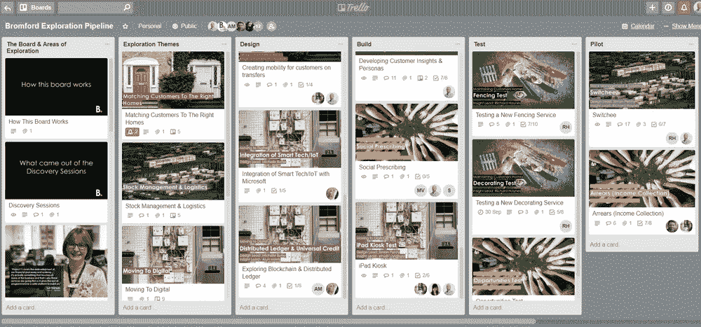

# 我们需要记住的事情

> 原文：<https://medium.com/hackernoon/things-we-need-to-remember-e92dce262eab>

## 原型原型原型！

> “如果你只做两件事，让他们做研究和原型制作。如果只做一件事，做研究；离开座位，走到街上，与你的顾客交谈，更重要的是观察你的顾客"

[亚当·圣约翰·劳伦斯](https://twitter.com/adamstjohn)，全球服务 Jam 的联合创始人

在过去的几个月里，我们一直忙于促成[探索会议](http://www.bromfordlab.com/lab-diary/2018/3/14/designing-for-tomorrow-a-discovery-session-round-up)和服务设计研讨会，以支持 Bromford 目前正在进行的组织转型项目 programmeOne。就其本身而言，这是实验室的一次发现之旅。除了参与设计、促进、综合和交流研讨会成果的工作，我们还一直在研究如何最大限度地融入项目，以及我们在哪些方面可以提供最大的价值。我们刚刚重启了我们的 [trello board](https://trello.com/b/DUUozEVO/bromford-exploration-pipeline) 以反映我们发现会议的工作包，我们目前正忙于召集利益相关方，填写变更请求和起草测试计划。

周三，我们进行了一次偶然的谈话，让我们可以离开仓鼠轮一个小时，回顾一下我们是如何工作的。在那之后的一个小时里，我比过去几周更有创造力，也更清醒，所以我们需要记住的第一件事是:

# 反思的时间不是奢侈品，而是必需品。。。这是正当的工作。

为了推进我们的后发现会议，我们在过去的几周里非常忙碌，定义工作包，起草详细的测试计划，并向我们的设计委员会提交变更请求。这本身就是好的；虽然变更请求和测试计划看起来像是增加了不必要的官僚主义，但实际上并不是这样。它们提供了一种结构，确保我们测试的所有东西都考虑到了它在组织战略中的位置和方式，并确保在测试之后我们能够展示影响。然而，视频追赶变成我们偶然的谈话的原因是我们正在努力推动我们所有的工作包通过这个框架。出了什么事？我们已经失去了我们的创造力吗？为什么我们看不到需要测试的内容？答案似乎是没有什么可测试的。。。还没有。

平！灯泡，第二点要记住:

# 原型原型原型！

我们一直主张[多测试，少试验](http://www.bromfordlab.com/labblogcontent/2015/7/22/tests-vs-pilots)，但在此之前，我们已经有了原型。。。。或者我们有。高保真原型可以像测试一样工作，但低保真度原型可以是纸上模型，甚至是研讨会上的涂鸦。原型可以是任何东西，从草图或故事板到一个早上[坐在公园的长椅上](http://www.bromfordlab.com/lab-diary/2016/6/1/social-experiment-challenging-the-taboo-of-loneliness)或者一个下午试图向人们出售一项看起来真实但实际上并不存在的服务，以此来看看你是否有一个浮动的想法。原型帮助我们理解问题，并给我们有价值的洞察力，我们可以用它来设计测试(如果我们需要的话)。因此，与其试图直接跳到一个变更请求和测试计划，对于一些工作包，我们只需要走得更低，我们需要走到街上与人们交谈，开始在纸板 iPads 上画屏幕或者只是开始制作一些东西——如果我们被困在一个问题上，我们只需要拿出笔、乐高和 PlayDoh。我们真的需要进行一次正式的测试，看看我们是否可以飞行我们的新无人机并快速制作格式化的视频，或者保罗上周末刚刚用他自己的无人机(完全相同)制作了它的原型[？](https://www.instagram.com/p/Bjam7TZneN1/?taken-by=paulitaylor)

这就引出了我们要记住的最后一点:

# 向人们展示某样东西是如何工作的比试图向他们解释要好得多。

全球服务堵塞的口头禅是“展示不告诉”和“不谈论做”，本质上是使用原型来学习和交流你的学习。如果你想更多地了解人们如何与无人驾驶汽车互动(顺便说一下，这不在我们自己的[探索管道](https://trello.com/b/DUUozEVO/bromford-exploration-pipeline)中),你不需要开发自动驾驶汽车的早期版本，并申请各种证书和许可证，你只需要[打扮成汽车座椅](https://www.youtube.com/watch?v=MPPpaKJ0u1o)并将 GoPro 贴在你的挡风玻璃上。我们从“做”中获得的灵感和学习比“谈论做”更有用，并且可以说能够在以后获得利益相关者更多的认同。

[注释](http://www.bromfordlab.com/lab-diary/2018/6/1/things-we-need-to-remember#comments-outer-wrapper)

*最初发表于*[*【www.bromfordlab.com】*](http://www.bromfordlab.com/lab-diary/2018/6/1/things-we-need-to-remember)*。*