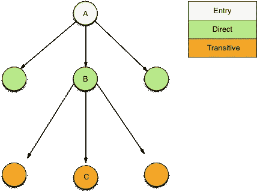
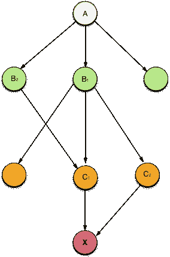

# 每个开发人员在开始前端开发时应该知道的事情

> 原文：<https://medium.com/hackernoon/things-which-every-developer-should-know-when-starting-with-modern-front-end-development-7030486bf092>


[Ben White](https://unsplash.com/@benwhitephotography?utm_source=medium&utm_medium=referral) on [Unsplash](https://unsplash.com?utm_source=medium&utm_medium=referral)

*免责声明:本文高度概括了软件包管理和相关的许可问题是如何工作的。这是为了让新的*[*JavaScript*](https://hackernoon.com/tagged/javascript)*开发者意识到他们的项目/客户/组织可能出现的问题，而不是为了打击这种精神。*

这些年来，Javascript 的前景已经发生了巨大的变化。现在，它为开发人员提供了许多工具来轻松管理应用程序客户端的复杂性。如果你是一个曾经在 jQuery 还不是 DOM 操作标准的时候用 Javascript 编写过一些重要代码的开发人员，你就会知道我们已经取得了很大的进步。我仍然记得我和 AngularJS 的第一次⭐️时刻，它让双向数据绑定变得如此简单。然而，尽管我们可以继续谈论每一个新的前端库/框架如何使我们的生活变得简单，但这篇文章很快就会失去重点。

Javascript community pushing the boundaries 💥

**我们为什么需要这些框架/库呢？**

Javascript 是 ECMAScript 规范的一个实现。谁在支持这些新的和即将到来的规范的实施？我们自己最喜欢的浏览器！每个浏览器都采用一个 javascript 引擎，负责执行我们编写的 javascript 代码。由于我们/我们的用户在选择浏览器时被宠坏了，这给我们留下了 ECMAScript 规范的实现差异。如果拥有各自 javascript 引擎的浏览器与他们的方法保持一致，并跟上了[](https://github.com/tc39)***的最新发展，那么老实说，对于大多数事情，我们都不需要这些框架和库。但是让我们现实一点！***

***This is so not true***

*****JavaScript 包的包管理器*****

***npm & **yarn** 是流行的 javascript 库包管理器。他们让前端应用的安装和运输变得非常简单，例如，如果您需要安装像 **vue** 这样的库，您需要做的就是***

```
*<package-manager> add/install vue*
```

***就是这样！它下载了运行所需的一切，你可以开始了。基于应用程序需要运行的环境(开发/生产/测试),您可以配置应用程序在特定环境中运行所需的包。***

*****我们安装包的时候内部会发生什么？*****

***每个与 npm 或任何其他包管理人员一起工作的工程师都应该知道上述问题的答案。详细的答案可以在[这里](https://lexi-lambda.github.io/blog/2016/08/24/understanding-the-npm-dependency-model/)找到，否则如果你觉得懒，只想知道基础知识，那么继续读下去。每一个新的包都会带来其他的包，这些包是它顺利运行所必需的，这些其他的包会为它们安装更多的包，在你意识到之前，你的项目已经有了一组你不知道的包。比方说，如果你为你的应用程序`A`安装了一个包`B`，那么你就直接依赖于这个包，如果它需要一个包`C`，那么你就依赖于包`C`，以此类推。***

*****我们为什么要为传递依赖而烦恼呢？*****

***在任何应用程序中，依赖关系图都很复杂，视觉上也不吸引人😛与下图相比。根据您的项目所使用的包，图表可以有更多的级别和更多的节点。基本上，更长和更宽。***

******

***A very simple dependency graph***

***让我们想象一个稍微实际一点的场景，您的项目的图表如下所示。正如你所看到的，有多条路径通向包`X`考虑将 B*1*B*2*作为两个不同的包，对于 C *1* 和 C *2* 也是一样，因为数字 1 & 2 不会与包 B & C 的版本混淆***

***A-> B*2->*C*1->*X&A->B*1->*C*2->*X***

******

***non-trivial dependency graph***

***`X`因为它被标为红色，表示在某些方面会给你的项目带来问题。让我们来看看两种常见的情况，在这两种情况下，由于软件包`X`可能会出现问题***

*****安全*****

***我们真的不知道可传递的包实际上在做什么(我假设你已经知道直接依赖在做什么——你应该知道！👨‍🏫)可能会发生这样的情况，你最终安装了一个软件包，它会跟踪表单上的敏感用户数据，如用户名、密码或任何其他个人信息。如果你在服务器上运行 javascript，那么 [**原型污染**](https://hackerone.com/reports/310443) 和 [**重做**](https://snyk.io/blog/redos-and-catastrophic-backtracking/) 是你应该远离的东西。我不是[安全](https://hackernoon.com/tagged/security)专家，但是如果你从一个[黑客](https://en.wikipedia.org/wiki/Security_hacker)的角度来考虑，恶意软件包可以通过很多其他方式[导致安全问题。](https://blog.npmjs.org/post/173526807575/reported-malicious-module-getcookies)***

*****法律*****

***vue、jquery 等包。有 **MIT** 执照，可以转述为说，***

> ***它让人们可以对你的代码做任何他们想做的事情，只要他们把归属权还给你，并且不追究你的责任***

***pdf.js 使用 **Apache License 2.0** 引用***

> ***类似于 MIT 许可证，但是也提供了贡献者对用户的专利权的明确授权***

***以上两个许可证看起来都很好，无论你把它们用于何种用途，甚至是商业用途，都不会造成威胁。无论第三方软件包的许可有多严格，在向公众分发之前都不是问题(除非软件包许可条款明确声明私下使用也是非法的)，并且将软件包分发给同一组织的员工也是可以的。***

***License check fail ❌***

***现在你可能会想，既然你的软件/服务是通过你的基于 SaaS(软件即服务)的产品的网络分发的，并且不存在于用户的机器上，那么使用任何第三方包都是可以的——但是像 **GNU AGPLv3** 这样的许可证也将网络使用视为软件的分发。***

***如何预防上述安全和法律问题？***

***现在我们知道了问题是什么，我想到的一个合理的解决方案是想出一种方法，我们可以从`package.json`文件(用于 npm)开始查看我的项目(直接/间接)使用的每个包。这就是所谓的`deep scan`依赖。您的深度扫描应该能够查看每个包，并从安全和法律角度决定是否可以安全使用。整个过程分为三个部分:***

1.  ***为了能够有效和正确地扫描项目中的所有依赖项。***
2.  ***能够从安全和法律的角度决定使用一个软件包是否安全。***
3.  ***重复做 1 和 2***

***有一些开源和专有的 API(**RetireJS**、 **NSP** 、 **Snyk、fossa)** 可以帮助处理部分或全部流程，你只需要找出最适合你的情况。可能会有这样的情况，您的检查发现了漏洞，但有时*可以*避免它们，例如，如果您没有在服务器上运行 javascript，那么**重做**漏洞可以被视为不危险。***

***总而言之，npm 和包管理器的概念是很棒的，但是要时刻注意你的依赖项会给你带来什么。干杯！***

***Happy Coding 😺***

***一些可能更有用的来源***

*   ***[理解依赖模型](https://lexi-lambda.github.io/blog/2016/08/24/understanding-the-npm-dependency-model/)***
*   ***[为您的项目选择许可证](https://choosealicense.com/)***
*   ***[风险标记的漏洞](https://snyk.io/vuln/?type=npm)***
*   ***Vova Bilonenko 关于[为什么我们应该关心许可证](/@vovabilonenko/licenses-of-npm-dependencies-bacaa00c8c65)的精彩文章***