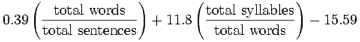

# 向投资者推销时，像 8 年级学生一样思考

> 原文：<https://medium.com/hackernoon/think-like-an-8th-grader-when-pitching-investors-32eb080c8a19>

*Kevin O’Connor, Founder Graphiq (Photo Credit:* *Santa Barbara Independent)*

这篇文章的一个版本曾出现在《福布斯》杂志上。

连续创业者都同意，最好用清晰简单的语言和投资人沟通。为了说明这一点，DoubleClick(被[谷歌](https://hackernoon.com/tagged/google)收购)和 Graphiq(被亚马逊收购)的前创始人兼首席执行官凯文·奥康纳(Kevin O'Connor)经常以提出以下问题开始他的创业谈话:

从该列表中选择真正的软件产品。

A.同化的、零管理的标准数据库队列模式

B.开放式架构、劳动力中立、生产力同化

C.模块化简化的图形用户界面启发式

D.以利润为中心的容错编码接口

**巴兹关**

*“明语的大敌是不真诚。当一个人的真实目标和他宣称的目标之间存在差距时，他会本能地求助于长词和令人厌倦的习语，就像墨鱼喷出墨水一样。”乔治·奥威尔，英国作家*

正确答案是…以上都不是。所有这些“产品”都是通过点击几下[流行语生成器](http://www.1728.org/buzzword.htm)创造出来的。

正如凯文所指出的，“你的潜在客户是大忙人，他们不关心你产品的内部结构。他们关心的是找到问题的解决方案。”同样，大多数投资者都太忙了，以至于没时间去解读晦涩的行话。如果八年级学生不能理解你的推介材料，典型的[投资者](https://hackernoon.com/tagged/investor)可能也不会阅读。

有效的企业沟通不仅仅适用于投资者。你还必须设身处地为其他穿制服的冷漠的利益相关者着想，包括:客户、合作伙伴和供应商。通过简明扼要地解释你将如何解决这些不同的问题，而不是用你的技术的内部运作来烦他们。人们关心的是减轻疼痛，而不是止痛药的来源、设计和成分。

**斯蒂芬·金启动提示**

在描述有效写作时，畅销书作家斯蒂芬·金指出，“你必须在词典中寻找的任何单词都是错误的单词。”在商业中，如果你的听众关注的是你的话，而不是你的信息，你就用错了话。

担心简短、简单的话听起来居高临下？不要这样。

根据[、](http://www.impact-information.com/impactinfo/literacy.htm)、*的全国成人识字调查，“普通成人的阅读水平是九年级。这解释了为什么流行的畅销小说是在 7 年级水平上写的。人们喜欢阅读比他们实际阅读能力低两级的娱乐性读物。”毫不奇怪，[报纸的阅读水平从九年级到十二年级](http://www.impact-information.com/impactinfo/newsletter/plwork15.htm)，普通的高中二年级学生都能看懂《纽约时报》。*

毫无疑问，他们的平均利益相关者可以理解超过七年级水平的语言，但由于我们大多数的日常交流都是在初中阅读范围内，明显更复杂的文本很快就成为负担。

还不服气？在他的《小说作家的头脑风暴》一书中，詹姆斯·v·史密斯将弗莱施-金凯可读性测试应用于十位畅销书作家的写作。史密斯确定他们集体散文的平均成绩水平是 4.4(即四年级的第四个月)，每个单词的平均字数是 4.15。

如果你不确定你的公司通信与这些大众市场基准相比如何，那么就用下面的 Flesch-Kincaid 可读性公式来测试你的文本。

可读性测试

等级水平测试

让你的大学英语写作教授见鬼去吧，阅读水平高的文学作品可能会疏远潜在的投资者和客户。

顺便说一句，我通过弗莱施-金凯测试评估了这篇文章中的几个随机段落，它达到了 12 级阅读水平！如果我想与《纽约时报》平起平坐，我显然还有一些工作要做。

*在这里关注 John 的创业型 Twitter feed:*[***@ johngreathouse***](https://twitter.com/#!/johngreathouse)*。*