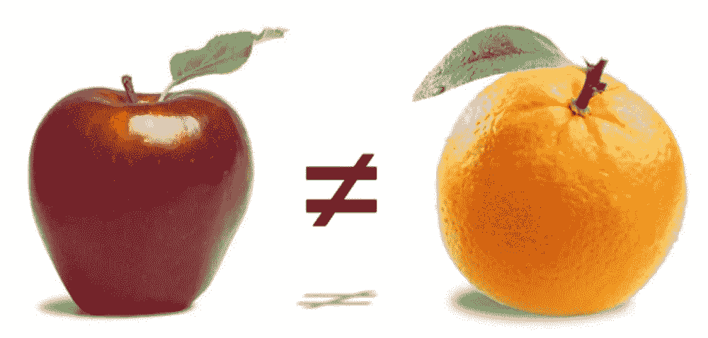

# 像美国证券交易委员会那样思考

> 原文：<https://medium.com/hackernoon/think-like-the-sec-before-you-ico-412a24357d76>

Are tokens securities? The Howey Case on orange groves is the test used by the SEC today.

去年，ICOs 在 800 多个项目中筹集了 50 亿美元，预计今年会有更多。热情高涨，但问题仍然多于答案。一个紧迫的问题是证券交易委员会将如何监管 ico。目前还没有明确的指令，但在推出 ICO 之前需要考虑的事项方面，有了越来越多的法律标准。

**SEC 在 ICOS 中的角色** —美国证券交易委员会(SEC)从高层开始监管美国的证券。他们围绕 ico 的主要问题是令牌是否是一种证券。如果它是一种证券，那么公司及其买家和卖家必须遵守现有的证券法来发行它。

区块链社区中的许多声音认为代币是一种新型的金融机制，根本不应该被视为证券。他们认为代币是工具，我们称之为工具代币。然而，美国证券交易委员会说，如果它看起来像证券，行为像证券，那么它需要像证券一样受到监管，让我们把这些称为安全令牌。那么，SEC 如何定义证券和公用事业？使用豪威测试。

> **豪伊案**——1946 年，最高法院审理了一个案件([证券交易委员会诉豪伊案](http://caselaw.lp.findlaw.com/cgi-bin/getcase.pl?navby=case&court=us&vol=328&invol=293))，该案件涉及回租协议在法律上是否是一种投资合同(该法案中被列为“证券”的投资类型之一)。SEC 就这些交易起诉了被告，声称他们没有提交证券登记声明，违反了法律。

如果你打算 ICO，你应该了解一下[豪威测试](http://consumer.findlaw.com/securities-law/what-is-the-howey-test.html)。最初的案例集中在橘子园，但在过去的 70 年里，它仍然是定义什么是或不是证券的标准。

**ico 案例研究—**SEC 尚未明确说明什么是安全令牌，什么是实用令牌。证交会的角色不是积极推动监管，而是对欺诈行为做出反应。他们更关注的不是输赢，而是输赢。这意味着他们可能还需要一段时间才能有更具体的定义指南。我们对他们的思想最好的参考是关于 ico 的两个出版的报告，DAO 和 Munchee。

*   DAO: [SEC 发布调查报告，认定数字资产 DAO Tokens 是证券](https://www.sec.gov/news/press-release/2017-131)。([全案报告](https://www.sec.gov/litigation/investreport/34-81207.pdf))
*   munchee:[SEC 停止和终止的摘要](https://www.natlawreview.com/article/when-does-software-become-securities) ( [完整报告](https://www.sec.gov/litigation/admin/2017/33-10445.pdf))

这两份报告是 SEC 认为不应该做的唯一公开案例研究。如果你打算 ICO，这些都值得一读。你的法律顾问可能会参考这两个案例作为如何继续的背景。美国证券交易委员会还发布了[更多关于他们可能会做什么的公开声明，但还没有最终确定。](https://www.sec.gov/investor/alerts)

如果你想更进一步，你还可以阅读[新加坡金融管理局(MAS)关于 ico 和证券的公开立场](http://www.mas.gov.sg/News-and-Publications/Media-Releases/2017/MAS-clarifies-regulatory-position-on-the-offer-of-digital-tokens-in-Singapore.aspx)。瑞士还没有公布他们将如何进行的信息。

**继续进行 ICO** —那么，在 SEC 不清楚的情况下，如何继续规划 ICO 呢？据我们采访过的 ICO 律师称，根据我们所知，以下是你可以采取的关键步骤:

*   **熟悉豪威测试**。它经过了几十年的时间考验，虽然简单，但它是确定代币是否安全的黄金标准。
*   **即使是公用令牌也应遵守安全监管标准**。如果在 Howey 测试之后，您有文档证明它是一个实用令牌，而不是一个安全令牌，那么遵守安全规则仍然是值得的。积极主动地做一个好演员会让你在法律改变时做好更好的准备。
*   **如果你因为你的 ICO 而受到压力，就等着传票吧**。[秒为无功](https://hackernoon.com/the-sec-called-about-our-ico-i-answered-8cbbd31568ec)。如果你的 ICO 被媒体报道，你很可能会收到传票，这样他们就能了解更多。提前准备好文档会有所帮助。
*   **将代币销售的目标锁定在会使用代币的人身上**。Munchee 一案的目标是全球投资者，以获得一种只能在美国使用的代币。这是一个危险信号，表明它不是一个实用令牌。
*   小心选择你的宣传语言。如果你声称你的代币会升值，这听起来更像是一种证券。一种证券会随着时间的推移而升值。实用程序令牌不会。
*   全球监管机构仍未做出决定，因此避开美国并不能解决问题。美国存在更多障碍，但如果其它地方的监管不更加清晰，情况可能会发生变化。简单地在 ICO 中避开美国投资者可能会避免这种情况，但公开交易的全球代币可能会在以后由美国投资者发行，但仍将面临监管。
*   **SEC 法规只是关注 ico 的众多监管机构之一**。其他组织负责监管持有、交易、共享信息和应税事件。雇佣优秀的律师和会计师在 ICO 发布前、令牌发布前和发布后帮助导航。

尽早采取额外的步骤来计划你的 ICO 会有回报的。这是一个新的行业，所以历史不会重演，但它确实押韵。看看早期的衍生品市场。在多德-弗兰克(Dodd-Frank)等更强有力的监管出现之前的几年里，人们热情高涨。几年后，在破产之后，它被一次又一次地监管。

对于 ico 来说，很可能也会发生同样的事情。如果欺诈行为很少，那么就没有理由急于立法。SEC 的工作永远不会结束，但它是为了保护人们，而不是阻止创新。要了解最新消息，你可以在 Twitter [@SEC_News](https://twitter.com/sec_news) 上关注他们。

作为一个社区，如果 ico 积极主动地成为好的参与者，我们都会受益。从 DAO 和 Munchee 的案例研究中学习远离坏演员名单。只需要一个大坏蛋来改变所有人的创新速度。

**进一步讨论—** 如果你想了解更多关于 ico 的法律框架，请参加我们下一期 [Lattice Ventures : BlockTalk，2 月 12 日](https://www.eventbrite.com/e/lattice-vc-blocktalk-legal-frameworks-for-icos-tickets-42677564745)。SEC 法规是 ICO 之前需要考虑的一个方面，但不是唯一的一个方面。我将在以后的文章中介绍 ICO 结构的更多方面。

如果您想了解更多关于 ICO 法规、法律、合规、会计和投资结构的信息，请点击此处订阅电子邮件更新。我们正在大声学习，请在评论中留下您的想法、问题或反馈。

*免责声明:我不是律师或财务顾问，请咨询适当的法律顾问，不要将此视为法律或财务建议。我是一名早期投资者，将尽最大努力披露任何潜在的冲突。*