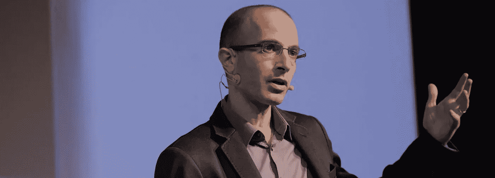

# 为 21 世纪而思考

> 原文：<https://medium.com/hackernoon/thinking-for-the-21st-century-4d630380cc30>

## 革命正在发生。随着技术的快速进步，一种新的思维方式正在形成。我们应该更新我们的知识和世界观以应对当前的挑战。

我最近遇到了一些杰出的思想家，我很乐意与你分享，并把一些全球话题纳入个人视角。

Picture of professor Harari, kindly stolen from his website [https://www.ynharari.com/about/](https://www.ynharari.com/about/). Thanks)

如果只有一本[书](https://hackernoon.com/tagged/book)你想读，那就选**智人:人类历史**，作者[尤瓦尔·诺亚·哈拉里](https://medium.com/u/8a6d8f1fc05c?source=post_page-----4d630380cc30--------------------------------)。他是 21 世纪思维的一个现象。我敢肯定，你会喜欢继续阅读他的下一本书**德乌斯人**和 **21 世纪的 21 课**。观看他在达沃斯论坛上激动人心的演讲，一窥尤瓦尔的辉煌:

“Who controls the past (data) controls the future. Who controls the present controls the past.” — **1984 George Orwell** ((youtube comment below video))

正如尤瓦尔在他的书中描述的那样，不仅仅是我们是可编程的有机体——算法，而且我们在说话的时候正在被编程。由于巨大的数据收集，一种新的能源正在从虚拟云中出现。很快，算法会比我们自己更了解我们。因此，源自我们内心的人文权威将会消失。目前，资本主义是基于这样一个前提，即客户知道最好的，他/她基于内心的欲望购买产品。如果一个产品没有被购买，它就不是一个好产品，顾客的自由意志是真理的最终来源。民主也是如此。选民知道，也只有选民知道，在选举中选谁，除了我，没有人有权力这么说。我的选票是政治权威的来源。人本主义权威的最终来源是内在自我。

这一原则受到数据寡头威胁。一个算法，可以完美地记住我的一切，有一天可能会完美地知道我的情绪状态，可以做出比我更好的决定。AI 第一个规模化的应用是电子商务。我们都喜欢亚马逊书店提供给我们的算法。他们给我提供了好东西。如果算法在我的情绪、性取向、欲望、目标、政治观点等意想不到的领域更了解我，会怎么样？如果算法总是为我选择比我自己更好的结果会怎样？如果其他人控制了这些知识，他们能黑我，操纵我做一些不想要的行为吗？

我们已经看到它被滥用。《剑桥分析》是宣传机器的现代战争，在许多州大规模操纵选举。如果约瑟夫·戈培尔活在今天，他会喜欢这狗屎！

如果你想深入探讨人工智能，我推荐这篇文章:

 [## 当技术比你自己更了解你的时候

### 当你 2 岁的时候，你妈妈对你的了解比你自己还多。随着年龄的增长，你开始…

www.wired.com](https://www.wired.com/story/artificial-intelligence-yuval-noah-harari-tristan-harris/) 

没有比脸书最早的成员之一 Chamath Palihapitiya 更好的人来解释短期多巴胺反馈回路了。作为一名 [Hackernoon](https://medium.com/u/4a8a924edf41?source=post_page-----4d630380cc30--------------------------------) 的读者，这篇演讲对你来说是必须的:

看了这个演讲后，我已经在一月份删除了我的脸书账户。至今无怨无悔。也许你会考虑社交网络的另一种方式，比如最小化使用。但首先，这对你的多巴胺分泌和心理健康不利。其次，通过单独参与，你支持了副作用的集体问题。

最重要的是，看完这段视频后，你可能会考虑不再看色情片了(注:

现代加速了所有思维领域的发展。不管你的职业是什么，我敢打赌你正被来自各个方面的关于你感兴趣的话题的大量内容所淹没。

在这个巨大的信息流海洋中，很难不关注真正重要的事情，提出深刻的问题，保持健康和快乐。

这里的结论是什么？

我没有很好的答案。但是我创造了一些对我有用的原则，每个人都应该用自己的方式找到她。

1.  **认识你自己**

保护自己免受各种消费主义诱惑的最好方法是删除社交网络，或者不经常使用。我也不再买我不需要的垃圾。我不需要最新、最花哨的衣服、电子产品和小玩意。我也吃得很节制，不吃肉，尽量避免快餐。我不发布我的个人生活，我试着去生活。我练习瑜伽来保持头脑冷静，我进行长跑来冥想更多。所有这一切的结果是一个安静的头脑，能够批判性地思考，并有大量的时间阅读和学习新技能。

**2。知道你为谁工作**

你的工作不仅仅是生存的资金来源。你的能量转化为公司活动的成果。如果你意识到，你参与了支持背离的活动，比如强迫性消费主义，或者其他负面的副作用，决定退出。重新安排事情可能需要一段时间。但是一旦你意识到了这一点，就专注于你需要学习的新技能并坚持下去，直到这种技能能给你带来一份新的、积极向上的工作。

**3。了解世界上正在发生的事情**

请继续阅读并关注上面的这些人。不要为让你变成植物人的网飞买单，而是支持 TED 演讲，看，读，听…

我希望这能激励你们中的一些人。

一月