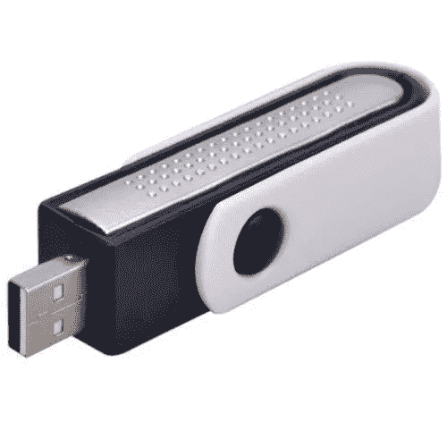
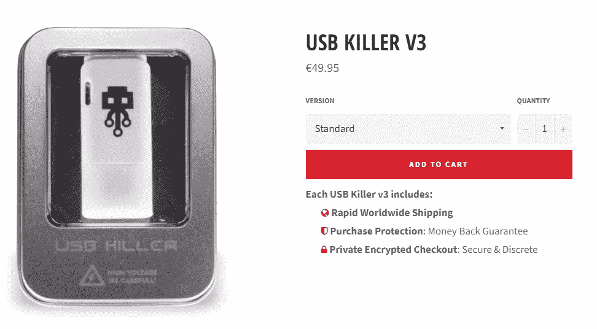
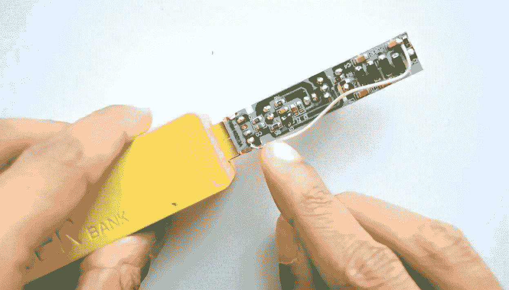

# 这个 3 美元的 DIY USB 设备会杀死你的电脑

> 原文：<https://medium.com/hackernoon/this-3-diy-usb-device-will-kill-your-computer-33c4bdb1da40>

这个看似无害的 [USB 空气净化器设备](https://bit.ly/2tzgjJI)如果被人恶意改装，可能会对你的电脑造成不可挽回的损害。了解 [USB](https://hackernoon.com/tagged/usb) 黑仔的威胁，它的历史，以及如何在网上购买现成可用的或用低成本组件即兴制作。

几年前，俄罗斯黑客 DarkPurple 展示了“USB 杀手 2.0”相当于 RJ45 连接器接入电源的 USB。一旦连接，USB [设备](https://hackernoon.com/tagged/device)通过 USB 端口发送高压负 DC，直到它烧坏主机设备的电路。USB 黑仔是一种简单的设备，只有一个 FET、几个高压电容、一个 DC/DC 转换器和一个 USB 连接器。将这个设备插入你的电脑，220 伏的电压直接流入 USB 信号线。这将杀死你的笔记本电脑。

这些年来，随着香港一家公司发起众筹活动，推出类似的设备，我们看到了 USB 黑仔的发展。这款名为“ [USB Kill 3.0](https://usbkill.com/products/usb-killer-v3#/2-edition-anonymous_editio) ”的测试工具在市场上的售价为 49.95 欧元(约合 60 美元)，面向希望保护自己系统的管理员。

Commercial USB Killer V3

尽管该工具有明显的潜在危险，但它的公开发布似乎是出于好意。或者至少制造商是这么说的。USB 黑仔由香港的一个安全硬件团队开发，该团队在一年多前首次公布了其目标漏洞，并开发了早期原型。

但该团队深感沮丧地看到，消费电子产品开发商几乎没有采取行动来消除漏洞。根据该团队的说法，[苹果](http://fortune.com/fortune500/apple/)是迄今为止唯一一家保护其设备免受这种所谓的 USB 浪涌攻击的制造商。

“尽管有足够的警告和时间做出反应，”USB 黑仔团队[写道](https://www.usbkill.com/blog/usb-kill-behind-the-scenes-b40.html)，“大多数消费级硬件制造商选择不保护他们客户的设备。我们对这种**不尊重客户**的行为感到沮丧。”他们的重点，不是我们的。我不知道这到底意味着什么。

根据 USB 黑仔 3.0 制造商测试，超过 95%的设备受到 USB 电源浪涌攻击的影响。几乎所有的消费级硬件在测试 USB Kill 时都会以某种方式失败。最常见的结果是设备(笔记本电脑、智能电视、汽车音响等)完全毁坏或永久损坏。

最近，Kedar Nimbalkar 发现，改装一台价值 3 美元的 USB 空气净化器非常容易，它本身就具有家用 u 盘的无害特性，相当于一个 USB 杀手，只需花费 3 美元和一个小小的改装。

Air purifier turned into a USB Killer

离子净化器使用高压静电带电表面或针来产生带电空气或气体离子。这些离子附着在空气中的微粒上，然后被静电吸引到带电的收集板上。这种机制会产生微量的臭氧和其他氧化剂作为副产品。永久安装的家用和工业离子净化器被称为静电除尘器。

Nimbalkar 发现，如果你断开充电针，并将电容器的输出连接到两条数据线中的任何一条(这种设备通常不使用),你就创建了一个相当于 USB 黑仔的设备，但看起来仍然无害。

虽然不是原来的 USB 黑仔，但它仍然是一个非常危险的设备，它至少会烧坏 USB 端口并杀死 USB 控制器。现代设备(如笔记本电脑)组件的高度集成和小型化使它们比老式台式计算机更容易受到攻击，在老式台式计算机中，USB 控制器与 CPU 在物理上是分开的。on modern system on chip(**SoC**)是一种集成电路，它集成了计算机或其他电子系统从 CPU 到 USB 控制器的所有组件。

虽然制作这些设备似乎是一个有趣的想法，但重要的是只在我们合法拥有的一些旧计算机上进行测试，因为带一个专门制造的破坏性设备证明了有预谋的意图，这在世界上大多数司法管辖区将你的恶作剧升级为刑事损害。

如果你在地上发现一个漂亮的小 u 盘，你会插上它看看里面有什么吗？也许是好奇或者有些用户把驱动和寻找主人的利他意图联系起来。没有吗？好吧，你认为你的父母、邻居和同事会怎么做？

但这完全是错误的做法。把来历不明的东西插到你的电脑里真的是个馊主意。在 2016 年伊利诺伊大学的一项研究中,调查了一种传闻，即最终用户将通过完成一项受控实验来捡起并插入他们找到的 USB 闪存驱动器，研究人员在一所大型大学校园内丢下 297 个闪存驱动器。他们发现这种攻击是有效的，估计成功率为 45–98 %,并且第一个驱动器在不到 6 分钟的时间内就连接完毕

人们可以想象，也许最好不要打开文件，或者你可能认为你有一些安全知识，并试图安装它作为只读从 Linux，但是，如果设备是一个 USB 黑仔你会得到一个不愉快的惊喜。

这是正确的，伙计们，不要连接任何 USB 到你的电脑上，如果你不知道它是从哪里来的，尤其是如果它似乎是一个空气净化器。