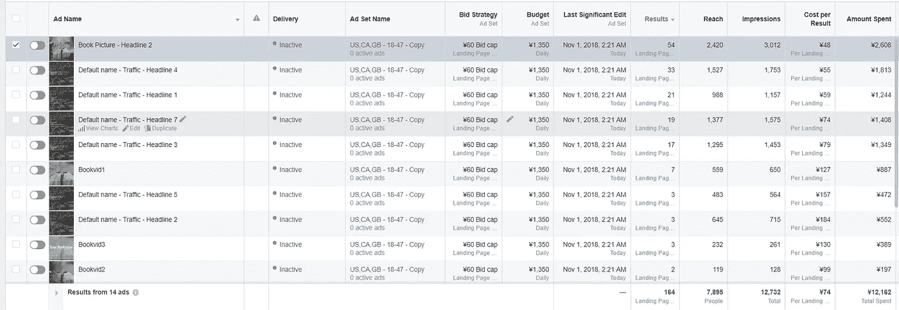

# 这本 1923 年的免费书籍将教会你比 2018 年大多数研讨会更多的营销知识——以下是 11 条顶级课程。

> 原文：<https://medium.com/hackernoon/this-free-book-from-1923-will-teach-you-more-about-marketing-than-most-2018-seminars-710dfc13b09a>

我最近读了克劳德·c·霍普金斯(这位教授奥美广告的人/书)1923 年写的书《科学广告》(Scientific Advertising)，大部分关键概念和教训在 2018 年仍然如此相关，让我感到震惊。

虽然很明显，对于经验丰富的营销人员来说，这不会是开创性的，但它可以作为一个宝贵的路线图，让你在一个平台、策略和算法不断变化的世界中，保持良好的营销原则。

令人惊讶的是，它还指出了失败的营销人员在 2018 年仍然存在的许多缺点，以及回到正确轨道的公式。

下面，我列出了这本书的 11 条主要经验。

2018 年，任何营销人员在花一分钱在网上做广告之前都应该学习的课程。

# 1.测试一切

> 几乎所有的问题都可以通过测试活动得到廉价、快速、最终的答案。这就是回答问题的方式——而不是围着桌子争论。去终审法院——你产品的买家。”

这种说法在 2018 年和 1923 年一样真实，如果不是更真实的话。

而且实现起来肯定要快得多，也容易得多。

但是，人们仍然让他们的骄傲和品味决定广告的最终结果。

而不是让真正的付费用户向你展示理想的广告是什么样的。

如果说克劳德·c·霍普金斯想让他的书的每一位读者都明白一点的话，那就是:

测试一切。

如果你采取提出假设和理论的方法，并实际测试所有的假设和理论，只继续使用有效的方法，你最终会得到一种几乎科学的方法(这就是他的书名)，这种方法可以最小化风险，最大化回报。

如果你只是基于突发奇想、冲动和想法做广告，你很容易浪费整个预算和数年时间，而回报有限。

不确定新广告使用哪个标题？

*** *全部测试。****

你认为某个形象会比普通广告中的形象更吸引女性吗？

*拆分测试一下。*

不确定如何为您的 SAAS 定价？

测试你心中的 3 个不同选项。

不确定你的社交媒体努力给你的企业带来了什么价值？测试一下。

(要么提供跟踪优惠券，要么关注某些没有在其他渠道销售的产品，并检查需求，以及保持社交网站的首次点击互动，要么完全停止 SM，而不改变其他任何东西&观察对底线的影响，就像一些大公司正在做的那样。)

基本上，测试你营销的每个方面，包括产品、活动、文案、图片等。

**(在我“正式”发表这篇文章之前，我测试了 7 个标题，3 个介绍& 5 套创意！)**

# 2.了解你的客户

> 广告人研究消费者。他试图把自己放在买家的位置上。他的成功在很大程度上取决于排除一切因素去做这件事。”

根据大卫·奥格威的说法，这位一手创立了现代广告的人用三行字一劳永逸地证明了了解消费者的重要性。

了解你的消费者是如此重要，以至于如果你实际上不了解你的消费者，你可以做好其他一切事情，使用正确的创意，提供一个杀手级的报价，打破公园的头条，但仍然会失败。

另一方面，如果你真的了解你的消费者，你甚至可以打破“科学广告”本身的法则，仍然会成功，因为你会直观地有效吸引他们。

我曾经短暂地做过电话推销员，通过电话销售氡气测量工具。

如果我是一名文案或营销顾问，我可能会关注氡气的危险，以及我们测试套件的便利性和价值。

但实际上，我最容易也是最大的销售来自出租公寓的房东，我所做的就是通知他们即将到来的立法，该立法将强制所有出租公寓进行氡气测量。

我还通过简单地查找和传递当地氡气测试的结果来达成交易。

继续下去，我可以通过营销活动专门针对房东，在告诉他们新法律后给他们一个很好的报价，或者用真实的研究数据研究和瞄准最危险的领域，可能会通过平淡的标题和文案取得成功，而不是试图仅靠恐惧和便利取胜的艰苦斗争。

了解你的客户是成功营销活动的第一步。

# 3.从小处着手

这本书的作者也是一个巨大的支持者，总是从一个测试活动开始，在走向全国，甚至全世界之前，在当地一级确认你的想法和广告的盈利能力。

即使在 2018 年，一些创业公司仍然没有吸取这个教训。

早在 2017 年，榨汁初创公司“ [Juicero”在浪费了 1.2 亿美元的硬风险资金](https://www.forbes.com/sites/bizcarson/2017/09/01/silicon-valleys-infamous-400-juicer-startup-is-shutting-down/#13b381c7d57b,)后破产，原因只是他们没有费心从小处着手，专注于盈利的商业模式并坚持下去。

他们最终得到了一台价格昂贵的闪亮机器，这是漫长而昂贵的 R&D 和制造过程的结果，但它真正做的只是从袋子里挤出果汁。(即使是产品的果汁部分对现有的榨汁机也不是很有吸引力，考虑到他们榨汁是因为他们想要新鲜的，而不是在超市购买预榨果汁。)

另一方面，你有 Daily Harvest，这是一家正在持续增长的创业公司。

它是由一位当时怀孕 8 个月的母亲自举并确认盈利的，而且肯定没有 1.2 亿美元的投资。

有什么区别？他们起步很小，甚至在成立公司之前就有销售，并且一开始就直接向客户销售和交付产品。

正因为如此，他们很快就能专注于消费者真正关心的东西:便利性、价格和不可安装性。

现在，这家奶昔初创公司在全国范围内提供服务，正在稳步增长，并与著名厨师合作，情况看起来真的很好。

这是一个很好的例子，说明从小处着手往往是最终做大的最佳方式，并能长期做大。

# 4.花更多的时间在标题上，而不是广告/内容上

> 这一章的作者花在标题上的时间远远多于写作。他经常花几个小时在一个标题上。通常在选择正确的标题之前，许多标题就被丢弃了。因为广告的全部回报取决于吸引合适的读者。”

与任何现代营销“专家”交谈，无论他们是参与印刷、电子邮件还是搜索广告，他们都会滔滔不绝地谈论标题的重要性。

但是没有人能像现代营销的创始人自己那样清楚生动地解释它们为什么重要:

> *“广告和个人推销术的区别主要在于个人接触。推销员是来吸引注意力的。他不容忽视。* *广告可以忽略。**但是销售人员在他永远不可能感兴趣的潜在客户身上浪费了大量时间。他不能认出他们。广告只被感兴趣的人阅读，他们自愿研究我们要说的话。”*

如果广告不能抓住潜在客户的注意力，那么不管是什么平台，广告都可能会被他们忽略。

同样，即使你能够激发某人的兴趣，他们成为付费用户，甚至成为你社区的活跃成员的可能性也是零。

在聪明的(点击诱饵)标题上，他是这样说的:

> *“也许一个盲目的标题或一些巧妙的自负会吸引数倍于此的人。但它们可能包含你所能提供的几乎不可能的主题。而你所追求的人可能永远也不会意识到这个广告指的是他们可能想要的东西。”*

当然，一个聪明的标题，或者一个利用“闭环”的标题可能会获得更多的点击，但你可能会得到较少的相关关注。

结果是，与你写了一个吸引目标消费者的好的、相关的标题相比，对你的网站/报价感兴趣的买家会更少。

花时间写一个好的标题，当然也要测试你的想法，但是要确保你的决定不是基于纯粹的虚荣指标，比如点击率/总点击量。

(如果你有多余的钱花，你也可以开始尝试头条新闻。)

# 5.要成为一名优秀的营销人员，你必须了解人类心理

> “有能力的广告人必须了解心理学。他知道得越多越好。他必须知道特定的结果会导致特定的反应，并利用这些知识来增加结果和避免错误。人性是永恒的。在大多数方面，今天和凯撒时代是一样的。所以心理学的原理是固定的，持久的。你永远不需要忘记你对他们的了解。”

克劳德非常支持尽可能深入地了解你的前景。他不仅自己出去采访人，或者在接受新客户时挨家挨户推销产品，他还会在“空闲时间”研究人类心理学。

对人类心理的深刻理解是每个优秀营销人员的基础，因为你需要利用独特的人类力量、突发奇想、恐惧和欲望，试图将它们推向你想要的方向。

当心理学在 100 年前还处于非常早期的阶段时，克劳德已经有了一些非常早期的见解。

他认识到社会证明在营销和商业中的作用。

人们倾向于将他们的决策外包给大众。“如果 40%的美国人都用这个产品，那一定是好的！”

他还谈到了销售和营销中熟悉和接近的重要性，以及

# 6.好奇心可能会杀死猫，但它从未杀死一场营销活动

> *“好奇心是人类最强烈的动机之一。我们尽可能地使用它。膨化小麦和膨化大米的成功很大程度上是因为好奇心。”谷物膨化到正常大小的 8 倍。”“从枪里射出的食物。”“1.25 亿次蒸汽爆炸在每个内核中引起。"在这个因素被发现之前，这些食物都是失败的."*

建筑物、广告牌、电视、谷歌甚至社交媒体上的广告变得如此熟悉，以至于大多数广告都被忽视了。

任何广告的第一个任务是抓住潜在顾客的注意力，但如果它就此打住，它就没有完成第二个任务，即激起观众对产品的兴趣。

这就是好奇心的来源。

正是这一点驱使数百万“技术极客”购买几乎无用的新品。

如果好奇心不起作用，知名食品品牌永远不会推出限时特殊口味，但几乎每个知名品牌都会定期推出。

但他也警告说，不要把好奇心用在与销售你的产品无关的地方，比如一个模糊的点击诱饵标题，这一点我们已经在标题部分讨论过了。

# 7.好的营销是关于销售技巧，而不是书法

> *“要正确理解广告或学习它的基础知识，必须从正确的概念开始。广告是推销术。它的原则是推销的原则。”*

营销不像英语课。

使用最罕见的词汇和最难的语法的人不会得到表扬，相反，他们会受到与他们的吸引力无关的观众的惩罚！

> 成功的推销员很少是优秀的演说家。他们很少有演讲的风度。他们是普通而真诚的人，了解他们的顾客，知道他们的路线。
> 
> *广告写作也是如此。广告业中许多最能干的人都是毕业的推销员。我们知道最好的是挨家挨户的游说。他们可能对语法知之甚少，对修辞一无所知，但他们知道如何使用令人信服的词语。”*

广告不是文章，销售页面不是文章，案例研究不是学术研究。

你的广告的主要目的应该是获得销售，而不是在 Instagram 上获得粉丝，在你的脸书帖子上获得喜欢或其他虚荣指标。

但这并不意味着你需要“善于销售”才能有效销售。

如果你了解你的消费者，并遵循下一课，你就可以“卖而不卖”。

# 8.人是自私的；所以给，不要问

> *“记住你称呼的人都是自私的，我们都是。他们不关心你的利益或利润。他们为自己寻求服务。忽视这一事实是广告中常见的错误，也是代价高昂的错误。广告实际上是在说，“购买我的品牌。把你给别人的交易给我。把钱给我。”*
> 
> 这不是一个受欢迎的呼吁。
> 最好的广告问没人买。
> 那是没用的。他们通常不报价。
> 他们没有说经销商处理产品。
> 广告完全基于服务。他们提供想要的信息。
> 他们向用户展示网站优势。
> 
> 也许他们会提供一个样品，或者购买第一个包装，或者发送一些试用的东西，这样客户就可以证明他们的主张，而不会有任何成本或风险。这些广告中有些似乎是利他的。”

人都是自私的。

他们不关心你或你的生意，除非他们是你的私人朋友，而且他们不会购买你的产品，除非他们觉得他们会以某种方式受益。

如果是巧克力，除非他们认为这是最美味的价格，祝他们好运说服他们购买。

不要浪费时间通过宣称你的品牌是正确的选择来提醒你的潜在客户你有竞争对手，给客户一些信息，帮助他们理解你的品牌是正确的选择。

确保你有一个好的报价，比你的任何直接竞争对手都要好，这将使营销成功变得容易得多；你需要做的就是让真相大白。

如果你的报价比你的竞争对手差，你要么希望你的潜在客户不去努力研究，要么就如何吸引你产品的独特优势发挥创意。

# 9.创意在于表现，而不是品味或外表

在过去的 100 年里，广告业发生了很多变化，但我们的创意需要在你的广告中赢得一席之地。

尤其是在印刷品上，你实际上是在为你的广告所占据的空间付费。但是，即使在脸书和展示广告中，你的广告的生死取决于创意，它们需要销售，它们需要引起正确的关注。

> *“只使用图片来吸引那些可能对你有利的人。只有当它们比同样大小的排版空间更有卖点时，才使用它们。”*

视频广告也要考虑这一点。

测试不同版本的视频(长片段和短片段),查看基于长度和包含的片段的性能是否有任何变化。

不要只让一个资深的创意总监根据口味做决定，单看口味。

在野外测试创意，坚持使用最受观众欢迎的创意。

(或者，更好的办法是，利用细分，在锁定没有共鸣的群体时，利用每一组创意。)

# 10.具体胜过夸张，告知胜过吹嘘

> *“老生常谈和泛泛而谈对人类的理解就像水对鸭子一样。他们不会留下任何印象。说，“世界上最好的”，“现有的最低价格”，等等。充其量只是声称预期的。但是这种最高级通常是有害的。它们暗示了表达的松散，夸大的倾向，粗心的事实。他们会让读者对你的所有陈述打折扣。”*

一些营销人员似乎认为给人留下深刻印象的方法在于最高级。

并非如此。

大多数消费者更关心事实，而不是你可以在产品名称前贴上什么晦涩难懂的词语。

现在比以往任何时候都更是如此，但即使是 100 年前的**也是如此。**

> 一个邮购广告商向较贫困阶层的人出售女装。多年来，他一直使用“美国最低价”的口号。“他的对手都抄袭了。然后，他保证低价出售任何其他经销商。他的对手也这样做了。很快，这些主张对他那一行的每一个广告人来说变得很普遍，变得司空见惯。然后在能人的建议下，他把他的陈述改为“我们的净利润是 3%。“这是一个明确的声明，并且给人留下了深刻的印象。从他们的业务量来看，显然他们的价格必须是最低的。没有人能指望以低于 3%的利率做生意。第二年，他们的业务有了惊人的增长。”

如果你有具体的竞争卖点，充分利用它们。

不要只是暗示他们。

如果你在批量销售蛋白粉，不要只是说“更多的蛋白质，让你的钱”，要具体。“平均每花 1 美元多 18 克蛋白质”。

不要只写“厨师选择我们”或“厨师的选择”，你可以根据你的消费者的位置得到具体的信息，而是写:“戈登·拉姆齐& 374 其他纽约厨师使用我们的产品在他们的餐厅制作食物。"

别添油加醋了。

说出该死的真相，而且说得很好。

# 11.商业成功并不意味着你的营销是有效的

如果你没有完善的跟踪机制，包括不同渠道的特别优惠、登陆页面和优惠券，就无法知道你的营销是否有效。

*即使你看到了商业成功。*

霍普金斯先生认为，在写作和出版这本书时，基于猜测的广告很快就会结束&结束，但不幸的是，他错了。

有多少小企业主每周花几个小时在 Instagram &脸书上“为了他们的生意”，主要是因为其他人说他们必须这样做？

有多少 B2B 企业仍然在经营“行业杂志”广告，却不知道他们得到了什么回报？

有多少全国性的品牌推广活动是在没有做长期本地测试的情况下发起的，以检验品牌提升是否真的提高了收入？(与其他因素导致的其他领域的增长形成对比。)

即使你的业务逐年增长，也不意味着你的营销是有回报的。

你可能会有福音传道者为你加倍工作，或者偶然得到公关报道(就像一个大的 streamer 或 Youtuber 展示你的业务/产品而没有植入交易)。

或者你可以在正确的时间提出正确的提议。

尽管营销不佳，但成功是可能的，这给我们留下了很大的发展空间。

尽管你做了营销努力，你如何发现自己是否成功了？

很简单，做个测试。

从小处着手。

选择一个你将在很长一段时间内停止营销活动的地区，看看缺乏营销是如何影响该地区的整体销售的。

不管怎样，如果这些结果显示成功，你就有一个很好的案例来测试你企业的其他营销手段。

# 号召勇敢的人们行动起来

祝贺你完成了这篇 3000 字的巨作。

我希望你能从这篇文章中有所收获，这篇文章大量借鉴了现代营销之父的营销智慧。

首先，自己看书。

如果你在谷歌上搜索“科学广告”，会出现一个免费的 pdf 版本&一个免费的有声书版本，如果你很难阅读古英语或电脑上的书籍，你还可以在亚马逊上获得现代改写版(尽管这不会是免费的。)

这篇文章花了我 10 多个小时来研究，写作，重写，编辑，清理和发布。(更不用说第一次读这本书，所以如果它给了你任何见解，或者你喜欢它，请随时留下评论。

如果你有兴趣与使用 2018 年验证的科学营销方法的人合作，而不是像咆哮的 50 年代那样收费，[联系](https://ragnarmiljeteig.com/contact-me/)。

看在上帝的份上，测试一下你们的 sh*t 家伙，现在是 2018 年。