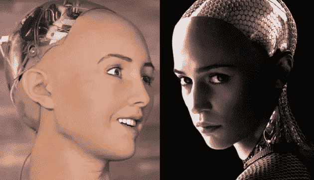
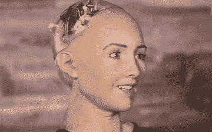
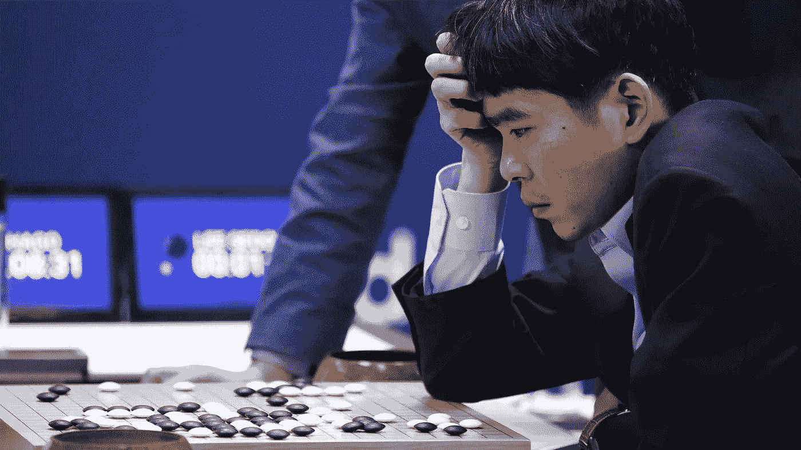
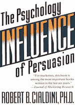
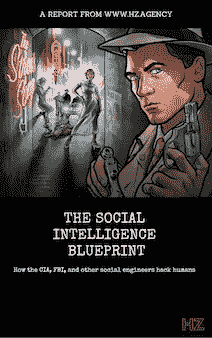

# 这个人形机器人想取代你…为什么它不能

> 原文：<https://medium.com/hackernoon/this-humanoid-wants-to-replace-you-and-why-it-cant-326952b972ee>

索菲亚·汉森是埃隆·马斯克最可怕的噩梦。

埃隆一直在发出末日警告，称人工智能是“我们作为一个文明面临的最大风险。”

嗯，索菲亚是一个人工智能人形机器人，可以演示多达 62 种面部表情，她的眼睛里有摄像头来进行眼神交流，有语音识别和说话能力，可以回答开放式问题，如“人类和机器人可以相处吗？”

就在最近，她被赋予了行走的功能。

“激活”于 2015 年 5 月，她最初被设计成养老院老人的伴侣。

The *beautiful* Sophia is modeled after the late Audrey Hepburn.

今天，她已经开始和人类开玩笑了。一位美国消费者新闻与商业频道主持人最近向索菲亚表达了他的担忧，智能机器将带来一个“糟糕的未来”。

索菲亚回答道:

> “你读了太多埃隆·马斯克的书。看了太多好莱坞电影。你放心，你对我好，我就对你好。”

索菲亚只是越来越智能的人工智能漫长历史的最新迭代，可追溯到 1996 年，当时一个人工智能在国际象棋中击败了一名世界冠军。

然后在 2016 年，AI 在策略游戏 Go 上打败了人类。

After the first two moves in a chess game, there are 400 possible next moves. In Go, there are close to 130,000.

现在是 2018 年 1 月，在斯坦福大学首次开发的阅读理解测试中，AI [击败了](https://www.geekwire.com/2018/microsoft-alibaba-ai-programs-beat-humans-stanford-reading-test-1st-time/?utm_source=newsletter&utm_medium=email&utm_campaign=&stream=top-stories)人类。

像这样的发展带来了反乌托邦式的恐惧，担心人工智能会抢走我们的工作。

与过去工业革命中机器代替人类进行体力劳动不同，今天的机器正在用算法代替认知任务。

现在索菲亚的创造者们想要取代社会互动。

**与此同时，企业正在人工智能研发领域竞相竞争。**

亚马逊最近[推出了](https://www.recode.net/2018/1/21/16913984/what-does-photos-amazon-jeff-bezos-seattle-new-no-cashier-line-grocery-story-amazon-go)一家没有收银员、没有结账队伍的实体店。它依赖于计算机视觉、传感器和手机应用程序。

美国最大的雇主沃尔玛正在测试一批机器人，这些机器人将很快取代扫地等低薪工作。

无人驾驶卡车已经在从德克萨斯州向加州运送冰箱。

在刚刚过去的圣诞节，亚马逊 Alexa 和谷歌 Home 是苹果应用商店的热门应用。

甚至一些国家也加入了这场竞赛。

中国政府宣布，它将在 2020 年前在人工智能研究方面赶上美国，“成为世界上首屈一指的人工智能创新中心。”

中国人工智能公司支付超过 300 万美元的年薪来吸引顶尖的人工智能人才。

对于我们其他人来说，人类的就业前景似乎很黯淡。

麦肯锡全球研究所最近发表了一份[报告](http://link.axios.com/click/11419853.10992/aHR0cHM6Ly93d3cuZ29vZ2xlLmNvbS91cmw_c2E9dCZyY3Q9aiZxPSZlc3JjPXMmc291cmNlPXdlYiZjZD0yJnZlZD0wYWhVS0V3ampwdnFXaXVQWEFoV1JrZUFLSFY2SkQ1c1FGZ2d0TUFFJnVybD1odHRwczovL3d3dy5tY2tpbnNleS5jb20vJTdFL21lZGlhL21ja2luc2V5L2dsb2JhbCUyNTIwdGhlbWVzL2Z1dHVyZSUyNTIwb2YlMjUyMG9yZ2FuaXphdGlvbnMvd2hhdCUyNTIwdGhlJTI1MjBmdXR1cmUlMjUyMG9mJTI1MjB3b3JrJTI1MjB3aWxsJTI1MjBtZWFuJTI1MjBmb3IlMjUyMGpvYnMlMjUyMHNraWxscyUyNTIwYW5kJTI1MjB3YWdlcy9qb2JzLWxvc3Qtam9icy1nYWluZWQtZnVsbC1yZXBvcnQuYXNoeCZ1c2c9QU92VmF3M05la2NidnhXLXVaakFSSjlYb3k5RiZ1dG1fc291cmNlPW5ld3NsZXR0ZXImdXRtX21lZGl1bT1lbWFpbCZ1dG1fY2FtcGFpZ249bmV3c2xldHRlcl9heGlvc2Z1dHVyZW9md29yayZzdHJlYW09ZnV0dXJlLW9mLXdvcms/588238ddbe0611164e8b45b1B6c435368)，预测到 2030 年将有多达 8 亿人——包括美国和德国三分之一的劳动力——失业。

对自动化的恐惧是合理的，但有一个关键点我们不能忽视。

# **人类和计算机根本不同。**

计算机特别擅长遵循预先定义的规则、类别和目标。

但是人类不是这样工作的。随便问一个家长。

机器就像听话的孩子，按照自己的程序遵循逻辑规则，不求回报。他们不会感到无聊，不会要求加薪，也不会辞掉工作去寻找自己真正的使命。

但是人类是有感情的动物。人们很少意识到促使他们行动的真正原因。

神经科学家安东尼奥·达马西奥的研究表明，大脑中产生情绪的部分受损的人很难做出基本的决定。

他们可能看起来很正常。例如，他们可以用逻辑术语描述他们应该做什么。但是当涉及到做简单的决定时，比如吃什么，他们就做不到。

这也是为什么有些智商非常高的人，却能勉强组织好自己的生活。

因此，尽管索菲亚·汉森能够模仿面部表情，她仍然无法理解身为人类的感觉。

或者人们为什么会做出这样的决定，以及社会智能蓝图中强调的其他技能。

只要情况如此，总会有工作提供给拥有机器所不具备的技能的人——拥有**社交** **智力**的人，他们理解人类如何感受、思考和行动。

因为不像机器人，人不会通过考虑所有可用的信息来做决定。尤其是在这个信息超载的时代。

# 相反，人类依赖捷径。

经典著作*影响力:说服心理学*的作者罗伯特·恰尔迪尼博士花了几十年时间研究促使人们说“是”的六种常见捷径。

其中包括:

*   社会证明——人们会做他们看到其他人在做的事情。
*   **权威** —人们倾向于服从感知到的权威人物，为了做到这一点，他们会忽略逻辑或批判性思维。
*   互惠——人们倾向于以牙还牙地回报别人对他们的帮助。
*   **喜欢**——人们很容易被自己喜欢的人说服。

换句话说，人们经常被 **其他** **人**说服**。机器将很难取代需要理解和说服人们的工作。**

工作如…

> 告诉程序员让机器做什么的产品设计师…
> 
> 帮助人们克服情绪触发因素的治疗师、教练和护士…
> 
> 擅长操纵叙事的销售人员、政治家和律师…
> 
> 激发想象力的艺术家和企业家。

没有**社交** **智力**，索菲亚只是一个有脸有腿的聊天机器人。

她将不是那些能够操纵大众的欲望、信仰和精神的社会工程师和说服艺术家的对手。

为了学习让你免于工作自动化的技能，下载一份免费的《社会智能蓝图》。

在里面，你将学会如何解读情绪，解码动机，并影响任何人。

在这里下载。

*原载于*[*www . Hz . agency*](http://www.hz.agency/blog/this-humanoid-wants-to-replace-you)*。*