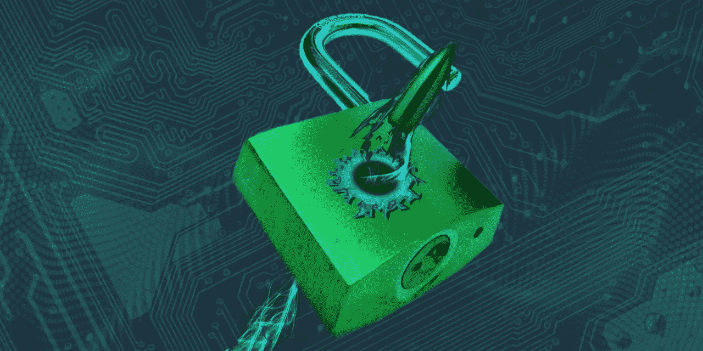
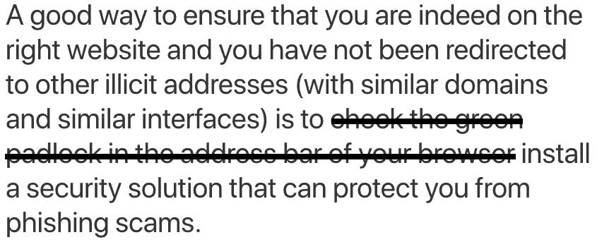

# 这是一封致所有密码作者和社区管理者的公开信。🚫

> 原文：<https://medium.com/hackernoon/this-is-an-open-letter-to-all-crypto-writers-and-community-managers-2053a44392>

请停止建议你的读者、投资者和社区成员在他们的浏览器工具栏中寻找挂锁。这个建议很危险。

挂锁是浏览器告诉您网站已经安装了 SSL 证书的一种方式。SSL 证书用于加密您的浏览器和网站之间的数据传输，仅此而已。这可以防止第三方在您将个人信息输入网站时窃取您的信息。

挂锁/ SSL 证书**并不能**表明网站所有者就是他们所声称的那个人——或者他们是可以信任的。SSL 证书是免费的，并且是自动颁发的。没有验证过程。**你不能因为一个网站有挂锁就相信它。**

我目睹过负责拥有 2 万多名成员的团体的社区经理提供这种不明智的建议。我也读过许多著名出版物写的文章。**请住手！**

如果你看到有人提供这种糟糕的安全建议，请给他们提供这篇文章的链接。

MetaCert 在加密领域保护的人比世界上所有其他安全公司保护的人加起来还要多，所以我们对加密网络安全有一个很好的全球视角。

超过 90%的数据泄露也始于网络钓鱼诈骗，因此，您在交易所、钱包、ICO 或令牌公司听到的几乎每一次黑客攻击，实际上都始于他们团队中的一名成员中了网络钓鱼诈骗的圈套。

谢谢，

Paul
MetaCert 首席执行官