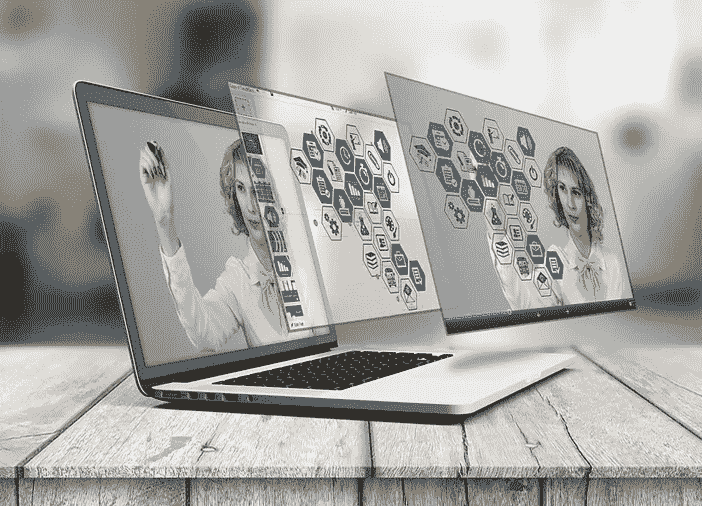

# 这就是增强现实将如何重塑我们的未来

> 原文：<https://medium.com/hackernoon/this-is-how-augmented-reality-will-reshape-our-future-53214985b6d>

[Pricekart.com](https://www.pricekart.com)

我们几乎每天都看到新的技术和趋势出现。去年，我们看到虚拟现实进入了各个领域。在这些最新的发展中，增强现实就是这样一种技术，它将留在这里，成为我们生活中不可或缺的一部分。增强现实使用现有的环境，并在其上覆盖额外的信息。

如果你还不清楚 ar 是什么，那么你所要做的就是回到过去，回忆一下 Pokémon Go 席卷互联网的那段时间。游戏围绕玩家捕捉数字怪物展开。同样，Snapchat、脸书和 Instagram 等应用为用户提供滤镜，将动画图像叠加在用户的脸上。

你现在可能想知道这项技术如何重塑或改变我们的未来。增强现实可以给各个行业带来很多变化和发展。让我们来看看它们是什么。

**房地产**

我们都梦想住在设计完美的房子里，夸耀我们的风格和声明。有了增强现实，这个梦想可能会成真。AR 使用交互式计算机生成的图像，这使得买家可以在还在建设中的时候就可以预见完工的房产。这项技术在房地产行业的好处是，它可以将蓝图和照片等所有 2D 模型转换为 3D 模型，以便买家轻松互动。

建筑商和房地产经纪人会发现用这种身临其境的体验来展示房产是很方便的。不仅如此，感兴趣的买家还可以根据他们希望完成的设计来修改颜色、家具、房间大小等。甚至在建造之前就用 AR 设想你已完工的房产是销售房产的一个有利的营销工具。

**购物**

网上购物正在慢慢取代传统的购物方式。然而，正是不确定性阻止了买家在网上购物。AR 在购物行业的发展肯定会让潜在买家转向在线购物。随着商店中增强现实技术的发展，客户可以在他们喜欢的环境中以高度逼真的方式查看产品。

营销人员分享产品目录和最新信息也将变得更加容易。此外，在每个零售店或超市都可以买到 AR 眼镜，这可以增强购物体验。这些眼镜会在顾客购物时向他们展示所有的价格、设计和产品规格。增强现实肯定会改变人们购物的方式。

**旅行**

旅游业是增强现实可能带来革命的另一个领域。尽管虚拟现实在旅游业中发挥着更大的作用，但增强现实仍可被视为巨大的变革。智能手机上基于 AR 的应用程序将帮助游客和旅行者检查和找到附近的当地旅游景点，并将广告牌和标志立即翻译成他们的母语。

此外，利用增强现实探索和参观当地景点、主题公园和动物园将有助于旅行者拥有最非凡的旅行。该技术将显示地标的 3D 模型，并带游客回到过去，向他们展示时间带来的演变。旅游行业的 AR 不仅仅是有趣的因素，还为旅行者增加了教育元素。

**医疗保健**

虽然人们已经习惯于被带入 3D 世界，但使用[虚拟现实耳机](https://www.pricekart.com/mobile-accessories/vr-headsets)并不存在，AR 已经被用于制药和医疗保健行业，以拯救许多生命。然而，这还不是全部。增强现实可以为医疗机构提供重要帮助，帮助他们完善现有流程。AR 将为外科医生提供关于微创手术风险的深入知识，并帮助他们有效地进行手术。

早期的外科手术需要不同类型的监视器，通过内窥镜摄像头显示病人的生命统计数据。抛开所有这些麻烦，医生可以戴上 ar 智能眼镜，在他们进行手术时显示所有相关信息，并帮助他们专注于手头的任务。

**教育**

教育领域的增强现实可能会极大地改变儿童的学习方式。这项技术将为学生提供身临其境的内容，帮助他们理解概念。借助引人入胜的 3D 模型，学生可以更轻松地掌握复杂的信息，从而对主题有更广泛的理解。

在我们这个充满活力的时代，博物馆和历史遗址已经将 AR 功能融入到他们的展品中，以与技术保持同步。这是人们探索和获得额外信息的好方法。AR 就是探索，最终引导学生走向学习和理解。这对技术和教育行业来说都是双赢的。

结论:

毫无疑问，增强现实将重塑的不仅仅是这五个行业。随着设备适应新技术，增强现实的增长呈指数级增长。有了这么多积极的优势，AR 可以从根本上改变人类的生活。