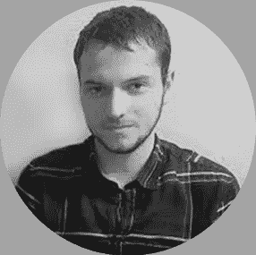
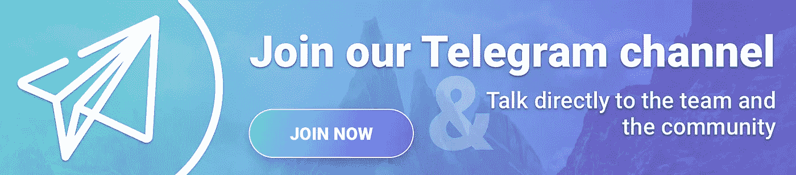

# 这是 Peer Mountain:见见 Florian Lagouche

> 原文：<https://medium.com/hackernoon/this-is-peer-mountain-meet-florian-lagouche-34d224d237c>

为了产生好的结果，产品开发、部署和采用的敏捷方法需要开发和运营团队之间的紧密联系。Peer Mountain 的区块链 DevOps 工程师 Florian Lagouche 确保这些小组之间的沟通和协作保持清晰有效。

25 岁时，Florian 已经在 DevOps 这个相对较新的领域拥有了丰富的经验。作为一名热情的技术爱好者，他于 2010 年开始在法国南锡的 Epitech 数字创新研究生院学习。三年后，Florian 在北京交通大学学习了一年，然后在巴黎 Epitech 完成了学业。

弗洛里安对技术的热情让他在教室和计算机实验室之外保持活跃。他在全球金融巨头兴业银行(Société Générale)的子公司 Boursorama 获得了他的第一份 DevOps 工作之前，做过几次实习。事实证明，弗洛里安在法国网上银行的两年是一次宝贵的学习经历。在那段时间里，他升级了 Boursorama 的交付系统，这样他的团队可以在几秒钟内将代码推送到几十台服务器上，并在必要时立即回滚到以前的版本。

2016 年，区块链和加密货币引起了弗洛里安的兴趣；他于当年 10 月开始为比特币分析工具提供商 Scorechain 工作。Florian 和他的团队帮助其他公司，主要是金融机构，了解并受益于区块链理工大学。他还自动化了 Scorechain 基础设施的几乎每一个部分，使开发人员只需将他们的代码推送到 git 仓库，就可以自动获得它的实际版本，之后他们只需点击一下就可以投入生产。

KYC3 在 2017 年末与 Florian 取得了联系。他们向他提供了将他的 DevOps 技能和经验应用到他们新的 Peer Mountain 项目中的机会。Florian 现在管理这家区块链初创公司的开发集群，以及 KYC3 生产集群。为了进一步帮助 Peer Mountain 交付其分散的信任、商业和合规生态系统，Florian 还管理这家区块链初创公司的基础设施，并自动化产品交付流程。

弗洛里安在业余时间保持身体和精神上的活跃。他是一个热爱运动的人，喜欢跑步、游泳和滑雪。虽然他知道谷歌 home 和亚马逊 Alexa 等智能家居工具，但 Florian 致力于自动化家用电器和电子产品，如灯和扬声器。

> “我不信任大公司的智能家庭助手，”他说，“我喜欢了解这些东西是如何工作的，所以我自己做。”

为了与弗洛里安交谈并了解更多关于[同辈山](http://www.peermountain.com/)，加入我们生动的[电报组](https://t.me/peermountain)！

