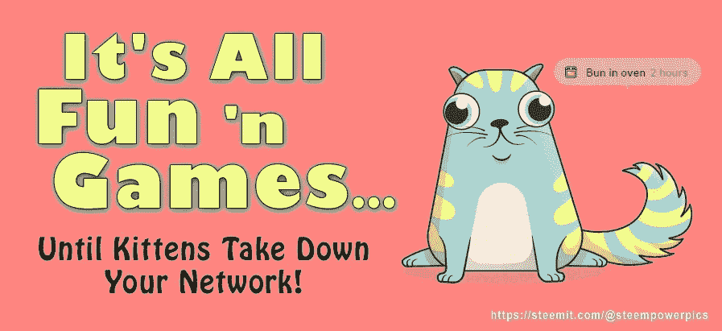
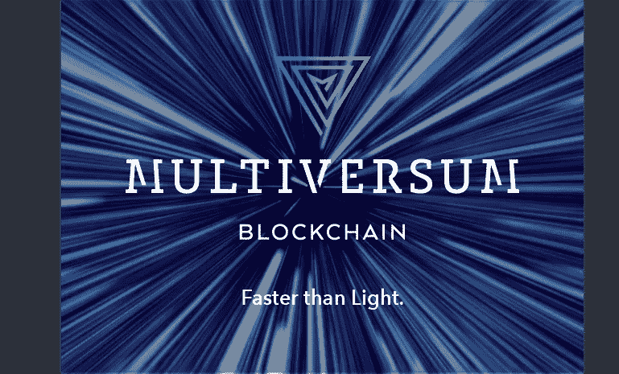

# 关系区块链是前进的方向

> 原文：<https://medium.com/hackernoon/this-is-what-a-4th-generation-blockchain-looks-like-multiversum-77165f1b8dea>

第四代区块链就在我们的门口，它承诺将使我们比以往任何时候都更接近大规模采用。但在我们深入研究之前，让我们快速回顾一下自 2008 年以来区块链技术经历的 3 个发展阶段。

## 我们目前所拥有的

第一代区块链由中本聪设计，诞生了第一个加密货币比特币。第一代区块链的标志是他们使用工作证明(PoW)算法来验证交易。在这个群体中还有比特币的各种克隆和分叉，如比特币现金和莱特币。

**第二代**由以太坊(Ethereum)领导，引入了智能合约，使资产的简单令牌化成为可能。它变得非常受开发人员的欢迎，并成为绝大多数 ico 的首选平台。这一类别的其他项目有 NEO 和 WAVES。

This kittie is not as innocuous as it looks!

缓慢的交易、高昂的网络费用和疯狂的能源消耗已经成为比特币的代名词，而去年 12 月的 CryptoKitties 狂潮表明以太坊远未达到生产就绪的可扩展性。

**第三代区块链**正在努力解决可扩展性、速度和能源效率的问题，使用的方法包括利益证明(PoS)验证和链外路由。像卡尔达诺这样的项目就属于这一类。

## 那么…下一步是什么？

第四代区块链应该超越前两款的不足。它必须引入激进的概念，通过使区块链环境对企业、工业和机构的使用灵活、经济，对消费者安全，使我们更接近大众接受。

[Visit the website](http://multiversum.network)

[**多元宇宙**](http://multiversum.network) 寻求实现的正是这一点。与不适合复杂数据接口和表示的现代区块链实现不同，Multiversum 将提供**复杂数据类型**和多维结构中的组织**，类似于关系数据库**。

数据分片、链分裂和重新连接将允许更大的可扩展性和并行性，以及独特的完整性证明(PoI)验证算法，这将提供卓越的速度和能效，并将有效地淘汰 PoW。

在多元宇宙区块链上托管的项目将能够启用**可选回滚功能**。通过实现一组事务恢复状态，它将允许撤销不希望的操作，而不会破坏链的可信度。

为了简化应用程序的开发，Multiversum 将以基于 SQL 的语法为特色，并将为 Java 和 JavaScript 提供高端库。

## 还有什么？

Multiversum 声称的事务速度为0.2s(包括验证)和**无限的可扩展性** —吞吐量将高达每核 1000 Tps，因此 64 核服务器最高可达 64 000 Tps。

引用 Je-Gyeong Jo、Jong-孙婉和 Hyung-Woo Lee 的研究，该项目将研究支持**生物识别输入**以产生非对称密钥并保证签名者身份的真实性**。**将用户的生物特征和个人信息与 SHA-256 相结合，将产生一个唯一的散列，然后在转移资金或数据时可用于验证，并且仍将保持其所有者的匿名性。

有关更多技术细节和完整的特性列表，请参考白皮书。

> [-访问网站](http://multiversum.network)
> 
> [-加入电报通道](https://t.me/MultiversumOfficial)

## 感谢阅读和…请鼓掌！:)

我不是财务顾问，这也不是财务建议。