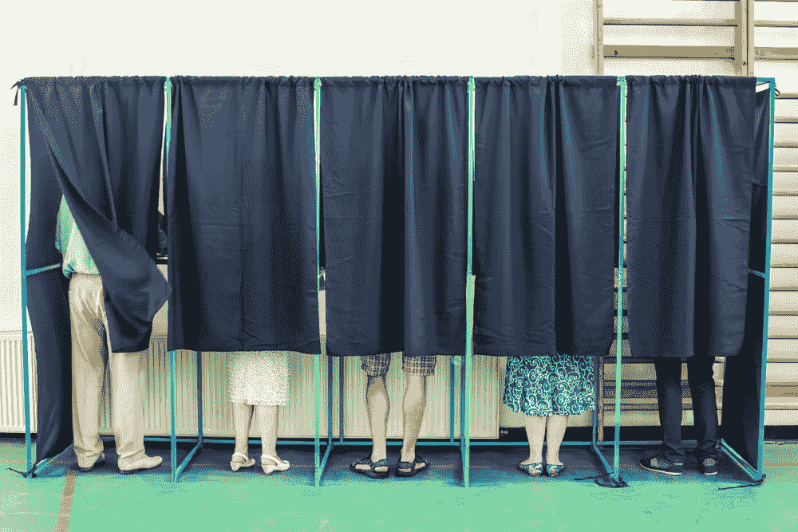

# 这就是投票的未来

> 原文：<https://medium.com/hackernoon/this-is-what-the-future-of-voting-looks-like-e5e9117bd694>

区块链承载着改善人类系统的各种潜力。

我们最常听到的是金融服务和银行系统的这种潜力。但是区块链最有可能改善的人类舞台是投票。

在上一个选举周期中，关于欺诈、假新闻和“系统操纵”的言论非常猖獗。而且理由很充分。

假新闻*对*不利。我们现有的机制*确实证明*易受外界感染。每个人都清楚，有些事情需要改变。

这就是区块链的用武之地:通过将我们的投票系统转移到区块链——一些国家和州已经进行了试验——我们可以改善一个多次暴露出不足的系统。

方法如下:

# 使用区块链投票确保了必要的透明度。

将我们的投票系统切换到区块链的主要好处是区块链允许的更高水平的透明度。

区块链肯定会阻止不良行为者欺骗系统。这将确保人们不会投两次票，因为我们有他们投票和身份的不可改变的记录。没有人能够删除投票，因为区块链是不可改变的。那些负责计票的人将拥有每一张计票的最终记录，监管者或审计人员可以随时检查。

在区块链，一切都是不变的，也是可证实的。然而，同样重要的是，结果可以加密，这将鼓励透明度，同时保持重要的隐私意识。

# **区块链有助于更快获得结果。**

然而，在区块链上输入和存储的结果不仅仅是不可变和透明的，它们还可以立即获得。

这意味着在区块链举行选举不仅更安全，而且更有效率。

如果你把这与我们目前进行选举的方式相比较，差别是明显的。目前，选举后需要几个小时，有时甚至几天来统计选票，有时我们会因为人为或机器错误而混淆结果，这当然会导致这一过程需要更长的时间。

> 然而，区块链提供了一个现实，在这个现实中，人为错误被排除在等式之外，结果被立即计算。

想象一下在选举结束后马上知道选举结果。这就是区块链能做的。

# **区块链使人们能够更系统地验证信息，如新闻文章是否可信和有效。**

我们的选举比计票包含更多的过程和功能。当我们谈到选举时，我们还必须谈到在选举日之前发生的一切——例如信息和新闻的传播和讨论。

这也许是我们的投票系统在最近的选举周期中被证明是最脆弱的地方。时至今日，社交媒体网站上的用户经常会接触到一些图片和文章，这些图片和文章在外行人看来是真实的。至于确定某样东西实际上是否是真实的，读者只能自行其是。

> 区块链承诺让我们有能力核实哪些消息来源是可信的、可核实的。

它可以作为一个不变的数据源，根据它可以检查新闻来源。例如，如果我们在区块链上存储这种数据，脸书的用户可以查找他们遇到的作者或网站，并确定该作者或网站是否发布了可验证的真实或明显虚假的信息。该记录将保存在区块链供所有人参考。

根据用户是否能确认内容的准确性，个别文章甚至可以被投票赞成或投票反对。实际上，这给了人们更多的工具来实践聪明的社交媒体消费习惯。

# **区块链也可以用来改善私营公司和组织内部的投票程序。**

显而易见的是，你对区块链作为管理投票过程的潜在机制研究得越多，你就越会发现它的应用不仅仅局限于市政或公共选举。

单个公司和组织可以通过在内部使用区块链获得同样的好处。

例如，公司可以使用代币授予员工和股东投票权。员工或投票人获得的硬币越多，他们潜在的投票权重就越大。授予令牌也是激励良好行为的一种方式，比如一致的准确性。

像以太坊这样的公司已经在试验这种结构——这种结构除了增加透明度和效率之外，还使权力多样化。

# **我们进行这些改进所需的技术已经在这里了。**

当然，除非掌权者决定实施区块链，否则它将无法改善我们的投票程序。

好消息是什么？实现这一目标的技术已经存在。我们看到世界各地的国家和州正在试验这种技术——在区块链主持选举，使用区块链存储和跟踪投票数据，并通过分散共识的方式核实新闻来源。

当然，在这成为现实之前，还有更多的工作要做。但是技术就在这里。如果我们决定将透明度、效率和安全作为优先事项，我们知道等待我们的是什么:一个新的[未来](https://hackernoon.com/tagged/future)。