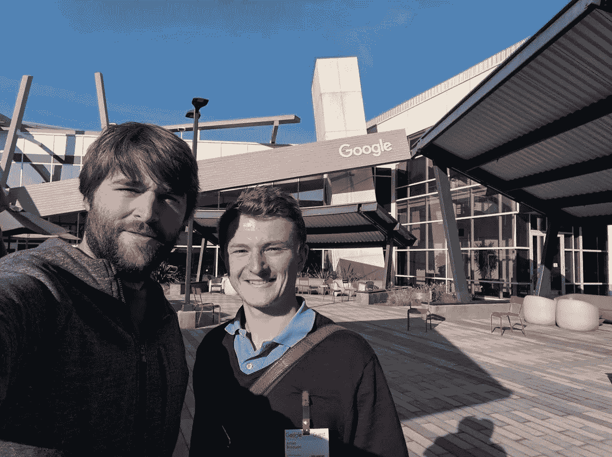

# 这名学生通过勇敢的人际关系网进入了谷歌总部

> 原文：<https://medium.com/hackernoon/this-student-talked-his-way-into-the-googleplex-through-courageous-networking-f80500b0f5c2>

Jonas Bolduan (left) with Google’s Andrew Fuller

> 这篇文章的一个版本曾出现在《福布斯》杂志上。

我鼓励我的[加州大学圣巴巴拉分校](https://www.tmp.ucsb.edu/)创业学生宁可行动失误，也要抓住机会。为此，如果他们通过参加校外的专业活动来锻炼自己的社交技能，练习他们的[个人推销](http://johngreathouse.com/forget-your-elevator-pitch-whats-your-personal-pitch/) : (i)他们是谁，(ii)他们的人生目标是什么，以及(iii)他们将如何实现这些目标，我会给他们额外加分。

最近，我的一位来自德国的国际学生乔纳斯·博尔杜安的社交技巧给我留下了深刻的印象。我的大多数美国学生，英语是他们的第一语言，在他们的祖国建立关系网，没有表现出乔纳斯的勇气和信心。

**勇气和信心**

乔纳斯想要参观谷歌的总部，尽管他不认识在该公司工作的任何人。他没有被吓倒，在他们在 UCSB 做了一次演讲后，他联系了一名谷歌员工，并勇敢地问他们是否可以在谷歌共进午餐。

在下面的邮件中，乔纳斯描述了他是如何充分利用自己的勇气和信心的。

*亲爱的格瑞特豪斯教授*

我希望你一切顺利！我想你可能会有兴趣听听下面这个轶事，它是从你的讲座中得到启发的。

当我在校园里参加一个谷歌技术讲座时，我专注地听谷歌光纤的年轻硬件工程师安德鲁·富勒(Andrew Fuller)讲述虚拟和增强现实的未来。他充满激情地展示最新项目，在回答学生问题时也很投入，这让我想和他谈谈。

Andrew 演讲结束后，我走近他，我们就谷歌、“合作精神”(一部环境纪录片的标题，印在他的 t 恤上)和公司可持续发展进行了有趣的交谈。我们的谈话很自然，但也很坦诚，所以我抓住了这个机会，问安德鲁是否愿意在谷歌总部见我。我很高兴，安德鲁不仅同意了我的请求，还建议我们一起吃午饭。

当那个时刻到来时，我不知道该期待什么，有点害怕与忙碌的谷歌员工匆忙共进午餐。体验相反的感觉很棒。

*我在谷歌光纤办公室见到了安德鲁，然后我们一起开车去了谷歌总部——谷歌及其母公司 Alphabet 的总部大楼。我们进入了一个欢迎的庭院，里面有许多座位区，由于是公共假日(感恩节)，大部分座位区都是空的。*

*在一个主要入口的正前方，谷歌放置了一个 Android 雕像，每当新的 Android 版本发布时，它都会被替换——目前是绿色的 Android 机器人站在一大块牛轧糖上，这代表了最新版本:Android 7.0 牛轧糖。*

在整个院子里，我都能认出很多保安人员。似乎他们的主要任务是阻止游客骑上谷歌自行车，这些自行车都是红色、黄色、绿色和蓝色(谷歌的颜色)，不容忽视。正如安德鲁解释的那样，员工们用它们作为不同字母办公室之间的一种交通工具，这些办公室可能相距几英里。

在第一栋大楼里，我的注意力被一个巨大的屏幕吸引住了，屏幕上实时显示着谷歌搜索引擎中最常输入的搜索词。恰当地说，第一个谷歌搜索词是“填充火鸡”。在一个堆满零食的“微型厨房”停下来的时候，我发现了一个装满洗衣机和烘干机的侧室。安德鲁认出了我困惑的脸，确认道:是的，你可以在那里洗你的私人衣物——只要你想，随时都可以！我们搬到了我最喜欢的谷歌总部房间:一个满是老式游戏机的拱廊，安德鲁和我在那里玩经典游戏，如 Pong、Space Invaders 和 Pinball。感觉好像我们回到了 80 年代的游戏时代。

当我们在院子里走着的时候，我发现了一辆看起来很奇怪的自行车，安德鲁向我介绍了这辆车，他叫“CoBi ”,意思是,***Co****nference****Bi****ke。为了平衡我们的室内游戏活动，我们跳上这辆圆形 7 人自行车，开始踩踏板——我们非常规会议的主题是:探索停车场。*

我的经历让我想起了你在课堂上一直强调的:要有企业家精神，利用日常生活中围绕着你的机会。

感谢您在加州大学圣巴巴拉分校的讲座中激励我采取行动！

约纳斯·博尔杜安

**经验教训**

1)走出去——利用演讲者，不要只是被动地听。带着问题问他们，并在他们讲话后与他们进行一对一的交谈。

2)乔纳斯让演讲者围绕一个真正感兴趣的话题——电影*cow spicy*和谷歌对可持续发展的承诺。

3)尽管谷歌在互联网上占据着不祥的主导地位，但它提醒乔纳斯，谷歌是一家充满正常、友好的人的公司——尽管它鼓励 it 员工在工作时吃无限量的零食、洗衣服和玩视频游戏。正如乔纳斯在随后的一封电子邮件中告诉我的，*“在不知道浏览器搜索引擎背后是什么之后，看到谷歌的总部有点幻灭。我有点意识到，即使是谷歌也“只是”一家拥有巨大办公楼的公司。*

4)承担社会风险的回报通常超过潜在的短期痛苦。如果安德鲁拒绝了乔纳斯去他办公室拜访他的请求，任何尴尬都将是最小的。

5)谷歌的一些人是铁杆，在重大节日工作和招待客人，包括感恩节。

*你可以在推特上关注约翰:*[***@ johngreathouse***](https://twitter.com/#!/johngreathouse)*。你也可以在这里查看他的动手* [*创业*](https://hackernoon.com/tagged/startup) *博客***。**

**图片来源:Jonas Bolduan**