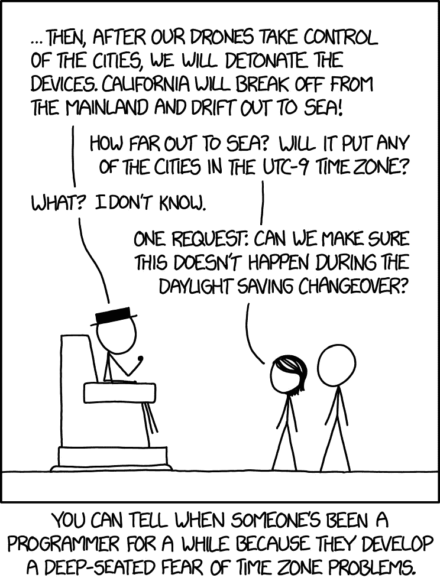

# 本周是一个边缘案例，或者为什么用代码处理时间很糟糕

> 原文：<https://medium.com/hackernoon/this-week-is-an-edge-case-or-why-dealing-with-time-in-code-sucks-3be3d5935cc>

今天早上 8 点，一个 todo 应用程序的提醒打断了我的早餐仪式。这没什么大不了的，如果不是因为我把提醒时间定在了早上 9 点。几分钟后，谷歌开始给我如何去工作的建议，而通常一个小时后它就开始烦我了……搞什么？

我不能确定，但如果你用枪指着我的头，强迫我为某个原因下注，我的筹码将会是 DST 的*all-in*——是的，该死的夏令时。

[https://xkcd.com/1883/](https://xkcd.com/1883/)

你看，这一周对时间迷来说很特别:欧洲的夏令时刚刚结束，但在*自由之地*这里，我们直到下周日才结束——因为与欧洲同时结束太容易、太无聊、太连贯了——所以现在我们是一年中仅有的欧洲和美国接近一小时的两周之一。

这有一些含义。首先:如果你有重复的会议*在大洋彼岸*，你的日程会被完全打乱。第二，也是最重要的，如果你是一名开发人员:你最好确保在你的代码中控制这种边缘情况——对于阅读这篇文章的普通人来说,“边缘情况”是我们开发人员所说的很少发生的事情，推而广之，可能不会工作；事实上，我们这周生活在一个边缘的情况下，这可能会让很多值得的开发者现在紧张得尿裤子。

看，在一个乌托邦式的场景中，开发人员将完全理解日期/时间是如何工作的，他们编写的软件将是没有错误的。在一个不太理想的场景中，开发人员将非常了解与时间/日期相关的一些边缘情况，将它们考虑在内并进行测试。更现实地说，从经验来说，我们大部分时间只是即兴发挥:我们尽可能编写最好的代码，测试我们当时能想到的所有情况，当我们将代码交付给产品时，我们的屁股都绷紧了。

这是为什么呢？我只是认为没有多少开发人员知道如何利用时间——这不是他们在训练营教你的那种东西，更不用说在大学里了——我们只能自己照顾自己，我们通过试错来学习。我在软件方面犯的第一个错误是让顾客预订 2557 年的酒店，而不是 2014 年。是的，差了 543 年。“这不是一个边缘案例，这是一个惨败”我听到你的想法。好吧，听我说完。这个 bug 只发生在泰文版的网站上。你知道泰国遵循比公历早 543 年的佛教历法吗？嗯，我也没有，咄。

这只是一个有趣的例子，但是当你挖得更深一点时，事情变得真的很快:你知道吗[萨摩亚不止一次而是两次改变时区，增加然后减少一整天](https://en.wikipedia.org/wiki/Samoa_Time_Zone)？欧洲可能会从 2019 年开始取消夏令时，这一事实[如何？还是因为](https://www.timeanddate.com/news/time/europe-dst-end-2018.html)[日实际上没有 24 小时，我们需要时不时地补偿一下](http://blog.keithw.org/2013/02/q-if-one-day-is-not-exactly-24-hours.html)？

这让我想知道，难道没有一个更好的系统来处理所有这些狗屎吗？这真的是人类能想出的最好的办法吗？简而言之，是的。我们花了[数千年的调整和标准化才走到今天，所以我们必须与它合作。你不需要相信我，我不知道我在说什么，但我认为尼尔·德格拉斯·泰森知道。](https://en.wikipedia.org/wiki/Gregorian_calendar)

好吧，这开始听起来像是对时间的咆哮(时区？)但事实并非如此，所以我将总结一些非常基本的常识性建议，这些建议是我多年来在软件中处理日期/时间时学到的，来自您的:

*   **在任何时候、任何情况下，都不要尝试使用自己的内部日期/时间库**。你读了前面的段落了吗？你真的想维护动态变化的数据结构，这些数据结构被随着*时间*发展的边缘情况所困扰吗？更不用说本地化的日期了:我们甚至不能在如何写日期 FFS*上达成一致！日期/时间库必须处理来自噩梦的东西，所以就让开源发挥它的魔力，并充分利用整个事情中真正英雄的工作:日期/时间库的维护者，你可以免费下载和使用它们——你不需要向任何人证明你在构建自己的库。
*   **试着理解日期/时间实际上是如何工作的**。[不要计划巧合，计划故意](https://pragprog.com/the-pragmatic-programmer/extracts/coincidence)。一些需要研究的基本概念:时区(duh)，[纪元](https://en.wikipedia.org/wiki/Unix_time)，本地化日期，持续时间，重复事件等。这里有一本关于所有这些概念的精彩入门书——如果你从这篇文章中只学到了一样东西，那就选这本吧。
*   **使用** [**时钟**](https://sinonjs.org/releases/v1.17.6/fake-timers/) **测试日期和时间**

感谢阅读。结束了。

*   顺便说一句,*对“如何写日期”最正确的*(也是唯一)答案是`[YYYY-MM-DD](https://xkcd.com/1179/)`，不客气

 我 感谢您的阅读，希望您觉得有用。如果你喜欢，请**考虑订阅** [ **灰色事件** ](https://graymatters.substack.com/) **🧠** ，这是我与[马里奥·查莫罗](https://medium.com/u/6291e977af46?source=post_page-----3be3d5935cc--------------------------------)共同撰写的每周时事通讯，我们在这里讨论生产力、科技、新常态以及介于两者之间的一切。