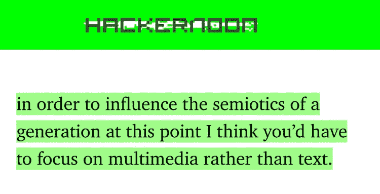
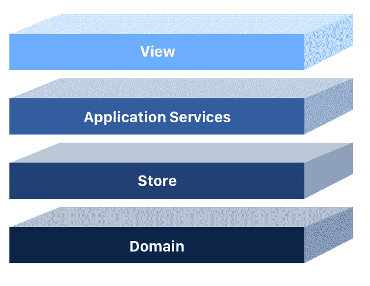

# 本周十大科技故事

> 原文：<https://medium.com/hackernoon/this-weeks-top-ten-tech-stories-5bb0b3446b10>

# 嘿，

我第一次在奥斯汀。期待他们今天开始的 [24 小时黑客马拉松。](https://goo.gl/uq9Wyv)但是互联网在前进！更多的人继续写伟大的故事！我策划了 IMHO 精英中的精英:-)你可以在[三月档案](https://hackernoon.com/archive/2018/03)中找到本月所有的头条新闻，但不必多说…

# 以下是本周十大科技新闻:

[**克里斯·梅西纳如何运作，AMAs 的未来如何？**](https://hackernoon.com/how-chris-messina-works-and-whats-the-future-of-amas-319046d1f12f) *克里斯是互联网上因发明了这个标签而出名的人，而他的新公司*[*【Molly.com】*](http://Molly.com)*，更是与摇头丸同名。很高兴能更多地了解他是如何看待互联网的，以及他为什么从事他的工作。感谢* [*克里斯·梅西纳*](https://medium.com/u/2229dec1a44f?source=post_page-----5bb0b3446b10--------------------------------) *分享你的科技智慧，喜欢引用如下:*

[**挑选低挂密码**](https://hackernoon.com/picking-the-low-hanging-passwords-b64684fe2c7) **通过** [**大卫·吉尔伯特**](https://medium.com/u/f735d3b0f2f3?source=post_page-----5bb0b3446b10--------------------------------) **。** *根据守护者* *最近的一份根本不算什么的* [*报告，任何用户账号都有 50%的几率可以用 25 个最常用密码中的一个进入。还有 17%的几率密码是 123456* *。这让我觉得完全是垃圾，但它让我想到，如果我想不受约束地访问一些用户帐户，我真的不在乎是哪些帐户，而不是通过为一个用户帐户尝试许多密码来使用“暴力”,这更有意义。*](https://keepersecurity.com/blog/2017/01/13/most-common-passwords-of-2016-research-study/)

[阅读更多软件开发故事。](https://hackernoon.com/tagged/software-development)

[**你从未听说过的最大内容网站:下面是为什么**](https://hackernoon.com/the-biggest-content-website-you-never-heard-of-and-heres-why-790d7e33229c) 由 [Rishi Sachdeva](https://medium.com/u/2e8eeab6826c?source=post_page-----5bb0b3446b10--------------------------------) 创建。*在整个过程中，包括我们商业模式的战略和执行，我们没有意识到一个关键的缺点:这一切都依赖于一个我们不拥有的平台，一个强大到不能让任何东西免费在上面茁壮成长的平台——Facebook.com。由于直接与脸书有影响力的人/页面打交道，我们基本上把平台本身从等式中剔除了。*

[阅读更多社交媒体故事。](https://hackernoon.com/tagged/social-media)

[**4 层单页应用你需要了解**](https://hackernoon.com/architecting-single-page-applications-b842ea633c2e)**[**丹尼尔**](https://medium.com/u/f486ab1a1719?source=post_page-----5bb0b3446b10--------------------------------) **。** *每一个成功的项目都需要一个清晰的架构，这个架构是所有团队成员都理解的。***

****

**[多读 React 的故事。](https://hackernoon.com/tagged/react)**

**[**Starsky Robotics 驾驶全无人驾驶卡车(并从 Shasta Ventures 融资 1650 万美元)**](https://hackernoon.com/starskyunmanned-de7af7e5a38b) **由**[**Stefan Seltz-ax macher**](https://medium.com/u/6f8e39a3475?source=post_page-----5bb0b3446b10--------------------------------)**。** *Starsky Robotics 是* ***中唯一一个拥有*** *自主卡车团队的产品。我很激动地宣布，我们驾驶了一辆卡车，全程无人驾驶，行驶了 7 英里。方向盘后面没有安全驾驶员，没有躲在铺位上的工程师。我们是第一家让无人驾驶卡车成为现实的公司。* [*观看我们的 GoPro 镜头*](https://www.youtube.com/watch?v=cjfS-UPHTRw) *。***

**[阅读更多风险投资](https://hackernoon.com/venture-capital/home)和[自动驾驶汽车的故事。](https://hackernoon.com/self-driving-cars/home)**

**[**区块链神谕将让智能合约飞起来**](https://hackernoon.com/oracles-help-smart-contracts-resolve-subjective-events-d81639d8291c) **由** [**道格·冯·科霍恩**](https://medium.com/u/900cbf8c516c?source=post_page-----5bb0b3446b10--------------------------------) **。** *在很高的层次上，使用 oracle 意味着从区块链外部接收数据。换句话说，神谕提供了真实世界事件和区块链之间的联系。在我看来，所有真正有趣的复杂智能合约都需要外部信息——金融衍生品、赌博、稳定积分、身份……实际上任何你想将现实世界中发生的事情纳入其中的东西。***

**阅读更多关于智能合约的信息。**

**[**🔥值得使用的 JavaScript 模块🔥**](https://hackernoon.com/javascipt-modules-worth-using-9aa7301e41ac) **由** [**特拉维斯菲舍尔**](https://medium.com/u/e51316e004c2?source=post_page-----5bb0b3446b10--------------------------------) **组成。我发现自己反复使用的最有用的 JavaScript 模块的快速分类。这是一篇有见解的文章，重点关注通用模块和实用程序，我发现它们对 NodeJS 和前端 JavaScript 开发非常有价值。它不会是详尽的，也不会包括任何特殊用途的模块，因为那些类型的 [*牛逼列表*](https://awesomelists.top/) *确实很牛逼，但往往有点势不可挡。*****

**[阅读更多 Javascript 故事。](https://hackernoon.com/javascript/home)**

**[**你帮助我们为旧金山马林食物银行筹集了 2600 美元——价值 13000 美元的食物**](https://hackernoon.com/you-helped-us-raise-2600-for-sf-marin-food-bank-13-000-worth-of-food-eca57de7d4a2)**[**米莎·贝诺利尔**](https://medium.com/u/29e3a84161a0?source=post_page-----5bb0b3446b10--------------------------------) **。每下载一次，我们就向旧金山马林食物银行捐赠 1 美元。这 1 美元允许食物银行提供价值 5 美元的食物，因为他们有能力批量购买。由于旧金山马林食物银行，筹集的 2600 美元可以提供价值 13000 美元的食物，或者这可能意味着更多急需的存储空间。旧金山马林食品银行的社区参与经理 Debbie Bullish 告诉我们:“目前仓库的面积达到了令人印象深刻的 55000 平方英尺。它的容量是每年 2800 万磅，但是我们每年提供 4800 万磅，相当于每天 100，000 顿饭。我们根本没有能力全力以赴，考虑到这个慈善机构正在产生的影响，这是一个严重的耻辱。”******

****[阅读更多有益的技术](https://hackernoon.com/tech-for-good/home)和[营销故事](http://hackernoon.com/tagged/marketing)。****

****[**如何在区块链世界讲故事？**](https://hackernoon.com/how-to-tell-a-story-in-the-blockchain-world-e5e2fce9ccfa) **由** [**莫希特**](https://medium.com/u/24f7fbc09357?source=post_page-----5bb0b3446b10--------------------------------) **组成。** *区块链在整个人类历史上第一次允许陌生人合作，而无需首先信任彼此。除了金融，它对其他行业的影响也是惊人的。这种转变是巨大的！谁会想到人类物种在几千年前通过在洞穴墙壁上画标记而开始的旅程会导致整个物种的未来围绕着讲述故事的那一天。*****

****[阅读更多区块链故事。](https://hackernoon.com/blockchain/home)****

****[**关于比特币和加密货币给银行的公开信**](https://hackernoon.com/an-open-letter-to-banks-about-bitcoin-and-cryptocurrencies-b0c7ef9b7c62) **作者** [**彼得·麦科马克**](https://medium.com/u/79b96a130697?source=post_page-----5bb0b3446b10--------------------------------) **。亲爱的银行经理先生，这封信对我来说并不容易写。我已经是你 20 多年的顾客了。当我买第一辆车时，你为我提供了贷款；我买第一套房子的时候，你帮我安排了抵押贷款，你甚至帮我创办了第一家公司。我们一起经历了这么多。我告诉你一个小秘密。你是我的第一次！别担心，我知道我不是你的。我想这就是为什么这段感情对我来说比你更重要。******

****[阅读更多公开信。](https://hackernoon.com/open-letters/home)****

# ******和网上的 ICYMI】******

****[**加密货币:上周今晚与约翰·奥利弗(HBO)**](https://www.youtube.com/watch?v=g6iDZspbRMg) **。**这个 20 分钟的视频——虽然有点介绍性——非常有趣，并且触及了加密运动中的一些标志性时刻，比如将黑客攻击区块链比作[用鸡块把鸡拼回来](https://youtu.be/g6iDZspbRMg?t=8m2s)和[这家伙对 BitConnect 的非理性(和奇怪的激励性)乐观。](https://youtu.be/g6iDZspbRMg?t=16m23s)****

****直到下一次，不要把世界的现实想当然。****

****亲切的问候，****

****[大卫·斯穆克](http://www.davidsmooke.net/)，[阿米](https://medium.com/u/1fedc8fffada?source=post_page-----5bb0b3446b10--------------------------------)****