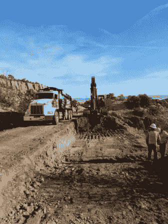

# 这个工作现在有点糟糕

> 原文：<https://medium.com/hackernoon/this-work-kinda-sucks-right-now-deac33425a58>

## 在长期项目的乏味阶段保持动力

【2015 年 4 月,我是六个软件团队的技术项目经理，他们都在为一个巨大的项目工作。这是该公司面临的最大挑战。我们的目标是:为中小企业创建和建立一个交易账户产品，这样我们就可以申请一个无限制的银行牌照。

我们花了 12 个月的时间，正要在我们预计的那个星期完成项目，不可避免的事情发生了:我们收到了一大堆新的需求，这将增加至少另外 3 个月的[工作](https://hackernoon.com/tagged/work)。额外的工作并不迷人；主要是安全增强、灾难恢复准备和复杂的产品幕后调整，这对用户没有什么好处，但从监管的角度来看却是一项要求。

可以理解的是，士气受到了打击，但我们需要保持速度，否则我们可能会错过获得许可证的最后期限。在与我的岳父就这个项目进行了一次有趣的讨论后，我发现了一个关于我们所处位置的新视角，这促使我写了下面的内部博客，以帮助激励团队朝着我们的最终目标前进。一些人告诉我，他们很欣赏这一点，当每个人都蹲下，向终点线推进时，抱怨似乎平息了。

然而，就在最近，当我无意中听到一个同事，在一个类似的最后 20%研磨场景的团队中，向一个新同事推荐这个三年前的博客，并查找它供他们阅读时，我感到很惊讶。出于好奇，我回去自己重读了一遍，发现我以为是给某个特定团队打气的话，实际上是一篇相当普遍的激励性文章。

因此，无论你目前是在一个团队中艰难地度过一个项目的无聊的最后阶段，还是在最终将在同一个地方结束的令人兴奋的第一阶段，我希望你会发现这有助于给你一些长远的观点和[勇气](https://hackernoon.com/tagged/grit)。

# *“这项工作现在有点糟糕”*

*大家好，*

在过去的一两个月里，很多人对我说,[Project T]的工作“似乎正在枯竭”或者“我们似乎只是在做很多小事”。

我能理解这些情绪从何而来。在过去的一年里，我们建立了…

*   *交易账户，与我们的支付服务相集成；*
*   *一个电话 app*
*   *与 Xero 整合；*
*   *新的会计制度；*
*   *电话报名体验；*
*   *申请处理和客户支持网络应用程序；*
*   *跨分布式系统协调的账户供应；*
*   *银行对账单和其他重要的监管报表和功能；*
*   毫无疑问，还有一大堆我已经忘记的东西。

*但是现在，在过去的几个月里，每个团队都在着手我们为自己创建的巨大的安全补救工作。其中一些工作很大，有些有趣，例如[技术编辑]的主要传播引起了我的兴趣。其他部分就没那么吸引人了，比如防止日志文件中插入新行或不可靠的数据。(有得有失，嘿[团队谁做的日志过滤，但也是一些最有趣的早期工作]？)*

*与此同时，我们中的许多人一直在处理许多零散的事情:pact 测试、用于配置 Rabbit MQ 或防火墙的工具、为 iPhones 构建流程、用测试数据准备 SIT 和生产环境，以及文档。文档，看在上帝的份上！我们真不像新手。*

## 大型项目

上周末，我和我的岳父聊起了我们的这个“大项目”。他过去常常修路。大路。他建造了从悉尼到纽卡斯尔的 F3。(当然不是他一个人。)他有一些很棒的故事，讲的是当喜鹊要引爆炸药的时候，他会骗它们过来坐在炸药上。但是我跑题了……

他说他们在修建高速公路时遇到了完全一样的情况。开始时有各种各样有趣的事情在进行:炸山，造桥，平整大片的灌木丛，用最新技术的大型机器铺设路面。

然而，随着项目接近尾声，正是这些小事开始变得重要起来。通往当地道路的入口坡道已经修建，安全围栏已经竖起，路标已经就位，线路已经刷好漆，当然还有文件。这个项目从小事做起，但它们仍然至关重要。没有 onramps，你无法在第一时间上路；如果没有安全围栏，道路在偶尔但不可避免的事故发生时风险太大；没有路标，道路就无法行驶，司机可能会以不安全的速度行驶；没有油漆标记车道:混乱！没有人会把这些工作写回家，但是如果每一项都没有完成，没有一辆公共汽车被允许上路。

我们的项目也是如此。过去几个月我们一直关注的这些“小事”,以及未来一两个月我们将继续关注的这些“小事”,其重要性丝毫不亚于之前发生的那些大事。它们同样重要，因为不做它们，我们就什么都没有——我们就没有许可证，没有许可证我们就没有产品。

*你们中的一些人可能以前走过这条路，但有些人可能没有。一些在 Tyro 工作了一段时间的人可能已经忘记了项目结束的感觉，因为我们很少将这么多的功能批量放入一个“发布”中。事实是，项目的结尾总是会有这样的决胜，这通常是一个艰难的过程，似乎永远不会结束。*

*近年来，我亲身经历过几次这样的经历，在 App Store 上开发并发布了一款应用程序和一款商业 Atlassian Stash[现在的 Bitbucket Server]插件。在这两种情况下，开发产品只占工作的 50 %- 70 %,剩下的是“管理”:创建图标、建立账户、撰写营销文案、制作网站——与一开始让我起步的有趣的编码问题毫无关系。做这些事情的时候很难有动力，尤其是当我把我那微不足道的业余时间花在这上面的时候。我确实考虑过放弃每个项目很多次，但是我坚持了下来，因为我想完成一些重要的东西，并看到它在别人的手中被释放到野外。*

## 那么我到底在这里写些什么呢？

*三件事:*

首先:什么是软件工程师？它不仅仅是一个程序员，或者一个软件开发人员。这是一个袖子很长的 T 型角色，这就是为什么我们使用“工程师”的头衔而不是其他头衔。我们没有架构师、设计师、数据库管理员或性能调优专家，这些都是软件工程师做的。与此同时，我们没有安全基础设施团队，或者安全日志团队，或者 iPhone 构建维护团队，因为，作为软件工程师，我们也可以拓展这些技能。这个角色比全栈开发人员更广泛——它是一个做大量编程工作的技术专家，但也可以做许多其他事情。有时候这些事情很大很令人兴奋，有时候两者都不是，但是我们在这里雇佣的人有技能和态度去完成需要做的事情。你做到了，做得很好。

其次:我认为相当多的人正在努力对我们现在正在做的工作感到有动力。我明白了。我去过那里。我已经在 Tyro 工作了八年半，我不会假装每一天都是令人兴奋的编程乐趣庆典。然而，Tyro 的一个优点是，在很多时候，工作足够有趣，以至于它真的是自我激励的:你想每天开始工作，并开始对该功能进行编码或解决该问题。现在，你们很多人可能没有这种感觉。

*那么，怎样才能保持动力呢？我的建议是关注最终目标，这个目标并不遥远。想象一下，当第一个试点商户将他们辛苦赚来的现金存入一个新手账户，然后用它通过我们的应用程序支付账单，只需输入 PIN 码和点击一下，我们会感到多么激动。这是正在创造的历史。值得重复的是:这是正在创造的历史。你是其中的一部分。你现在正在做的工作可能不会刺激你的思维，但没有它，我们永远无法跨过终点线，推出这个我们花了一年时间开发的令人敬畏的产品。这是马拉松的最后 500 米。抬起你的下巴，看着目标，继续前进。*

*第三:接下来会发生什么？我们正以每天一人一月的速度完成这项安全工作。(是的，在 6 个[Project T]团队之间，你每天做一个月的工作！这让我很紧张！)当我们把这些东西包起来时，我们都要做些什么呢？嗯，这不是我能决定的，还没有完全决定，但[产品负责人]对下一步的方向有很多想法，现在正在准确地选择下一个优先事项。他好心地提出做另一个“[Project T]的状态”会议，并分享一些关于 release 2 可能走向何方的想法。我们将在本周四午餐后的本周技术讲座结束时做这件事。*

## TL；博士；医生

你是软件工程师。你可以做任何事，无论大小。有时这意味着做一些小事。
*如果你的工作“是什么”有一段时间很糟糕，试着把注意力集中在“为什么”上，朝着目标前进。坚持住。会好起来的。(如果没有，请告诉我们，以便我们为您解决问题。)*
*【Project T】发布 2 在即。敬请关注。*

最后，如果你想谈谈这些，或者谈谈你对工作的感受，随时欢迎来找我聊天。

顺便说一下，我们越过了终点线，拿到了银行执照。我们创造了历史。但是那是另外一个故事了。

*这个故事最早发表于*

## **图片来源:**

*[1]自 2015 年以来，我们聘用了架构师和数据库管理员，尽管交付团队仍然主要负责设计他们自己的软件和数据库。*