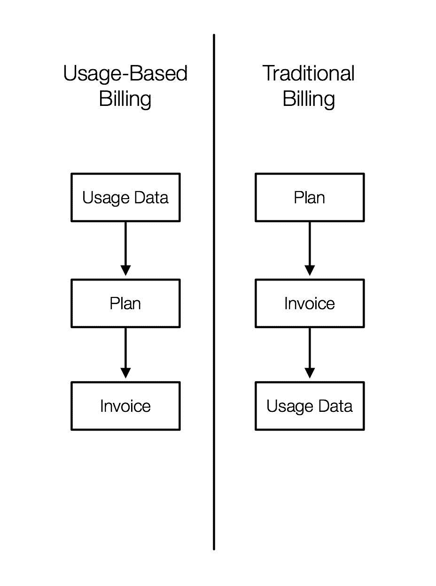

# 托马斯·爱迪生不擅长给顾客开账单。你不必如此。

> 原文：<https://medium.com/hackernoon/thomas-edison-was-bad-at-billing-customers-you-dont-have-to-be-713c00f613d8>

*为什么是时候在 SaaS 转向基于使用的计费结构了*

人们认为托马斯·爱迪生是 T2，他发明了第一个商业上可行的灯泡，并倡导直流电的商业化。然而，有一件事爱迪生不能居功，那就是这个系统可以正确地为这些产品的价值收费。

事实上，爱迪生最初很不擅长为他的投资收费。例如，为了向客户收取他们的[电费](https://hackernoon.com/tagged/electricity)，爱迪生照明公司的计费流程首先包括[派员工去数客户家里的灯的数量](https://ethw.org/Electric_Meter)，这在我们现代计量电力的世界里看起来很可笑。

公平地说，那是 19 世纪 80 年代。当时的技术限制了爱迪生如何建立一个高效的系统来给客户开账单。更重要的是，电表不是他的发明，当爱迪生照明公司按每盏灯收费时，它也没有变得无处不在。

也就是说，一百多年后，开账单没有理由像 19 世纪 80 年代那样复杂或耗时。

# 陈旧的计费系统增加了不必要的工作和复杂性

如果你的计费系统没有技术来轻松跟踪客户对你的产品或服务的使用，就像爱迪生的情况一样，你将很难对你的产品或服务收费。

如果你有跟踪客户使用的技术，但是你的计费系统实际上不是基于使用的*，你还会有一层不必要的逻辑，并且很难成功地为你的产品或服务定价。这正是今天 SaaS 初创公司的计费系统。*

*从历史上看，计费结构始于订阅，即特定计划的客户。随着技术的发展，计费系统集成了使用情况跟踪，以准确了解客户使用了多少产品或服务，从而可以按比例向客户收费。*

*然而，即使使用跟踪现在是大多数计费系统的共同特征，基本的计费结构并没有改变。这意味着在一个计费周期结束时，您的计费系统会调用您的软件，要求您提供软件的使用数据和定价信息，以添加到发票(或费用)中。换句话说，使用数据是事后才想到的。*

*当使用数据是事后的想法时，您的计费逻辑变得更加复杂。这意味着开发人员不得不担心如何存储使用数据、围绕定价计划的信息以及其他计费逻辑。如果价格发生变化，这意味着开发商必须参与进来。*

# *基于使用的架构是 SaaS 计费的未来*

**

*[基于使用的计费架构](https://gtchdr.com/2CQrrHH)彻底颠覆了传统的计费方式，它应该成为 SaaS 团队的首选计费架构。*

*简而言之，基于使用的计费在任何计费结构中需要最少的 API 端点。不用担心为订阅和定价编写逻辑，您只需要知道您想要跟踪什么。然后，您的软件不断向您的计费系统发送与特定客户相关的使用数据。*

*最大的好处？计费代码从代码库中分离出来，开发人员可以最大限度地减少他们在定价会议上花费的时间。这是一件大事。*

*价格-市场匹配——迭代你的定价，找到在你和你的客户之间产生最大总价值的点——在 SaaS 是一件大事。根据 Price Intelligently 所做的一项研究，“……要经营一家成功的企业，你需要至少 3:1 的 LTV/CAC 比率。但随着价格的不断优化，你可以将这一比例提高到 11:1 甚至更高。”*

*而且每次你的公司迭代定价时，开发者都不用碰一行代码。*

# *如果爱迪生有基于使用的计费系统…*

*如果爱迪生有一个基于使用量的计费结构，他的公司将准确地知道他的服务为多少灯具、电器和插座供电。然后，爱迪生照明公司可以无摩擦地试验各种定价结构，使他们的客户最快乐，爱迪生照明公司最赚钱。*

*当然，爱迪生照明公司可能仍然会最终基于千瓦时收费，但这主要是因为电力没有多久就成为商品。*

*但是如果爱迪生照明公司是一家 SaaS 公司呢？这将是一个完全不同的成功故事。*

**韦斯·瓦格纳是* [*Cheddar*](https://gtchdr.com/2CQrrHH) *的内容和社区团队的一员，这是一个基于使用的计费平台，可以帮助您跟踪客户活动，迭代您的定价，并优化您的收入，以便您可以专注于打造出色的产品，而不是为它们计费。切达干酪是用美国中西部的❤制成的。**