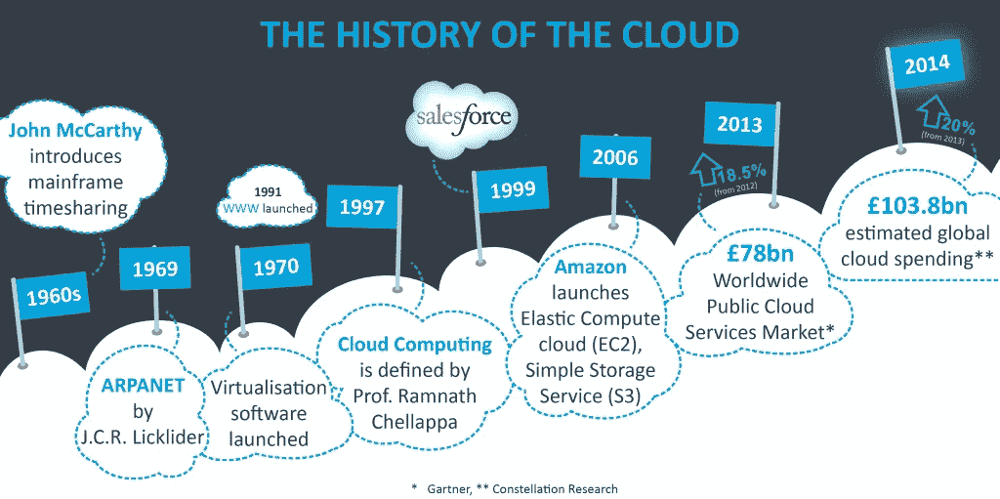
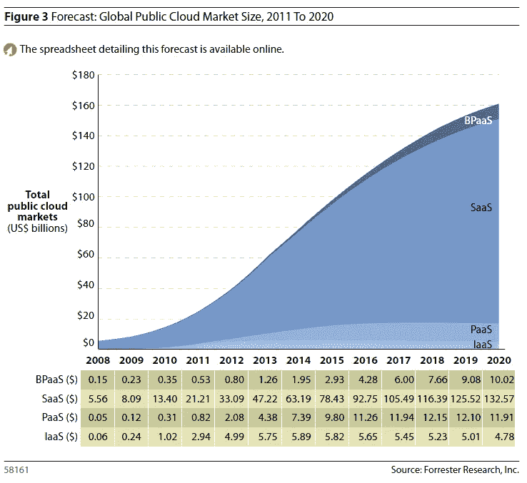
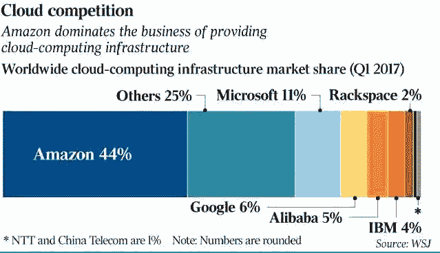
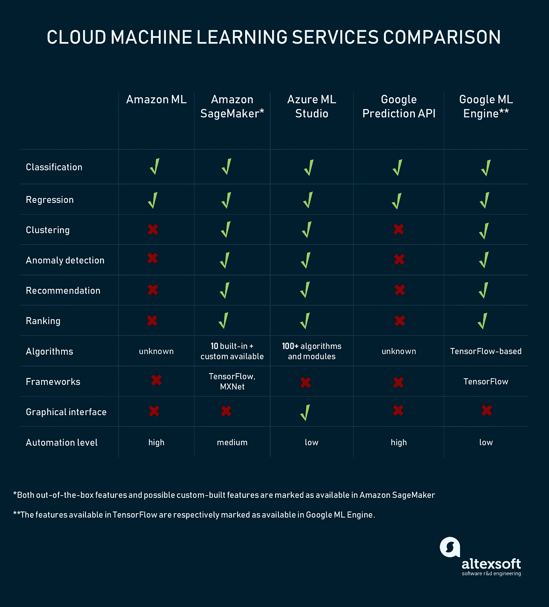

# 云中的那些机器

> 原文：<https://medium.com/hackernoon/those-machines-in-the-cloud-c988f36b6bef>

## 云人工智能和工作的未来

[Pierre Châtel-Innocenti](https://unsplash.com/@chatelp) on Unsplash.com

> “人工智能将是谷歌的终极版本。理解网络上一切的终极搜索引擎。它会准确理解你想要什么，并给你正确的东西。我们现在还远远没有做到这一点。然而，我们可以逐步接近这一点，这基本上就是我们正在努力的方向。”—拉里·佩奇

当你将两项从根本上改变生活的技术合并成一个终极用例时，会发生什么？答案是:企业可能会变得更有效率，但社会混乱可能会变得更加普遍。随着工作自动化并从企业中消失，全民基本收入(UBI)的论点变得更加有力。然而，这一切在这一点上都是猜想。大型科技公司现在在各自的云上提供机器学习(ML)工具，允许企业 IT 部门和新手创建 ML 应用程序，而无需编写代码来自动化任务。这篇文章着眼于由谷歌、微软和亚马逊部署的研发(R & D)和新的云人工智能平台的新生热潮。最后，如果这些技术成功地创建了用于创建和部署人工智能和人工智能应用的人工智能平台即服务(PaaS ),它将对就业前景做出未来展望。

# 云简介

云指的是互联网。句号。互联网开始被称为云，因为 IT 系统图将使用云作为符号来描述互联网。虽然云的概念早在 20 世纪 60 年代就有了，有些人认为是约翰·麦卡锡，有些人认为是 JCR Licklider 开发了 ARPANET(现代互联网的前身)。不管其属性如何，云都被设想为互联网上的一台计算机，它将通过互联网收费提供存储等基础设施、操作系统和软件应用等平台。简而言之，它被认为是根据用户的要求租用硬件和/或软件。

随后，一款名为“salesforce”的客户关系管理(CRM)软件在云上推出，公司可以付费获得许可，这标志着普及云计算时代的开始。事实上，salesforce 的 rai son dêtre。随后，亚马逊推出了弹性计算云，这是一种按需付费的云，进一步推动了云的普及。今天，微软以 Azure 的名义提供它的云，以 Amazon Web Services (AWS)的名义提供 Amazon，以 Google Cloud Services 的名义提供 Google。

timesofcloud.com

如前所述，云可以托管基础设施即服务(IaaS)、平台即服务(PaaS)和软件即服务(SaaS)。此外，云可以是公共云(在共享的基础上对所有人开放)或私有云。预计到 2020 年，全球公共云的总市场规模将超过 1500 亿美元。

亚马逊凭借其先发优势，在全球市场份额方面遥遥领先。[如今，市场领导者亚马逊打着 AWS 的旗号提供了大量解决方案](https://aws.amazon.com/?nc2=h_lg)

Source: Wall Street Journal

如今，任何业务都可以虚拟化。这意味着后端变成了一种服务，可以从单个或多个提供商那里租用。

金融机构可以完全建立在云上，它可以通过网站和移动应用程序提供产品。它可以利用诸如 STAR 网络之类的网络来发行 ATM/借记卡。区块链将成为会计和促进跨境交易的关键。银行可以完全数字化，无需任何实体架构。然而，这意味着大型科技公司进入这个领域的时机已经成熟，它们可以利用自己的用户网络来建立忠诚的客户群。

因此，云计算催生了一场革命，这场革命正在将整个行业虚拟化。下一步是研究可以自动化的人工任务。这就是驻留在云上的人工智能(AI)的关键所在。

# 当人工智能遇到云

现在你知道云(互联网，web 2.0 随便你怎么称呼)是今天的一切。然而，24/7 互联网连接和网络安全方面的挑战仍然阻碍着全球 IT 系统的全面改革。这并没有阻止科技公司在人工智能研究上花费数十亿美元。一场始于 Geoffrey Hinton 反向传播的深度学习革命现在正以卷积神经网络(CNN)和生成对抗网络(gan)的形式继续进行。机器学习方法的发展令人难以置信。这就像火炬在世界各地从一个领导人传递到另一个领导人，没有任何明确的方向表明谁将成为可能的获胜者。在那之前，战斗仍在继续。这个新领域被称为机器学习即服务(MLaaS)

source: https://www.altexsoft.com/blog/datascience/comparing-machine-learning-as-a-service-amazon-microsoft-azure-google-cloud-ai/

关于微软、谷歌和亚马逊如何让 ML 不仅为数据科学家所用，也为普通人所用的故事数不胜数。其中一个最有趣的故事是日本农民 Makoto 如何利用谷歌的 TensorFlow 开源人工智能平台使用人工智能培育黄瓜。

Source: Google

## 微软 Azure AI

微软于 2008 年 10 月宣布其云计算服务，并于 2010 年 2 月 1 日发布。[为奥迪开发底盘的 Elektronische fahrwerksystem](https://www.efs-auto.com/)使用微软 Azure 分析道路。这个想法是让自动驾驶汽车能够提前思考并了解它们所处的道路:

*作为其研究工作的一部分，该公司使用由英伟达特斯拉 P100 GPU 支持的 Azure NC 系列虚拟机来驱动深度学习人工智能解决方案，该解决方案可以分析道路的高分辨率二维图像(来源:微软)*

视频游戏发行商育碧(Ubisoft)在微软 Azure 上运行其电子竞技游戏*彩虹六号围攻*:

source: Microsoft

2016 年，微软通过在 15 个国家的每一台 Azure 云服务器上安装 F **现场可编程门阵列** ( **FPGA** )创建了它所谓的“世界上第一台人工智能超级计算机”。根据维基百科，FPGA 是一个[集成电路](https://en.wikipedia.org/wiki/Integrated_circuit)，设计用于在制造后由客户或设计师进行配置，因此“[现场可编程](https://en.wikipedia.org/wiki/Field-programmable)。

## 谷歌云 AutoML，胶子，张量流

谷歌首席云人工智能科学家费-李非正在努力让所有企业都能使用机器学习。然而，她也指出，很少有公司拥有将人工智能成功嵌入其商业应用所需的人才和其他资源。为了支持其在云人工智能领域获得并保持领先地位的努力，谷歌向开发者开放了一个完整的生态系统，包括 TensorFlow 和 Kubeflow 以及其基于容器的系统 Kubernetes。

印度的 Dainik Bhaskar (DB corp)集团和赫斯特出版集团(Hearst group of publications)等报纸利用谷歌云人工智能对数字内容进行分类。

## 亚马逊 SageMaker

亚马逊 Sagemaker 是一个开发和部署深度学习应用的平台。2017 年 11 月上线。根据亚马逊:

*亚马逊 SageMaker 是一个完全托管的机器学习服务。借助亚马逊 SageMaker，数据科学家和开发人员可以快速轻松地构建和训练机器学习模型，然后直接将其部署到生产就绪的托管环境中。*

 [## 亚马逊 SageMaker 是什么？-亚马逊 SageMaker

### 亚马逊 SageMaker 是一个完全托管的机器学习服务。有了 Amazon SageMaker，数据科学家和开发人员可以…

docs.aws.amazon.com](https://docs.aws.amazon.com/sagemaker/latest/dg/whatis.html) 

让我们举个例子来了解亚马逊的应用程序如何帮助机器学习融入日常生活。

亚历克斯·舒尔茨(Alex Schultz)是一位没有深度学习经验的父亲，他使用亚马逊 Deep Lens 开发了一个名为 [ReadtoMe](https://aws.amazon.com/deeplens/community-projects/readtome/) 的应用程序，为他的孩子读书。Alex 使用 opencv、亚马逊 Deeplens camera、python、polly、tesseract-ocr、lambda、mxnet 和谷歌的 tensorflow 构建了该应用程序。这个例子证明了这样一个事实:通过各种各样的应用，ML 是可访问的，并且可以嵌入到现实生活中，这加强了它可能变得无处不在的论点。

## 合作竞争

2017 年 10 月 12 日，亚马逊网络服务和微软宣布了一个新的深度学习库，名为 Gluon，允许所有技能水平的开发人员为云、边缘设备和移动应用程序原型化、构建、训练和部署复杂的机器学习模型。

人工智能是一个非常广泛的术语，包含许多构建模块，如云平台、编程平台、API 以及集成电路。如此多种相互关联且不断发展的技术，在商业和日常生活中有着广泛的应用，为大型科技公司提供了优势。他们中谁是平等者中的第一个，这是未来的事。

# 工作的未来

每家公司都在成为一家科技公司。如果没有，他们需要意识到大趋势，明智地部署资源，以防止过时。

如今的金融机构更喜欢租用软件即服务(SaaS)，因为开发软件不是他们的核心竞争力。此外，当今的技术变化如此之大，因此敏捷和灵活是生存和发展的关键。

想象一个场景，您想要为高层领导准备某个销售报告或业务回顾。你只需给数字助理(AI)一个语音命令，就可以给你一份 2018 年迄今为止所有销售的国家报告。这些数据将存储在与人工智能助手相同的云上。然后，人工智能机器人将组织数据，并将其发送到您选择的输出设备，这可能是一个增强现实屏幕。现在，将这个场景扩展到所有可以自动化的常规和非常规任务，你可以想象人工智能作为一种技术有多可怕。就像我们所知，科技刚刚吞噬了工作世界。

首先，常规任务可以自动化。后来，人工智能可以成为一个推荐引擎，最终它将能够自己做出决定。对未来十年左右自动化的程度有不同的估计。然而，对大多数人来说，学习新技能或把生活当作继续教育应该是他们的口头禅。

Source: McKinsey

虽然技术颠覆正在继续向工作场所进军，但人工智能及其影响还不足以引起社会动荡。还没有。这就是伦理困境所在。

例如，印度等发展中经济体的政治家已经听到了抱怨自动驾驶汽车导致驾驶岗位流失的痛苦声音。当一辆自动优步在亚利桑那州杀死一名行人时，该事件引起了人们对自动化可行性的怀疑。与比特币、CRISPR CAS 9 基因编辑技术一样，人工智能监管将需要领先于游戏。

然而，对于我们这样的普通人来说，学习刚刚获得了一个全新的实际意义。