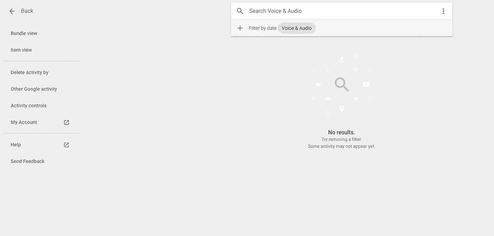

# 欧盟数以千计的小企业将不得不适应 GDPR 法规——了解如何适应

> 原文：<https://medium.com/hackernoon/thousands-of-small-businesses-in-eu-will-have-to-adjust-to-the-gdpr-regulations-find-out-how-d23b6683253f>

Source: Unsplash

不管你从事什么类型的工作，不管你是否完全数字化，不管你的业务是在欧盟还是在国外市场，这都是你应该自学的话题。

也就是说，欧盟推出了一项关于互联网上个人数据安全的新法规，即所谓的 GDPR ( *通用数据保护法规*)，该法规将于今年 5 月 25 日生效，并将在个人数据使用权方面设定新的全球标准。

这是过去几年中最有争议的欧盟法规之一，将吸引我们所有的客户，我们决定特别关注这个问题。

> 如果你是一个网站所有者，将来你**需要告诉你的客户**你拥有什么信息，你如何收集和处理这些信息，你保留这些信息多长时间，以及你与谁分享这些信息。您还需要保证这些数据的安全性。

每天我们都会在各种设备上留下无数的个人数据，而这些数据会进一步深入到我们称之为云的无限空间。从字面上看，这个云只不过是另一台(别人的)电脑。

据推测，在不久的将来，没有人能够隐藏自己的任何事情，因为一切都将已经在云端(阅读:书面)。为了至少让这些人感到乐观，根据新的规定，个人数据的所有权将被视为与任何其他财产的所有权一样。

因此，作为一家公司，每个公民都可以向您询问信息，如您为什么收集他们的个人信息，以及要求您删除您个人拥有的关于他们的所有信息。

**想知道这一切是为什么吗？**

**GDPR 法令旨在使个人能够控制其个人数据的使用**，因为隐私权(和数据隐私权)是每个公民的基本权利。

鉴于我们所处的时代，不同的利益相关者以各种方式收集、保存、处理和货币化个人信息，现在是时候制定一项法规，赋予个人在使用其数据时的投票权，并对数据收集和数据安全以及参与收集和处理这些数据的行为者实施严格的标准

鉴于之前的法规可追溯到 1995 年(数据保护指令)，其数量并没有反映出我们日常生活中不可接受的互联网和我们今天使用的技术。

当银行业务、购物、支付公用事业费用以及大多数其他事情都在网上完成时，个人信息滥用的威胁令人担忧，身份盗窃每天都在发生，等等。

GDPR 要求您(企业)报告**任何涉及侵犯隐私、数据窃取等的事件**。72 小时内到达主管机构**。**

**宣布的**违规罚款高达€2000 万**。**

# **我们应该注意哪些个人信息？**

**问题是该法规涵盖哪些数据，答案既简单又复杂:任何可以识别个人身份的信息。**

**具体来说，新规则一般对个人信息有更严格的定义，所以现在你的位置数据(你在哪里)，IP 地址和 IMEI 手机号码等在线标识符，关于你的遗传和健康的信息，生物特征数据，种族数据和种族，政治态度，性取向。**

**对于企业来说，这意味着他们必须审查所有这些信息，并进行详细的审核，以确定他们实际拥有哪些数据，以及这些数据是否属于受监管的隐私范围。**

**在 Avalon，我们对此非常认真，现在正在完成这一过程，对此我们将立即通知所有用户。**

**加密数据也可能受到 GDPR 规则的约束，这取决于识别它们属于谁的难易程度。**

# **GDPR 增加了对云的使用，这对市场意味着什么？**

**欧盟 27%的公司已经在使用云技术。GDPR 将进一步改变这一统计数据，并鼓励企业转向云计算。**

**欧盟的大公司已经准备好迎接新的 GDPR 规则，他们成立了特别小组来处理规则的实施。金融和 IT 部门在为新 GDPR 做准备方面走在了前面。**

**银行、信息技术公司和其他已经在使用新技术方面有经验的现代化参与者已经为重新调整做好了准备，但其他用户，甚至是公共和国家部门的用户就不能这么说了。**

# **陷入困境的小企业**

**对于小型[企业来说，业务合规性是一个很大的问题，特别是如果他们在当地安装了业务软件，因为所有的调整都必须独立进行。](https://hackernoon.com/tagged/small)**

**不幸的是，他们中很少有人能支付得起数千欧元给这个领域中无处不在的新来者，这些人经常公开自称是 GDPR 专家。**

**如果公司有“别人的”软件，情况会好一些。例如，微软将让他们所有使用 Office、ERP 和 CRM 的用户提供自动调整，但我们都知道，从公司总数来看，欧盟这样的公司很少。**

**例如，据粗略估计，仅在欧盟最年轻的成员国克罗地亚，就有至少 6 万家公司需要申请 GDPR。想想整个欧盟的每一个小企业。**

**在 GDPR，另一项法规将有助于向云的过渡。该法规被称为第 2 号*支付服务指令( **PSD2** )，处理向合作伙伴开放银行 IT 系统以及互联网上的竞争。它实际上已经有效，但要到 2019 年 9 月才能投入使用。***

**对于这样的公司，云将是唯一的选择。**

# **全球/大玩家**

**GDPR 将在全球范围内打击所有主要的世界玩家，包括美国五大巨头:亚马逊、苹果、谷歌、脸书和微软。实际上，他们将被剥夺迄今为止对欧盟用户数据的垄断权，即脸书通过用户网络从用户那里收集的私人生活描述，以及他们开展业务的基础。**

**你有没有想过脸书或谷歌可能在窃听你？举个例子，拿着手机和你的朋友谈论一个话题——去克罗地亚度暑假，第二天你会在脸书和谷歌上看到提供克罗地亚暑假的广告。**

**这正是本案的意义所在。现在你首先会想到的是:脸书在监视我，还用了我的麦克风！这是相当不现实的，因为对于这样的事情，甚至整个美国宇航局的技术可能是不够的。**

****

**Google Voice & Audio Activity interface**

**与脸书不同，谷歌有权在你的手机上使用你的声音，但同样——**只有在你允许的情况下**。如果你使用像“OK Google”这样的语音搜索服务，你所有的语音输入都会保存在你的 Google 账户的 [Voice & Audio Activity](https://myactivity.google.com/myactivity?restrict=vaa&utm_source=help&product=29) 标签中。**

**事情是这样的，互联网上的一些云保存了大量的个人数据。当在线时，这些数据可以随时随地被留下。大型企业只需购买这些数据库，在他们的平台上与我们的账户对齐，并为我们提供个性化广告。**

**所有这一切的好处是:没有人在听你说话。坏消息:他们仍然知道你的一切。**

**例如，你的信用历史记录，你正在听的音乐，你正在看的电视节目，你在黑暗的房间里谷歌了什么，当你的手机位置跟踪功能启用时你去了哪里，所有这些应用程序都可以跟踪你，你下载了哪些应用程序到你的设备上，等等。不胜枚举。**

**因此，脸书在 2016 年宣布该法规后，**迅速在欧盟**建立了 3 个数据中心，而在此之前，他们一个数据中心也没有。“五大”中的其他公司也在采取类似举措，其他大公司也将不得不相应调整业务，因为尽管官方公司位于美国，但只要它们拥有欧盟公民的个人数据，这些法规就仍然会影响它们。**

**欧盟预计 **GDPR 将恢复公民对在线服务的信心**，因为当涉及到我们的个人信息时，我们越来越担心，信任是每一个货币化的关键，包括数字经济。**

****

**Source:Unsplash / Daria Shevtsova**

**有人指出，由于数字经济的大规模增长，信息处理方式发生了巨大变化，因此有必要进行重大变革。现在的一切都比 90 年代复杂得多，当时雅虎是互联网上的一种趋势，而饼干只是美味的小饼干。**

# **电子邮件营销和网站**

**如果你使用电子邮件营销，GDPR 适用于你，最重要的是你必须得到你的基础上的每个个人订户的同意。**

**GDPR 要求您明确获得同意，并且用户必须清楚当您获得同意时，您将如何使用这些信息。**

**这实际上意味着您需要一份 GDPR 友好的联系表格，这将有助于您获得并记录用户同意。您将需要允许用户选择他们的电子邮件地址将被用于什么。这将允许用户表明他们是否希望收到来自您的促销电子邮件，或者他们的电子邮件地址是否将用于广告目的，等等。**

**首先要做的是审核您收集的个人信息。**

**问问你自己:**

**–我们使用这些数据的目的是什么？**

**–我们将它们存放在哪里，它们安全吗？**

**我们还需要它们吗？**

**此外，检查所有其他可能使用这些数据的公司和**他们的行为是否符合 GDPR** 。请记住，你拥有的每一个个人信息都意味着围绕它也有责任，所以**确保你只保留你真正需要的数据**。**

**在这堆积如山的新标准和义务中，好消息是:从现在开始，你将拥有的联系人将属于那些真正对你提供的东西感兴趣的人——这可能为更好的转化、更多的点击、访问以及互动带来新的机会。这意味着**少并不总是少**。**

**如果你有一个电子商务网站，假设客户从你这里订购了一些东西，只有在他们明确同意的情况下，你才能在该用户身上投放再销售广告。**

**假设你是一家人力资源公司，一名候选人申请一份工作。如果没有他们的同意，您将不能再向同一候选人发送类似的工作邀请。**

**因此，您的网站将不得不经历某些变化，主要是联系方式和 cookies 设置。因此，如果您还没有这样做，请联系您的 web 开发人员，查看您正在使用的隐私政策。**

**同样，你网站上安装的每个插件都必须是 GDPR 友好的。作为网站所有者，您有责任确保每个插件可以提供洞察、导出或删除收集的用户个人信息。**

**这可能会使一些最流行的 WordPress 插件变得非常复杂。例如，像 **Gravity Forms** 或 **Jetpack** 这样的解决方案使用了大量自然收集用户数据的模块。每个插件所有者(开发者)必须建立关于个人信息的信息流，并通知用户他们的处理。**

# **移动应用**

**我们所有人都遇到过这种情况，下载一个移动应用程序，当我们到了要求“访问权限”的部分时——我们改变了主意。例如，为什么闪光灯应用程序可以访问我们的位置、日历、联系人和照片库？很荒谬，对吧？**

**根据 2016 年隐私论坛的*未来研究， **24%的世界领先应用程序没有隐私政策**，这意味着它们非常适合收集个人信息，并可以根据自己的意愿进一步处理这些信息。***

**因此，根据 GDPR 的新法规，应特别注意您通过移动应用程序收集的数据——只收集您可以用于您的业务的数据，告知用户您收集的数据和目的，介绍他们的信息将受到保护的方式，一切都将处于最佳状态。**

**古老的谚语——“一点点供应过剩不会伤害任何人”似乎不再适用了:)**

***本文原载于* [*阿瓦隆博客*](https://www.avalon.host/blog/thousands-of-small-businesses-in-eu-will-have-to-adjust-to-the-gdpr-regulations-find-out-how/) *。***