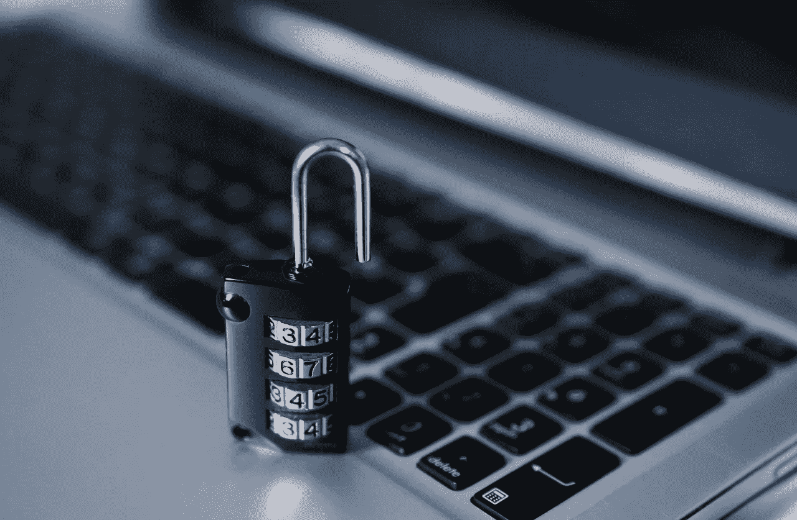

# 威胁模型和提高个人在线安全性

> 原文：<https://medium.com/hackernoon/threat-model-and-improving-ones-online-security-a8b5a599e009>

我们目前正在 Lambda School 进行关于[安全](https://hackernoon.com/tagged/security)和计算理论的 Sprint 挑战赛，我们的部分任务是讨论威胁模型是什么，并讨论我们可以采取哪些具体措施来提高我们的在线安全性。

第一部分，我给一位同事写了一封虚构的电子邮件。

**什么是威胁模式**

嗨，卡斯，

非常感谢你们的热烈欢迎！

在您昨天的电子邮件中，您问我是否熟悉安全环境中威胁模型的概念。是的，我是。如果你还记得的话，我们去年在 Lambda 学校的一节课中讨论过这个话题。下面是一个简单的解释，以及一个例子。

据我所知，威胁模型基本上是一种用于理解和提高网络安全性的概念性工具。威胁模型有几个方面:攻击面(他们使用什么技术或系统是潜在的攻击“入口点”)、对手(可能对攻击他们的安全感兴趣的人)、攻击媒介(攻击或妥协的手段)和缓解措施(可能的解决方案或预防措施以消除攻击风险)。这些方面或因素帮助我们评估任何给定情况下的优势、劣势和威胁，并为我们提供可能的解决方案或措施来防止安全漏洞。

为了说明，这里有一个假设的场景:

假设我们有一个学生叫 Mike，他在 LambdaSchool 学习 web 开发和软件工程。在技术和[编程](https://hackernoon.com/tagged/programming)方面，他绝对是个新手，在安全方面，他也不是很小心。他经常和室友共用他的笔记本电脑，而把手机扔在宿舍里。他很少注销自己的 Gmail、Slack、Zoom 和 GitHub 账户。谈到密码，他也有点天真:他所有的账户和应用程序都只有一个密码。他决定用 Mike123，因为它很好记。

一天，他受到了一生中的震惊:拉姆达学校把他踢出了这个项目。在对他的众多投诉中，有这样一些:他被指控在闲暇时向他的几个同学发送恶意的短信；他在 GitHub 中破坏了几个 repos 他向学校的首席执行官发送恶意软件；他分享了实际上是恶作剧的缩放链接。他坚持说他没有做这些事情。

这个故事的威胁模型是这样的:

攻击面— Mike 与几个人共用一个房间。他们中的一个或多个可能有伤害他或他的名誉的动机。例如，他们中的一个可能是竞争对手编码学校的学生。他使用编程学生常用的技术工具——笔记本电脑、Slack、Zoom 等。，而且他也不注销，这就让黑客们超级容易黑他们。

对手——如前所述，一个朋友或熟人可能是来自竞争对手的编码训练营的学生，或者可能某人只是和他有过节，等等。

攻击媒介— Mike 非常容易受到攻击。他的应用程序通常是打开的，而那些没有打开的程序有非常不安全的密码。

缓解措施——确保 Mike 安全的方法显而易见:始终注销所有应用和帐户，为每个帐户创建唯一的密码并使用密码管理器，利用双因素认证，使用加密，使用 SSH for GitHub 等。

如果迈克采取了上述措施，他就不会被错误地指控那些行为，他仍然是一名拉姆达学校的学生。

只是我的两分钱。我期待与团队合作！

最诚挚的问候，
*但丁*

**我如何提高我的在线安全性**

对于我们任务的第二部分，我们将采取具体措施来提高我们的在线安全性，所以我做了以下几件事:

1.  我决定注册一个密码管理员。我选择 Dashlane 是因为它是免费的，但我也在考虑 LastPass。
2.  我利用安全套接字外壳(SSH)通过生成一个 SSH 密钥并将其添加到我的 SSH 代理来连接到我的 GitHub。我下载了 GitHub 桌面。
3.  我使用了“通行短语”，而不是简单的“口令”或“通行码”。我的密码就是这样——一个很长的短语或句子，不太可能被任何没有读心术能力的人破解。

我只用了不到一个小时就实施了上述措施，这是多么大的变化啊！它们听起来微不足道，但却让我的安全感增加了十倍。

你也能做到。这里有一些你现在可以利用的资源(我从我们的 Sprint Challenge 材料中借来的，得到了我的项目经理的许可):

*   [KeePass](https://en.wikipedia.org/wiki/KeePass) —开源密码管理器
*   [KeePass 的替代品](https://alternativeto.net/software/keepass/) —云、桌面等。，考虑您的个人安全/便利权衡
*   [双因素认证](https://twofactorauth.org/) —支持双因素认证的服务列表
*   [使用 SSH 连接到 GitHub](https://help.github.com/articles/connecting-to-github-with-ssh/)——比密码更方便(对于命令行)*和*
*   [将 GPG 添加到你的 GitHub 账户](https://help.github.com/articles/generating-a-new-gpg-key/)——简单的 GPG 设置，让你签署提交
*   [创造完美的 GPG 钥匙对](https://alexcabal.com/creating-the-perfect-gpg-keypair/)——对于那些想要更好控制的人来说，更复杂
*   [Keybase](https://keybase.io/) —一种共享/认证公钥的方式(还提供加密聊天、文件存储等功能。)
*   [Yubico](https://www.yubico.com/) —双因素/加密的经济实惠的硬件安全设备
*   [如何在 VirtualBox](https://linus.nci.nih.gov/bdge/installUbuntu.html) 中安装 Ubuntu 可用的 Linux 安全流行发行版
*   [Kali Linux](https://www.kali.org/)—Linux 的安全特定(渗透测试)发行版，包括供下载的虚拟机映像
*   [关于沙箱的信息](https://en.wikipedia.org/wiki/Sandbox_(computer_security)) —学习沙箱以包含应用程序的一般起点

提高我们的网上安全是非常容易和必要的。我们没有任何理由不去做，也没有任何理由去做。