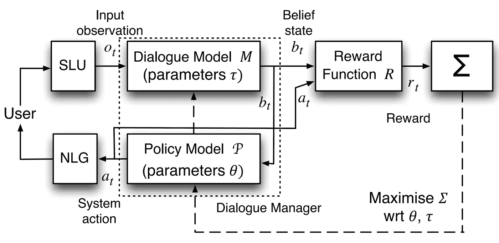

# 三项人工智能技术可以让聊天机器人变得智能

> 原文：<https://medium.com/hackernoon/three-ai-technologies-that-could-make-chatbots-intelligent-10f8c6e8b4b0>


Photo by [Andy Kelly](https://unsplash.com/photos/0E_vhMVqL9g?utm_source=unsplash&utm_medium=referral&utm_content=creditCopyText) on [Unsplash](https://unsplash.com/search/photos/-robots?utm_source=unsplash&utm_medium=referral&utm_content=creditCopyText)

我很沮丧。聊天机器人有潜力让人惊叹。《星际迷航》中的电脑似乎终于成为了现实。到目前为止，我们都很失望。大多数聊天机器人都是垃圾，这应该归咎于[工具](https://chatbottech.io)。如果我想建造一个具有某种智能外表的聊天机器人，我必须为无数种可能性进行设计。这肯定是人工智能应该为我做的吗？

不一定要这样。有一些神奇的 T4 技术可以帮上忙。这项技术仍然停留在学术界，但我想改变这种情况。

这些技术可以让聊天机器人变得智能:

*   语义解析将用户的表达转换成计算机能够理解的形式
*   **自动规划**选择一系列行动来实现预期目标
*   **自然语言生成**允许计算机用人们自己的语言回应他们

# 披萨快乐的语义解析

"我想要一份有凤尾鱼的比萨饼."(对你我来说)很清楚，我想在比萨饼上放凤尾鱼。但是“我想要一个带薯条的披萨”呢？如果我的比萨饼上有薯条，我可能会感到惊讶。

这个特殊的问题叫做**介词短语附加**。介词短语" with fries "与" pizza "或" want "是连用的吗？


Photo by [Igor Ovsyannykov](https://unsplash.com/photos/2eEWGj_CQL8?utm_source=unsplash&utm_medium=referral&utm_content=creditCopyText) on [Unsplash](https://unsplash.com/search/photos/pizza-with-anchovies?utm_source=unsplash&utm_medium=referral&utm_content=creditCopyText)

传统的自然语言解析器如 Parsey McParseface 也必须处理这个问题。然而，传统的解析器只会告诉你句子的结构。它不会试图描述整个句子的意思。

另一方面，语义分析器将把句子翻译成计算机能够理解的形式。在聊天机器人的情况下，这通常是被称为**意图**的结构。“我想要一个有凤尾鱼的比萨饼”的意图可能看起来像这样:

```
{
    "intent": "order-items",
    "items": [{
        "item-name": "pizza",
        "toppings": ["anchovies"]
    }]
}
```

另一方面，“我想要一个带薯条的披萨”的意图看起来像这样:

```
{
    "intent": "order-items",
    "items": [{
        "item-name": "pizza"
    },{ 
        "item-name": "fries"
    }]
}
```

在第一种情况下，凤尾鱼在“浇头”属性中与比萨饼捆绑在一起。在第二种情况下，我们有两个项目，比萨饼和薯条。

一些聊天机器人工具，如 [Dialogflow](https://dialogflow.com/) ，集成了可以进行这种类型分析的语义解析器。然而，它们的复杂程度目前是有限的。它们不会输出我们所描述的那种深层结构的意图。

进行深度分析的语义解析器已经存在一段时间了。例如，Geoquery 数据集在约翰·泽尔和雷蒙德·穆尼于 1996 年在 T2 的一篇论文中进行了描述。

他们的系统接受这样的输入查询:

*   *密西西比州周围各州的最高点是什么？*
*   阿拉斯加最大的城市有多大？

它将这些翻译成可以直接在数据库上评估的查询，并将答案返回给用户。

该数据集目前的最高水平是 91%的准确率，[由 Percy Liang 及其同事在 2011 年实现。](https://arxiv.org/abs/1109.6841)

那么，如果技术已经存在，为什么聊天机器人工具不支持这种更复杂的分析呢？大概有几个原因:

*   没有人要求它。聊天机器人的设计者甚至不知道这是可能的。建造没人想要的东西是没有意义的。
*   这增加了工具的复杂性。大多数当前系统处理的意图是漂亮简单的平面结构。如果它们变成任意深度和复杂度的树，一切都会变得更加困难。
*   这使得聊天机器人的设计者更加困难，他们现在必须想出如何处理这些树。

基本上做 AI 很难。谁知道呢？

除非聊天机器人的设计者开始对他们的工具提出更高的要求，除非他们愿意认真致力于打造智能，否则我们可以预计聊天机器人仍然很愚蠢。

# 救援的自动化规划


Photo by [mwangi gatheca](https://unsplash.com/photos/E3CZ_AtzixY?utm_source=unsplash&utm_medium=referral&utm_content=creditCopyText) on [Unsplash](https://unsplash.com/search/photos/superhero?utm_source=unsplash&utm_medium=referral&utm_content=creditCopyText)

假设我们能够克服其中的一些障碍，并从用户那里获得一些不错的复杂树。我们该拿他们怎么办？

我们可以将用户请求视为指定用户的目标或愿望。原来有一个完整的人工智能分支致力于找出如何自动满足这些目标:[自动规划](https://en.wikipedia.org/wiki/Automated_planning_and_scheduling)。如果我们不必告诉聊天机器人做什么，但它只是在每种情况下找出最佳的行动顺序，这不是很好吗？这就是自动化规划的前景。

当然，仍然有工作要做。我们需要描述聊天机器人所处的“世界”,这样它就知道它可以采取什么行动，以及这些行动的效果是什么。

有专门为此设计的正式语言。最常用的是规划领域定义语言，简称 [PDDL](https://en.wikipedia.org/wiki/Planning_Domain_Definition_Language) 。

事实上，对于不同类型的问题，有一大堆不同的 PDDL。可能对聊天机器人有用的一类问题是部分可观察马尔可夫决策过程，或简称为 [POMDPs](https://en.wikipedia.org/wiki/Partially_observable_Markov_decision_process) 。这些不仅考虑到了行动结果的不确定性，也考虑到了世界现状的不确定性。剑桥大学的史蒂夫·杨和他的同事们已经成功地将它们应用于口语对话系统中。



Steve Young et al’s [system](http://mi.eng.cam.ac.uk/~sjy/papers/ygtw13.pdf)

在这个图中，“SLU”是口语理解单位，“NLG”是自然语言生成单位。

该设计的部分动机是语音识别所特有的挑战。这里，口语理解单元的输出可以包括用户所说内容的不确定性。

在我看来，这也适用于聊天机器人，用户意图的含义仍然存在不确定性和模糊性。

例如，也许我真的想要薯条作为配料。

这种类型的歧义与句子结构有关。模棱两可的话也是一个问题。例如，单词“run”在牛津英语词典中有 606 个意思。任何类型的模糊性产生的不确定性都可以很容易地并入 POMDP。

在 POMDP 方法中，系统跟踪可能状态的分布，而不是跟踪单个状态。给定各州的分布，规划系统选择最佳行动以最大化预期回报。这意味着尽管存在不确定性，但它能够理性行事。(在上图中，规划系统被描述为“对话管理器”。)

所以我们省了很多工作。我们只是描述了这个世界，而不是描述聊天机器人在每种情况下应该如何行动，聊天机器人会找出最好的办法。这将使我们的机器人变得更加智能。

但是我们仍然需要列出机器人能说的所有事情。如果我们希望我们的机器人更有表现力呢？如果它能自己构造句子呢？这就是自然语言生成的用武之地。

# 谈论我的自然语言一代


Photo by [Khairul Arifin](https://unsplash.com/photos/7A1pZTvuNWw?utm_source=unsplash&utm_medium=referral&utm_content=creditCopyText) on [Unsplash](https://unsplash.com/search/photos/grandparent?utm_source=unsplash&utm_medium=referral&utm_content=creditCopyText)

这是自然语言处理的另一个巨大的子领域。当前的系统通常会采用一个可能有一个或两个空位的模板句子，并将其返回给用户。但是如果我们想给用户更详细的信息呢？

维基百科[文章](https://en.wikipedia.org/wiki/Natural_language_generation)中描述的花粉预测系统的一个例子是:

> 周五的草花粉水平已经从昨天的中等水平上升到高水平，在全国大部分地区的数值约为 6-7。然而，在北方地区，花粉水平将是适中的，数值为 4。

这是根据苏格兰不同地区的花粉水平数据自动生成的。

想象一下，如果您可以对您的数据做同样的事情。你可以要求对你的网络分析进行总结；你可以询问有关保留、新用户或登录页面的问题。您的查询可以被翻译成一组数据库查询，然后为您总结其结果。可能性是无限的。

# 回到聊天机器人的未来


从现在到 2025 年，聊天机器人市场预计每年增长 25%。但是这种期望能成为现实吗？

我和很少有人知道什么是聊天机器人，更少有人用过聊天机器人。我只知道一个人喜欢使用聊天机器人。

聊天机器人市场的增长是基于消息平台的显著增长。但如果这些用户不能转化为聊天机器人用户，聊天机器人市场就不会增长。就个人而言，我怀疑我们能否说服大多数人在当前状态下使用聊天机器人。

聊天机器人技术的未来掌握在我们手中。我们会对聊天工具要求更多吗？或者我们会期望用户适应我们有限的技术，并学会不期望智能？这取决于我们。